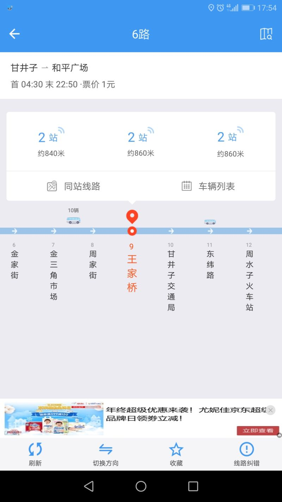

这个礼拜，整服务器整得要吐了。
五天时间里换了6个服务器。
终于在工作日的最后一天终于被我搞明白了原因——之前一个9美金年付的VPS，起名成了我所拥有的另一个域名B。垃圾VPS最近被大墙关注了。我在主服务器上只要一把B域名的SSL一打开，不出两个小时墙就会来把我服务器的443给封掉。
幸亏Linode是按时间计费的。

这次换了BT面板，因为它的安装确实比较快。但是，真心不怎么好用啊！

上周在单位，键盘出了个毛病令我百思不得其解：
右边的Win键不好使了，怎么按都不出Windows菜单，更不要说Win跟别的键组合了。
但是左边的Win键一点毛病都没有。翻墙google好几天也没找到答案。
直到最后一天写代码，无意中碰到了，才发现弹出了右键菜单。
又拿起来仔细端详，终于被我识破了——半个月前闲着没事儿清理键盘，Win跟旁边的右键菜单键装反了！

最近天冷。家里楼下的快递柜都冻罢工了。
24号早上一个小伙在电话里跟自己的领导抱怨：“就是系统冻得起不来了，我能怎么办？！”
第二天早上同一时间，拿个电吹风在那儿吹。

闺女新年晚会，老师要求：
每位同学带点装饰品来，要求跟新年有关，不能跟圣诞有关。老头、驯鹿、圣诞树统统不行。红白绿配色的也不行。

老婆大人让装了个软件，说在车站等公交的时候可以知道下辆车的位置。
于是出现了下图这种情况，并且等20分钟也不见一辆车过来。
后来才搞明白，那两站之间，是这趟线路的车库所在啊！
