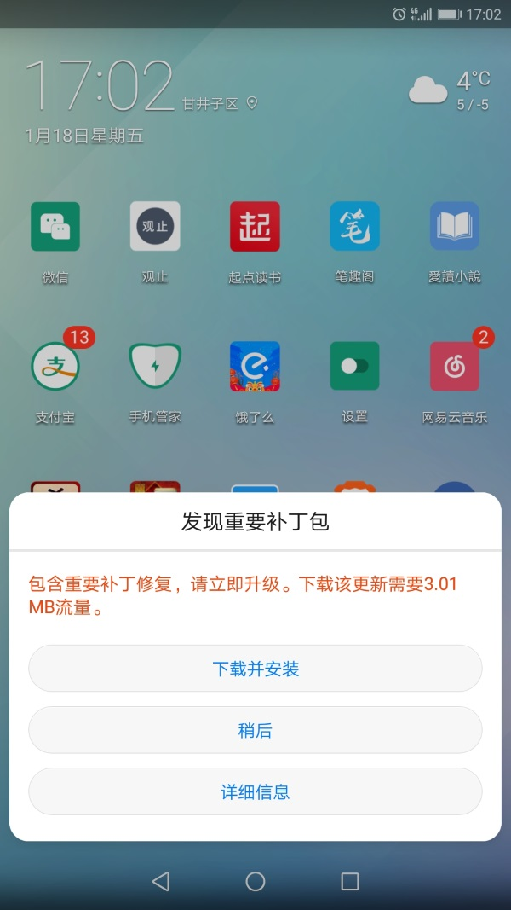

高中同学小李子又被[某高中同学](https://pewae.com/2010/08/borrow-money-with-money.html)坑了一次。大家都认识20多年了，没想到这么不地道。
哪怕是陌生人吧，做生意也没有这样的。去找他，竟然摆出一副老赖的嘴脸：“我已经离婚了。”
那小子贼得很，既然敢这么应付，估计房子和车都不是他自己的名字。
幸亏李子这回狠心找了律师，起诉的是对方两口子，官司算打赢了，第一期要回了10w，还差20w，也不知能不能要回来。
当然只有小李子的一面之词，但是前科这个东西并不是那么容易抹平的，何况还有代表国家的判决书在。
以后不会再跟这家伙产生任何交集。

多说一句，李子精细着呢，原本就没什么上当的可能。
可谁家没个败家老娘们呢……

新来的明明同学这几天下班都要提前往家跑。因为婆婆病了还得给她带孩子，老公近期天天加班，她得早点回家做饭。
这不稀奇。稀奇的是他老公加班的原因。
她老公跟我们一样，是另外一家公司的程序猿。一个一月底要交的项目，某同事过完元旦失踪了。两天没有任何音信，辗转之后打给了他老婆。他老婆说也在找。
于是报案，公司财务查到工资卡在失踪后的某某日还有取款记录。
公安的答复是：“哦。”
上面这句是我编的，反正就是不立案，不调查。
又过了几天，他老婆也失踪了。

emlog一定是升级了。闲着没事儿改输入框的id干嘛？我还得跟着改油猴脚本。
即使只改三五个字母，也非常不情愿。
“为长者折枝，语人曰：‘我不能’，是不为也，非不能也。”

光天化日之下，华为一遍又一遍地提示我更新系统。大概的意思是“客官，只要3M流量唉，您就随手点了呗？”
妈的就不惯这毛病。计划外的流量，4个byte也别想白白溜走！

快过年了，电梯里的广告可热闹了，三天一换。
C位先是海参，再是虫草，然后是燕窝。
差个蜂蜜一家人就整整齐齐了。
看来本小区被贴上人傻钱多的标签了，唉！