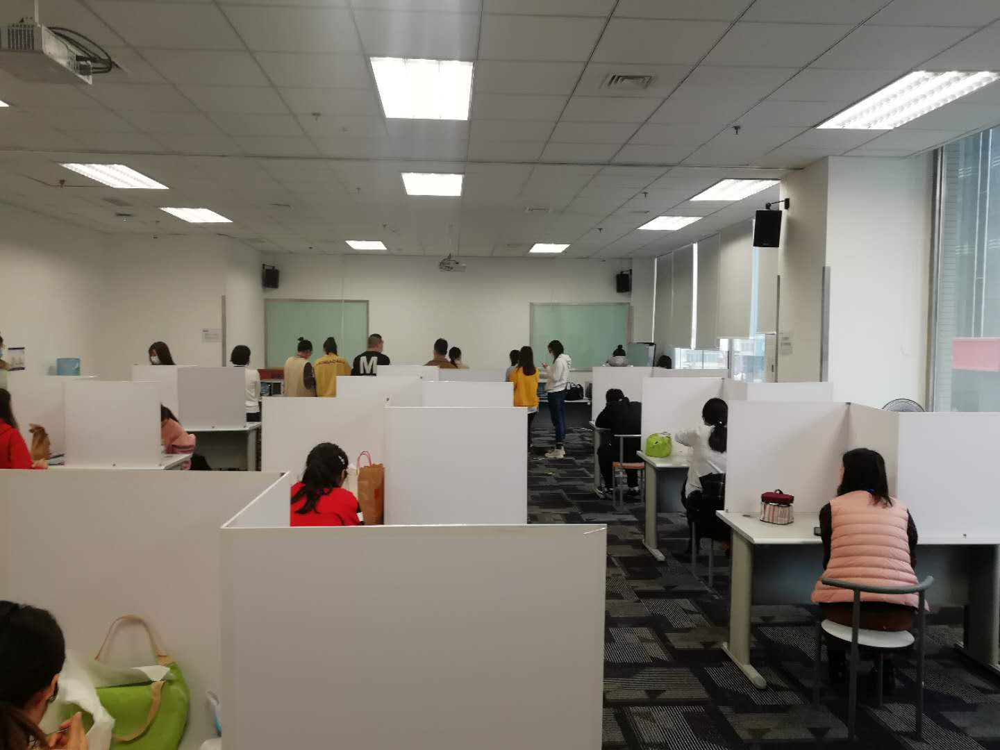

Kelly接到村里党支部微信，通知要捐特殊党费。“原则上普通党员不超过1000元。”
她大为光火。理由是：“‘捐’是自愿的，不自愿的应该叫交”。
就此，我跟她展开了亲切而友好的辩论。我说：“也没用错啊。如果是‘献助’，那就是你说的用错了；可是‘捐’还有一个意思是‘赋税’，也就是苛捐杂税的‘捐’。这个解释的时候，是强制的，不用自愿。”
Kelly回去想了几个小时。又来跟我辩论：“当赋税讲的‘捐’是名词，捐党费的‘捐’是动词，所以不能用赋税来解释。我还是要生气！”
她赢了。
旁边小葱同学全程旁听了我俩的争论。敲了一会儿键盘后，开腔：“捐躯的时候，‘捐’还有牺牲的意思。所以你的钱牺牲了，这解释完美不？”

上面这个故事告诉你们，抬杠可能是程序员的职业病。

我老婆虽不是党员，她们那半国有性质的单位却也“号召”“捐”款。
这个“捐”绝壁是名词的那个“捐”。

疫情得到控制，复工遍地开花，协弃市政府的控制措施反而更严了。
公司之前的一人一桌被警告了，周末连夜给加上了挡板，成了现在这个样子：

离公司最近的就是金拱门。从这周开始，之前的自助点餐机也不让用了，为了“避免接触”，只能通过手机APP或者微信小程序点餐。

几个群疯转市政府通知，要求下载市民云APP，填个人信息，生成二维码。有二维码才能上地铁和公交。
而二维码的生成是需要实名认证的。两种手段，面部识别或者走支付宝的实名。
那一刻真产生了不匿名，毋宁开车的冲动。但想想开车上班的一系列麻烦事，果断怂了。
想必开发的人也没想到，还有支付宝没验过脸的人存在吧。

小区封闭的时候，小区收集了手机、住址，让做了一个二维码，后来没人查。
刚复工的时候，区公安局~~手机~~收集了手机、住址、身份证号，让做了一个二维码，也没人查。
这回市政府又收集。反正今天第一天，地铁只有广播里嚷嚷要查，却也没人查。
麻痹的，什么都要再搞一次，身份证里的芯片到底有什么用？！无权读身份证信息的部门，也应该无权收集我那些隐私才对吧。
等我闺女毕业，高低要换个老头机，怼死这帮些拿鸡毛当令箭的。反正我手机套餐里一个Byte的流量都不送。

话说上个礼拜六，全家驱车出门，目的之一是还年前就该还的移动宽带的电视盒子。
好容易找到一家开门的大网点。只开了一扇门。保安把我拦在耳房，要求排队等里出来人了才能进。
*——“特殊时期，大厅里客户不能超过15个。天天来查。”
——“那营业员呢？”
——“营业员不管。”*
业务不复杂的根本就不会出现在这个大厅。每个业务都得办个十几二十分钟。

还完盒子。来都来了，我还是顺便问问自己的卡相关的事。（当天是2月29号）
*——“现在18块钱的套餐有2G流量是吧？”
——“是。”
——“我要是今天新办一张，这个月月租是18还是几毛钱？”
——“论天算，是几毛钱。”
——“那你们现在那个送流量的活动，能查一下送到几月份吗？”
——“稍等………………到7月31号。”
——“谢谢，我今天先不办新卡了。”*
即使隔着口罩，明显能看出柜台MM在笑。
她笑有她的道理，我问也有我的道理。各取所需。

出营业厅的时候，耳房里已塞了20多人。要是真有发个热的就gg了。

我手下有个小孩，1~~8~~9年毕业来的，算我半拉徒弟吧。她家是内蒙莫力达瓦达斡尔族自治旗（简称莫旗）的。在正月初四左右的时候，莫旗封旗了，不准入也不准出。
2月1号没回来。2月10号没回来。2月29号还是没回来。
当然协弃市的规定跟全国大多数地区一样，外地回来的，先自行在家隔离14天才能上班。
关于工资，辽宁省规定的是2月9号以前的全额发，2月10号以后的自行商议。
我们公司完全遵守国家和省里规定。9号之前分文不差，10号以后的，先拿有薪假顶。有薪假不够的，周末加班顶。实在没法顶的，对不起只能按无薪事假算。
小姑娘本年度本来就只有3天年假，还用光了。
设她上周六3月7号回协弃，隔离14天之后就是3月23号。
从2月10号到她上班一共欠了25个工作日。这意味着不算节假日，得干到夏至之后她才有周末可休。

昨天晚上她微信里说：“她认了，合同该咋办就咋办吧。要是欠公司钱，她就通过微信转。反正人是不会再出现在协弃了。”
至于莫旗解没解封，早已不再重要。

唉！

我是感叹她的命运吗？不，我是感叹缺人干活啊！