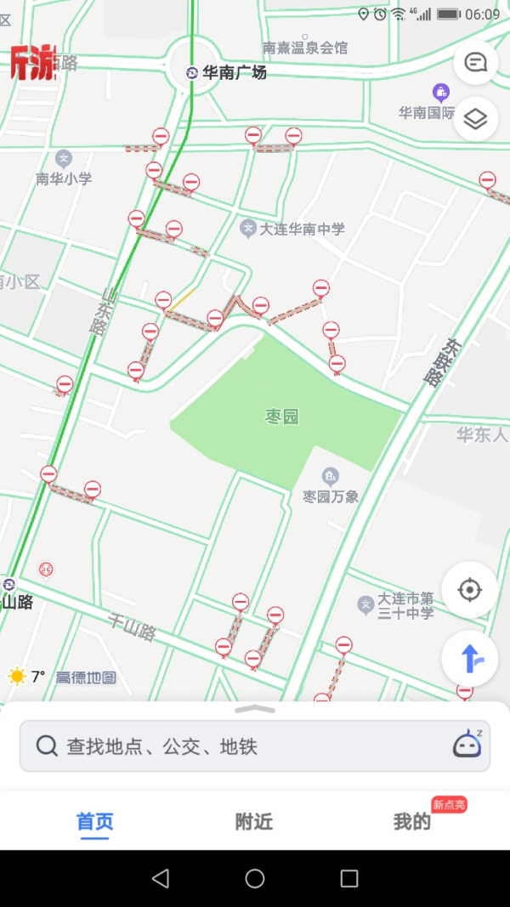

上一个阶段，协弃市累计病例是19例，全部病愈出院。
但是，进入新阶段之后，输入病例已经有7例了。都是十几岁到二十出头的留学生。
再次印证了协弃市汇集了东北不愿离开的贪官和土大款这一事实。

有关方面的管制措施未见根本性的放开。对企业的管理可能反倒严了，每天上班都要求我们刷市民二维码签到。
正规的餐饮面积够的允许恢复堂食，同样要求食客刷市民二维码签到。
完全是虚张声势。对于企业，只能吓唬我们这种大型的守规矩的；饭店也只能管束到万达、奥莱、佳兆业、柏威年这种有主且集中的。路边小店对饮喝醉甚至大打出手的都已经恢复了。

个人认为最没有意义的是对老小区的封闭。除了增加居民的出行成本，以及害街道工作人员整日忙碌以外，根本没用。
如下图所示，高德上标出来的是封闭了的车道，实际上还有更多的行人的路口也被堵死了。老小区基本上是以“社区”为单位封闭的，坐公交买菜绕路二里地已是寻常事。

即使是武汉最重的时候，我们这里也没怎么慌。但这几天是真开始手忙脚乱了。
皆因日本疫情严重，东京进入紧急状态，客户那边从上周五下午开始整个办公楼疏散，所有人在家办公观察一周，后续待定。
甲方皆祸害一事无需再论证。日本人又大多是夜猫子，加上在家办公要显得自己很忙。于是乎，什么下半夜1点的邮件啊，什么周日中午12点的WeChat组群聊啊之类的幺蛾子都来了。
亏他们还知道中国人周末不看邮件还开WeChat。
当然找的都是领导，没我啥事。

从4月1号开始，协弃的市民APP上将不再提供评价抢购的口罩。我们公司也不提供福利口罩了。
据说同时药店的口罩销售会放开，比之前的一次性口罩好一点的一次性口罩，价钱也会好不少。

组织上任命了一位市委副书记。都知道是啥意思。
这意味着，年前盛传的小胡不会来了。
本来还打算在那之后把协弃市改名为胡来市或者小胡来市呢。
梗玩不成了，不开心。

不过，似乎胡不来市也挺带感？

注：夫=大姨夫。