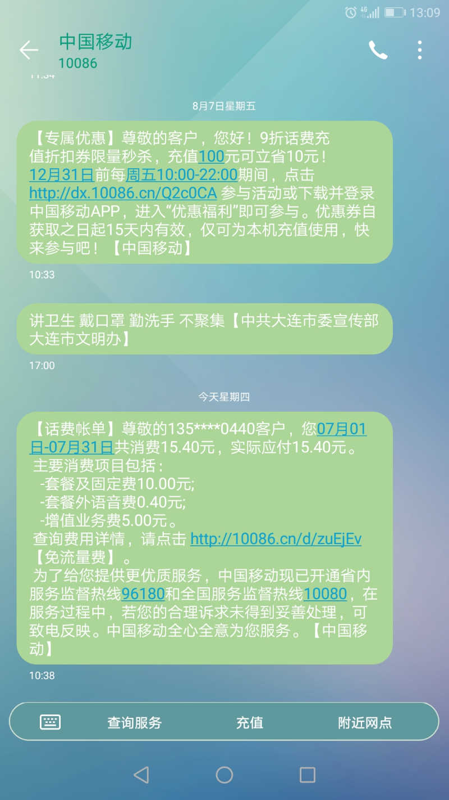

7月初的时候手机摔了一下之后屏不亮了。联系老婆家那边的一个在胜利百货卖手机的嫂子，去修一下。
因为疫情，有一半的门不开。没手机也不能问路，究竟哪个口能下去只能靠撞运气。
一路走去，只有大约1/3的摊位是营业的。多是美甲的。最多的服装鞋帽类的，十家能有一家开业就不错了。
二嫂所在的手机广场倒是有很多人。等换屏的功夫，跟二嫂聊胜利的惨状。她说：胜利现在就靠他们这帮买手机修手机的撑着，大概一个大厅聚了整个胜利一半的人。
偌大的胜利广场啊！曾经的城市名片的胜利广场啊！

7月份是之前移动两年免费送流量活动的最后一个月。这个月过完我就要没流量裸奔了。
10号的时候，登录APP查看有没有什么流量的活动。发现有个回馈老用户的什么包特适合我——每个月10块钱2G流量，一年以后会涨到每月3G。这个包刚刚好适合我，赶紧用上。
因为我的话费是每个月15块钱最低消费的。为了给话费留点空间，就把之前办的小号取消了。
但是，这里有个问题——流量包是当月生效的，而小号得下个月才能取消，这个月的钱已经扣了——7月的话费空间被用光了！
不过问题不大。我爸妈、老丈人、老婆都有内网小号，打电话不花钱。我只要保证不往外拨收费电话就能保住金身。
7月28日，开发间不开空调实在太热，我跑外面茶水间吹风。同事小黄也在。
“哥，电话借我用一下呗，我电话忘带了。告我对象一声，让他晚上去接孩子。”
但凡是个正常人也说不出不借吧？

可是哥是真的差这四毛钱啊！

我不记得是不是曾经在这里骂过创维电视了。再骂一次好了。
三个多月以来，电视的遥控器逐渐慢性死亡。先是音量键不好用，然后是线路切换键不好用，终于，建军节那天，关机键也不好用了。
我以为是闺女总用油手按键导致部分按键不灵了的原因，拿出工具拆遥控器查看。老婆则在研究电视侧面的按钮，希望能先把电视关上。最后的办法才是拔插头对吧。
这边还没拆完，那边老婆试出了真相——遥控器上不好用的键，调出软键盘也不好用。
作为一名老程序狗，我一下就判断出来了，这tm只能是软件问题！
重装，哦不，恢复出场呗。好了。
麻痹的创维，我实在不能理解这种使用后导致按键不响应的BUG你们是怎么写出来的！

部长过年前去日本出差，就没能回来。协弃这边7月份起任命了一位代理部长，萱哥。
这位哥们对纪律一类的事情特别重视，比如天天跑过来看我们有没有戴口罩，比如找5点05分以前打卡的同事挨个谈话，问他们怎么挤得上下班电梯的。
最近强调的纪律是，要求每人每天在座位上的时间不得少于6.5小时，并且用一个月的数据说话，召集各个项目组的领导谈话。
对于程序员来说，推导出他的数据来源很容易：不就是我们开发间门的进出打卡嘛！
我们组被表扬了。主要就是因为我。我的在座位时间是全部门第一。
因为我腿不好嘛，上班为了有座，每天都会早走一些，下班也会晚走一些，错峰。
而且我还不下楼吃午饭。我把吃饭的时间都用在看别人的博客上了……
可我的数据经不起考验啊，这就是把我架在火上烤。我并不是为了干活才坐在座位上的啊。这要是被人嫉妒，揭发出我一半的时间在摸鱼就尴尬了。
于是，在第一次统计公布之后，别人是不敢在茶水间多留了，我却要每天增加一次至少20分钟下午蹲坑时间。
就说，公式准确很重要嘛！

注：夫=大姨夫。