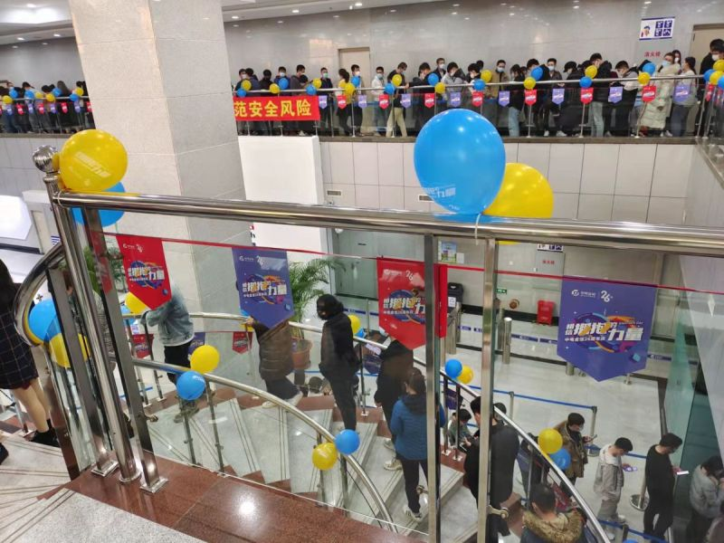

过去的相当长的一段时间里，往github提交代码都是失败的。只当是大强发威，反正也没什么紧要代码要提，就一直没当回事。我甚至一度错误地认为，Github是不是终止了对于svn[[1]](https://pewae.com/2021/11/random_kuso_68.html#inner_anchor_1)的支持。直到前几天补读RSS，发现某条旧闻说Github取消了密码认证，只能用令牌，才幡然醒悟。赶紧创建一个，涛声依旧了。
对不起大强哥，冤枉宁丫的了。

进入10月末，协弃市开始强推12岁以下孩子的疫苗接种。幼儿园和小学的小朋友除了有正规医院出具过敏性疾病诊断书的，一律要扎。臭宝学校11月1日（周一）下通知，学校会统一出车把孩子拉到区里指定的接种地点。要求家长11月4日（周四）下午请假，自行前往接种点跟孩子汇合，就为了当场签个监护人同意的字。等孩子接种出来以后自行带孩子回家。
那个接种点位于最近10年才开发的小区，进出只有一条路，也没地方停车。我们六年级预定的时间是下午16:30，扎完正赶上晚高峰。
一夜在思考如何带孩子回家中度过。
第二天（周二）中午，班主任又在群里发了新精神：因为周一去的接种的学校进度太慢，所以我们学校周四排不上，顺延到周五。但是周五的时间又不确定，要求每家出一个家长，“全天待命”。
到了周四（11月4日）下午，叒出紧急通知：因为庄河出现疫情，接种活动取消。

周日(11月7日)下午，因为有人从庄河偷跑回了市内，出现人传人现象，市区有多个小区被波及，封了。教育局叕次发出紧急通知：由于【天气原因】，即将到来的周一周二两天所有中小学停课，学生在家自学。
气象部门也发布了暴雪、大风和降温警报。
立冬本就有吃包子饺子的习俗。
立冬、疫情、暴雪、熊孩子在家，加上近来一直持续的食品抢购风并未退去，几个原因争奇斗艳，在下午两点多，高速口以天气原因为由封闭的视频被放出后，居民害怕封城封门的恐慌达到最高峰。无论线上还是线下，所有大型超市的米面油、方便面挂面、面包、香肠肉干、速冻饺子汤圆馄饨手抓饼、八月节没卖完的月饼都被抢购一空。楼下小超市里连黄飞鸿花生都断货了。没错，我们一家也去扫货了，没买到吃的，贼不走空的老婆大人买了4件10L的纯净水。
现在的天气预报也还真准，晚上17:00多开始下冻雨，到了19:00风雪交加，一夜未停。
此前我从未在树叶还没掉光的时候见过这么大的雪。

（11月8日）天刚亮，班主任发出11月第5号班主任令，要求所有学生和家长，两天内完成核酸筛查。眼见外面白茫茫一片，也不打算去公司了，在家看孩子吧。
我们家所在的社区检测点10点才开张。带着孩子冒着雪踩着泥泞的路面赶到的时候，前面已经排了大约200米的队。想着10人混检应该过得很快，就把孩子放去玩雪，自己在队伍里占着位置。
老婆大人发来新指示：这次检测不登记身份证，而是要通过扫“辽事通”的绿码确认身份。只认码不认人，让我赶紧找到“代填身份”项，把臭宝的身份录进去生成二维码。我找了五分钟，没找到。
老婆大人大骂我笨，随后发过来一个某音的链接教程。
赶紧电话回去，说：“你又不是不知道我没装没账号。”
又被骂：“都什么时候了还心疼你那点流量！”
电话挂了，小声嘟囔一句：“就不是流量的事儿。”
排在队伍前面的阿姨看不下去了，从手机里调出了那段教程视频，也没说别的，就是让我看。
step by step，确实是没那项嘛！
旁边好心的维持秩序的警察叔叔一句话点醒了我：“你是不是进错小程序了？要不要再扫一遍？”
立刻开微信，找出了小程序的“辽事通”，遂一切顺遂。
结论是，这个功能在小程序版里有，APP版没有。这软件做的……

这个靠二维码确认身份的新龟腚很蛋疼，队伍里老人和孩子多，尤其是还有不怎么会用手机的老人单独带孩子排队这种可怕的组合，所以进展特别慢。200米的队伍看着不长，其实有很多人跟我一样，把孩子放出去玩雪、把老人放车里避风，只派一个代表排队。轮到我的时候已经过去了2小时。

协弃这波疫情的具体情况不说了，我知道的也都是媒体上看来的，毕竟庄河在200多公里开外。
而某小学的小朋友们被全校隔离在香格里拉酒店这种花边新闻，又没什么实际意义。

11月9号晚上，如同预料的那样，所有学校无限期停课，而且也不再遮遮掩掩地用天气原因做借口。因为“双减”和减少电子产品的使用，市教育局这次不给制定统一的课程，由每个学校自行制定教学计划。我们学校更是放权给了任课教师，上午老师自己找教学视频发到群里，晚上每科老师30分钟腾讯会议线上答疑。
老师们相当于每天都要上一次公开课。腾讯会议里听着个顶个的平易近人举重若轻笑靥如花。

这两天老师收集批改作业，用的都是QQ群。
这倒霉玩意儿现在PC端竟也要求先在手机上绑定手机号才能用了。
当初你可是自称“网络寻呼机”的啊！
都绑定手机了，还要你个寻呼机作甚！

今天11月11号，本来是公司成立26周年的司庆日。
因为疫情，所有庆祝活动取消不说，却迎来一轮全体市民核酸筛查。有人到我们公司上门服务。预定12:30开始，试剂12:50才到。
啪了个叽的，辽事通的服务器下午13:30左右挂掉了。
全市的筛查陷入停滞。两个多小时后才恢复，能不能刷出码还要看脸。
16:40公司广播通知所有员工，不做完检测不准下班；
17:10保安挨个通知排队的同事，没试剂了，到此为止，各回各家。
真是个愉快而又有意义的司庆日啊！

辽事通这个软件，以及这两次的筛查，真的很辽宁。

---

- [(1)](https://pewae.com/2021/11/random_kuso_68.html#inner_ref_1)：比起git，我真的喜欢svn太多太多。