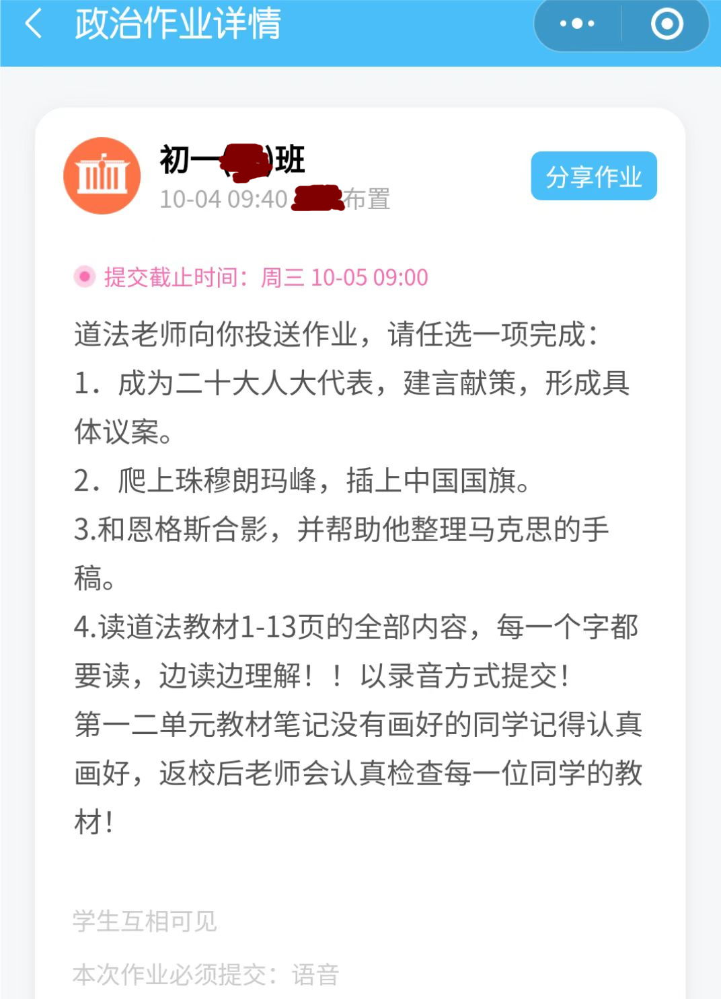

静默前的两天出勤产生了4张打车票。3张出租车的实体票，1张滴滴的电子票。
因为嫌公司的报销系统麻烦，所以从3年前公司上了现在的报销系统之后就没用过。这次钱数（约￥30 * 4）确实有点多，不报太亏。
先要在手机上下载一个APP，输入员工号后提示说初次使用要给手机发验证码激活。连弄5次，又在茶水间等了15分钟，屁都没收到。
想想觉得不对，回到座位上开公司PC——果然，5封未读邮件整整齐齐地排在那里——连个提示都说不明白，邮箱跟电话没搞清。可以说这第一印象已经很糟了。
拍照上传什么的不在话下。直属领导直接就给我拍回来了：打3次车只能有3张票的附件，而我传了6张（出租车有1元燃油附加费）。再出去一试果然可以，而且很贴心地总价也加出来了。但真没有任何提示说拍照的时候可以两张一起啊。

邻座的琪琪的打车票审核的时候出了问题。票据中心发专门的邮件来质询：“为什么你的票据跟另一个人的另一份报销单据产生了连号？”
这张票的故事是这样的：
我们虽然都居家了，但干活需要用带回家的PC通过VPN远程到工位机器上，活还是要在工位的机器上做。偶尔网络或者硬件有个风吹草动，就需要重启来治百病。所以每个开发间要留一个人值班。静默期间即使有特殊需要出门也不能跨区，我们开发间只有琪琪和另外一个外驻小伙符合条件。
在静默的第二阶段，高新区的出门卡要本人手写的保证书加签字后加盖公司戳才能批下来。某日公司就要琪琪到公司交那张手写的保证书。她交完保证书从公司离开的时候，刚好有另外某部门的某同事也打车来公司交保证书，一下一上，这不就赶巧连上了么？

臭宝的老师都挺年轻，最有历史的历史老师才31岁，其余三大三小的老师都没到30。班主任教语文24。数学老师最年轻，刚毕业才22。
每次群里发作业，看到“道法老师”这个title都会觉得很玄幻——总觉得给群里应该还有一堆潜水的“炼器老师”、“符篆老师”、“炼丹老师”、“御剑老师”、“御兽老师”……
这位90后道法老师还真是爱整活。说好听的叫活泼，说不好听的就是贱嗖嗖的。

瘟都这波疫情，9月18号（周日）解除静默，9月19号（周一）允许全面复工。我们公司怕周一人多，让多居家一天，9月20号回公司。
9月21日，周三，农历八月二十六，领到了百感交集的月饼。

复工以后，瘟都政府规定所有营业的场所都要扫“场所码”。公交车也要扫。地铁站也要扫，而且进站扫一次，出站也要扫一次。地铁站不光要看行程码，还要看移动数据的行程码（箭头码）。
也就是说，你扫场所码的时候，码得是绿的——这表示正常做了核酸，等于良民证。
去一个地方扫一次——这样一旦出事能立刻找到人，等于通关文牒。
箭头码是绿的——表示你从安全的地方来，等于路引。
我上下个班，得扫9次场所码，出示2次行程码。当年唐僧取经也只看一本通关文牒啊！

龟腚这个东西，永远是来的容易去的难。8月31号的时候街道来人把我们一楼饭堂给贴了封条，这叫避免飞沫；给所有楼层的楼梯门也贴上了胶带，这叫不准串楼层，精准定位。
可复工了，你倒是给找个地方吃饭啊——饭店不让堂食，一楼饭堂不让进，开发间属于实验室不让能东西，会议室也有规定禁止饮食。
要么违反规定在会议室吃（座位上有开发板，吃东西真的很危险），要么遵守规定在走廊里站着吃。
作为遵纪守法的好员工，我选择不吃。

最可笑的是，9月25号全市就又允许堂食了，可我们公司楼上楼下的封条都被遗忘了。
公司又等了三天，不知是问了有关部门还是私自行动，才敢把封条揭掉。

翻墙摔断腿的[黑哥](https://pewae.com/2022/09/static-dalian-3rd.html)手术之后恢复良好。
他这次伤在腿上行动不便，加上这个时期去医院也太麻烦，跟医生沟通以后，医生让他在家自己拆线。
拆的时候，黑嫂在一边给录了像。黑哥拆完后自己看视频觉得有意思，就给上传到了某音。
该视频两小时内点击就到了2万+，几天内点击到了4万+。此前他最多人看的视频点击才600多。
人啊，无论什么时候还是喜欢看血刺呼啦的东西啊。

P.S：十一期间在家攻略某FC名作的SFC复刻版，被一个BUG搞得欲哭无泪。