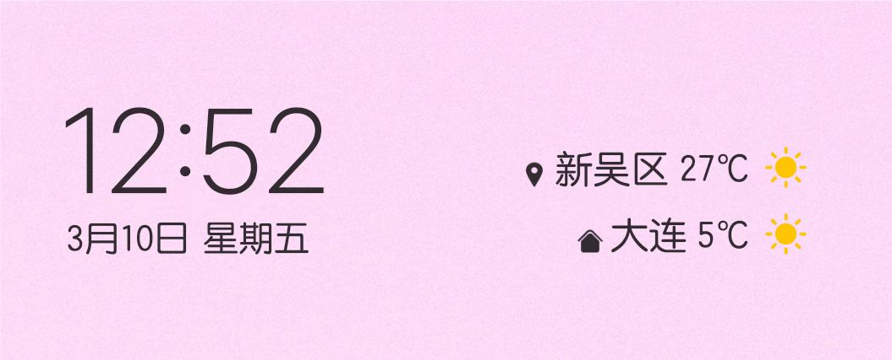

去位于新吴区的无锡公司出了趟差。
上次出差还是在2007年，我还没结婚。今年我闺女都初一了。

走的时候本可选择周六或周日出发，周六家里有点事，就选了周日。可周日只剩了21点20的一趟航班，咬咬牙，就那样吧。

航班人少，好像只有一半人。以至于办托运的时候被告知直接拎上飞机就行，有的是地方。
可是出发前两个笔记本的电源都被扔在箱子里，被安检的要求打开查验。有心跟他争辩又不能特别咬得准政策。算了，人在矮檐下不得不低头，急匆匆打开密码锁，查完又急匆匆关上。

没错，我带了两部笔记本，一部用于项目，另一部用于另一个项目（需要VPN）。
出机场，打车，到酒店刚好23：30。行李一放就来事了：密码锁打不开。大概率是过安检时仓促间把锁拧坏掉了——有一位明显松了使不上劲。
手边也没个像样的工具，折腾到凌晨2点啥也不是，匆匆睡下。

天亮后去报到。因为是“自家人”，也没太大的拘束，人家干啥咱干啥。最明显的差别是无锡这边太讲究节能了。早上空调谁第一个到谁开；会议室空调谁要用谁跟保安申请，然后保安给发遥控器，到时间回收；最过分是午休时间要熄灯！

工作工作，笔记本不能用可还行。第一个午休拒绝了无锡同事一起进食的邀请，跑回酒店，让前台找工人用钳子搞定了小锁头。把两个电源适配器带到工位上，工作才算是步入正轨。

无锡的作息时间跟瘟都完全不同，是标准的朝九晚六。对我来说那是相当的不适应，尤其下午显得特别漫长。
下班后直奔700米外的万达。我第一次见到如此荒凉的万达，里里外外没几个人。
我一直以来的习惯是每到一个地方要尝尝当地的啤酒。然而这个“长申”超市里并没有发现任何苏锡常的啤酒品牌。贼不走空，买了提当地的酸奶。难喝。
谨防食物中毒，第一餐在白胡子爷爷记解决。好不好吃另说，油比之前吃的要大。

出差最大的好处是不必早起。虽然闹表调到7点，可还是按照平常的生物钟，5点50醒了。但能来个回笼觉可太舒服了。

第二顿午餐，一位PM带我去吃的快餐。快餐店紧跟物联网潮流，餐盘刷微信后，每个盛菜点都能根据菜品不同称重并计算价格，精确到分，小开眼界。
晚饭直接在酒店旁边的小店吃面。几个店都是扫码点餐，不爽，最后找了家不扫码的羊汤，意外味道还不赖。

这趟任务正常是一周搞定，但因为公司从报销制度过于恶心，所以一共申请了三周，也就是留了两周的提前量。无锡的同事进展得非常不顺，第二天就确定一周内肯定搞不定。

第三天，另两位PM合伙请吃中午饭，饺子。过了这天我也开始推说自己不吃中午饭，这样大家都省得尴尬。何况我说的也是实话。因为中午我有更重要的事情要做：回酒店拉屎。
瘟都的上午10点一直是我带薪拉屎的时间，但无锡这边一来不太好意思，二来没有坐便，所以我那叫一个浑身难受啊……

国家软件园这地方实在太偏僻了，我其实不太愿意把它叫做无锡，想必无锡土著也如是以为。我问这边的同时，周末去无锡有什么好耍，得到的建议竟然是打车去高铁站，买张票20分钟就能到苏州……

第一个周六，去了惠山古镇和南长街。
第二周的第二天，确定了延长到第三周。
心情开始烦躁起来。

3月1号，忽然反应到闺女开学了。
打开QQ想看看学校又发了什么神经。可能是长期未登录加异地的原因，直接给转到认证阶段，就是要好友给发验证码。把验证码发到铁子群，没多久，队长说：“帮不了你，我的QQ也登不了了。”又过一会儿，李子干脆跟我一样发了一张求助图片进群。
好么，大家的QQ都落灰了啊。
最扯的是，能够登录以后才忽然想起，tmd闺女小学班主任才喜欢用QQ群，可现在她已经是初中生了。他们初中根本没有QQ群这玩意儿。
换句话说，我的QQ有８个月没打开过了。

差不多第二周中段开始，新吴区的气温开始飙升，第二个周末不得不跑去补了一件新外套。
此外哪儿也没去。本来@老虎 建议去梅园。早起一看梅园附近堵车，就立刻找到了不出门的理由，也不去想本来就是要坐地铁的，关地面堵车毛线事。
另外一位同事推荐水浒城。看看路线，两头都要打车，且还要花100多买门票，念头秒消。

第三周进入心情异常烦躁的状态。
一次性的内裤袜子告罄，电须刀也没电了。U盘里带的12部片子早就看完了。连续吃了20天的酒店早餐也不香了。那家感觉不错的羊汤馆都关门了。
19号下飞机的时候，两地的气温还差不多，办公室里开的是暖风26度，离开的那天，已经要开22度冷风了。

第三周的周五是原先计划的最晚返回日期。能不能回也要回。这里倒是要感谢出差申请延期异常麻烦这个龟腚。
周四下午忽然接到一个电话，说航班取消，要退保险。电话那头的普通话很好，一开始还以为是真的，直到要我下载一个app且要共享屏幕，我才意识到这是个骗子。把那个app删掉之后开始陪他玩。
“先生你用的银行卡是谁家的啊？”
“招行。”
“先生你打开招行APP啊？”
“没装。”
“先生要不然你操作一下短信银行啊？”
“没开通。”
“先生那你平时怎么操作银行的？”
“用电脑啊。”
“……欸，先生，要不然我们还是用微信吧，请打开微信收付款，像平时那样展示二维码……”
（我啥也没做）“打开了。”
“唉，我怎么什么都看不到啊……”
挂了。
不得不说这个回家前一天的时间点拿捏得真好，心情急躁下真的容易中招。

周五下午一点多，我都准备跟这里的同事告别了，接到了东航、携程和公司的短信三连。因为天气原因（瘟都大雾），航班真的取消了。

赶紧走公司系统改签机票并重新订酒店。
新订的酒店要远一些，checkin的时候，前台小姐姐说，先生，您订的这个275，其实可以退了，我这边可以直接做到220带发票的……
我说：“不要。”

最后一晚不死心，又逛了两家超市，仍旧没见到本地啤酒，苏锡常的都没有，遗憾。

最后一天归心似箭。中午退房后在金拱门家吃了午饭喝了杯咖啡磨蹭了一个小时就去了机场。在机场从14点一直坐到18点20登机。
硕放机场座位扶手下面是有电源插头的，大大好评。