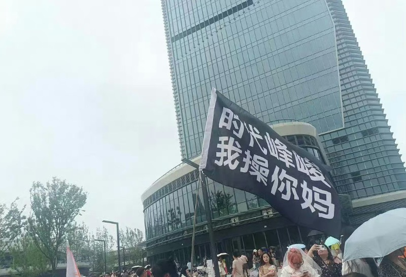

臭宝这次期末家长会不值一提。天气太热，老师都是只说几句便草草结束。臭宝三主科大约能排进全校前100，加上四小科之后就只能排500多。成绩模型太另类，老师没单独褒贬。
这种成绩倒是好事，主科不差不用太过紧张，副科不好正好把翘起的尾巴敲下去。老婆大人带她去延吉耍了4天，我也难得在家花差花差，好不过瘾。
这四天是周末两天加接下来的周一周二。
臭宝出去玩一趟没说如何高兴。周三回来托管老师说不上课，上午出去看电影，下午回来打水仗。问就是教育局督学检查，不让讲课。
再问，她走这两天，托管因为同样的原因而没上课。她出去玩一趟却没逃过一节课，进度跟别的小伙伴仍旧是一齐的，顿时感觉亏了一个亿。

上次说到臭宝追的TF三代[[1]](https://pewae.com/2023/08/random_kuso_84.html#inner_anchor_1)的广州演唱会是躲过去了，可转眼人家把演唱会开到咱家门口了。怎么说也得安排上啊。
乖乖，这年头的追星，就是赤裸裸的阳谋抢钱。
——人家这票压根就不直接卖。你想买时代峰峻家的票，就得先加入他们家的会员俱乐部。199每位每年。有了会员，赶上演唱会什么的才会发个二维码，曰抢票资格。
好说歹说，劝住了臭宝买会员的冲动。幸好据说全国有至少500万会员，也就是说总有大批会员是参加不了这些活动的，他们就会把这些码卖出来。在某鱼花40块钱给她买了两个第一天（场）的码，又花50块钱买了三个第二天的码。严阵以待。
第一天她们娘俩啥也没刷到。第二天一家三口一起上阵，还好我刷到了一张最低档的“山上的”票，680。
同期张信哲李荣浩也来开演唱会，票也难买，但山上的票却只要380。
小孩子和女人的钱好挣=>女孩子的钱最好挣，古人诚不我欺。

表哥家侄女高考结束办升学宴。480多分，压线进了山东某学校二本专业——这压力有点大，咱不得比同班的山东孩子少个七八十分啊！
宴席上嫂子表示，这孩子多么多么不容易，没赶上好时候——三年前初升高之前就赶上疫情居家，然后疫情两年半，课都没好好上，考前一个月又二阳了。
我心说除了二阳这件事以外，全市的孩子不都一样嘛。
不过侄女说的，叫不全高中同学名字这件事还是挺令人唏嘘的。

现在的项目我是跟一位大哥一起干的。这哥们摸鱼的风格跟我完全不同。
他家里单位只有不到二里地，步行就是10分钟的事。哥们总是态度端正地表示，有什么事给他安排就行，文档写好了让他测就行。然后白天就是刷视频看小说不干正事。一下班借口接孩子给孩子做饭秒闪。最绝的是，半夜一两点跑回单位，开始给我的文档代码什么的挑毛病，发群里，一副虚心讨论的样子。
可把无锡的小伙伴以及日本的客户都吓坏了，说咱们进度没这么紧张，不用加班到那么晚。
咬牙调了个4：30的闹铃，看到他有留言就给回回去。三五次后，不药自愈。

注：夫=大姨夫。

---

- [(1)](https://pewae.com/2023/08/random_kuso_84.html#inner_ref_1)：时代峰峻一代目是TF Boys，二代目是时代少年团，三代目一帮小破孩子现在还没正式出道，连个团名都没有，只能称之为TF三代。