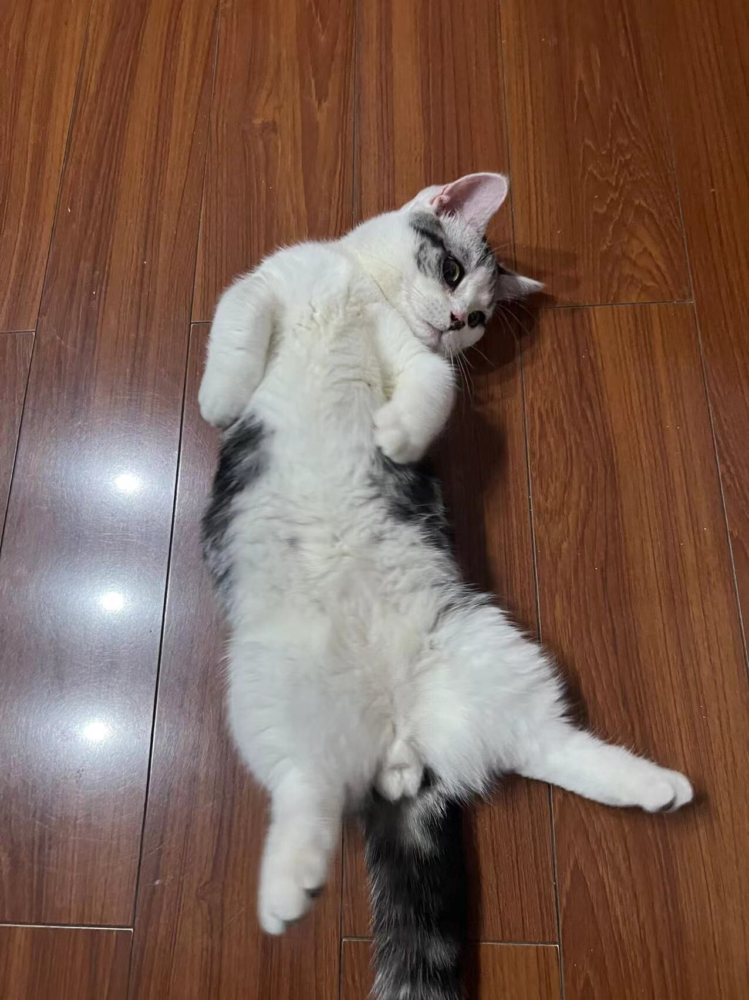
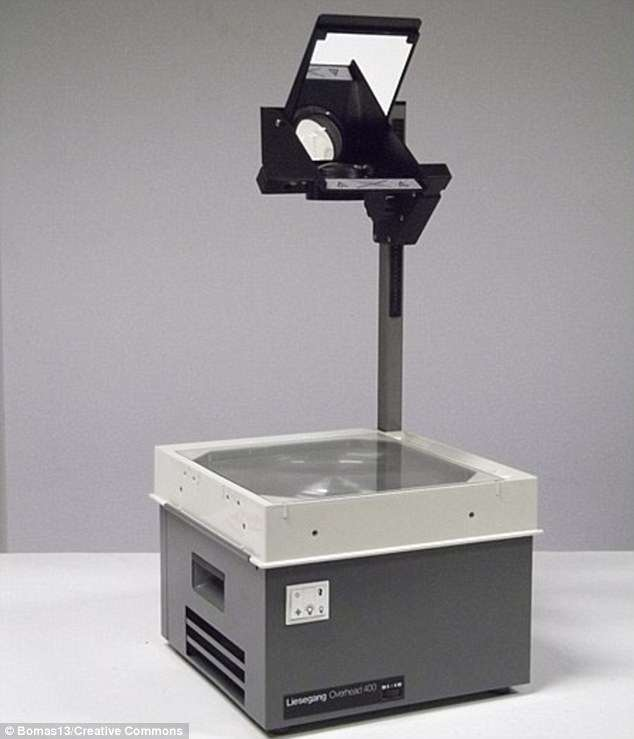

这段期间真是忙得脚打后脑勺。

带臭宝去了好几次医院。

臭宝学校，一个多月以来，班里的学生们此起彼伏地发烧。
10月底轮到臭宝。因为怕专业的儿童医院人多，所以舍近求远去了中山医院。晚上不到7点半到的中山医院，验完血就已经过了零点。
大夫也没说具体是感冒还是流感，也没像最近这样解释成支原体，只是说细菌和病毒都有。
挂完水，开车到家已经快凌晨3点了。关键是烧还没退。

折腾半宿，且老婆单位不好请假，就直接给领导发微信请假。
凌晨3点05分，领导秒回：“我也在医院，天亮也去不了公司……”

第二天一直浑浑噩噩，傍晚犯了错误。铺床的时候把臭宝乱扔的体温计直接甩到了地上，摔了个稀碎。
等老婆大人下班回家，赶紧掀开床垫，两人趴地上满地找水银球。
第三天不得不又跟领导请假：“因为孩子发了烧，所以我闪了腰。”

11月2、3日两天期中考试，班主任要求不管你考前考后烧成啥样儿，考试都不能缺席。
后来臭宝给我解释，这跟学校对成绩的统计方式有关：如果有缺考就直接记0分，而不是记缺勤。如此，缺考就会大大降低班级的平均分。平均分直接关系到老师们的奖金。

过了两周，臭宝又病了，这回是莫名其妙地头疼头晕恶心。
11月6日（周一），早起通过小程序在中山医院挂了个神经内科（二楼）。排了三五个人，轮到的时候竟表示神内不看14岁以下小孩，得挂儿科（四楼）。
再看儿科，只剩11点以后的号了，挂了之后再去儿科咨询，门口护士表示：“虽然但是，你这号上午肯定看不上，要不你试试急诊？”
跑楼下急诊（二楼），问讯处的护士表示儿科的护士是傻子：“一共就俩大夫，儿科急诊门诊不都是他们看？”
跑一楼把两个号退掉，奔儿童医院。

儿童医院神内的号早没了，欲挂急诊，窗口表示，只头痛不发烧的不给挂急诊。

又去医大一院。挂了儿科急诊。
8：40挂上的号，排队到10：15才给看上。看人家大门上写着“复诊看结果请重新排队”，赶紧把孩子姥爷从家CALL过来去队尾占坑。
开的验血、心电图和头部CT。CT排队到11：40做上。
12：20吃完饭回来，让老爷子带臭宝找个凉快地方坐着，换我排队。眼瞅着手机电量余额不足，赶紧通知孩子他娘替我用小程序刷检查结果。
还是多虑了，CT报告出来的时候，前面还有9个人。
等大夫得出：“没啥事，就是大喊大叫喊缺氧了”的结论的时候，已经是14：20了。
不愧是急诊，尿急的急。

匆匆奔回家，因为16：00还要赶一场臭宝的期中家长会。
臭宝带病给我翻找邀请函。因为“老师特意强调，不带邀请函不能进校门”。
然后嘞，初二2077名学生，实到多少不知道，16：00之前校门不开。开门后站两位身高一米六三的女老师，拿喇叭喊：“请家长出示邀请函……”
搞笑呢。

家长会乏善可陈。也就是跟臭宝的新班任见了个面。
第一印象不太好。倒不是因为他是男的，而是他的吉林口音实在太重了。

臭宝仍不见好，周三又请假带她去儿童医院的新院区。
新院区的好处是，小程序也是新的。挂号导诊交款都可以在小程序上完成。
病没任何进展，结论就是没病。
但我以为收据和病历也能通过小程序搞定就想当然了。

周六再去一趟，只打出了收据，人家整个科室都不上班，自然没法打病历。
周三，不得不再请半天假，才让大夫把病历给打了。

哦对，臭宝的病到了周末就忽然好了。

比一个祖宗难伺候的是三个祖宗。
臭宝一直嫌[老婆养的小猫](https://pewae.com/2020/10/e6b7bb-e4b881.html)没毛不好看，要养只带毛的。
刚好老婆同事给牵线，她们家楼下宠物店送了我们一只小美短[[1]](https://pewae.com/2023/11/random_kuso_88.html#inner_anchor_1)——因为鼻子长得有瑕疵，没卖出去。送是送，但得在他们家消费500块钱的猫粮或者其它宠物用品。

回家发现小家伙身上有跳蚤，耳朵上还有小块溃疡。
找宠物医院，又买除虫药，又买猫癣药。网上买了紫光手电。
每天又早起15分钟，喷完除虫喷皮肤药。屋里小家伙去过的地方也要喷84。下班后再来一次。
期间大的因为家里来了“陌生的怪物”，还应激了，不吃不喝不拉，又带大的去看病。
最可恨的是猫癣药喷光了以后，照小的身上还有荧光，再去检查，那大夫又说，好像不是猫癣……
这位兽医也是老婆同事的介绍的，她大姑姐，也在她家看了好几年了。还不好发作，这叫一个恨啊！

给臭宝辅导物理。这阶段学光，到了跟f/2f，正立/倒立，同侧/异侧，实像/虚像量子纠缠的阶段。
这玩意儿我很强的。
一道投影仪的题产生了争执。我表示，投影仪怎么可能呈现实像呢？投影仪上方是斜放的平面镜，那就不可能是实像。
臭宝：“投影仪上哪来的平面镜？”然后就给我翻书。
我这才意识到，这年头平常开会用的那玩意儿才是投影仪。但是为啥一做物理题就自动替换成了小时候上课那东西呢？那下面这东西不叫投影仪叫啥呢？幻灯机？那古早刑侦片里放幻灯的那玩意儿又叫啥呢？

主题稍微改了一下。初衷是只想去掉gravatar头像。觉得不太协调又改了背景色。随后觉得单调，想到了增加天气图标的馊主意。
结果改完以后第一次试水老天爷就来找麻烦，给我来了个前所未见的“中雨到大雨”，又紧急改了代码。
现在又觉得配色太脏。再说吧。

新换的这家VPS某天给我整了个大的——直接无法访问。惊得我以为他们删库跑路了。
赶紧上官网进后台，原来是有了新龟腚，即使是香港服务器，只要公司开在国内，那也要后台实名。
服务态度倒是挺好，登了手机号之后很快就给恢复了。
但是你们干这种事之前能不能别一声不吭啊？发封邮件不行吗？难道说邮件现在已经不是主流沟通方式了？

注：夫=大姨夫。

---

- [(1)](https://pewae.com/2023/11/random_kuso_88.html#inner_ref_1)：臭宝给这只小公猫起名“娜娜”。