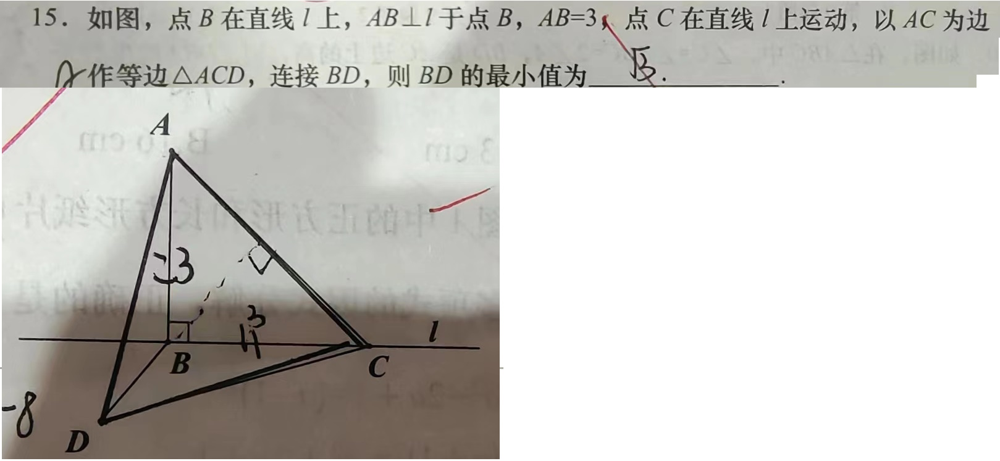

过去的一个多月实在是太忙了。强度大持续时间长，至少有10年没这么累过了。周日加班还要再加到晚上9点。
主要问题是客户那边四个人各管一摊，大大小小的活直接标“紧急对应”就甩了过来，你定的计划什么工时人家根本不care。
次要问题就是我们这边跟无锡的合作。客户发个问题，无锡只要解答不了就要拽着我们这边一起开会。都不仅仅是浪费时间的问题，本来代码写得飞起，一个会下来，之前的思路全没了。
组里那位大哥也真拉的下脸来，原本一人一半的工作量，到他那就是这也不会那也不会。也不说推给我，就是一句：”有空给我讲讲。“妈的有那时间我早自己写完了好吧。

这也就是2月份开始，我就回之前组了，临走前犯不上跟他一般见识。否则高低要跟他论战个八百回合。

今天2月1号，终于又回到之前的需要锁手机的组了。
说起来这个组业务的复兴还有些塞翁失马的意味：
这边客户干的是医疗器械，5年一个开发周期。上一个周期的时候还不太信任我们，只包给我们一些图形显示的工作，完成的很好，也建立了信任，本来约定这个周期要给我们150人 * 40个月的合同。
结果23年11月新周期筹备启动，合作被对方董事会的什么监理机构叫停了。因为对于医疗器械来说，美国的FDA认证是非常关键的步骤。鉴于现在中美关系如此紧张，而我们被收购以后又顶了个央企的名头，一旦导致FDA不能通过或者延迟通过，对于他们都是不可估量的损失。然后就对我们说了声抱歉，转头把活发给越南人了。
也正因为这样，为了补偿我们，多给了一些新机种以外的活。之前的组也因此扩大了规模。

上次说到臭宝学校军训，臭宝以阑尾炎术后恢复不能剧烈运动的理由逃掉了。军训的一周正赶上12月的寒流，5天里天天下雪。回来的孩子各个带病，连班主任老师都请了两天假。
所谓的学农也很搞笑。学军基地的后山上的土豆是不是种的不得而知，孩子们干的事情就是，前一个学校抠个坑，把土豆埋进去；后面一个学校再把坑刨开，把土豆挖出来。
“学农”5天只挖了1天土豆。其余时间就在操场上军训练队列。

然后就考试啊。家长会啊。
家长会一个半小时，至少一个小时在解数学填空最后一题。果然是数学学渣，完全没解出来。

之前总是一边开会一边敲代码，被无锡PM私信说：“你键盘什么轴啊。”
这是嫌吵啊，嫌吵你别给我这么多活，或者别让我开会啊！正好换组，新年新气象，就买了把声音小的红轴。也是第一次尝试用87键的键盘。目前87键使用不顺手的地方主要有三处：最右下角不是回车，右下角右二不是半角点，以及没有单独的星号。
习惯终归是可以改的，省地方这个优点就很能打了。
键盘到货之后反应过来，这边的客户也不开openmeeting啊！

家里三口人两只猫轮着生病。老婆大人连发两周低烧。上回不是说她是挂号爱好者嘛，第16天终于按耐不住，下班后跑去中心医院挂急诊。进门排队一个半小时，大夫给开个血常规和胸片。检查后复诊，又排一个半小时，（排队期间报告早出来了）。复诊时大夫头不抬眼不睁：“不是细菌感染。肺没事。下一步你是要查支原体衣原体还是新冠甲流乙流什么的？还是来全套？”
此时已是晚上十点半。老婆大怒。摔门而出。

带猫去猫诊所。化验之后是支原体感染。
我一听，心说我老婆的病是不是能确诊了。
结果人家兽医说，猫有猫的支原体，人有人的支原体，猫的支原体不会传染给人，人的支原体也不会传染给猫。

注：夫=大姨夫。