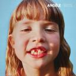

一个半月没来大姨夫了。欧洲杯连着奥运会，昼夜颠倒确实有些内分泌失调。

奥运会闭幕式对我来说最大看点是洛杉矶8分钟。美国人显然演了不止8分钟，算上阿汤哥的串场感觉都在20分钟以上了。但是内容实在乏善可陈，就那么三四组人马在海滩搭了几个舞台，唱，唱跳，说唱。节省到没朋友。
可以想见下届奥运会开幕式一定会巨无聊。

唯一看得上的节目就是Angèle的独唱了。声音挺魅惑的，身材也不赖。就去找她的专辑来听。好家伙！这封面设计真豁得出去嘿！

[Brol](https://pewae.com/gaan/aHR0cHM6Ly9tdXNpYy5kb3ViYW4uY29tL3N1YmplY3QvMzQ1NDExNTk=)

音乐家：Angèle协作：Roméo Elvis风格：流行地区：比利时发行年月：2018-10

Angèle Van Laeken竟然是个比利时人。联想到98世界杯主题歌演唱者Axelle Red也是个比利时人，甚至还是荷兰语区的。法国国内真就找不到个唱歌的了？

内分泌失调还有多半原因要赖单位。单位这边6、7月份其实一直在加班，一直加到8月10号日本人夏休。强度倒是不太大，只是在周末出勤一天。
我们这边加班有很奇怪的规定：平日加班不到晚上10点啥也没有，但周末加班给串休假。Leader小姑娘（小雨）几乎每天迟到，所以她对于周末加班有种自然的偏执。因为我平日也没少表达不愿意周末在家看孩子，所以她以为周末喊我来加班我会很开心。但此一时彼一时啊，比赛期间我需要补觉啊！而且单位周末不开空调的！室温28度对200斤有多不友好你造吗？

单位花了大约一个月重新装修厕所。新马桶比以前高了半寸。所以我在尝试了两次以后，不得不放弃了十几年来坚持的带薪拉屎，内分泌失调更严重了。

心血来潮想重温黑豹的二专和三专。某易云根本上根本没有。
可咱硬盘上本来就有啊。只是快10年没听本地歌，全然不知当初费尽心血基于Win7美化的Foobar2000运行起来面目全非，已然是灰了吧唧的一坨。
思考了不到3秒钟，立刻搜素下载了一个winamp。还是熟悉的味道，什么都没变，真好。

既然铺垫到这份儿上了，放这两张专辑的时候，就顺便扫了2个小时的雷。念头通达。