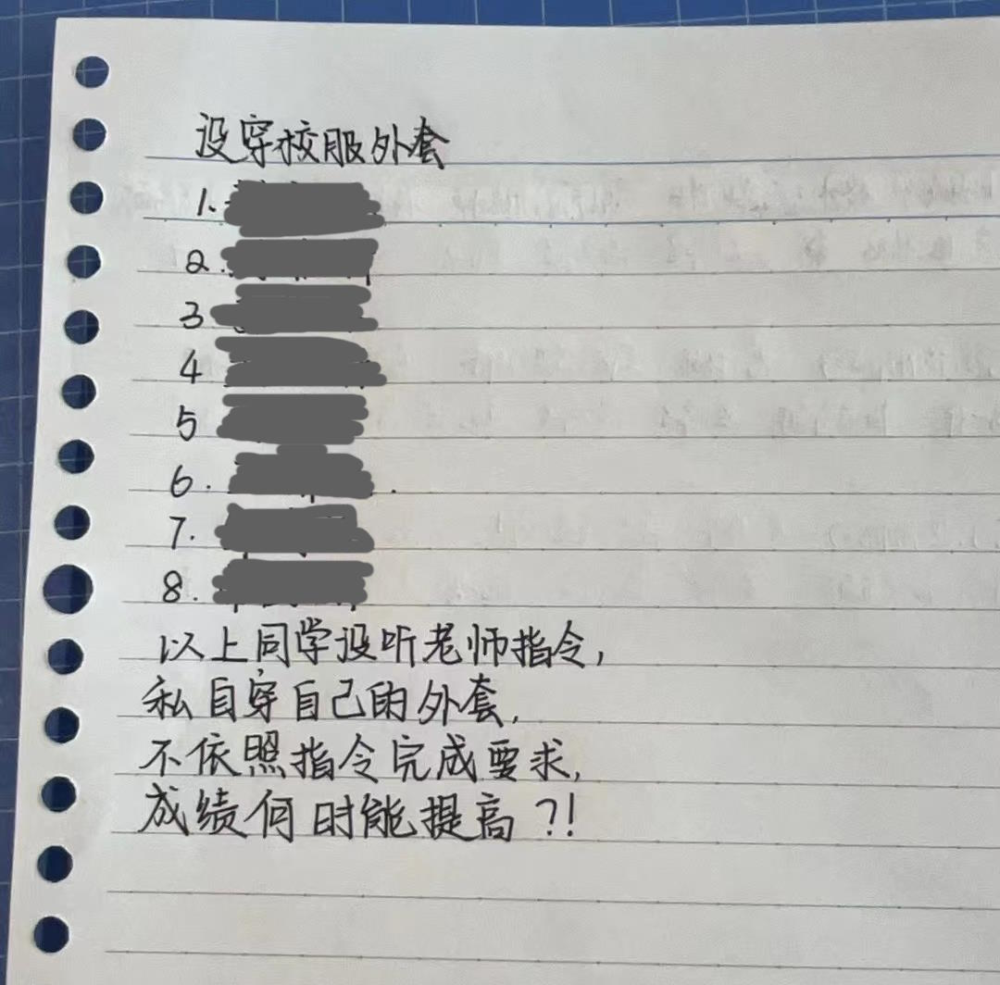

第一则仍旧由小雨贡献，仍旧是跟客户有关，仍旧是式样书有了问题。
小雨：“大致啊，你是怎么理解阙值的，是固定值还是范围啊？”
我：“确值？我只听说过确定值。那肯定是固定值啊。”
小雨：“你看看式样。”
我：“你个文盲啊，这是阈值啊！你要说个阀值，我还能猜到。这怎么能认成阙的呢？”
话说，日本人竟然会直接用这个词，难道又是一个不经意的由日语转回来的词？

虽然我们单位只是国企的外围资产，但这国企味儿可是越来越浓了。
早在6月份端午节的时候，节日礼包里有两副“掼蛋扑克”。在我们这个有丰厚3副扑克传统的地区，发两副扑克是几个意思啊。而且这扑克比普通扑克要大一圈，就算凑三副来玩，抓起来也不顺手。
等到了8月份，看到了相关新闻报道，才知道怪不得人家是集团领导，是副部级，是有大局观的。

从8月中旬开始，单位执行“每天地球一小时”，也就是关灯。
一关灯，同事们就忍不住想睡觉。
这就让每天中午冲浪的我特别不合群。何况我用的还是一副带灯的茶轴机械键盘。
不得不改成看小说。
不是大事，但不爽。

9月1号开始的连续三天，部门领导紧急通知，每天下班要关机，服务器也要关，项目经理要负责检查。
内部邮件明明白白写着，总部聘请了外面的评价公司，每天晚上8点进行模拟攻防演练，是一项“政治任务”。
就是说，为了防止被猴子偷桃，自己先切为敬。

开学后臭宝换了班主任。
应该是个快退休的70后。但她这风格吧，就像30年前我所遭遇的40后。
这家伙开学第二天就把全班家长都给得罪了。包括围着她转的狗腿子。

事情是这样的，跟往年一样，学校开学要买保险。放学时她留堂25分钟，给学生强调“买保险的必要性”。
这下马威来的，平实又实际，家长们真就没有一个不买的。当然这是无关的小事。
给学校的单子签完以后，家长还要通过转账或者某宝的形式，交钱生效。于是老师要在第二天通过协作编辑文档来收集保单截图。
她在群里强调，要上传【有签字】和【有日期】的截图。当然，通过银行付款和直接走某宝的合同样式略有不同。
几个家长传完之后，她就开始在群里发飙：“我的要求很明确了！为什么你们做不对！”
然后她放上了其中一种方式的截图示例。
家长陆续上传，她就一份接一份地删除。其实她想要的，是【合同生效日期】页，而不是【合同签订日期】页。但不光是自己没说明白，就连她自己上传的例子，截的也是【合同签订日期】。
后来还是有个本身就是卖保险的家长，一个一个私聊其他家长解释，才达到了老师的要求。其中有某位爸爸，因为一直没达到要求，被老师打回6次！
直到上传教育局，老师的错误示例页还挂在那里。
所以她当然不仅没觉得自己有问题，反而在放学时又留堂25分钟，大骂学生家长：“一个一个都没文化，没素质，这么点要求都看不懂！”

她还拿出了我上小学的那一套，给每个学生打纪律分。说笑打闹上课溜号之类的常规项目自不必提，连卷纸名字写歪了，口罩戴黑色，见老师问好声音不够响亮，甚至吃饭biaji嘴，都要扣分。
对纪律的要求变态严苛也就罢了，关键是特别不尊重人。事无巨细，一概在群里开大嘲讽。她是不知道现在的小孩自尊心有多强么？还是不知道她的同事[暑假前刚被隔壁班下过毒](https://pewae.com/2024/07/random_kuso_96.html)？

9月10日，素质低下的家长们没有给老师送上半个字的节日祝福。
不约而同。

注：夫=大姨夫。