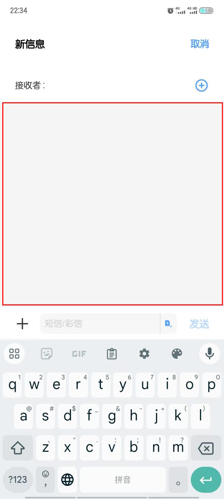

年前项目组招人，作为技术考核人面试了近20位人选。
35岁以上的比比皆是，比我大的也有。一家美资的著名友企，9月份的时候就清场了，没想到这波面试大约1/3来自那里，其中又有4位几个月来一直待岗。
有位47岁的大哥给我留下的印象颇深：
他做车载是可以从底层驱动到云平台打通关的，说起项目管理也头头是道。只是最近几年没怎么用C++，答题分数不太高，但是看他的谈吐应该两个月就能捡起来的样子。
最主要这位大哥的精神状态，明显没有从忽然被裁的打击中恢复过来：12月10号还带着项目组加班到晚上9点多，12月11号通知项目没了裁员，12月18号就来我们这面试了。
PM跟我经过不怎么缜密的磋商，最终还是订了一位88年的小姐姐。明面上的理由是大哥日语不好，技术也脱离了一线。实际上的原因我们都没说。

如果我也出去面试，可能还不如那位大哥。

客户也觉得当前的小破项目负担个3人驻日的成本有点高。于是主动推进，要给我们买机器买板卡，恢复到以前的离岸外包的状态。给了开发机20000一台的预算。这种公家采购要一个正规，必须是某东上的品牌专业店才行。作为核心要求的那块要命的视频卡，需要两个8X的PIC-e插槽，这是个不变的刚需。本来我们这项目主要是跑视频采集卡，对CPU、显卡和内存的要求都不高，预算应该是够用了。但所谓品牌机有个特点，就是反木桶原理，一个高了，另外的配置也跟着高。多个PCI-e插槽的服务器，大多是为了上高档显卡，给AI运算准备的。找个价钱合适的服务器并写报告，就花了我两天时间。
我把报告交了就算完事，能不能跟各个网店谈判更改配置就与我无关了。但对于我们PM来说，这只是苦难的开始。
先是不能直接买，而是要把选好的型号发给采购部门审批。采购部门问，怎么没有XXX认证啊，就得跑去问客服。客服说不明白，又转达给采购部门，来回折腾。把客服发给采购部门让他们直接沟通，答曰不行，不符合规定。
然后是内部审批，年前流程走到部门长批完，转给集团法务。然后部门长年底离职，任务移交给了下一任部门长，但是邮件系统没有同时转移，法务过完年回复的时候，系统跟邮箱不同步，发不回来了。
又问，我们挺着急的，打回来重新走一遍流程行不行？法务和采购异口同声说不行。法务说要是能给你打回去早打了；采购说已经开始记成本了不能重来。
只能等不知哪个部分的所谓同事先修复部门长邮件变更的BUG。
WQNMGB的中字头央企。

臭宝终于把她姥爷给的破手机用到黑屏再也不亮了，心中窃喜之余，还是想做戏做全套，带着臭宝去手机店再最后挣扎一下。并且事先跟她说好，要是屏坏了就不修了。
店主瞅了一眼，说：“着急的话开盖10元，然后再说。”
臭宝着急啊，在一旁催促着：“开，开，开”，神情酷似山东版水浒里赌红眼了的李逵。
店主开了盖之后，把电池抠了下来，又装了回去，然后就把盖合上了。
嗯，别的毛病没有，只是死机了。
人家理由也很充分：“长按电源是解决不了的，如果你们等得起，放到没电就行了，但你们着急开盖啊！”
啊呸，就为了10块钱，你也干了。

支付宝最近的触碰付款在我们这个城市推广得很凶，公司旁边的早餐店的便利店脚前脚后都上了设备。
我也就比早餐店晚了一天就用上了。毕竟即使不算额外的优惠，我每顿早餐也能保底节省5分钱，这样只要上220天班，就能省出一顿早餐了呢，多划算！
只是有个小小的问题：别人NFC之后都不用确认，我开通了之后却还要再摁一次指纹才能确认支付。
2025年以前，我都以~~外~~为是我的手机系统安全级别高。
直到跨年夜，我那人工智障的物联网卡要求我跨月的时候重启一次。
支付宝NFC再也不要求我输入指纹了。竟然忘了重启治百病这条宇宙真理了。

某天，闲的，大概是因为凤还巢的老朋友S̆̈那里有IP归属地显示吧，忽然对被我删除的一些有IP归属显示和自动播放的RSS心生愧疚。
我完全可以在阅读器里本别建立【挂代理】和【摘耳机】两个分类啊。
说干就干，用SQL语句和正则，从历年的留言里抢救了近30个rss出来。

某在线服务大概识别出了我总是在单位挂代理上，要求我验证身份。验证方法是扫二维码或者给XXXXX发短信。
对于我来说，相当于只有发短信这一种方法。
打开手机，愣住了。我忽然发现，不算回复给10086那种，我可能有十几年没主动发出短信给某个号码了。现在的这部手机用了3年半，短信界面除了接码，我就没正经进过。
我想说的是，一时间我没分辨出哪个才是敲文字内容的框。当然，穷举法点几下就全明白了，但是你中间空那么大地方不能输入，这算个啥设计啊？

注：夫=大姨夫。