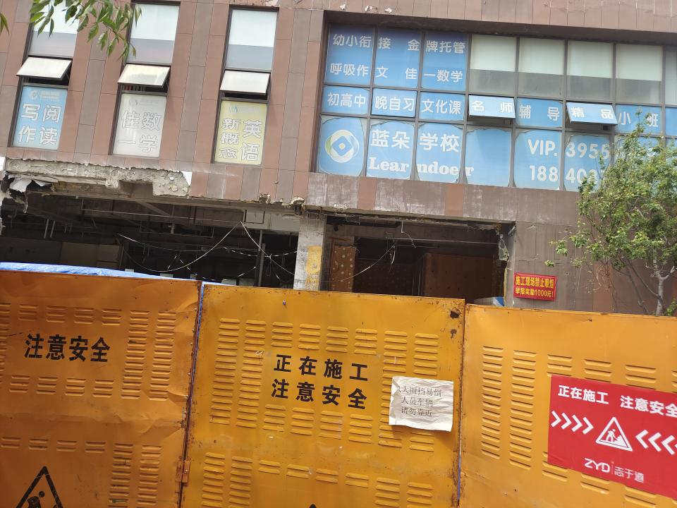
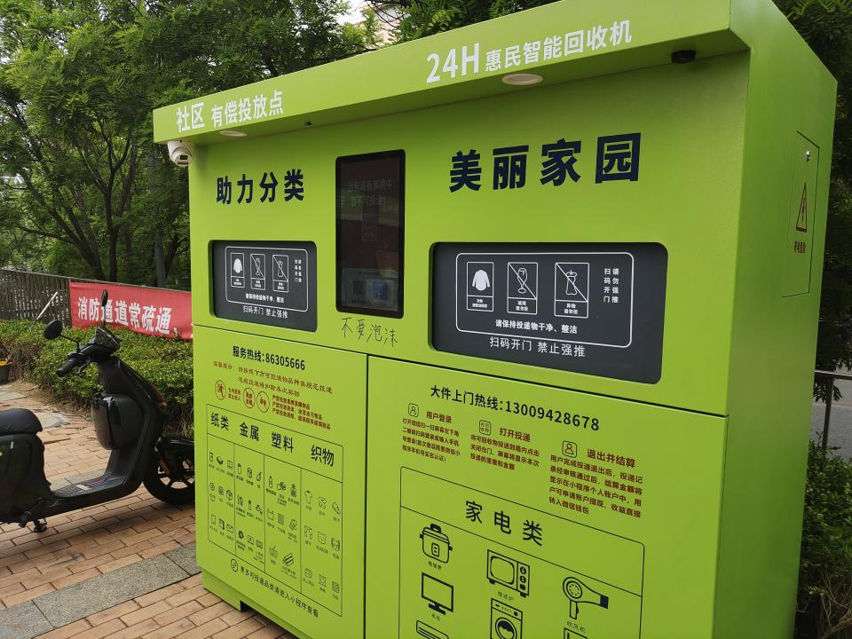

[上次](https://pewae.com/2025/04/random_kuso_105.html)说某科要把自己的楼改建成宾馆，迎接高考。这说法不准确。
不是某科自己盖宾馆，而是卖给了一个老板，新老板要把写字楼改成宾馆。
在工人日以继夜的努力下，发生了一次小型透水事故淹了电梯房；刮风吹倒围挡砸到一个老头；用电不规范发生了一次小型火灾——事故和损失倒是都不大，但想在高考前整完是彻底没戏了。
5月31号的工地长这样：

瞅瞅人家这亡羊补牢的精神，赶在2026年高考前完工不在话下啊！

老板可能为了回血，在房子的一角光速开了家库迪。咱也不知道卖多少杯咖啡才够得上买楼的钱。
离家近且刚开业有活动，很快成了老婆大人的周末首选。
端午假期第一天中午，老婆大人起床后要喝的时候，打开小程序一看，竟然只有热的没有冰的。便打发我去一探究竟，要是制冰机坏了就去买七天家的，反正她就是要冰咖啡配粽子。
到店里一问，出冰的没问题。是他们店前一天补完冰以后忘了在系统上更新，就被判断成做不了冰的了。
两个店员还在那自嘲：“怪不得一上午一单都没接，还以为过节都起得晚呢。”

物业的前任管家回家生孩子去了，新来的小男孩办事挺认真的。
老婆大人反应的楼下的给电动车换电池那玩意儿离楼太近不安全，前两任都没给解决，小伙来了之后就把电源给拔了，并承诺搬走。
邻居们反应的地下停车场入口灯光太暗的问题，也在一个月之内给装了一圈LED。
但是吧，他也不能光花钱不是。几天不见，门口多了个“收破烂机”。就是手机扫码平台给估价，然后把破烂扔进去的一个物联网新物件。
对此我非常不以为然。且不说用APP会暴露大量隐私，就说这些个资本，都沦落到跟收破烂的抢饭吃了，这也太难看了。

中考报名临近，臭宝的成绩在22K考生中大概排在8.5K到12K，小重点指标尾巴到普通高中的层次（中招这事儿各地规则都不一样，每隔几年也不一样，就不展开说明了）。这几周任务是去考察各个普通公办和私立高中。
看校其实是个挺有意思的事，值得单拉出一篇的，但是最近兴致缺缺，就一起说吧。

三周以来，实地考察了伊尔廷市市区范围内的（6-2）所公办普通高中和7所私立高中。
公办高中不愁招不到人，接待家长的一般只是教导主任级别的；而私立高中无一不重视招人，都是大校长亲自出马。
某所公办被我第一个PASS掉，因为我在厕所里发现了烟头，然后立刻让老婆大人去了女厕，发现也有。
而另一所公办就聪明得多，他们用花架把厕所门堵上了，根本就不让家长进。
排名比较靠前的一所公办，展示栏里有一半人是辽大的，并且很多是2016、2017年毕业的。顿时生出了“此校不行”的念头，因为我就是辽大出来的，它的211身份有多水我还能不知道？没看见博客里都很少提么？

私立学校的校长们则喜欢互相黑：
A说B的教学楼是危房；B说C的教师去年走了一大批没补上来；C说BD招生名额被减了，是被教育局审计出了抽逃资金的问题；D说C经常不好好讲课，用太多现成的视频课件；E说D脑子里只有钱除了正常的学费还变了法的从家长手里坑钱，比如在高一开学前开衔接班；F说A学校的高层都不是好鸟，在学校周围屯了大量的房子就为了租给陪读的家长，联合起来不降房租；E说D区别对待学生，非重点班就是在放羊……
不一而足。
听完所有的介绍之后，第一轮被排除了两个。
E，全军事化管理，必须住校，女生也必须剪短发——让臭宝剪短发她能拿刀把我给劈了。
B，校长在介绍的时候一口一个我们老板有钱，是干房地产的，不屑于从学生身上挣钱。老校长70岁上下了，不知是真认不清形势还是装的，这两年干房地产的可太屑于了啊！结合另外的校长爆料的审计的事，我是真担心老板跑路啊！

另外有个有趣的事，A学校的校长是我高中隔壁班的班主任，A学校的高三清北班班主任兼数学首席是另一个隔壁班的班主任。高中那会儿我们班是重点班，她俩只是30来岁的年轻教师，根本轮不到教我们。所以到我们这届毕业，她俩就结伴跳槽去了彼时刚改了招生范围的育明高中，摇身一变就成了市级名师，退休以后也能在私立高中呼风唤雨。
所以啊，所谓名师也就是那么回事吧，终归还是看学生。

上一个手机摔出了杠杠，去买了个新的。
我一不打手机游戏二不刷视频三不拍照，千元机就能用得很高兴。但还是花了2100，因为老婆大人给报销。

倒完数据，换卡，发现不能上网了。心想是不是物联网卡跟主机绑定，赶紧换了回来，仍旧不能上。
打电话咨询帮我搞卡的表妹，才知道物联网卡不让卖了，且确实是一换手机就不给用了。
反正年假多的很，7月1号马上就重置了，索性请假一天，去找表妹，直接办了张新的电话卡，（对我来说）流量根本用不完那种。
回家后把各个不得不绑定手机号的APP统统绑到新号上。
别人都没事，唯独我们集团自己内部那个宝贝即时通讯软件翻车了——旧号登不上，新号依旧登不上。
不愧是央企。

今天日子也没选好，没一个APP让改用户昵称和头像的，周末还得费二遍事，唉！