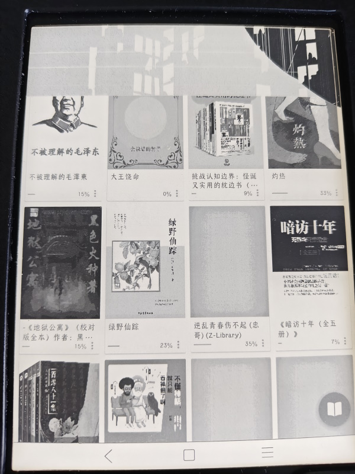

某夜。看漫画看得犯困，又没到直接睡过去的程度，把电子书合上放在胸口，酝酿情绪。毛孩子2号猛地跳上我胸口跟我互动。撸了几下之后，猫和我都就都睡着了。
第二天早起发现，被9斤的小猫踩了一脚之后，酱婶了：

这玩意儿叫做墨案Air6。

我这人遇到好东西一般不会夸，但遇到差东西就一定会骂。既然坏了，那就得说道说道了。墨案Air6只有一个优点，就是轻便。
剩下全是缺点。它的破系统我早就想吐槽了。买的时候是本来冲着开放系统去的，到手之后发现除了自带市场里的小猫两三只，自己找的软件80%都是装不上或者闪退，10%会在3分钟之内卡死或自动退出。电量也不太能打，连续用不到5个小时就歇菜了。
倒不会把它加到黑名单里，因为估计这牌子也坚持不了几年。

在最后尝试抢救的时候，意外发现墨案号称是杂粮生态链上的。
哟吼吼，把屎盆子扣杂粮头上我可是一点儿心理负担都没有。杂粮在我心中本就离“永不录用”[一步之遥](https://pewae.com/2017/05/random_kuso_7.html)。

真正在黑名单上的是创维。我姑娘早上9点出门的时候电视没关，下午4点回来，发现白屏了，断电重启都不好使的那种白屏。
自己尝试刷机无效，还是找了修家电的师傅上门。
拆机用表量了几个脚，说是板烧了，屏没事。换板550，问还修不修。
这电视修的，根本也不去给你查是板子的哪个零件坏了，也根本没有动烙铁的意思。
我自己上还真不行。首先我没法判断是板坏了，其次这板的型号我在某宝上还真没搜到。
这个价格拿捏得刚刚好。平常确实是几个月都不开，可明年还得看球，2028年还得看球，2030年还得看球……

拆！
十年前的电视，电路板分成泾渭分明的两部分，一半就是个机顶盒，另一半负责控制屏幕，两板间有几组排线。
一周后新板到货，涛声依旧了。师傅走前特意叮嘱：“这板子已经不太好找了，我跟你说啊，用创维的电视，千万别升级，就当成个显示屏用就行。反正我看你也是配了机顶盒。”
从善如流，干脆网络都不配。

公司又换名字了。这次工资卡也会同时换成浦发。
上门办工资卡的同时推销的信用卡，“开卡豪礼”可以是个小风扇或者某视频网站的VIP季卡。部门还真有人要了那个VIP季卡。
回家充会员的时候，发现这卡也太狗了：每个月可以激活VIP7天，到下个月可以再激活VIP7天，下下个月还可以激活7天，最后失效。
就问你跨了3个月是不是一季吧！

某日早上，工作机提示密码即将过期。改完密码后登邮箱，停在在二次验证的弹窗画面上，死活刷不出来。
找IT的小伙来解决。我们彼此能叫上名字，他知道我搞不定的问题一般都不太常见，一进门便神色紧张。
我说：“给你看个稀罕东西，Outlook把IE给弄出来了。Win11下的IE你见过吗？”
哥们当时就懵了。试着给我清用户清缓存，又登录网页版反复修改邮箱配置。又用他的管理员账号配置他自己的邮箱，也卡在同样的地方。
一个多小时毫无效果。
他忽然想起来：“你给我打电话之前，重启过没有？”
一阵振聋发聩的沉默。

臭宝学校的军训开始了。感觉学校根本就怕出事，千方百计地在拖延时间——每天训练，上午8：00开始，午休11：30到14：00，下午16：00回教室写当天的军训总结。
教官是从某军校找来的大二学生。
原本的计划是7天，第一天之后缩短到6天，第二天又通知要抽出半天看电影。刚才又通知，最后一天的汇报表演原定是下午3小时，改成早上2小时。
总之就是一副赶进度跳流程的样子。
这种糊弄让我觉得这学校目前看还挺务实的，没苦硬吃样子货就应该这么糊弄。

注:夫=大姨夫。