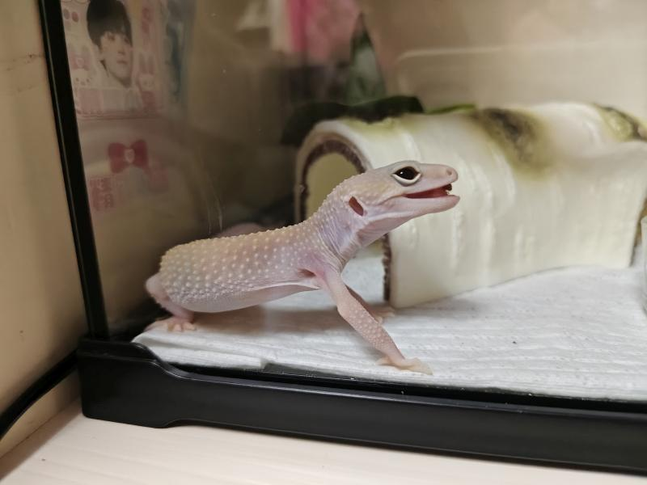
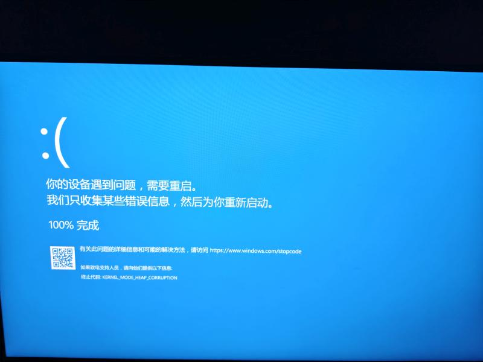
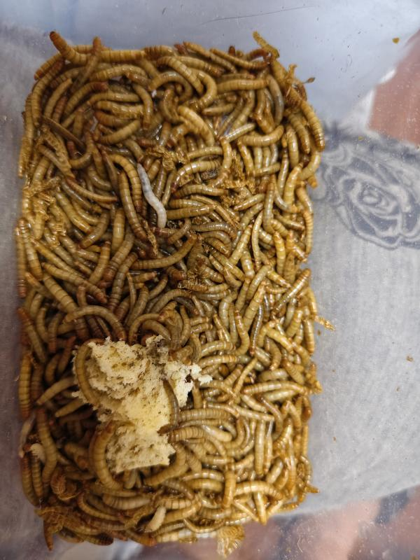

娘俩出去逛街，带回来一个新家庭成员——豹纹守宫。
粉嘟嘟的，相当可爱，非常老实。不吵不闹不臭不咬人，比仓鼠好伺候多了，难度跟养鱼差不多。
唯一的问题是，哪有豹纹？

某天晚上，臭宝用老婆大人的手机点了外卖，我都不知道她俩点的什么。外卖送来的时候，一个在洗澡，一个在屋里吹空调刷手机，我看也没看就给收了。
老婆大人洗完澡出来，接到外卖小哥的电话，他把两份外卖弄混了，问能不能换回来。老婆大人表示，没动就可以送回来。反正我们这份是没动。
过一会儿，外卖小哥回来，又是我开门，一顿点头哈腰，说：“不好意思，那边打开了，不过我看没吃，你们还可以吃。哥你看行不行？”
我说：“我看行不行有P用啊，又不是我买的！”
外卖小哥不知道是没听清还是没听懂，拿走我手里要换走的那份，东西放下就急匆匆跑了。
老婆大人出来一看里层袋子打开了，直接就申请退款。平台看到照片，配合早已超时的事实，二话没说就给退了。

第二天傍晚，娘俩又去逛吃，我自己在家。忽然有人敲门，一看是昨天的外卖小哥，还另带了一个光头花臂膀大腰圆的人。
光头佬上来就先声夺人：“你们昨天订外卖，怎么不先联系我们外卖员就直接退款了呢？”
我：“你谁啊？”
光头佬：“我跟他一个站点的。”
我：“哦，那没你事，让他说。”
光头佬：“这样你只能把昨天外卖还给我们，我们退给商家。”
我：“你闭嘴，让他说。”
——一听就是被罚了气不过，过来吓唬人找心理平衡的。大夏天的，哪个商家会给退卖出去一天多的东西？更何况是外卖平台都处理完了。
外卖小哥一看就没多少社会经验那种，话说的磕磕绊绊：“哥，那个，昨天那个外卖，你给找出来，我，我去给退给商家。”
我想都没想，直接说：“扔了。”
光头佬一下子来劲了：“扔了让我们怎么退，你得把钱退给我们。”
我：“你闭嘴，没你事，让他说。”
外卖小哥重复一遍：“大哥，你把钱——”
话音未落，光头佬发现了我放在门口的包装袋子：“你不说扔了吗，一看就是吃了，XXXXXX”

我真的不想的。孩子嘴馋，昨天要吃，老婆怕被吐口水都没让吃。
不仅一口没动，反而多摞了两泡猫屎。我白天没出门，所以没来得及扔。
既然你们这么想要，我就一边笑一边把包装袋递给了光头佬。
我：“你拿好了，仔细检查检查，我们一口没吃。”
光头佬脸都绿了：“你这太恶心了，你让我怎么退！”
我：“你自己非要要的。有问题找平台吧。”
关门。
光头佬在门外又骂了两句，说了几句：“你这个门我看挺好啊”之类肌无力的话。
打给老婆说了声，她给平台反应了一下。
几分钟后，平台给我来电话，说外卖员因纠纷上门是严重的违纪行为，已经暂停他资格了。

活该。
他们应该庆幸是我在家，换我老婆直接就报警了。刚好不久前片警大哥通过业主群加了小区里所有人的微信，喊他过来都不用打110。
老婆还顺手把没关好门的物业保安也给投诉了。

老婆回来之后，说：“咱真不怕他们上门找麻烦吗？”
我：“他要有那本事，还会去送外卖？”

某日，人行道上遇见一哥们，岁数看着跟我仿佛，双臂花里胡哨的，但是走路却不怎么利索，有点“拐小筐”。
我心想，都是浩南哥害的，这男子汉的勋章来的有点猛啊。
走近了偷瞄，画的不是什么青龙白虎山精海怪。左臂纹的几个大字是“瞬 冰河”。
看来是因为不纹生命力强大的第一主角，被反噬了。

臭宝开学之后，全家的作息时间重新调整。我起床时间从5：50提前到5：25。由早起变为更早起。
5：48下楼，陪臭宝去班车点等班车。班车6：00准时到。
最大的困扰是，网易云坏掉了——9月份之后出门，日推总是不更新。
直到第一个周末，恍然发现，网易云其实没问题，只是日推每天到了6：00才会更新。
看着臭宝的背影，戴上耳机，响起一天的背景音乐。

臭宝的班级成立了家委会，组织了家长群。我是在军训汇报表演的时候扫码加入的，老婆大人是在我回家后被我拽进群的。
家委会成立后第一件大事，是每人收100块钱班费。
一看这负责收钱家委就没有经验，她发起的群收款，对象是每个家庭第一个加群的家长（有经验的都找XXX妈妈收钱）。
我一下午没看手机，到下班的时候发现老婆大人打了8个电话催我交钱。
交完钱以后，想跟家委解释一下工作时间不能看手机，字没打完又给删了。我解释那么多干嘛呢。
退群，然后重新加入了。这样老婆大人的名字就排在了我前面。
两天之内，陆续有人学样退群重新加入。最后加入的昵称都是XXX爸爸。

臭宝学校的伙食可能太好了。
上周四中午，班里几个男生比赛吃包子。
班里剩下的所有人人乐此不疲地帮他们去跟打饭阿姨要加包子。
冠军吃了21个，亚军19个。
晚自习的时候，亚军吐了一地。
时代在变，中学男生的愚蠢不变。
赢了，你是头号饭桶；输了，你还不如饭桶。

手机APP令牌二次认证这玩意儿太讨厌了。
前两天Github的认证，死活过不去。我都想重置了，看看提示里的1-2个工作日人工审核，又打了退堂鼓。
好在终于想起来，我刚才用的是口令App3号，号称可以用来加github账号，但是我加失败了。应该用口令App1号来的。
1号是Github用的，2号是公司用的，3号是微软系用的。
妈的纯刁难老年人。

家里的Windows，再一次升级失败出蓝屏。
你说它考虑老硬件了吧，它升级出蓝屏。
你说它不为用户考虑吧，重启了几次之后还能退回来，然后右下角弹出一行小字：“我们已经为您跳过此次升级。”
我可能是正版软件的受害者。

我前面是不是说守宫好养活？
屁咧！在你养一个东西之前，你最好明确知道自己养的是什么。
爬虫类的东西，吃活食。
闺女养守宫，我替守宫养面包虫。

5块钱给了一大坨，至少300根，小守宫一天吃5根。
我tm这辈子买东西第一次嫌老板给多了。
很好养，喂点馒头就行。
不喂馒头，会饿死。喂了馒头，会蜕皮，因为虫口太密集，也有憋死的。
这东西一死一片，所以要及时把死掉发黑的捡出来扔掉。我会叠个纸盒，把活虫子一根一根捡进去，把塑料盒里剩下的死虫子、虫蜕和粑粑清理干净，再把纸盒里的虫子倒回来。每周两次。
我是不怕虫子，不等于喜欢摆弄虫子啊。

好像熬过这两三个月之后就不用再养面包虫了——守宫长大以后，吃蟋蟀。

不过有一说一，看面包虫吃馒头还挺治愈的。你会发现“蚕食”这个词发明得真好。
搁30年前，高低要嚼两根尝尝味道。
想想这么干以后，除了老婆责骂以外任何小女生的青睐鄙视或好奇都获得不了，还是算了。
老男人并没有变聪明，只是学会计算利益了。

那哥们右臂纹的是：“死牙马 龙魔”。

注：夫=大姨夫。