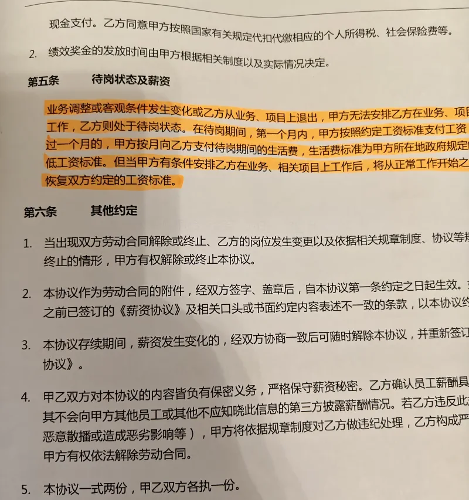

同事们谈论爱好。我说，我没有花钱的爱好：“听歌不充会员，看片看书只下载到本地，看球不去现场，打游戏也从不充钱。”
小木头（97年出生）问：“哥，你不充钱能玩舒服吗？”
我：“我只玩以前的游戏。”
小木头：“以前的游戏，什么游戏服务器还开啊！”
我：“基本都是单机游戏。PC和以前的游戏机。”
小木头：“PS3那都20年前的东西还有人玩啊！”
我不回她了。
不好意思跟她解释我都没碰过PS3。

新公司工作内容是照旧，但工作习惯上还是大有不同。
最大的变化是不敢随便摸鱼了。上网冲浪严格遵守起作息时间，只在午休的一个小时里进行。
主要是因为新公司地方小，3个屏幕1个摄像头，据负责帮老板搞Infra 的老赵说，摄像头很清晰，调焦后能直接看清屏幕。
之前的公司，监控在专门的监控室，如果不出事，部门长是没有权限进去调监控的。新老板可没有这个顾忌，随时随地闲着没事掏出手机就能监视我们这帮牛马。妈的要是我我也忍不住想看啊，都想起当年玩的《主题医院》之类的经营类游戏了。
而且老板大部分时间都在日本跑业务，想瞟他办公室都办不到。
于是生生在2560×1440的分辨率下把屏幕字号调成100%这种本不属于我这个年龄段的缩放比，老板比我小两岁，他要想看那就来吧互相伤害啊。

那天想把大包装的茶叶倒进茶叶罐里，本能就想去打印机旁边拿张A4，折一下当滑道。打印机旁不再有成摞的打印纸这件事一下打醒了我，不行，不知道老板是不是在看监控。一纸一笔，当思来之不易。就算老板不小肚鸡肠，也保不齐老板不会把这好玩的游戏推荐给老板娘啊。

地方小也有地方小的好处，老板办公室在老板不在国内的期间，兼做饭厅。

来之前就担心新办公场所的厕所，蹲坑时果然引起了生理不适。

“如厕纸”这三个字就得理解半天，叫手纸很难听吗？闹半天是为了把擦手纸跟擦腚纸区分开。
罗里吧嗦一大堆，无非是说，擦手纸不能扔马桶里；擦腚纸可以扔马桶里，也可以扔纸篓里，但不能扔地上。
但是问题来了啊，能不能扔马桶里取决于纸遇水能不能分解，这是纸的固有属性，而不取决于纸跟人体的哪个部位接触。一张纸并不会因为擦了手就变得不吸水，也不会因为擦了腚就变得能溶于水，毕竟腚眼里能分泌的不是盐酸。要像你这纸上说的，我要是先擦了手再擦了腚，那这算擦手纸还是擦腚纸，能不能扔马桶里呢？
关键你蹲位边上只提供了一种纸啊！

工位宽度比原先小了1/4。还想像之前一样1台访问外网的笔记本+1台开发用台式机显示器+2机械键盘的配置，根本就放不下。小到什么程度呢，新买了一把双模键盘，都只能买87键的，放弃了多年的101键使用习惯。
笔记本我还真有不得不接键盘的理由，除了不喜欢短键程以外——本本是老板从日本带回来的，日文键盘跟美式键盘回车和退格附近那几个键的定义不一样，没有直接的反引号和反斜线，加号和管道符也很难找，这些可都是刚需。

除了键盘，还买1个双模鼠标，1个显示器支架和1块某品牌的智能手表。现在第一个月的工资还没发，故而被同事们调侃为花钱上班。
买智能手表是因为，虽然仍旧是不让带手机，但现在地方小，终于能连上蓝牙了。2月份开始老婆大人忙活别的事，没法分心管小祖宗，就把每天喊祖宗起床（去补课）和一日二餐订饭的大事托付给了我。小祖宗什么都会，薅千问的羊毛比我顺溜多了，但老婆大人担心的是给她充钱以后乱花。
我侄子在某东的实体店卖某品牌，想都没想直奔他的柜台，用10分钟的时间拿起一块戴着就回家了。

在这里我不能单纯地评价某品牌智能手表好还是不好。因为对我有用的只有通知、NFC和看时间这三个功能。通知这件事想正常用还得把以前被我费劲巴拉屏蔽掉的各个APP的通知逐一打开，真是有种开门揖盗的感觉。
哦对，还用了一次用手表找手机的功能。
这东西对健康和健身的执着有点魔怔了。戴上第二天，买年货呢，忽然弹出个消息，问：“你是不是在走步？”
关你屁事啊，我只是在商场里找厕所。

开学之后，不用服务祖宗了，这表就更鸡肋了。因为我忽然发现，我之前被老婆骂失联，是因为不开通知并且常年静音，可新单位它不禁手机铃声啊！
因为地方小，所以所有人说话都自觉地降低音量，铃声音量只开一半都听得真儿真儿的。
被自己蠢哭了。

今年伊尔廷市三令五申，通过短信、交广、业主群、拉横幅等各种形式强调市区大部分地区不准燃放烟花爆竹。然而年三十傍晚开始，人们忽然发现，街道和警察根本就不管。物业管家一改年前的口风，紧急在业主群里表示：“虽然我们的保安不在门口站着，也找地方过年了，但是我们随叫随到。”翻译成人话就是，赶紧放吧，我们就当没看见。
那也没用啊，都没买怎么放。
其实我对于过节放炮这件事没有态度，放不放都行。但是对于这种执法意见可就大了，你不能出台一个禁令却什么也不做。这不欺负老实人嘛！
所以这个元宵节我决定高低要报复性放一波，这是表达不满的炮声。

老婆大人2月份忙，是因为老丈人的肿瘤病情恶化了，到了需要立刻做化疗的程度。
一起比较罕见的由耳聋引起的肿瘤恶化病例。
2023年，体检后发现肿瘤，说问题不大，每年注意观察。
2024年，住院体检，问题不大。
2025年春天，参加社区体检。老婆的姑姑陪他去的。做胸透的人跟他说：“大叔啊，你这下边又长了一个，不太好，你赶紧去查！”他没听见【又】，还奇怪这是没看他病志吗怎么这么不专业。跟人说：“没事没事，我知道。”
2025年十一之后，胳膊疼去医院。他女朋友陪着。大夫看完CT直接跟他说：“你这个阴影不好，赶紧去挂肿瘤科。”这次他整句话都没听见。
老婆大人忙前忙后之余，恨社区的廉价体检不专业，恨看片大夫不认真。
直到年初三，我们一家，连同老丈人的女朋友，去给老婆的姑姑拜年。

头好几年就让他配助听器。
他偏说自己有同学用了，“声音忽大忽小，没法用。”“我那同学是xxxx处长，副局级待遇退的，什么好东西没见过，他说不行就是不行。”
别说副局级了，就算副国级，他也不是大夫啊。劝他戴助听器的可是他另一个同学的女儿，某三甲医院的耳鼻喉科主任。
又不是自己亲爹，说了也没用。看来太爷爷没给他讲过小马过河的故事。

臭宝的年轻班主任，人还怪好的。
假期里两篇征文，和2月28日召集日看电影的观后感，他都要求上交打印稿。
臭宝用豆包的时间还没有我帮她排版花的时间长。
不会有哪个实诚孩子真领会不到吧。

小云保留了找以前同事小琪一起吃午饭的习惯。
带回一个劲爆消息：以前的部长扛不住上面压力，开了转岗动员会。他会给没有项目的同事安排公司内部的转岗面试，三次机会，面试不过的，就要不客气地行使合同第22条，给安排待岗了。
待岗的意思，就是第二个月开始，没有活，不用来公司，只给最低保障工资。伊尔廷市2025年的保障工资是￥2230每月。
小琪得到的消息是，老公司2019年以后签的合同，不管是新签还是续签，都有这个歹毒的22条。2019年正是被某国企收购的年份，两人大骂国企没良心一番之后，小云来找我求证。
刚好2013年签的最后一份转长期的那份合同我没扔，查看一番之后，国企平反昭雪了，这条不是国企加的。（截图来自合同的附件薪资协议，正文上也有）

我心里可完全没有提前跳船的幸灾乐祸，只是有种悲凉。
职场跟江湖一样，不止是打打杀杀，还有人情世故；部门长那个老油条既然现在准备打打杀杀了，说明已经没有人情世故的余地了。
就像那个条款，不是撕破脸，谁会想要用呢？

心悸之余，赶紧查看现在的合同和员工手册啊！
新老板还算有良心，或者说政府的制式合同算有良心，并没有那恶心的一条。
甚至可以说新老板太善良了。新员工手册上，被我找到一个 可以卡的bug：

> 5、施行输精管结扎术的，休假十日；
> 7、施行输卵管复通术的，休假二十一日，施行输精管复通术的，休假十五日。

这要是医保给报销，还不爽死……

注：夫=大姨夫。