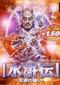

[水浒传：天命之誓（PS）](https://pewae.com/gaan/aHR0cHM6Ly93d3cuZG91YmFuLmNvbS9nYW1lLzI2NDMwNTM3)

原名：水滸伝・天命の誓い,Bandit Kings of Ancient China别名：Suikoden: Tenmei no Chikai机种：PS厂商：光荣类别：SLG发行年月：2000-12耗时：8

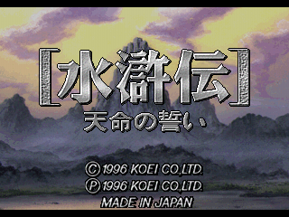
光荣版水浒传是一个本人一直很向往却屡屡擦肩而过的游戏。
最早看到介绍是在95年的一期电软上，当时攻略里的一句话至今言犹在耳：“鲁智深拉了几个烂人，连李瑞兰都给分了40个杂兵。”
（P.S：各位还记得李瑞兰是在什么时候出场的吗？我小时候刚好有这两回的小人书，对这个婊子印象很深刻。）

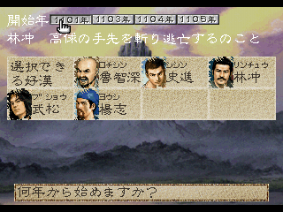
在1995年秋天的市场上，我兜里揣了150块钱面临着二选一的问题：《霸王的大陆》or《天命之誓》。最终的决定却做得一点儿也不犹豫——早在1987年我就通读过了水浒传，而1995年的时候我却只看过少年儿童版的《五虎将》而已，那么通过游戏了解名著不是很正常的事情吗？
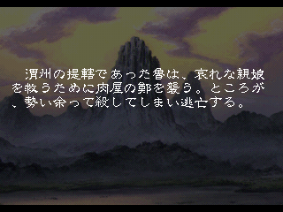

可能是光荣早期做电脑游戏起家的缘故，光荣的游戏一般都是全机种发售的。错过了红白机版之后，再次相遇是2000年的Windows版。但是Win98版的天命之誓在我看来操作起来别扭，加上还有部分乱码的问题，玩了一个小时不到就放弃了。
这次重温本来也是选的FC版，但说实话没有青年滤镜的加成，红白机的画面是有些不够看了，玩了一小会儿就换成了这个PS版。正好我PS游戏玩得不多，权当补充。
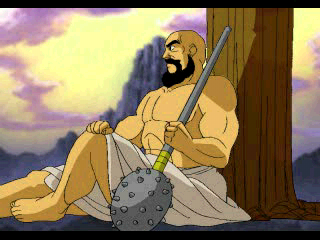

幸亏当年没选这个枯燥的游戏。
这是个典型的光荣早期SLG，内政和战斗都非常单调。内政就是搞钱搞粮搞铁搞人，外加防灾和民心。战斗则只有白刃、单挑、弓箭、火计和妖术。唯一有特色的是水战。不带船过不了河，逆流而上将领没有操舵属性的话会被水冲走。而操舵是游戏中（理论上）唯一无法学会的技能。
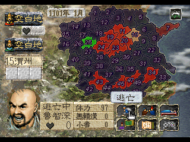

因为过于早期，奇葩的设定还是很多的。像指令系统的增加就很蛋疼：跟地盘大小没关系，跟将领多少也没关系，而是要靠结拜“义兄弟”。一个义兄弟便是一个指令包，根据难易度（！）不同，可以拥有5~9个义兄弟。能否结拜要看由“忠义”、“勇气”、“仁爱”三项组成的向性系统。内政系统简直糟糕到无力吐槽，玩家控制的城市永远发展不过电脑AI，自己的城市连工资都开不出来了，电脑的城市却三个回合就能把兵补满。所以看高手的录像，都是第一时间招出没有加入门槛的裴如海潘巧云这对奸夫淫妇扔到空城里负责钱粮大计……
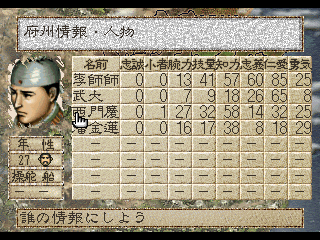

对于一个SLG来说，这个游戏难度有些高。每个回合能干的事情太少，游戏却有时间限制，到1127年没干死高俅，就金兵南下恶结局游戏结束了。而高俅的初始势力又过于强大——初期关胜花荣秦明董平张清索超闻达这些高手经常聚集在一个城里，不用点引蛇出洞的技巧根本打不赢。
好些的设定有两个，一是只要灭了高俅就能通关，不必占很多城，甚至不用消灭所有高俅的势力。另一个是对于其它的造反势力可以花点钱直接并购，避免不必要的消耗。
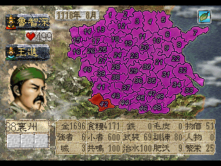

所有SLG都差不多，熟悉了系统之后再玩，就不是很难了。实力强于电脑之后便自然产生了找齐所有武将把高俅堵死在角落里的歪歪心思。想把高俅打剩一个光杆司令有点难，主要是时间不够用。一不小心就迎来了金兵南下的恶结局。
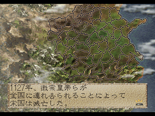
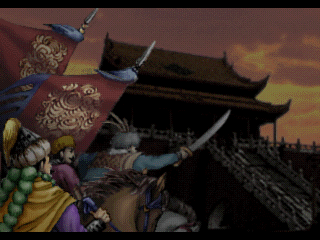

整个游戏的人物可以说把原著中稍微有头有脸的人物都囊括了，但是剧情的走向就完全不控制了，所有的人物都没什么性格上的特征，只要你愿意，杨戬童贯蔡京田虎方腊王庆都尽可以收入麾下。
综合起来游戏里最厉害的武将应该是花荣，腕力技力双高，结拜的话智力也能练出来点儿。但是技力高最多也就是能发动个狙击，用处不大。
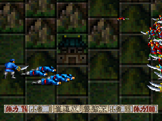

游戏的设定有点偏科，腕力（武力）的作用被夸大了，强力武将带足兵马白刃战竟然是最快解决战斗的方法。妖术会的人太少且使用条件苛刻，弓箭伤害太低，而光荣老传统的放火也很老传统的容易烧到自己屁股。
甚至发展内政都要找腕力和技力双高的武将而不是智力高的，不知道游戏策划是怎么想的。
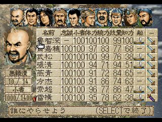
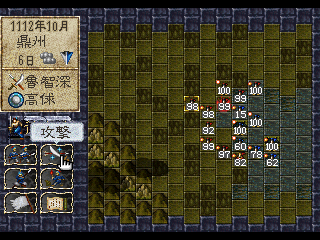

光荣喜欢玩的“历史事件”梗，本作里有一个半，一是统一郓州和济州并且两地共鸣度均高于90，会发生“梁山泊聚义”的事件，事件发生后势力威望提升100，对于招揽人才大大有好处。另外半个是势力达到250之后第二年，宋徽宗会下密旨要求讨伐高俅，在此之前你不能打高俅所在的城。
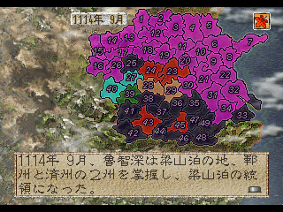
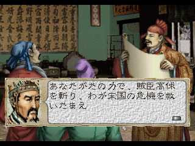

另外，这个游戏的配乐单独拎出来算挺好听的，可听久了就非常非常催眠，可能也是SLG的通病吧。
PS版对比FC版，应该是增加了片头动画和通关动画。按说选择人物不同，应该有10种不同的结局动画才对。不过好像只有开头的一小块不太一样，似乎也没必要把10个人都选一遍了。
通关！
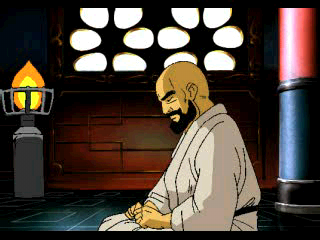
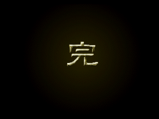