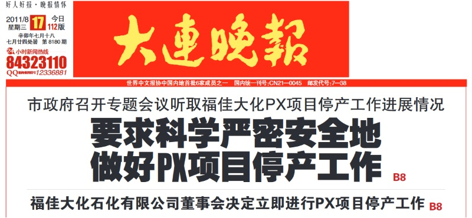

多年不问时事，清明节上坟之后跟几个舅舅表哥喝酒，才知道协弃太守换人了。
真是个喜大普奔的好消息。

前任唐太守刚一上任就摊上大事儿了，他发下大宏愿：“代表市委市政府宣布，这个工厂（PX）一定搬走。”
然后就成功诠释了什么叫一事无成——就办了一件事，还没有办成。我当时就很奇怪这厮哪里来的自信，要搬走[一个每年交税近10亿的正规企业](https://pewae.com/2007/06/px-in-xiamen-is-over-how-about-the-dalian-one.html)的。
——要么企业是非法的，你应该去搜集证据，然后直接关停；
——要么企业是合法的，你想让人搬迁，就得给钱。
上来就承诺把企业搬走的，真不知道是哪里来的自信。

游行的时候，我闺女还不会走，等他离任的时候，闺女都上小学了。
福佳PX工厂不仅硬硬的还在，还tm扩大规模了。
唐太守凭一己之力，成功刷新了贵党在协弃市广大人民群众心目中的下限。
唐太守当年的风采（href=”//www.youtube.com/watch?v=6XQ-6kdW3Xw），言犹在耳。（翻墙可见）

贵党再多一些这样的书记，就有大希望了。
祝官运亨通。