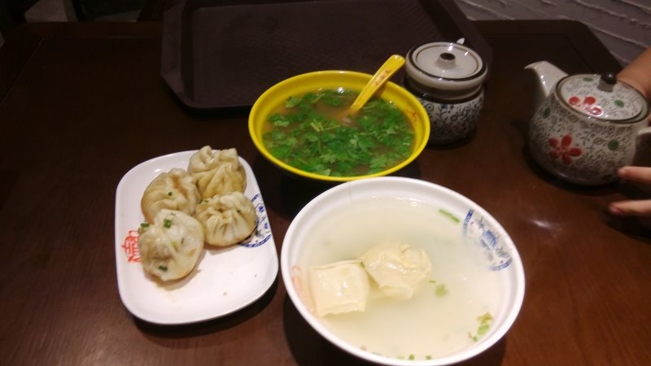
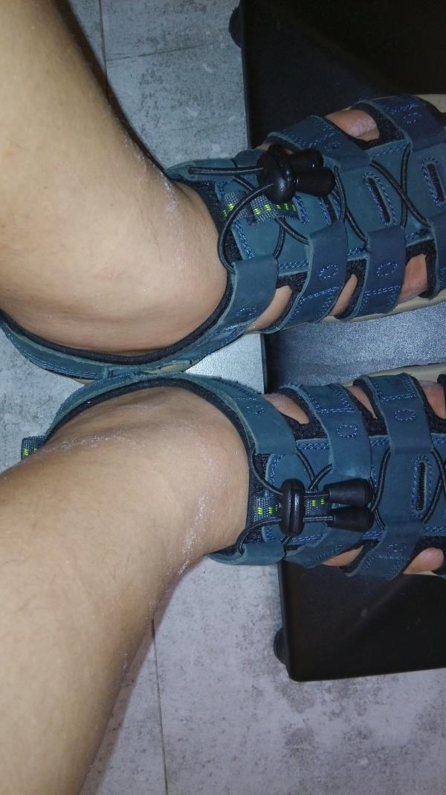
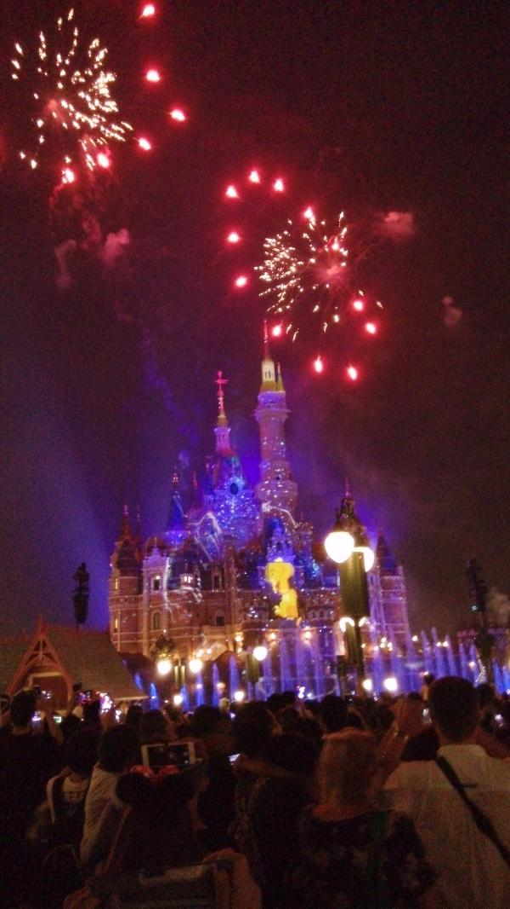
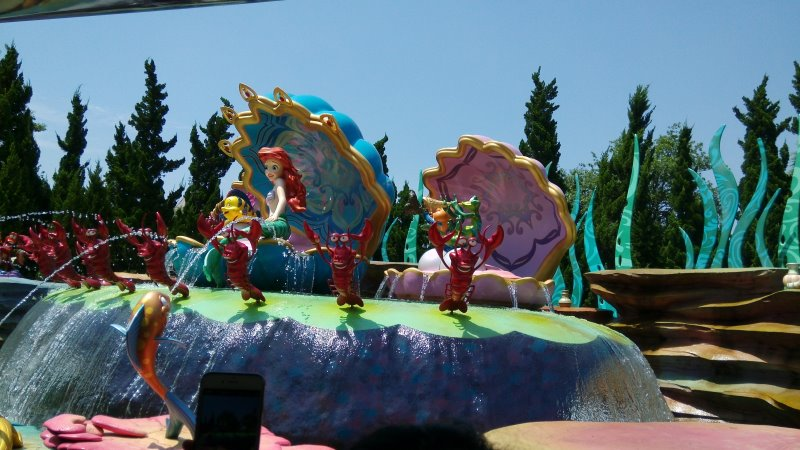
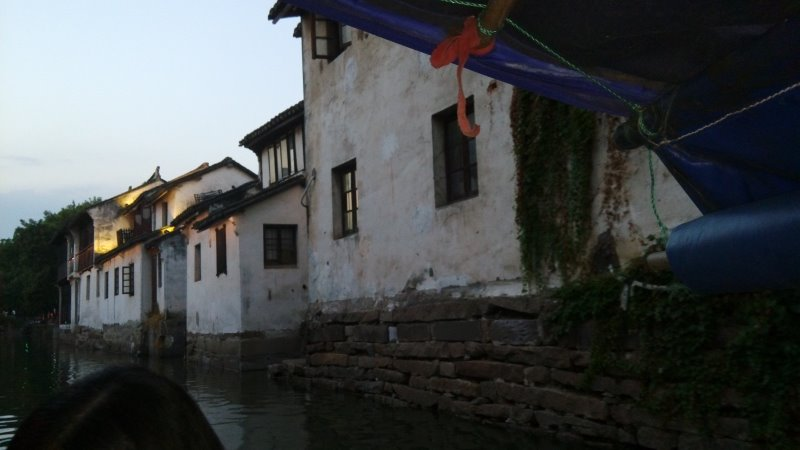
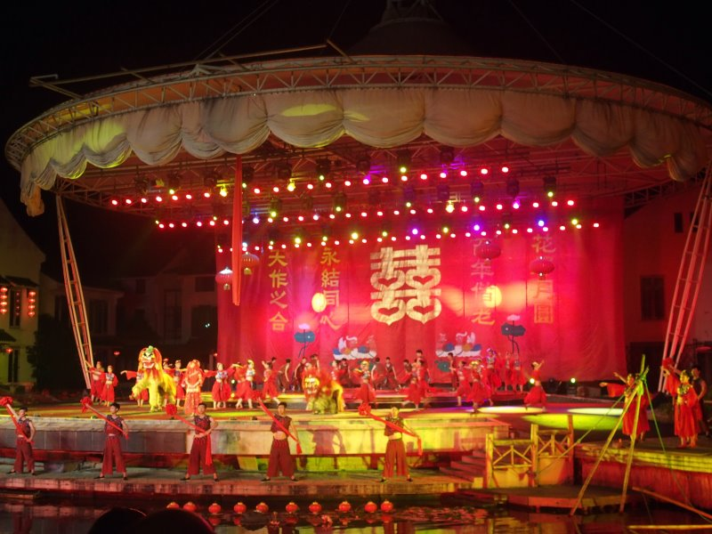
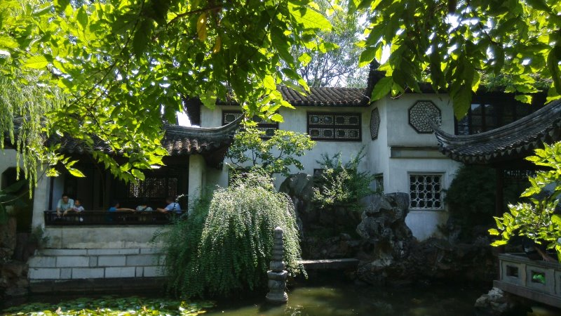
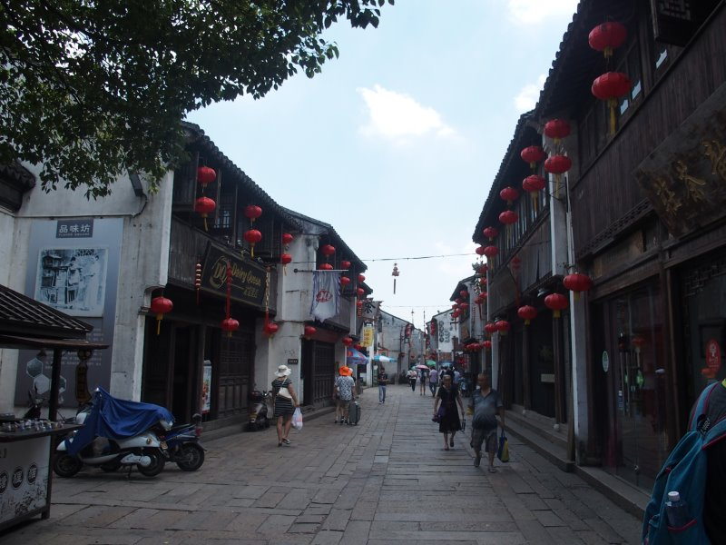
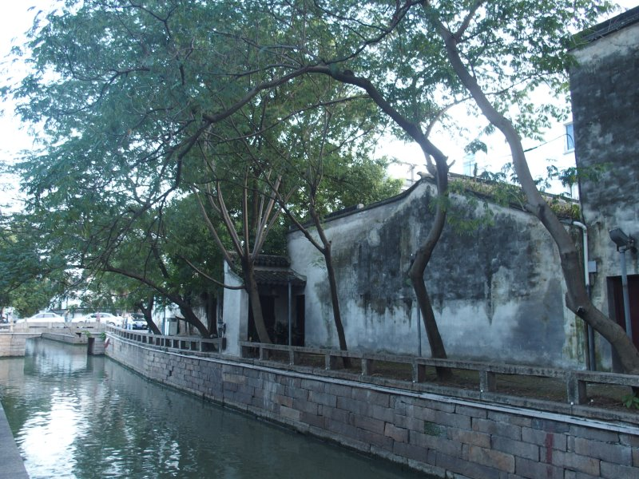

周记No.555

## 7.18:尼玛闭

这一天我一直在犯错误，除了两件事以外。第一是临出发前心血来潮，带上了8年没开的NDS。

老婆也犯了个错误，她忽视了臭宝过于兴奋而接近整晚失眠的事实。为了赶飞机没敦促臭宝早餐吃下更多的东西。
空乘一般，伙食一般，没有饮料。我一路在玩NDS。

直到飞机落地的那一刻，杂粮手机自带的天气预报都说上海是有雨的，所以几乎降落的过程有一半时间在讨论我们究竟要执行PlanA还是B。
另一半时间在处理晕机呕吐的臭宝。

落地之后就在纳闷，雨呢？或许是天气预报报的是市内，而我们身处郊区吧。
出机场跟老婆讨论了一下，决定坐速度更快的磁悬浮。
下飞机时买了55块钱的磁悬浮+地铁一日通票。这就是我的第二个正确决定。

PlanA是世博园，PlanB是科技馆。
其实两个Plan都是我定的。在威逼下。
下了磁悬浮之后，龙阳路的地铁指示牌非常调皮，只写二号线不写七号线。转了几圈问了N个人之后才知道是在一起的。

七号换八号一站，出站台立刻被一群黄牛围上：“去XXX吗？有车。”而却一个游客都没有的样子。
尼玛，闭馆。稍远一点的巧克力工厂也是世博园的一部分，同样闭馆。

哪个口出来就哪个口回去。先去酒店放行李也好。

虽然十点多到的酒店，倒也顺利地入住。随后随便到酒店附近的什么面馆糊弄了一顿，这面馆的面和生煎水准倒意外的高。天钥桥路上，名字没记住。
吃饭之余琢磨了一下要不要执行PlanB。这次涨了心眼儿，提前查了一下。
尼玛，闭馆，也。科技馆。

没怎么睡觉的臭宝兴奋劲儿过去了，开始打瞌睡。正好让她睡一觉。
不打扰她们娘俩会周公，我打了一下午的NDS。用了两年半的杂粮手机明显不给力了，还是专门的游戏机价格实惠电又足。

四点多俩人睡醒。老婆大人对上午从徐家汇地铁站出站的经历心有余悸，不愿意再在地铁站里换来换去。我们舍弃了最近的4号线，而是打车去了最近的10号线图书馆站，向南京路进发。
上车之后老婆大人看着地图突然变卦，要线去豫园耍耍。

话说上次从上海离开已经是遥远的2007了，6号线还没开通，2号线没延长到浦东机场，4号线跨江的那段也没环上。当然那时我主要猫在紫竹那个乡下地方，也没怎么进过城。所以如今的上海地铁真是让我大开眼界，各种肤色各种年龄的男男女女上了地铁3/4都在玩手机。尤其是大妈们喜欢玩各式各样的三消，还不喜欢关音乐。
所以图书馆上车的一位黑衣女纸额外引人注目。她手里捏了个kindle。看看时间，5点刚过。这种下了班就跑的，一定不会是贝总的哦？

豫园这种不仅致力于坑国人而且连外国人一起坑的所在，当然是没什么好玩的了。打消了老婆在南翔馒头店排队的念头之后，我提议步行去南京路。反正方向是没错的，找了条街就往北走。我说，这地方离外滩那么近，随便找个地方吃个东西再去外滩就好了。尤其看到四川南路几个字，更有信心了。毕竟四川北路也是混过的……
直到差三条街到南京路的时候，臭宝和老婆大人都到了爆发的边缘。
忽然出现的一家大壶春拯救了我。
出发前穆说的，大壶春比小杨好。幸好，幸好。他家的生煎和馄饨确实好吃。

外滩全是人人人。老婆抱怨人多的同时却又不停拍照。甚至还有过江登塔的念头。我赶紧用明早还要起早去迪士尼来劝说。
老婆直接打车到最近的地铁站回酒店的念头只存在了不到半分钟就打消了。取而代之的是“来都来了，顺着南京路走一走吧。”
谁说中国人不能游行的，麻痹南京路这每天的游行规模，比特立尼达和多巴哥国庆阅兵都要大了吧……
臭宝的体力明显不行了，每每路过有空调的店，臭宝就蹲下不愿意走。

10号线换4号线回酒店，我又犯了错误，把“上海体育场”跟“上海体育馆”搞混了，提前一站下了车。好死不死出口是个商场，臭宝看到刨冰跟棉花糖的店都快走不动路了。好说歹说，用迪士尼吊着，总算达成迪士尼第二天回来再吃的协议。
这两站站名真的太坑爹，看我到现在都还没分清楚不是？

## 7.19:通往郊区的地铁

为了确保第一波进入迪士尼，早起仍旧采取打车去地铁站的形式。司机是个热心人，非说老婆指定的那站太远，要给我们送到离得最近的徐家汇站去。结果堵车+地下狂奔，地铁开动的时候已经八点半了。过了徐家汇人倒是越来越少，离终点还有四五站的时候，车上已经仅存各式各样的熊孩子和苦逼家长了。

地铁从地下钻出来之后，车上忽然冒出一个辽北口音的大叔，卖雨衣。瞬间联想起了刚上大一的时候来卖听力磁带的学长，就觉得这是个坑。后来的事实证明这真是个坑，里面的项目基本用不上雨衣。

当然，没买的原因是我们自己带了。没人一薄一厚两件雨衣，一人一把遮阳伞。嗯。我们这就是被天气预报坑了。哪怕到了早起的时候查，都是阴有雷阵雨。所以防晒霜只剩一个忘了拿出去的小瓶，只能给她们娘俩用了。

到得已经不怎么早了，安全检查又花费了大量时间。迪士尼偶奇怪的龟腚不能带自拍杆。可处理的方式更搞笑，把你的自拍杆掏出来，然后慢条斯理地叮咛：“请你把自拍杆收到包的一边，进去之后可不能用啊！”说完再给放回去。tnnd这到底在折腾个什么劲儿啊！

入园跟米妮拍照之后，老婆打听到给小孩租的手推车是50一辆。绕过城堡推着臭宝直奔梦想花园，路过的第一个项目叫“梦想奇航”，内容是坐船看迪士尼著名动画片的小布景。包括小美人鱼、阿拉丁、花木兰、美女与野兽、小飞侠、幻想曲什么的。可能第一个这种平淡的水准就是上海迪士尼的基调了吧。排队大约半小时。

接着老婆排了一张小飞侠的快速票，我们排队准备看冰雪奇缘的演出。有时大概半个小时的队，午饭在排队期间解决了。这个演出的水准很一般，真人假唱，以及大量的动画片段。不过演出的馆子冷气开得真的很足，很舒服。高潮部分天降雪花，臭宝看得很高兴。

回头把小飞侠的票用掉，又排了一张过山车的快速票，去排加勒比海盗的队。这个队排的时间比较长，一个多小时。有了设施的质量倒挺不错的。出来之后，趁着娘俩上厕所的当口，我抢到一个有遮阳伞的座位。正好赶上海盗区的一个小演出。两男一女耍剑（刀），在房子上蹿来蹿去的。演员非常敬业，尤其是那个穿着凯拉奈特利式长裙的女演员，看着就觉得后背发痒。熊孩子打水仗的船没去。那么热的天，找中暑嘛？！

休息了一小会儿，穿过爱丽丝的迷宫花园往探险区走。雷鸣山漂流不知什么原因不开了。只好去了独木舟排队。生生排了一小时二十分钟，
结果是一条12人的小船，一人发一根小桨，绕着两个篮球场大小的小水面转了一圈。前面的船装了12个小学五六年级的小萝莉，划得那叫一个慢。我们穿上的引导员也不敢违反安全规定超车，被动地晃悠了一圈。

从独木舟下来，是一个千载难逢的机会！雷鸣山刚刚修好，可能只要排20分钟的队就能玩上。奈何臭宝一哭二闹坚决不去坐。

从城堡旁边绕回进门的地方，城堡的白雪公主也不开。老婆大人提出要坐“小飞象”，理由是要把所有的项目都轮一遍。我看这种司空见惯的玩意儿还要排队，就有些不情愿。可臭宝也跟着帮腔，于是为了坐这个无聊的东东又排了40分钟的队。

出来后去了美妙记忆屋。也不知是干啥的，有队就排呗。这里人不算多，而且排队也是有冷气的，怎么都不亏。其实里面倒没太大意思，迪士尼米老鼠系列的回顾。我成了义务讲解员，周围除了我们家臭宝还有另外三个小孩。看着他们眼睛里闪烁的小星星，我心说，叔的这些知识可全是从游戏（[米老鼠纪念版](https://pewae.com/2015/05/micky_mannia.html)）得来的啊！

转回梦幻世界深处，旋转蜂蜜罐是个挺无聊的玩意儿，排队时间也短。接着就去了它身后的维尼。预计排队1个半小时，排了一半出了意外，服务人员说出了故障，不知什么时候能修好。没耐性的陆续离开，我们就往前挪，半个小时重开之后，我们排第四，算小赚了一把。

过山车还是没开。工作人员说电压不稳，不敢贸然启动。

这时天已经擦黑了，7点了。去“明日世界”转了一圈，除了最火爆的飞轮，我都不怎么感兴趣。飞轮不仅要排队两小时，而且臭宝和老婆大人都不敢上，且非常可能错过最后的焰火表演，想想还是算了。

转悠回了正门，找到一个有栏杆的地方席地而坐，等待最后的大动作。此时坐在地上，一动也不想动，东西也懒得吃。乏力的感觉弥漫全身，不是中暑。缺乏电解质
的感觉，快20年不曾体会到了。觉得腿痒，伸手一划拉，全是小盐粒。

9点焰火表演正式开始。总算有了第二个值票价的项目。第一个是加勒比海盗。

老婆开始没搞清楚租车的50块钱是费用还是押金，所以退场的时候还傻乎乎推车去还，只换回一句“谢谢”。

## 7.20:摄氏36度的微笑

痛定思痛，这次带上了大瓶的防晒霜。出门打车也是要求到11号线徐家汇的下一站，避开了乱七八糟的地下指示箭头。

排队进门又很蛋疼，前面有好几起拿错票的，巨耽误时间。检票通过时，检票员说了一句，你们这种拿到票的，可以走最后面的快速通道啊！
你妹的，还不如不告诉我呢！这个跟昨天那个，一定有一个不是正经检票员吧！

臭宝说感兴趣的只有小飞侠和维尼，于是计划着排个维尼的票坐小飞侠。可小飞侠不知什么原因也不开了。老婆不顾臭宝再三反对，执意排了张矮人过山车。因为进来的算比较早，所以不到20分钟就坐上了维尼，算相当快捷。

过山车实在太热门，以至于快速通道都要排队。臭宝老大不乐意，上了车之后更是抱怨她妈给玩危险的东西，两个起落之后倒上瘾了，下来之后执意要求再坐一次。我们给她指了指排队的人，她就不闹了。

这是整个旅程最辛苦的一天，积攒的体力在前一天被烈日耗光，晒伤的后背也在隐隐作痛。头一天还偶尔有几片云彩，这天完全是红果果的大太阳。往往是太阳下晒得通红，走到有影子的地方出一身汗，浑身湿透，再到太阳下又再次蒸干。杂粮手机开始犯病，屏幕沾上汗水之后各种乱点，索性关机。

消耗掉快速票后，小飞侠终于恢复了，赶紧排了一张快速票。又玩了一趟“晶彩奇航”后，我们杀奔“明日世界”区。排队约一个小时，玩了一个坐小车打靶的游戏。创意平平，但排队的时候也有空调的就是好东西。排队时一个又高又壮的老外女人拿着个表格对工作人员指指点点，大约在说排队栏杆的连接处有毛刺，是安全隐患之类。只是不晓得是迪士尼的内审还是外面的审查。

离小飞侠还有一阵子，看看时间，我们去看了泰山秀。这又是一个冷气十足的好去处。而且秀的时间长达半小时，真是价格实惠量又足。秀本身就是各种杂技大串场，不是太好玩。好玩的是泰山的演员有两个，第一个是技巧型的，翻跟头叠罗汉什么的，第二个是力量型的，负责跟老虎和珍妮搞基。第二个泰山穿了件画着腹肌和背肌的背心。

泰山秀结束到小飞侠最后的入场限定时间只有15分钟了。出馆之后发生了意外——我们的推车不知是被人偷了还是拿错，反正是不见了。只好一路狂奔腿儿着穿越大半个迪士尼。老婆跑在前面线去跟工作人员求情，我腿不好带着臭宝在后面深一脚浅一脚地跟随。到的时候已经过时间了。不过快速通道这边的人也很多，人家没说什么也让咱进去了。

最后不知该玩些什么了，正好上午暂停的城堡开了，带臭宝圆跟公主梦好了。又排了一个半点的队，进城堡转悠了一圈。白雪公主的IP实在太老了，虽然现在技术下的白雪比当年的已经瘦身很多了，可仍旧提不起小朋友多大兴趣。

出城堡下午四点，赶上了巡游。这么热的天，我感觉他们脸上的妆都要化掉了。真敬业。

回到市内，按照约定带臭宝去吃了沙冰和棉花糖。棉花糖所在的那个大厦就有不少吃的，可老婆大人挑了一圈没看上眼的。坐一站地铁，四号线离我们住处最近的站出口的地方楼上楼下都是卖吃的，老婆愣是没看得上的，执意要吃”上海特色”的东西。当然她也知道我的脸已经越来越黑了——我们为了找吃的已经转悠了一个小时了。最后我们回酒店，老婆用饿了吗点了一份肠粉一份牛肉汤两份不同来源的排骨年糕和一份小杨生煎。排骨和生煎都是有点甜又没太甜的口味，吃多了真不太受得了。
小杨真不如大壶春。

## 7.21:舌尖上的黑暗料理

上海站售票处遇上一个傻子售票员，我们两口子的票跟臭宝的票分在了不同的车厢。所以去苏州的过程我一路都在点头哈腰的问“这里有没有人”或者“对不起我不知这个座位是你的。”悲催的是，回程票也是这样。

老婆的酒店就定在观前街附近。没出火车站就遇到了一个女人，问我们要不要车，八块钱到酒店。我意识到这女人可能是跟拉皮条的，但又想她说什么我都不搭理，光坐个车应该不要紧吧。路上女的说自己是旅行社的，开始推销各个景点。老婆无心问了一句有周庄的车吗，对面就滔滔不绝起来，止都止不住。臭宝听说有演出就立刻斯巴达了，一个劲嚷嚷“要看演出！”我也有私心，不想在这种大热门的地方浪费一整天的时间，就答应了跟野团下午去周庄。

中午，被上海的生煎和面条折磨得不行的我，决定吃顿好的。于是我们选择了上过“舌尖上”的得月楼。要了一个熏鱼，一个荷叶什么肉，一个莼菜汤和一个口蘑油菜。以及两笼小笼包。
苏州吃的甜，这个我是有心理准备的，所以熏鱼和油菜是甜的，忍了。荷叶蒸肉没什么味道，也忍了。而且莼菜汤非常好喝！可tmd素馅小笼包是甜的算是怎么回事？！平常我跟老婆为了给臭宝树立不浪费食物的良好形象，从不轻易说吃的不要了的，可老婆咬了一口就吐了，我勉强咽了半个小包子下去，却再也无法做到给臭宝当模范了。
什么舌尖上的中国，就算是肝尖上的联合国，素馅包子也不能是甜的啊！

下午两点，野团出发。车开得很慢。以为是为了安全，也没在意。一路上导游说了好多有的没的，什么照顾生意什么给口饭吃之类。忽悠去周庄中心的一家店买“万三蹄”。
下车坐船到周庄里已经三点半了，被带着去沈万三的老宅子转悠了一圈。什么升官发财摸聚宝盆的，净瞎扯。有那么多钱啥用，还不是被打发到了香格里拉去唱原生态了？外婆桥怎么怎么不吉利，要想散伙怎么也得有老谋子那么大名气以及有巩俐那么漂亮吧。

到了卖肘子的地方，老婆没听懂我“卖个新鲜的尝尝”的意思，一下买了6个寄回协弃市，又被忽悠到导游指定的饭店吃了顿晚饭。清蒸白什么鱼，鱼不错价钱也不错，就是刺多。臭宝根本不能吃，一个人对付了一个肘子。我估计她长大了也是个大咸党。

周庄的环境不错，可人文上万万算不上什么“镇”了，只是个服务旅游人士的怪物。哪有正常的镇子上几十家卖自拍杆无人机的店却没有一个彩票站的？
天擦黑跟另外一家三口合伙坐了一趟小船。不知是不是因为我们人多被差别对待了，反正人家的船娘会唱歌，我们船上的大叔不会。
导游一直在说江苏民居的特点是粉墙黛瓦，我就一直在纳闷哪里粉了。出了周庄才明白，原来粉是白粉。

七点匆匆赶去镇外的剧场看臭宝期盼已久的演出。没什么亮点，倒也不难看，不能完全算是为了骗钱的草台班子。本来说是张艺谋导演，我是不信的。最后一幕出来一帮红肚兜，我信了。

回去的车程非常快，也就半小时左右。此时我才意识到，野团是在压时间，不让我们有选饭店的机会。

大巴停在观前街西头，我们从车上下来已经快九点半了。可街上一派热闹景象，所有的专卖店都没开门。也许白天太热了，苏州人民的精力都留给了夜晚吧。回酒店转了一圈，臭宝几天来身上被咬了好几个大包，我决定出门去给她买药。前后几条街又转了一圈。这个地方还真是繁华，尤其是卖小吃的地方更是人声鼎沸。可惜没有开门的药房。

## 7.22:烈日＆诛心

出门后，我是打算执行吴MM推荐的一日游计划的。观前街麦当劳吃了顿早餐。出来后就在那个“观”的路口冲出一辆奥迪Q几，差点撞到臭宝。沈阳话六级技能启动，对着司机一通狂飙：“步行街你开什么车！”
估计对方觉得东北人不好惹，道歉了事。

走到尽头打不到车。人力三轮倒是上来了了一批又一批。最后找了个面善的，说要去留园。对方犹豫了一下说能拉。我就有些纳闷，大热天5块钱拉我们一家三口400斤，这是想死吗？于是主动提出面善大哥拉老婆孩子先走，我再打一辆跟上。前车不知给老婆大人灌了什么迷魂汤，两辆三轮先后到了离宾馆不到50米的一个景点售票处。老婆买完票之后告诉我不用坐三轮了，她买了套票有车接。当时我就觉得又上当了。

去留园的唯一原因是我跟老婆说，小时候拙政园狮子林我都去过了，而老婆觉得她来一趟一定要去一次园林。留园没什么好玩的，庭院假山水塘也就那么回事儿。游览完毕安排了一个大巴，上车后迟迟不发车，明显在等人。感觉愈发不妙了。
前后等了快一个小时，人差不多坐满了，来了个导游。

发车之后第一段话就让人觉得有猫腻“不管你是自己到我们门店的还是黄牛拉来的，上了我的车就得听我的，不能半路跑了。”
这tm跟说好的指管门票跟车费的自由行根本不是一个画风啊。

大巴拉去坐游船。跟想象的船游苏州不太一样——水面太宽，人太多，护城河两岸的景观太新。
上岸之后我们就决定脱团了，因为导游明显透露出要拉着去吃饭和买东西。导游明显是不想我们走：“你们走了唐寅园就去不成了。”
老婆说：“反正你接下来也不是去唐寅园。你能告诉我接下来去哪儿吗？”
那厮一脸狰狞地挤出几个字：“江宁织造。”

说来还要感谢这个导游。她的一番我们苏州人中午以后没有上庙的习惯的话打消了老婆大人要去寒山寺拍到此一游照片的念头。

在护城河边上打车，还是打不到。索性去坐公交。11点多空调巴士上还不到10个人，爽得不要不要的。

山塘街。真是个不错的地方。在DQ吃个冰淇淋补充一下能量。好奇怪苏州的DQ都不叫DQ而叫冰雪女皇。这东西在我们协弃市已经出现了快20年了，不出去完全不知道它还有全名的。
五芳斋吃了特色的甜粥、酒酿和鸡爪子。甜粥和酒酿甜得牙酸。

路上好几家旧书店。我最喜欢的东西。可惜时间不够，书也太沉了，不然一定要好好淘一番。

一直走到石路，东西没怎么吃，水喝了一肚子。没办法，烈日之下水分的流失太快了。杂粮手机又作祟，沾着汗偷偷打了两个电话出去。第一次产生了手机没坏却想换掉的冲动。
到石路打个车回酒店了，现代化的商业街吸引力不大。

四点睡醒，平江路出发。也不错，比山塘街要小资一些。一路吃一路逛。可能是错觉，似乎平江路的鸡爪子比山塘街的要好吃。唯一不爽的是，路上不止行人，电动车和自行车也是非常多，乱糟糟的。可能山塘街中午的时候人都不愿意出来吧。走到一家小店，臭宝说要吃它家夹奶油的甜甜圈。遂进去小坐了一下。他们家的“蟹壳黄”非常好吃，订了三盒快递发回协弃市，作为分给同事们的小礼品。可惜凉了之后猪油味儿太浓，味道不及原来的一半。
平江路旁边的小河边上的房子，墙角上布满青苔或者霉斑，想想就觉得潮，膝盖隐隐作痛。

坐地铁去了老婆一直想去的金鸡湖。去的时候是大的想坐摩天轮小的不想，到了之后是大的不想小的想。好在她爹对付小的最有心得，跟她说不赶紧回去就赶不上《中国新歌声》了。搞定。感谢那姐。

我爱死观前街这个地方了，随便买点什么，晚饭就有了。快11点的时候还跑出去买了件T恤——每天都湿身，我都没衣服可穿了。

## 7.23&24:雷暴去哪儿

早起趁着娘俩洗漱梳头的当口儿，在楼下的周末早市淘了两本品相不错的旧书。

搭高铁回上海，目标科技馆。在车上老婆收到短信，飞机从6点延误到八点，没说原因。

科技馆进门排队一个半小时。进去之后老婆领臭宝去玩，我排电影票，又排了一个半小时。
科技馆对于小孩来说确实是个很好玩的地方。如果人没那么多就更好了。因为人多，小孩子都没法做完一个完整的科学实验就被别的小朋友打断了，当然也就没机会进行科普了。
这里给我一种“年久失修”的感觉。老的展厅里1/5~1/4的东西破损或者部分破损，没法进行下去。
你们周一闭馆都干啥了？
看完环幕电影出来的时候，臭宝听说人家要关门了，急哭了。在迪士尼都没这么恋恋不舍。

老婆终于放弃了生煎和馄饨，最后一餐吃的肯德基。
科技馆出来后在世纪公园里坐了一会儿。虽然我知道穆在上海的家就在这附近，但最后一天因为飞机延误才找人出来太不地道，也就没喊她。
真的就是坐了一会儿，几天的密集行程下来，我们都对“逛”这回事失去兴趣了。

去机场的路上，又接到短信，说航班延误到了10点。
到浦东机场，办完手续才7点多点儿。找了个椅子，把臭宝放下，让她开始睡觉——天知道飞机究竟什么时候才能开。
老婆也迷迷糊糊地眯了过去。我一个人坐在那里打NDS。手机早没指望了，还是专业的好使。

晚上10点，旁边登机口飞往长春的航班取消了。一个激动的大妈破口大骂。
问老妈大连的天气，她说阴天而已，连个雨点都没有。不过机场的出发航班都延误了。
晚上11点，从协弃市飞到浦东的飞机才姗姗来迟。登机后空乘解释说因为协弃市上空有雷暴预警，所以所有航班都不允许起飞，允许飞之后才到上海，希望大家谅解。
因为准备之间不足，机票上说好的晚餐也变成了简餐，但归心似箭的人们都没在这个问题上斤斤计较。
周日0：12，飞机终于离开了浦东机场。

从协弃市机场出来的时候，已经是凌晨两点多。
回家真好。

周二的时候老婆收到了航班延误的补偿，一共900块。稍感安慰。