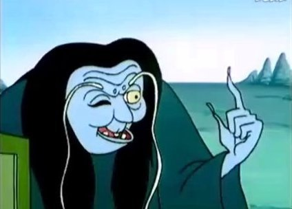
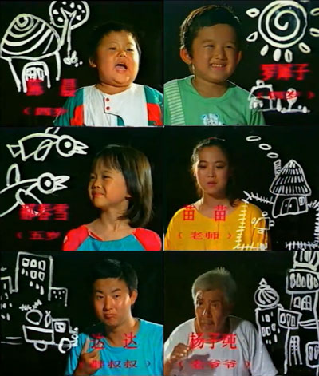

学生党的寒假已经开始了，应个景，这次来说说小时候的寒（暑）假节目。

不管是前期的黑白电视还是后期的彩色电视，印象中在有线电视时代来临之前，每逢寒假和暑假，地方台和AV都会为小朋友们“精心准备丰富多彩的假期节目”。AV台的大约是每天8点半开始，到10点半结束；辽台是中午；大连台早期是晚上五点，后期上午也播。

少儿频道分出去之前，AV的编辑质量算比较高的。通常两个小时的假期节目由儿童歌舞、动画片、舞台剧、电视剧组成。

先说说最不爱看的歌舞。一般刚开始的时候都是小孩儿跳舞。一般这种时候都是电视开着然后跟表妹玩真人RPG。
但也有二般的情况，那就是放长篇芭蕾舞剧。**《胡桃夹子》**和**《天鹅湖》**往往会在两个电视剧换档的时候出现，一天还播不完，非要分个上中下集。遇到这种情况当然是果断关机。
后来二姑父不知从哪儿弄来一台二手“彩电”。因为制式不对，所以出不来彩色，但可以收到“28频道”。于是遇到歌舞的时候多了一种选择——换台看AV2的《经济半小时》。

总的说来假期里的动画片不如平日的六点档有趣。
质量最高的是**《丹佛最后一只恐龙》**。每隔几个假期就会出现一次。首播的时候还小，看不进去。第二次或者是第三次播才发现质量很高。故事接地气而又有趣。遗憾的是没看过结局。多年以后有了豆瓣才知道这玩意50多集，当年电视台也没放完过。没看到结局再正常不过。哦对了，这部动画的主题曲又是正宗硬核摇滚。

几年前玩《孢子》的时候，一下想到了小时候看的**《火星上的小老鼠》**。大约92年左右，辽台假期在中午的时候放的。第一集好像就是说小老鼠在火星上哭啊哭，哭出了一个世界来。这部动画好像是无声的？？

辽台假期中午档印象最深的动画是**《百变雄师》**。这是一部一辈子生活在《变形金刚》阴影底下的动画，很长一段时间里我都以为它是山寨作品。剧情挺程式化的，正方李德王对反方萨尔魔。正方有个跟大黄蜂设定很像的小受状踏板摩托，反方有个叫“可可怪”的黑色女赛车。辽台的配音是亮点。

后来国家大力扶持的国产动画开始登场，93年左右的时候，假期的下午档开始播国产动画。以曲风雷人的《海尔兄弟》和画风雷人曲风更雷人的《太阳之子》最为突出。
**《海尔兄弟》**因其后面拍得由长又长的而广为人知。印象里最早的海尔广告是黄头发小孩先喊：“琴岛——”然后黑头发小孩再喊：“利勃海尔——”然后俩小孩才凑到一起组成经典的商标动作。所以动画版一出来的时候就懵了，不是应该一个叫琴岛一个叫利勃海尔吗？咋变成海尔哥海尔弟了。
**《太阳之子》**从主人公到大反派的造型都很鬼畜。这玩意儿也是后来才知道很长，电视台没播完过。主题歌“太阳的儿子就是我——（蝈蝈）——我的本领就是强”算是蒋小涵女士一生的污点了吧。二十多年过去了，我都不知道那句“蝈蝈”是什么意思。

再后来进入有线电视时代，我也上中学了。补课和电子游戏双重原因影响，很少care假期动画片了。95年寒假的时候，一部上美影的作品刷新了我的三观。**《特别车队》**讲述了猴子和熊猫的虐恋故事。整个剧情也是成人向的。我倒是挺喜欢里面的反派狒狒的。就在码这几个字的当口，搜资料发现这动画还有被删掉而现在解禁的部分，有空一定要找来研究一下。

2000年夏天MD借出去了几天，GB电源坏了没钱买新的，FC手上没有好卡，于是勉为其难看了一部**《人参王国》**。满嘴吉林方言也就罢了，故事又臭又长，一个夏天也没等到结局。当然现在知道了，这玩意儿也是50多集。假期动画的记忆停留在这样的烂片上，心有不甘。

在说电视剧之前，先说一些不太好分类的东西。

**《绿野仙踪》**
89年的寒假AV1和大连台不约而同地放了两版绿野仙踪。央视放的是木偶剧，大连台放的是真人舞台剧。所以强化之下，对飞猴的记忆空前深刻。忘了哪一版主题歌有一句歌词“在前进的道路上，每个人都有着梦想～”还怪好听的，但根本找不到。

**《花王国的朋友》**是92或者93年暑假放的。一部质量很高的舞台剧。现在一般会把这部剧跟曹颖联系到一起。但首播的时候印象更深的是曲先生，其装逼台风甚是对我的胃口。据说扮演者现在在电视圈里是个不错的执行导演。这部舞台剧能看得下去的一个原因是比较成人向。好像有一集是说到了秋天，谁谁是终究要死的。可惜现在网上没资源，也没有哪个台重播过。

跟“花王国”脚前脚后有一部童话剧**《冰冰棒棒泡泡》**。那个寒假闹牙疼，老爹三天两头带我去一个小诊所修牙补牙。补牙老头儿处于好心总打开电视给我放那个剧，其实我并不爱看，当时就觉得挺幼稚的。反派好像是只黑猫。主题歌非常有节奏感。

**《毛毛和哈利》**。猩猩和狗的爱情故事。好邪恶。
**《动物王国窃案》**。台词“金山金山我是银水……”好邪恶。
主演坟上的草比人高了吧……

88年暑假的时候，大连台6点档引进过一部真人版童话故事。皇帝的新装睡美人什么的都有。印象非常深刻。有一集叫“傻大胆”，跑到一个闹鬼的楼里，用骷髅打保龄球。以至于我很长时间内对保龄这种运动有心理阴影。可惜连名字都记不住，没法找资源。

转过年的暑假，在《[恐龙特急克塞号](https://pewae.com/2015/12/night-night.html)》之前，大连台播放的是《警犬卡尔》。我从小讨厌狗，并不喜欢这部剧。但表妹爱看，只能陪着她一起。剧情早就忘干净了,只记得一句“卡尔，上！”，跟“汽车人变形出发”一个级别。倒是初中的时候有件事跟这部剧有关：那时对字母K特别有好感，翻遍字典给自己起名Karl。洋洋自得之际，前座大猴转头来一句：“的瑟什么，起了个狗名！”

最后说说电视剧。小时候来事说写作文要扣题，本篇标题的意思其实就是说，85后们常念叨的“一到假期就重播”的《还珠格格》和《新白娘子传奇》，并不在我回忆和讨论之列——省得看不懂的人又说我瞎起标题。
**《还珠格格》**的情况比较简单，没拍嘛！赵薇林心如比我大4岁，范冰冰比我小1岁，李明启比我大44岁。好吧后边这个不算，我的意思是我是个小屁孩的时候，前面那几个也不过是半大孩子而已。而96年上高中之后，假期就不看电视剧了。98年放的《还珠格格》这玩意儿，我只是在首播的时候被老妈绑架着看过些片段而已，脑海中所有情节均完全来自同人小说和自行脑补。
**《新白娘子传奇》**就稍微特殊一点儿。首播在1993年的春天，俺娘是一集都没落下。可我一来讨厌叶童的男装扮相，二来讨厌演着演着就唱起来这种形式，三嘛就是那些个晚上大多贡献给游戏厅了，所以没觉得这剧如何特别。随后有线电视普及，确实有些地方台开始在假期重播这部剧。可这时候我玩红白机都忙活不过来，哪有空看这种咿咿呀呀的剧呢？哦对了还有一点很重要，白素贞的造型跟程淮秀比，差了100个冯程程。

那么，总重播的都有啥呢？90年代前期，符合条件的剧真不多，除了武侠剧以外，翻来覆去就那么有限的几样。
**《西游记》**
霸主地位无可撼动。[前回写过](https://pewae.com/2015/08/fragmented-memories-and-complete-songs.html)，不再赘述。补充一点是那时候重播的不是“精编版”。最喜欢看车迟国斗法，可惜现在最有意思的部分被“精编”掉了。
**《红楼梦》**
以前没提过，是因为我对其首播完全没印象。究其原因大概是因为爹妈没文化看不懂吧……四大名著另两部没拍的岁月里，《红楼梦》的重播概率非常大。红楼在我这儿是看到就关电视的待遇，因为非常非常讨厌林黛玉，觉得她事儿太多，而且这版男猪也算娘得无人能出其右了。
**《乌龙山剿匪记》**、**《破烂王》**
上回也已经说过了。

**《红红的雨花石》**
这剧流传下来的就剩首歌了。当年放个五七六遍也从来不看，只记得一首歌。

**《三个和一个》**
名字现在看来挺邪恶的。知道这个的90后朋友怕不多了，因为重播集中在80末90初。剧不长，说的是一个小女孩住在废弃的公交车里，三个小男孩帮她找家人的故事。关键的剧情有一处是小女孩把头发卖了凑钱干嘛。

**《好爸爸坏爸爸》**
这个名气大一些。为华语乐坛贡献了一首歌颂爸爸的歌。印象最深的一集是小孩听说猫摔不死，就把猫从阳台上给扔楼下了。于是，我从这部剧里知道猫是摔不死的。

**《十六岁的花季》**
这个就太有名了，总重播。第一次播的时候不到16岁，看不懂；16岁的时候没经历过中学住校生活，仍旧无法投入。其主线剧情——澡堂子男女牌子反转事件实在是弱爆了。出了这种事情学校大事化小才是正经事，怎么可能不依不饶地非要开除那谁谁谁呢。若干年后吉雪萍女士出任正大综艺主持人，我毫无印象。果然还是陈菲儿更对我胃口一些。这部剧的主题歌脍炙人口，作曲是大连之光徐沛东老师。说实话曲子挺一般的，老搭档张藜老师的词更出色。

**《末代皇帝》**
朱旭老爷子演技真是好。后期有个剧情是溥仪在苏联接受改造，穿个破棉袄小心翼翼的样子，看了就觉得当个亡国皇帝好可怜。虽然我至今也不知道为啥要给小孩儿播这个。

**《亲亲我，老师》**
讲的是暑假里幼儿园有三个小孩没人接走，带班老师照顾他们的故事。女猪苗苗老师长发披肩，咬嘴唇的模样特别有爱。可惜这个女演员后来不怎么出来了。演看门大爷的杨子纯老爷子显得特憨厚。还有一个达达叔叔，曾经在央视的儿童节目里经常出现。最经典的剧情是达达开车，这几个人去动物园玩，路上小胖子要撒尿，没办法让顺车门尿了。旁边车追上提醒达达：“哥们儿，车漏油了！”小胖子陈晨在这部剧里确立了童星地位。主题歌是首《排排坐吃果果》的改版。

**《小龙人》**
要不是它客观存在，我真不愿意提。从来没觉得好看。92年夏天这部剧在央视一套放的，后来在接下来的暑假立刻重播。表妹特别喜欢，我只能陪着她看以换取玩红白机的时间。最后真相大白小龙人的妈妈是身边的老鹦鹉的时候，我简直有砸电视的冲动——天底下哪儿有这么折腾孩子的妈？男主角太娘，动不动就哭，演技被配角小胖子陈晨完爆。印象最深的一是那个小姑娘非常漂亮，二是返回太古时代的剧情里，插曲《大老龟》好听。

**《少年特工》**
军事演习里率先使用童工，貌似应该判定为耍赖行为且违反“少年儿童保护法”吧。亏得片头还是当时国防部长题的字。印象最深的剧情是一个人把追踪器绑到了小刺猬身上“三十六计多一记——小刺猬历险记”。

**《寻找回来的世界》**
这部剧在80末90初放过无数遍，差点让我三观尽毁——讲工读学校的。里面工读学校的老师那叫一个温柔体贴善解人意啊！以至于小学班主任拿：“再调皮送你去工读学校！”当威胁的时候，我在下面腹诽：“工读学校不是挺好的吗？”女主角凭这片拿了青年演员奖从此走上了家喻户晓的不归路，看过电视的中国人应该没有不认识她的。有兴趣的可以不百度猜猜是谁。
提示：其第一次出现在小品舞台上的时候，形象反差巨大，我下巴都要吓掉了。