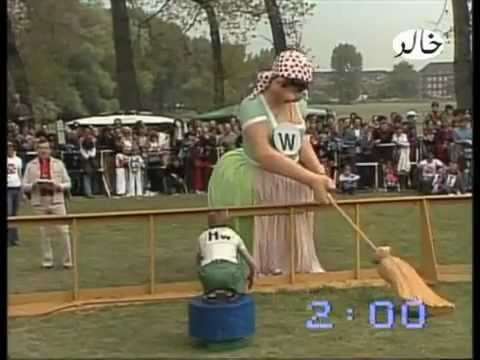
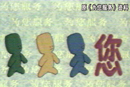

黑白电视的时代，本来还有挺多可讲的东西的。但好像再继续下去朋友们的客套话就要用光了，那就集中在一起最后来一发吧。

本来，是打算写写那个年代的娱乐节目的。
其实就是没啥固定的娱乐节目。

大连台有个《观众点播的文艺节目》，简单粗暴的标题。后来这个节目改成了很文艺的名字——《太阳雨》。《太阳雨》这个节目存活了很长时间，可能有十几年。主持人先是蔡杨，后是包杰。坊间关于蔡杨的流言蜚语也挺多的，感兴趣的请自行google。但《太阳雨》其实已经是彩电时代以后的事情了……
辽宁台也有一个类似的节目，好像开始叫《XX星期天》，后来叫《请您欣赏》。《请您欣赏》是每个周四还是周五播的来着，想不起来了。反正小学的时候要求除了周六都要八点半上床，这节目是看不完的。

节目的内容其实挺匮乏的。无非是什么历年央视春晚、辽台春晚、元旦晚会上的小品相声歌曲啊～上回提到的那些电视剧的主题曲啊～齐秦啊～董文华啊～韦唯啊～毛阿敏啊～童安格啊～苏芮啊～张明敏啊～费翔啊～胡月啊～程琳啊～成方圆啊～邓丽君啊～
不知道是不是因为有所顾忌，崔健、罗大佑和韩宝仪是很少出现的。
耳熟能详的就那么直接放过去，说点儿特别的。
《刘三姐》选段。刘三姐跟三个邪恶NPC对歌的那段，四个人普通话都不怎么标准。刘三姐流利地把骂人话唱出来，而对面的三个说话磕磕绊绊跟刘能似的，最后有个人被骂老狗，还被赶下河。这段剧情经常被反复点播，当小品看的。至今一提起俩人文斗，我第一反应还是这个片段。比唐伯虎大战对穿肠印象深刻。
《苏联搞笑体操》是一段滑稽表演，演员扮成各种残疾人，在双杠上完成非常规的动作。应该归于杂技吧？
《卓别林电影片段》《虎口脱险片段》都是当喜剧小品来点播来放的。
《美国哈林篮球队的表演》一段非常花哨的视频，也很受欢迎。可以算是我看篮球最早的启蒙吧。
小品里点播频率高的是陈佩斯朱时茂组合，然后是赵丽蓉女士。本山大叔那时候还在练级，宋丹丹女士也还是个正经演员。倒是有个王景愚先生的《吃鸡》经常被点到。
最后特别提一位歌手，目前她仍旧在各种真人秀节目上非常活跃。当年她的成名曲《十九岁的最后一天》点播率非………………常高。~~不久前重温了一下，感觉这歌儿被她唱的稀sei啊！80年代末的适龄少年少女们耳朵都瘸了吗？~~感兴趣的自己体会吧。

再次提醒一下时间，一切以1989年秋天为界，好多大神没出场不是因为我忘了而是家里还没换彩电，幕后排队等着吧。
观众点播这种东东说来也没什么技术含量。无非是坐那儿说：“热心观众XXX来信点播YY和ZZ演唱的#####，6月19日是他姥姥的生日，在这里他祝姥姥生日快乐，也祝全天下的母亲健康长寿。同时祝我们的节目越办越好。同时，XXX,XX,XXXX和XX也点播了这首歌……”
但就每个礼拜这么两句词，蔡杨女士还真能折腾，愣是被她折腾到了一个全国的“银话筒”奖。当时俺娘说这个奖是她摇头晃脑的风格摇出来的。父母那个年龄段不喜欢蔡杨的很多，要我说这是因为大连常年收不到马桶台，他们不认识李湘谢娜……

除了第二届的银话筒，大连台还有一个第一届的金话筒。这个就牛叉了，跟杨澜倪萍敬一丹叶惠贤并列。
小叶女士。
她应该是1950年左右生人，80年代末正是年富力强的时候，但她能进十大我看来是很奇怪的事情。大连全境那个时候人口加起来顶天400万，根本谈不上什么辐射面。她的那两档节目一个叫《社会与家庭》一个叫《月季花》，都是女性视角为主的访谈类节目。别说我遇到就换台了，连我妈都不看。
P.S:月季花是大连的市花，槐树是大连的市树，很多人把槐花当成市花是错误的。

大连电视台最为全国各族人民津津乐道的可能就是焦岩峰老师了。当时他也有且仅有一档节目《体育大观》，每个周四播出。就是把近期的体育比赛信息汇总，然后嘚啵嘚啵一个人念出来。只能算近期吧，有的时候一个月内的比赛都算新的。他说什么是什么，也没有别的渠道能够加以印证。其实焦老师并不是大连人，而是个在大连当兵的吉林人，早年他播体育新闻的时候也没那么重的大连口音。当年的体育解说都是走宋世雄的细声高频的路子，也不知道焦先生是先天这条件还是后天练的。他的臭毛病都是后来升格体育部主任并且解说假A的时候惯出来的。

总而言之，黑白电视的年代大连台除了电视剧以外的节目基本都是打酱油的，留下印象的不多。
辽台因为信号不佳也没好到哪里去。
除了上面提到的文艺节目，有印象的就只有一个《纵横》。有点儿像后来的“世界真奇妙”，讲一些世界各地的有趣的事情，或者一些滑稽录像之类。
德国的《夺标》最早是在辽台看到的，两个城市派代表队，进行趣味竞赛。也不知当时是按电视剧还是专栏播的。20年后在AV5我却逢《城市之间》则换台。

信号好并且白天有东西播的，就是AV1了。
《经济半小时》（这货其实出现在AV2，另外的故事）
在新闻只有一种调调儿的年代里，敬一丹大神领衔的这档节目我都是当娱乐节目看的。道理很简单——平日的上午，不看这个就只有电大课程可看。3.15的发扬光大完全要感谢《经济半小时》这个节目。揭发假冒伪劣什么的是我最爱看的节目了。
还有个介绍地方特产的子栏目，具体什么名字完全不记得了。好多冷知识是从那个节目学来的。比如湘绣。

《动物世界》
地球人都知道。印象里周日的白天和周日的晚上总会出现。最奇怪的是仿佛有那么几集出现的频率特别的高。一个是大脖子军舰鸟求偶，一个是非洲鼓伴奏下的草原追击。
一个印象特别深刻的场景是八月份的夏夜，天擦黑的时候忽然停电了，跟老爸出去溜达一圈，小区的周围有好多蝙蝠。之后赶着《动物世界》开播的时间回到家，恰好来电。谁知那一集刚好是吸血蝙蝠的传说，吓死宝宝了！
这典故，北京夏令时也有贡献。

《外国文艺》
片头非常有特色。动画的随节奏变化的不断延伸的螺旋线。片头音乐是巴赫的1052号。
这东东一般在下午放学的5点左右播出，那时在托管班老师家，小伙伴们一般会翘首等待片头放完，如果播马戏和杂技，就接着看；如果是交响乐，就关电视跑楼下去玩。
据说后来搬到AV3了？

《世界各地》
好像也是存活了很久的一个栏目。内容不一定有意思，所以有时看有时不看。直到进入彩色时代之后才翻了身，因为它开始播《吉尼斯世界纪录大全》。

《为您服务》
其实是个介绍生活常识的小栏目，主播张悦女士非常端庄大气。其实这节目我一般是不看内容的，我喜欢看那个小人跑来跑去的动画片头。
中间一度停播了，AV2现在的是诈尸版。

《人口与计划生育》
观看完全被动的。每个星期天的下午最热的那个时候，在家待着的话就只有这个和日本语讲座可以看。
把这玩意儿也当作娱乐节目，我是在凑字数吧～

剩下的能想起来的就不多了，《正大综艺》和《综艺大观》这时候都还没出生。
ちょっとまで，还有一个凑时间的节目可以拿来说。
《请您欣赏》
央视的请您欣赏一般会在下午少儿节目没开始前的垃圾时段出现，就是放几首歌什么的。印象最深、出场频率最高的是《高天上流云》，却完全回忆不起是张也版的还是彭女士版的。彭女士虽然已经成名，但在点播节目里出现的频率不是太高，89年以后才有点《我们是黄河泰山》的。

除了专题节目还有啥？新闻呗。
央视那几个几十年的都没变过样子。辽台有辽宁新闻，18：30播，大连台有大连新闻，19：45播。
播就播呗，反正我不看。

差点儿忘了，还有电影。
AV1每个周日的最晚的那个时间段，会播一部“译制片”。早期的文艺青年可是不会放过这个装逼的机会的。所以那个时候的有名配音演员人气都非常高，什么童自荣之类的。
但这本身不太符合我的年龄段，我只对辽艺的动画配音团队印象深刻。他们后面才会出场。

广告有时也能当娱乐节目来看。
捡几个印象深刻的说说。
果珍。
“共同进入太空时代，一起创造美好明天”。广告做的好，不如播出时间好啊！这玩意儿在米老鼠之前播，想不记住都不行。
奥林
“奥林是天然饮料，天然饮料是奥林”。一群年轻人围着辆大巴跳舞。奥林算是第一个我因为广告宣传而买的商品。味道还不错，但存在很短的时间就消失了。
美菱
“美菱——阿里斯顿”。不知跟现在的美菱还有没有关系。
来福灵、燕舞
“我们是害虫”、“一曲歌来一片情”。能记得的都记得。
长城。
“长城电扇，电扇长城”。一匹马跑啊跑~~爬山~~涉水的。
亨氏
“甜甜的，咸咸的，有营养，味道好”。亨氏麦圈跟强力荔枝汁可是绝配！可惜现在都没得卖了。“甜甜的咸咸的”也被玩坏了。
雪碧
“晶晶亮，透心凉”。雪碧最早的广告是跟迪士尼合作的，一顿狂拽酷炫叼霸洋的动画之后，蹦出来这几个字的台词。第一次喝雪碧感觉这玩意儿这么辣能喝吗？！
霞飞
“著名影星潘虹…………霞飞牌增白粉蜜”。我妈不待见潘虹，所以她坚决不买霞飞。
东芝
“TOSHIBA TOSHIBA 新时代的东芝”。酒井法子跟东芝真的是共赢。
万宝路
“男人的世界”。纯粹的烟广告比什么鹤舞白沙什么红塔集团高到不知哪里去！也成绝唱了。
荣升
“荣升荣升，直量的保证”。汪女士那时就显老。普通话也实在太烂了。
XX电饭锅
“我的好朋友陆大安问我，为什么总能保持良好的体力？我的答案就是XX牌电饭锅”。我觉得这广告在我这儿算彻底失败了。梁小龙看到我记得这么清楚也会泪流满面吧……
联想
“人类失去联想，世界将会怎样”。一个人扮成思考者雕塑的样子。个人感觉Legend改名Lenovo一下子怂了好多。
博士伦
“戴博士伦，舒服极了”。效果非常好的一个广告，大表姐真的省吃俭用去买博士伦了然后红眼病了。
大大
“大大，cici～大大，cici”。其实这玩意不做广告也是一家独大，当时市面上根本没第二种产品。
齐洛瓦
“每当我看见天边的绿洲，就会想起，东方齐洛瓦”。当时的广告也不知怎么排的，好像这个广告总在女排比赛的时候播。
康巴斯
“康巴斯为您准确报时”。比秦池板桥三株长脑子多了。当然在现在人手手机网络对时的时代就没用了。
其实那个年代最普遍的广告，是块大灰屏，然后出字，然后有人开始念：“大连百货商场为答谢新老客户，现展开大酬宾……联系电话XXXXXX电报挂号XXXXX”
没发过电报,也是人生一大憾事啊!

最后说一个我最喜欢的。
“唉哟哟，牙齿疼得好厉害”。
动画什么的，最有好感了。