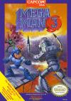

[洛克人3：威利博士的末日](https://pewae.com/gaan/aHR0cHM6Ly93d3cuZG91YmFuLmNvbS9nYW1lLzI2MzQ3MzM0)

原名：ロックマン3 Dr.ワイリーの最期!?机种：FC厂商：卡普空类别：ACT发行年月：1990-11耗时：5

找洛克人3出来玩，并不是突发奇想。这个游戏是一类游戏的代表：在某个时期非常想要玩，但真正有条件玩到的时候却忽然弃之如履。
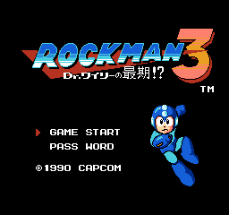
当年惦记《洛克人3》，是因为电软上的一条秘技：跳跃时按住2P的→，掉进坑里也不会死，而且可以高跳，并且无敌。
“无敌”二字还是蛮有吸引力的。但自己毕竟手潮，且彼时已经转型玩文字卡，我是不会主动去换这种高难度动作游戏回来的。也正因为如此，我在黄卡时期并没有摸过洛克人3，甚至都没见过（后期游戏店试玩揽生意用的也都是PS或者MD）。
本人对于红白机的热爱，在1996年秋天买到MD和1997年春天买了GB后，戛然而止。而且本作因为不是自己中意的游戏类型，连在几年后打开模拟器尝试的欲望都没有。
所以当年写[《洛克人2》](https://pewae.com/2006/08/mega-man-2.html)的时候，3P哥留言说3代最好玩的时候我是有些吃惊的，我都不知道他摸过3代的卡，所以他也不知道我知道3代的高跳秘技。
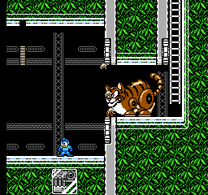

3代玩起来的感觉跟2代没差多少，但因为增加了滑铲动作，并且一开始就可以用高跳狗，所以难度生来就比二代要低。三代的属性克制关系很强，大多数BOSS只要选对了合适的武器，避免身体接触，硬吃子弹对拼就能拿下。
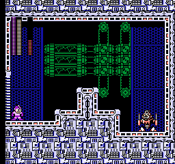

BOSS的特点其实不如一代、二代那么鲜明。甚至产生了大多数没什么用处的陀螺人这种废渣武器。倒是蛇人和电火花人两关的音乐很好听。另外还有一个印象深刻的BOSS叫难人（HARD MAN）。难人好难（笑）么？反正难人不适合第一个打。
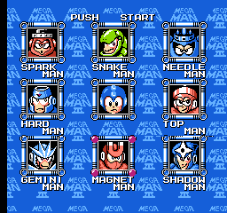
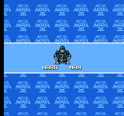

3代还有一个特点，是打完自己世代的BOSS后，还要挑战一次2代的8个BOSS。BOSS战的密集程度是元祖洛克人时代最密集的。因为普通关卡的部分不太为难人，所以这个游戏主要精力就花费在尝试关底BOSS的克制关系上。有点像香港的老电影《鹰爪铁布衫》，不断在敌人身上摸他的罩门。这次打AIR MAN就费了不少劲，没想明白为啥它怕SPARK MAN。二代打AIR MAN也没费什么工夫啊。
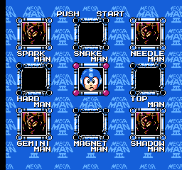

3代还加入了布鲁斯。我倒是不反对这个小BOSS，但真的没必要打那么多次。岁数大了，受不了频繁按手柄。
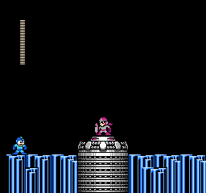

没想到的是，附加关第二关再次见到了童年梦魇——黄豆人。若是单论难度，学会翻身技能的黄豆人理论上可比一代的还要厉害。45岁的我，反应不可能比15岁更敏捷。但是现在的底牌可比当年多了太多。且不论有即时存档和连发调速这样的大杀器，3代的游戏本身也比1代友好太多了——有密码有E罐。遥想1995年的寒假，打到大黄豆的时候要不是已经搓了40分钟手柄注意力开始下降，或者能来一发E罐回满血，可能我也早就不会对这个黄色恶魔念念不忘了。
P.S:等我知道连续按暂停可以把大黄豆晃死这条秘技的时候，手上早就没有洛克人1的卡带了。
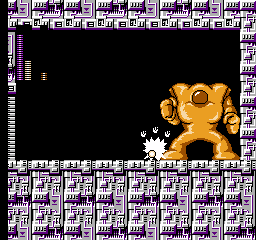

最后的威利博士的威力简直不值得一提。哪怕是先出来个替身拜年。
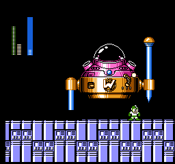
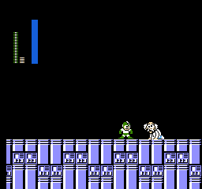
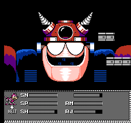
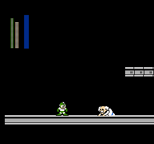

通关！
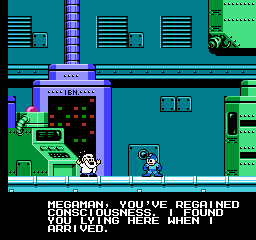
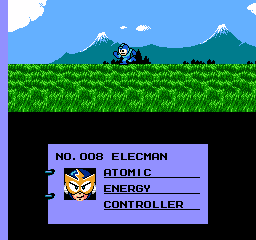
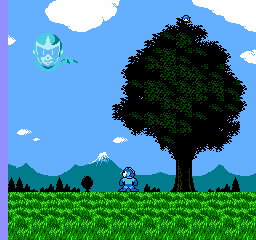
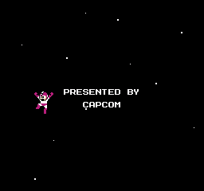

按2P右键什么的，根本就没试。一个人玩游戏，就应该只干一个人该干的事。时代变了。