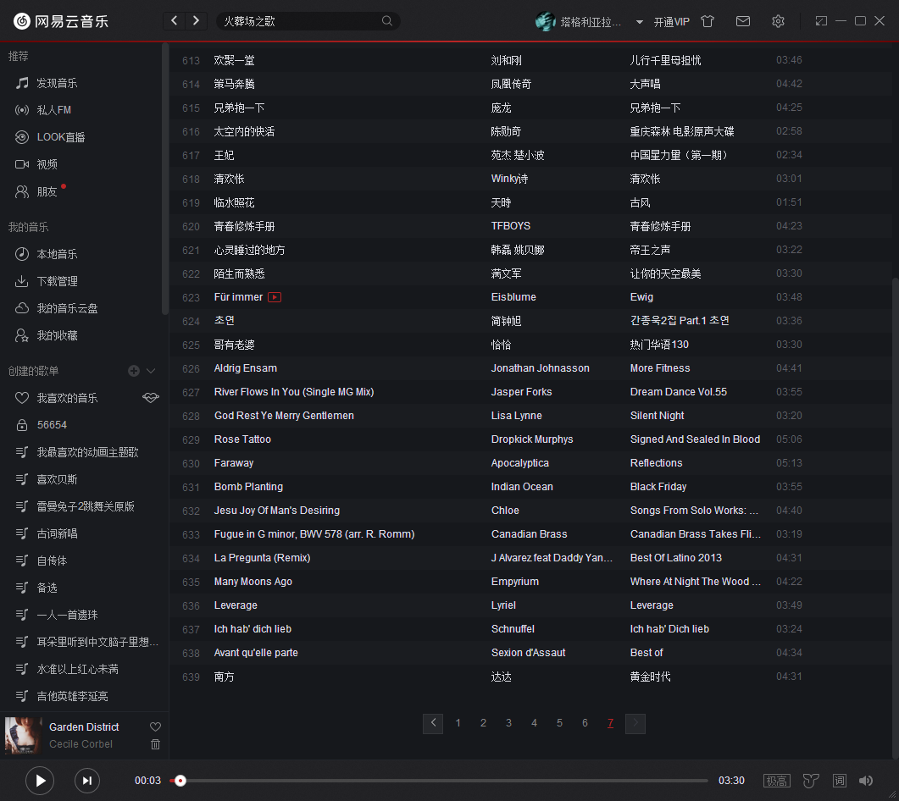

我曾经曰过：“BAT三家，我最喜欢的是网易。”

确实，印象中，网易是一众国内垃圾服务里，相对吃相端庄一点的那个。反正之前是没怎么喂过我屎。

然而，从今年下半年开始，网易云音乐这个播放软件，用起来越来越不舒服了。

最跳的是VIP试听功能。
VIP花钱听新歌稀罕歌，无可厚非。哪怕你把一半的歌手都划成VIP，我还可以听不花钱的另一半，井水不犯河水。何况那些要花钱的新歌我还真没什么兴趣，不买V相当于自动过滤了一批鲜肉，挺好的呢。
可大约从十一开始吧，网易云开始强行推广VIP，具体表现就是在原每日推荐30首的基础上，另加一两首15秒的试听歌曲。不算太明显，也可以在添加到播放列表之后再行删除。可就是让人别扭——对于懒人来说，没有必要的右键后左键也会引发不适；可若是听呢？那就是自找不快。没头没尾的，副歌还好，给试听一段间奏的情形也屡见不鲜，反应不过来还以外串台了呢。
私人FM没坚持几天也步了后尘，当不当正不正的插那么几句，跳戏。而FM还没法提前删除，等咱这老胳膊老腿的点不感兴趣的时候，15秒都快过去了。
查一下新闻，怪不得，9月份阿里妈妈给网易云注资了。这么有BAT风格的功能，闹半天是带资进组的啊！

然后是其推荐算法的日趋操蛋化。
在我看来，网易云音乐最有趣的地方是其秉承网易作风的评论区。我这种自带捧哏属性的大叔，非常喜欢这种地方，歌手的唱功、编曲的意境或者歌词的优劣都是我的评论范围。评论嘛，自然有好有坏，当然中二中年这里差评居多。
然而不知从什么时候开始，脑残的网易攻城狮们默认把“评论”当成了“好评”，又用滑坡论证的办法，把“好评”当成“喜欢”，然后一个劲推荐。
今年8月份的一天，不知是为了弘扬传统文化或者什么，日推里忽然多了一首“打虎上山”。受不了，在评论里嘲讽了一句网易云的算法。这下可捅了马蜂窝，每天一到两首京剧。
继续骂算法。直到一星期以后，有个哥们好心提醒我：“你越评，它越给你推。”才知道个中原委。

收藏也是。我的理解里，只有收藏到“我喜欢”的才是我喜欢的，其余“臭宝考级”、“单位节目”、“听个乐呵”、“小学时代”这种，都不能算我喜欢的，也就不应该从这些歌单里推演我喜欢的歌。
但显然网易的同行们不这样想。臭宝古筝表演，给她听了段“映山红”之后，就来了“说句心里话”、“相逢是首歌”等一大堆红色歌曲。
敬谢不敏。

最不能忍的是删评论。
我曾在某位老阿姨的最著名的歌下面，感慨了一句，要不是她当年膨胀犯了错误被封杀了两年，绝对不是现在的地位。
半年多以后，有网友私信询问，我才知道这条评论和后面说详情的评论，都已经消失了。
我其实并不反对言论控制，只要有理有据，指出我犯了哪条哪款，因言获罪我也认。
但是我完全不能接受不声不响的秘密处决，把我的言论消失了，连个通知都没有，这就不行，跟我的三观严重不符。

正常逻辑，用得不爽，换一个就是了。
残酷的现实是，另外几个，都姓BAT，或者连BAT都赶不上。
外国服务也不行。英文歌感觉平平，而且老美的曲库里小语种也没多少。有一说一，国内软件的曲库还是非常对我胃口的。

在单位的时候，戴上耳机基本意味着进入“勿扰模式”，所以差不多是刚需。刚需出了问题，还真挺难办的。

几年前从豆瓣搬到网易云的时候，我硬生生手动搬了223首红心。
再搬家的话，534首红心费点劲也还搬得了，639首垃圾桶里的歌可没什么办法。

网易啊网易，你知道吗？你是靠垃圾桶才捡了一条命啊！