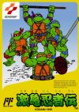

[激龟忍者传](https://pewae.com/gaan/aHR0cHM6Ly93d3cuZG91YmFuLmNvbS9nYW1lLzI2MzgzNDE3Lw==)

原名：激亀忍者伝别名：忍者神龟一代机种：FC厂商：科乐美类别：ACT发行年月：1989-05耗时：28

这个游戏的正式名字是”激龟忍者传”,是KONAMI的第一款以忍者龟为题材的游戏,被称作忍者神龟1理所当然.问题是后来科纳米不知道吃错了什么药,把后续的两款游戏分别称为忍者神龟和忍者神龟2,但是国内却习惯照顺序把他们称为2和3.
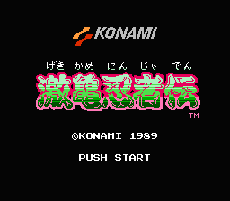
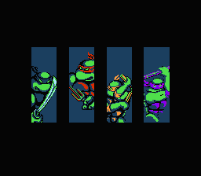
游戏分为地上部分和地下部分进行,而且经常会有压道车之类一击必杀的敌人.当年玩的时候又没有修改器又没有即时存盘的,所以算难度颇高的一个游戏.
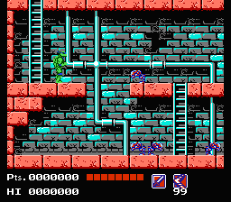
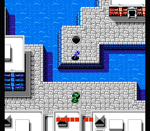
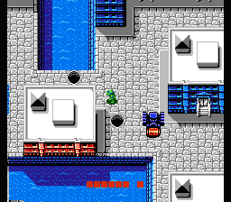
水下这关最重要的是时间.以俺的技术水平,基本上都是把拿叉子的拉菲尔牺牲掉才能过关.以至于现在可以修改了,也还是换成拉菲尔才能过关.
题外话,关于4只乌龟的名字,当年被动画片搞得乱七八糟的,在这里简单澄清一下.橘黄拿双节棍的是米开朗基罗这个没有什么疑问,但是剩下3只就乱糟糟了.拿双刀的老大是达芬奇,它身上明明写了个”L”?是的,那里确实是个L,不过这个L不是他的姓,而是它的名字.我想当初创作者用L可能有两个原因,第一是写”D”的话,跟老四多纳泰罗无法区分,第二是达芬奇也根本不姓达,写F的话就太扯了.达芬奇的名字是什么不用我在解释了吧?不知道的回去温习泰坦尼克号.接下来老二是R开头的拉菲尔,经过上面的解释大家应该知道拉菲尔姓R不是L了吧.当年被毁的最厉害的就是多纳泰罗,脑子进水的译者竟然安了个爱因斯坦的名字在它脑袋上!而有的局集又会忘记修改直接蹦出多纳泰罗来,再加上有时喊达芬奇有时喊里奥纳多,弄得小时候的我们很困扰,以为一共有6只乌龟了.
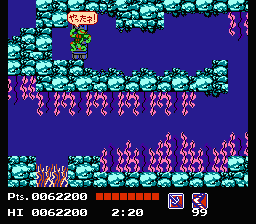
简单的过场动画,当年足以值得兴奋一阵了.
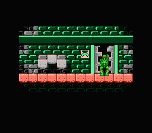
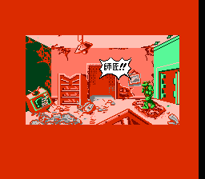
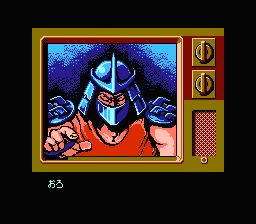

牛头和猪面存在的意义貌似就是像玩家声明:”你们现在玩的游戏不是别的,正是忍者神龟.”一直很纳闷,爱芙丽尔放到今天翻译的话,会不会就是”艾薇儿”?
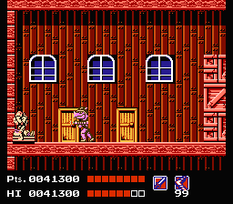

当年玩这个游戏的故事都在下面这张图里.
1994年夏天初升高的时候,学校因为做考场给我们放了近一周的假.从宝宝的哥哥那换来的卡里有这个游戏.在我牺牲了两只乌龟爬道这里以后,竟然怎么也蹦不过去.尝试了几十次后决定放弃.转到中央2,竟然在打篮球.那个时候对篮球规则还是似懂非懂,只知道场上两只猩猩在干架,其中一只叫尤因.但是实际上一周3场比赛下来能把人和名字对上号的就只有一个疯子斯塔克斯.也就是这几场比赛确立了俺对篮球中锋的印象.对姚明的偏见可能在这个时候就埋下种子了.很多人认为俺们这辈的人是从”篮球飞人”开始重视的篮球,这绝对是谬误.就俺所知,92年巴塞罗那奥运会就带动了一批篮球迷,94年总决赛的俺是又一批,而且这批人还不少.当天就在这个地方反复墨迹了一天,直到蛋尽粮绝也没有任何进展.一怒之下放弃了这个游戏,改玩热血硬派了.所以俺的激龟忍者传进程在有模拟器之前也止步于此处.第二周一上学就去问宝宝,那个沟究竟怎么蹦.宝宝很干脆地回了五个字:”直接走过去”.由此俺也正式在他面前确立了动作游戏白痴的地位.
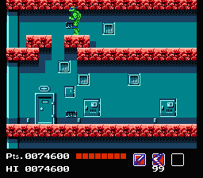
这只老鼠除了被抓就没有别的本事.
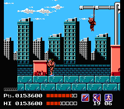
当年看这个东西,就觉得它像俺家后面的那个金南路的煤气罐.这里的形象更像.
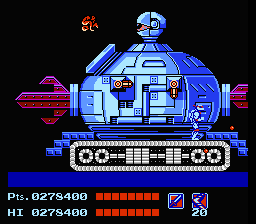
守关的当然识斯雷德,出场还蛮酷的,可惜中看不中打,可以在角落里封死.
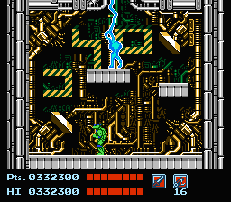
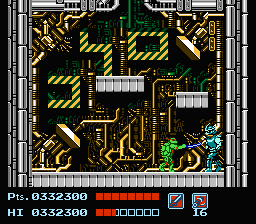
通关音乐和画面就都比较狗屎了,怎么看怎么像墓志铭.
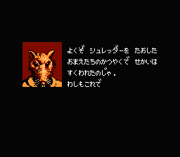
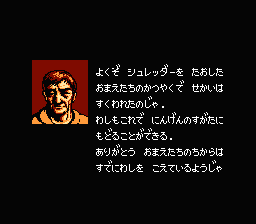
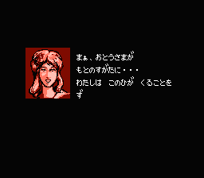