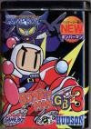
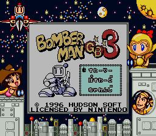
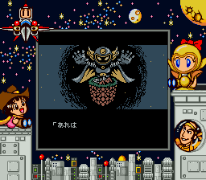
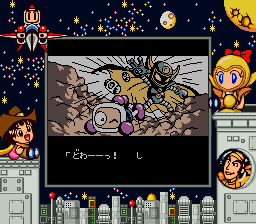
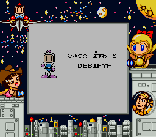
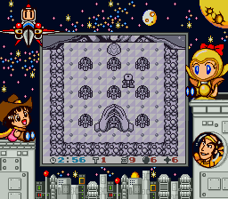
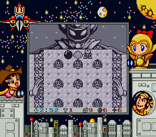
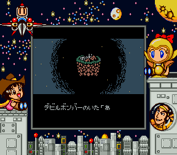
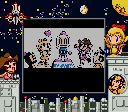
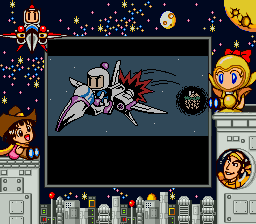

[炸弹人GB3](https://pewae.com/gaan/aHR0cHM6Ly93d3cuZ2lhbnRib21iLmNvbS9ib21iZXJtYW4tZ2IzLzMwMzAtMzI1NDkv)

原名：Bomberman GB3机种：GB厂商：Hudson Entertainment / Inc.类别：ACT发行年月：1996-12耗时：12

接下来又是HUDSON的名作系列在GB上的扩展。炸弹人作为HUDSON的当家主打游戏，二十多年来主体要素竟然没变过，也堪称是一个奇迹。

说来还有个趣闻：
*99年暑假，得知童年的小伙伴3P同学跟我靠了同一所大学，去他家玩。
当天他手上没什么好卡，就提议说：“咱俩玩《爆破》吧。”
我说：“我不爱玩这个，没有炸不死版也玩不好。”
他说：“反正也没别的可玩的了，老规矩一人一条命，死了换人。”
第一关刚开始没多久，他炸出的道具是颗雷，立刻伸手去按了RESET键。
当时我就惊呆了！遂被科普了炸弹人一的正确玩法——只要第一关吃不到定时器就reset——我之前真的不知道炸弹人的道具效果即使死掉了还可以保存的！*

前两天在网易云，随机到一首BGM，一个评论说没玩过泡泡堂的人没童年，然后被引用批驳了，说我们小时候玩的都是魂斗罗。我想说的是，骂这种山寨版，不是原版的炸弹人更合适吗？泡泡堂有的元素，这款GB版炸弹人里全有。

这样的带边框的画面，就是上次提到的SGB。其原理是在GB卡带里多加一部分内容，包括边框和一部分很短的彩色的演示画面；在SFC端增加一个16位转换器，能读取这部分信息并从纯液晶化的图像信号中分析出背景和前景并把前景色随机设置为淡彩液晶效果（好像一共16种）。
真不晓得这种黑科技最后的实际销量如何，会有人喜欢在电视上玩掌机游戏？

炸弹人GB3就是这样一款中规中举的炸弹人游戏。但炸弹人本身的框架非常适合掌机平台，所以也就造就了好多美好的回忆。这个系列在掌机上的三作其实差别不大，3里增加的不过是特技和道具需要用过关后的芯片购买而已。特别注意的是让所有炸弹一起炸的特技，简直是又贵又脑残。

通关！

