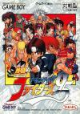

[热斗拳皇95](https://pewae.com/gaan/aHR0cHM6Ly93d3cuZG91YmFuLmNvbS9nYW1lLzI1NzMwNjA3Lw==)

原名：熱闘ザ·キング·オブ·ファイターズ'95机种：GB厂商：SNK / TAKARA类别：FTG发行年月：1996-04耗时：50

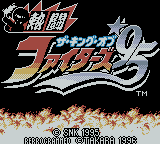
SNK的格斗游戏，往8bit和16bit家用机、掌机移植的时候，找的都是TAKARA。包括但不仅限于龙虎之拳系列、恶狼传说系列、格斗之王系列、世界英雄系列等。TAKARA是日本著名的玩具制造商，我们这一代小时候都玩过它们出品的变形金刚——孩子宝是版权方，TAKARA是制造商。
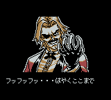

我买GB砖头机的时候，最有名的三款格斗游戏就是《热斗！格斗之王95》，《热斗！侍魂》和《热斗！斗神传》。之所以写95是因为95我玩得最久。GB上的热斗系列具有相同的特点：平衡性渣、音乐渣、出招判定诡异、打击感强。缺点很多，但掌机格斗游戏只要有“爽”这一个优点就够了。
[下乡的时候](https://pewae.com/2010/06/stories-happened-13-years-ago-in-the-countryside.html)，我的GB被宝宝他们寝室借走，每次去串门，都会看到两个人坐在一边玩95。砖头机联机玩格斗必须先说好“不准激动”，否则一使劲就把联机线给拽掉了。
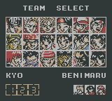

因为这个游戏非常不平衡，作为一个格斗苦手我基本上就没用过八神、卢卡尔和娜可露露以外的任何角色。八稚女擅长抓破绽、卢卡尔的腿攻击范围大收招快、娜可露露的空中MAX超杀简直是BUG，只要把自己甩在天上，然后反方向搓方向+B，落地不是超杀就是飞鹰攻击，很少失手。
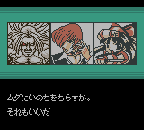
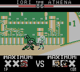
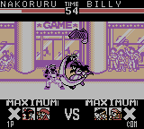
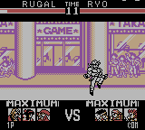

哦对了，片头出TAKARA字样的时候按3下选择键，能选草薙柴舟和卢卡尔，按25下选择键，能选娜可露露。
机能所限，薇丝只能活在过场动画里，麦卓则根本没出现。
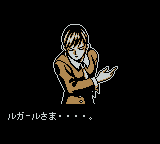

普通难度通关，草薙柴舟和卢卡尔会出来教放招，困难模式出场的则是娜可露露。
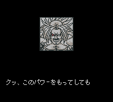
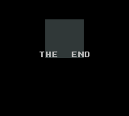

最后说一句，本作发行于96年，虽然是砖头机卡，但这个时期的卡内已经内置颜色索引而不是单纯的灰度了，所以模拟出来的是淡彩的效果，跟纯灰度模式比已经大有进步了。即便如此，估计这也不是贝总所期望的八神。
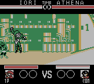