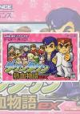

[热血物语EX~2007SP](https://pewae.com/gaan/aHR0cHM6Ly9nYW1lZmFxcy5nYW1lc3BvdC5jb20vZ2JhLzkxNTAyNi1yaXZlci1jaXR5LXJhbnNvbS1leA==)

机种：GBA厂商：Atlus类别：A-RPG发行年月：2007-01耗时：12

从版权上来说，这部作品非常特殊：它是红白机游戏《热血物语》的复刻版的半官方MOD。话说红白机时代热血系列的制作方TECHNOS早在1995年就破产了，版权落到两位热血系列的主创成立的小公司Millon手上。Million公司蛰伏多年，直到2004年，才在GBA上制作了热血物语EX，由ATLUS负责发行。这部作品可以说非常良心，强化了热血物语的招式，增加了队友和分支剧情，把一个原本流程不长的ARPG游戏搞出了很多可以反复刷的要素。我想，彼时的两位热血系列主创未必没有让TECHNOS再次复活的野心，毕竟SNK复辟的先例还是有的。只是这款游戏的销量上并没有掀起什么水花，Million公司也在几年后把版权卖给了亚克系统。

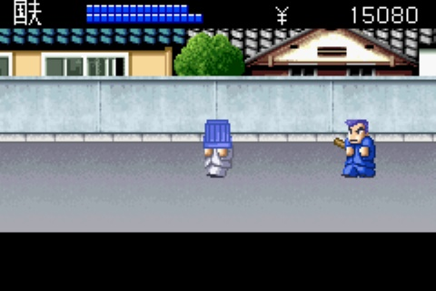
在NDS都已经发售了三年后的2007年，差不多也就是Million准备要卖掉系列版权的前夕，这个公司的两位程序员放出了名为2007Special热血物语EX的改版补丁，增加了很多新人物、新招式、新商店、新敌人和新地图。在日本地区，名义上拥有2004版游戏的玩家可以到游戏店里去烧写升级，实际上就是直接往烧录卡上烧；而像大陆这种地方，自然是直接玩新rom了。于是乎，网上通常把原版EX叫做热血物语EX2004，把MOD版叫做热血物语EX2007SP。这便是这个既官方又非官方版本的由来。算上红白机原版和后来的DS版，热血物语这个游戏至少存在4个大版本，所以网上抄来抄去的攻略往往会出现不同版本的拼接怪，也是个挺有意思的现象。
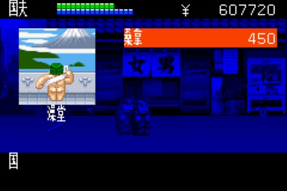
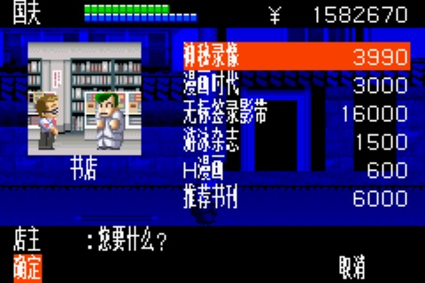
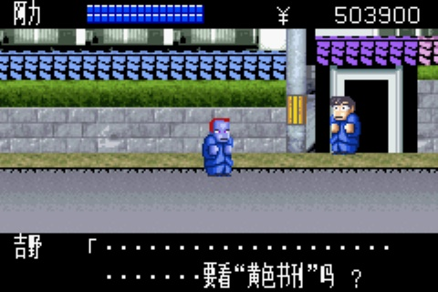

红白机版《热血物语》有个非常著名的典故：永远进不去的冷锋学院大门。说的是这款游戏带有RPG性质，最后的冷锋学院场景需要打败4个小BOSS后才能打开。而其中一位“所长”要走回头路才会出现，大多数没经过RPG时代洗礼的小伙伴根本没料到游戏还需要这么玩。
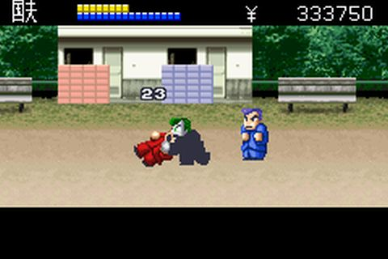

对我本人来说，这也只是个传说。卡带时代我搞到热血8合1只玩了不到一天。足球和热血硬派很熟没碰，包括热血物语在内的5个游戏蜻蜓点水了一下，剩下时间都在研究热血新纪录如何更好的淹死对手里度过。这次玩下来，跟新游戏差不多。
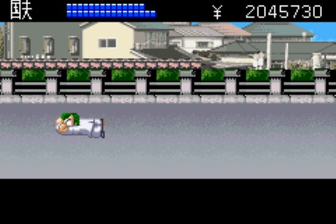

热血系列的前三部作品走了三条不同的故事线。《热血物语》是“downtown”线的开篇，除了国夫和阿力这两个角色来自《热血硬派》以外，其余就没什么联系了。说的是国夫和阿力去救阿力女朋友。因为跟“所长”的事情差不多，救人也要走一小段回头路，所以很容易被忘掉。实际上这个女的救不救都不影响结局。
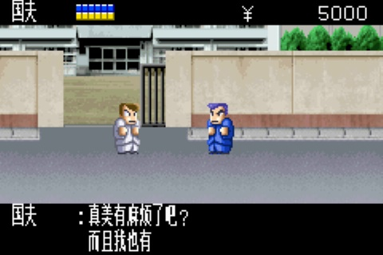
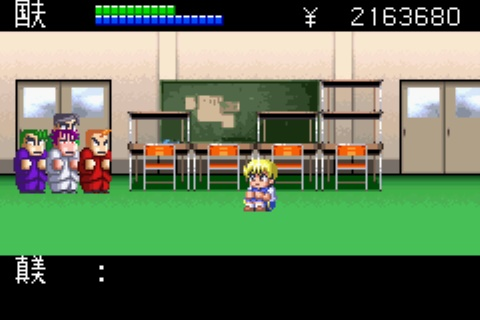

EX版在流程上并没有太多改动，所以流程也不长。默认的敌人数量从2个变成了4个，除了打起来更爽了以外，并没有变难多少。所以到了SP版作者又在杂兵里追加了会特技的“特种兵”。据说某两个杂兵就是Million的两位社长，也就是热血系列的两位缔造者，算是很有趣的设定。
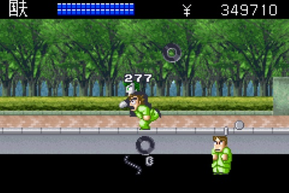

虽然增加了最多达到4位的队友，但能打的却只有小林、藤堂、五代、熊田、紫这寥寥几位。尤其是SP追加的热血队和花园队，全是炮灰杂鱼。
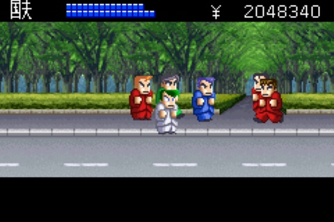
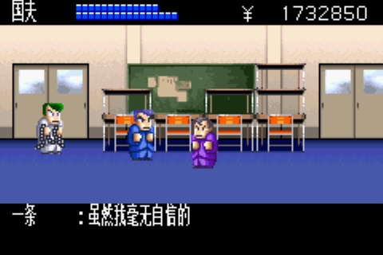
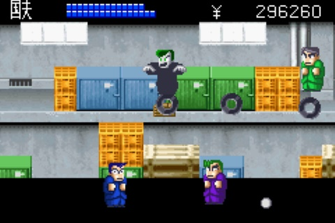

最难打的并不是最后的BOSS，而是守冷锋三楼的龙一龙二兄弟。原版这哥俩设定就是双截龙兄弟，本来就会“龙尾岚风脚”。这次又分别给追加了“天杀龙神拳”和“爆魔龙神脚”，挨一下非常非常疼。更带劲的是，EX版把兄弟俩出场的BGM改成了双截龙的音乐，催人泪下。
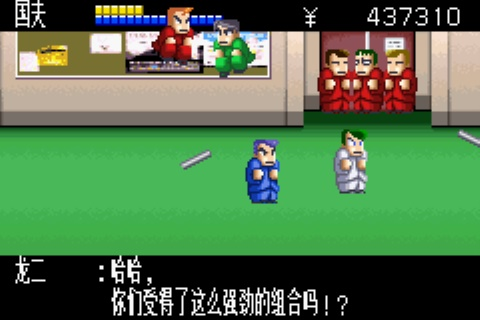

最后的BOSS山田单独打一点儿也不难。但是如果你带满了3个队友，他就也会叫出三个帮手来，其中两个就是龙一龙二，这难度也一下子就上来了。
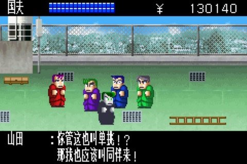

带队友也有不打多个BOSS的办法，就是趁山田没讲完话就直接动手。这就不能不提EX版一个非常大的改动：道德值系统。这玩意儿是《金庸群侠传》之后第二次见到，同样是跟找队友有关。同样是道德值越高就越容易找队友加入。不同的是这个值看不着。趁BOSS没说完话就动手时降道德最多的；而提升道德最快速的办法是往坑里跳，据说跳50次道德就涨满了，这简直是要逼死喜欢一命通关的强迫症。
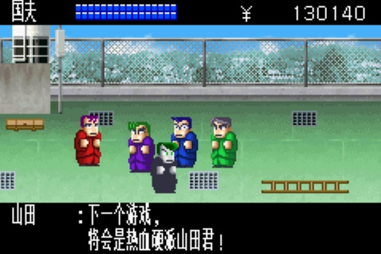
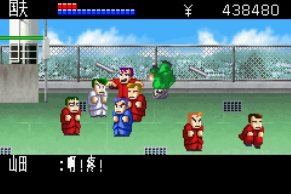

SP版追加了大量的招式。这些招式存在于大量的隐藏商店里。配合EX版就有的存档保留功能，就是为了让玩家反复游戏刷强力招数。获得大招之后，往往会生出普通敌人不够打的感觉。SP也给提供了一个神秘研究所地图，提供了变态的敌人供挑战。机器山田最讨厌的地方是只有用特定的集中能追加地面攻击的招数才能踩死，也就是招式列表里必须留一招攻击力低下的地面招，挺讨厌的。
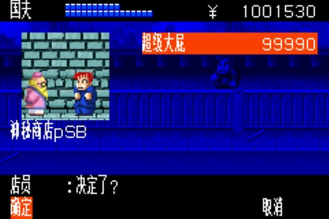
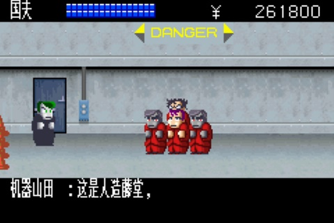
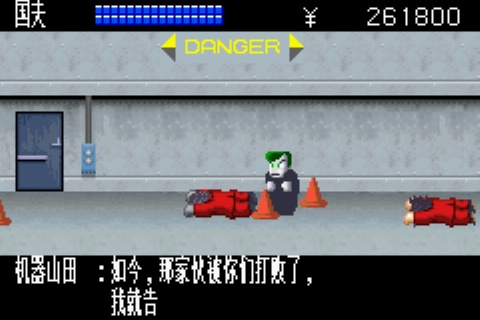
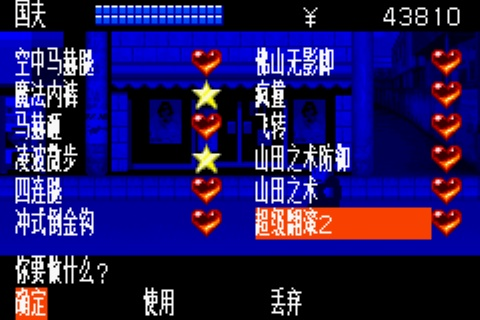
[B站的隐藏商店介绍传送门](https://pewae.com/gaan/aHR0cHM6Ly93d3cuYmlsaWJpbGkuY29tL3ZpZGVvL0JWMTdnNDExQjdQeD9zcG1faWRfZnJvbT0zMzMuNzg4LnZpZGVvcG9kLmVwaXNvZGVz)

异常简陋的通关画面。
