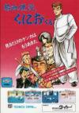
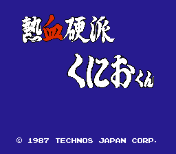
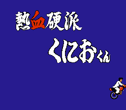
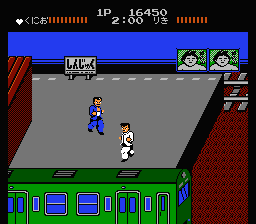
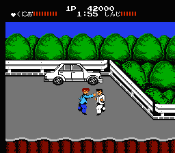
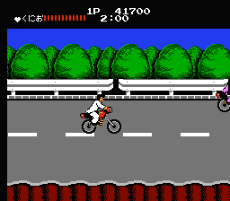
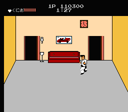
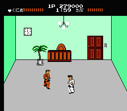
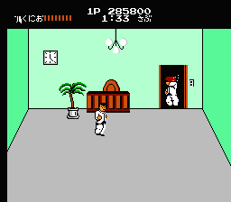

[热血硬派国夫君](https://pewae.com/gaan/aHR0cHM6Ly93d3cuZG91YmFuLmNvbS9nYW1lLzEwNzg3OTAwLw==)

原名：熱血硬派くにおくん别名：Renegade / 热血硬派机种：FC厂商：TECHNOS类别：ACT发行年月：1987-04耗时：30

怎么可以没有热血系列?国夫这个永远的主角(其实TECHNOS已经实际上黄了)来自他们社长的名字.热血系列给俺可是带来了无数的美好回忆.其中热血高校足球(热血足球2)曾经整整玩了半个暑假.热血躲避球是当初最喜欢看宝宝玩,俺在一边指手画脚的游戏之一.
但是要说印象最深的,还是热血的第一作,也是俺玩的热血第一作:热血硬派.这个游戏操作感一般,但是攻击花样繁多,对于俺这个好奇宝宝来说,是相当有吸引力的.不过奇怪的是,俺怎么就不爱玩双截龙呢? :?::?:

英雄救美的游戏就玩的多了,救什么小猫小狗小虫子的也有,救兄弟的还真不多.

第一关的boss,看着总能想起张耀扬

第二关boss,有点像里陶大宇的感觉

硬派=暴走族

最后一关的楼房里的迷宫,还是俺妹发现了”遇见白杨树右转”类的规律.其实很简单了,就是最后一门之前,哪个门上有标志物就走哪个门.

最终boss,是可以把主人公秒杀的.

兄弟,不容易啊…

