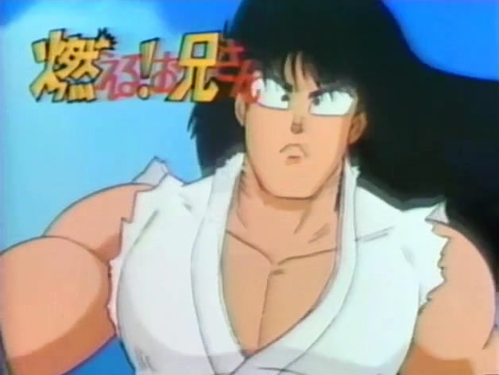
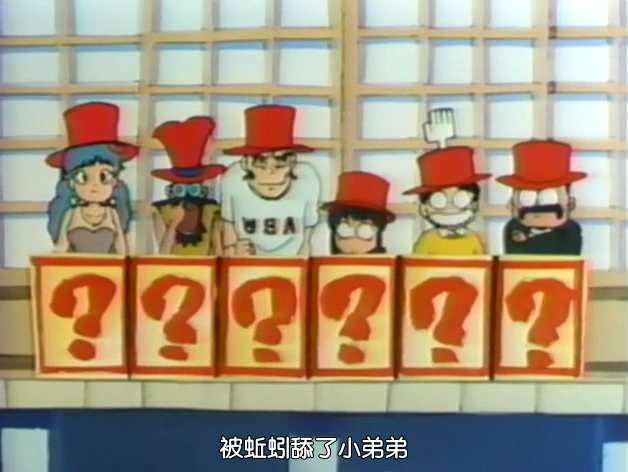
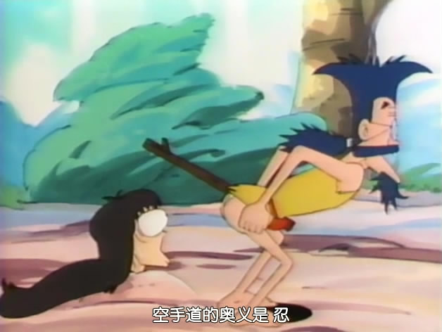
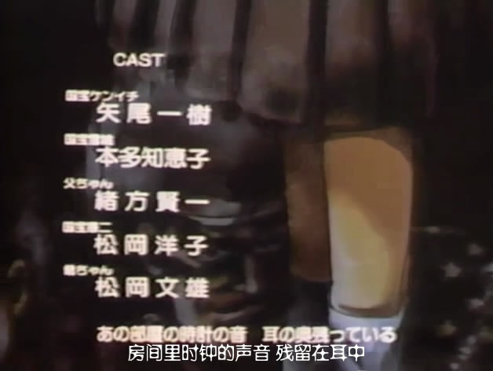
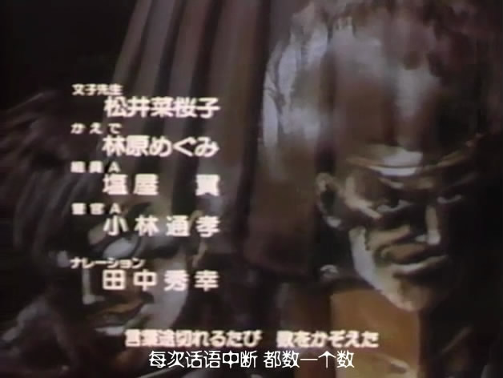
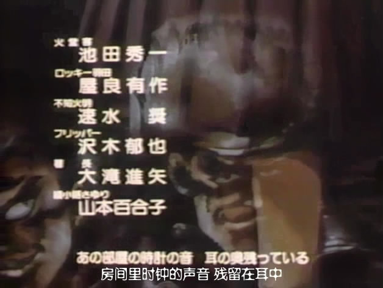

猜到了吗？是《森林好小子》。

二十年过去了，如今回味一下，仍旧是一枝独秀。

对于我来说，算是无厘头的鼻祖吧，比周星驰还要早。
本片的台湾配音国语版堪称经典。尤其是西多的那个小跟班，声音和语气实在太欠扁了！还有洛基出场时的那段“我是云……”的台词。原来并不是刚一出场就有，而是配音组发现后来有而延伸到了每次洛基出场的时候。比较奇怪的是台版的人名翻译，好好的国宝宪一、火堂不用，非要翻译成卡内奇.古哈、西多。最有趣的是龙套不知火，被直接音译成了陈大龙……

而这次重温日文版，发现其卡斯异常强大。
看到了没？看到了没？一页一个超级大能！！

所以，相比之下，担当主角的矢尾一树大叔就显得很憋屈。
之后很久的一段时间里，都没什么太有名的作品。眼瞅着配角们一个一个都比他这个主角还要红。
直到2004、05左右，猛然发现好几部作品里都出现了他那浓重的鼻音（天上天下、军曹），才幡然醒悟：大叔一定是领悟到了，只有变态和更变态才是他的戏路，所以才有了现在的Mr2和弗兰奇吧……

P.S：强烈推荐大叔配的天上天下里的俵文七。