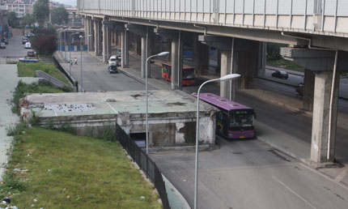
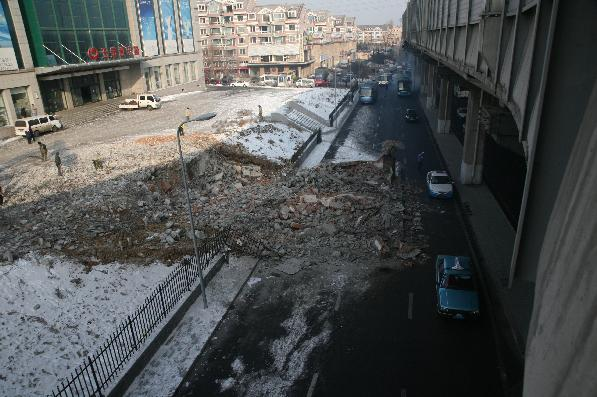

从前有个老红军，后来他死了。

东北路香炉礁立交桥下，有个小房子。是把若干层高的大楼拆掉后，剩下的地上一层的一部分。也就是所谓的钉子户了。
截至1月份，这户钉子已经杵在那两年多了。

谣言版本很具有传奇色彩：说那是解放后政府分给某一参加过长征的老红军的房子。老红军介于牛A跟牛C之间，政府来谈的时候根本不讲条件，就是一个字坚决不搬，说是我打下来的江山给我的奖励你们凭什么动！鉴于或者的老红军实在不多了而且他们可以直接给中央打电话，所以市里就忍了。直到忍到老红军不能再往中央打电话了为止。

1月份的某天，忽然发现房子平了。我就想，老红军可能是死了吧。

其实，从这两张照片的出处([1](https://pewae.com/gaan/aHR0cDovL2hpbGl6aS5jb20vbmV3c25ldy8yMDA5LTA4LzE5L2NvbnRlbnRfMzM4OTgxLmh0bQ==),[2](https://pewae.com/gaan/aHR0cDovL3d3dy5oaWxpemkuY29tL25ld3NuZXcvMjAxMC0wMS8xMS9jb250ZW50XzM2NzczMS5odG0=))就可以得知，其实并没有什么老红军。故事之所以存在是因为现在的人们对拆迁这种行为充满了怨念却又无能为力。并且，“只要他们想拆的，就能拆得掉”成为了一种思维定式，所以这种没拆掉的，必然“上头有人”。

不管到底那个房东有什么背景，我觉得，坚持不搬都是有道理的。虽然这次真的是为了修路，但这并不能成为拿走一个人财产的理由。强买还有个“强”字在里头呢。所以很不喜欢第二篇报道里的导语。什么叫占了两排车道啊？分明是把道修到了人家墙根低下！

所以这房子最终拆了，我的反应是理解+失望。

所以我还是喜欢老红军版本的故事。