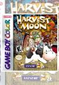

[牧场物语GB2](https://pewae.com/gaan/aHR0cHM6Ly93d3cuZG91YmFuLmNvbS9nYW1lLzI2OTc4Mjg0Lw==)

原名：Harvest Moon GBC 2机种：GBC厂商：Natsume类别：SLG发行年月：1999-08耗时：36

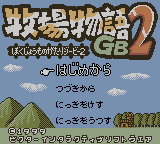
到了H才出现第一个GBC游戏，充分说明了我对彩机的感情没有砖头机来得深。
按理说，GB上的牧场物语系列，论独创性应该推1，论趣味性应该推3。我这里独独推荐2当然是有原因的。
1999年的那个暑假，[汤球球](https://pewae.com/2014/10/older-tang.html)同学把他的GBC处理给了我。同时搭了两盘卡：R-TYPE和DQM。我因为换不起电池，玩的时间并不怎么长。大学开学上沈阳以后，把GBC留给宝宝玩。
10月9日是宝宝生日。我决定买一盘游戏卡送给他。千挑万选之后，选中的就是这盘《牧场物语GB2》，这也是本系列在GBC上的第一作。
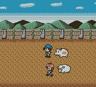

选卡的时候吸引我的是画面。淡彩渲染下的农场，杂乱中透着温馨。简单的描绘把各种动植物塑造得惟妙惟肖。如今这显示器+模拟器下的显示效果，不及无背光液晶下显示效果万一。
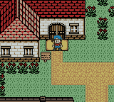
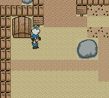

故事的情节被后来的种田流用烂了——主人公继承了家里的农场，村长说三年没起色的话就要强制拍卖。所以身为玩家要在这三年的时间里努力种菜种花喂鸡喂牛喂羊钓鱼锄草砍树盖房子抓虫子，以及跟镇子上的居民们聊天打屁搞好关系。三年后村长会针对你的发展度给予一个整体的评价，来决定你是否还能保留农场。
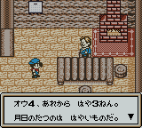

刚上手的时候稍微有些难。尤其是对于那些没玩过1代的人来说。但基本玩过了第一个季节之后就步入正轨。无非是努力种菜种花喂鸡喂牛喂羊钓鱼锄草砍树盖房子抓虫子而已＾＾
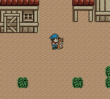
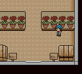

90年代后期正值图鉴热。这种经营类游戏也来凑热闹。游戏里钓鱼有鱼类图鉴，种花有花图鉴，抓虫子有虫子图鉴，再加上事件图鉴，一共4种。个人感觉抓虫图鉴是最容易完成的，一般到第二年夏天就可以搞定。种花要讲一点策略，要跟图书馆MM搞好关系，让她送你特殊花种才能完成。鱼的最难，8号狗鱼出现率极低，也有人说要跟这个公司出的一款钓鱼游戏互动才能完成。反正我玩了两年都没钓到，最后靠修改把图鉴补全了。
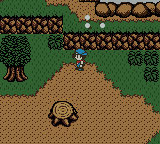

事件是一些穿插在种田过程中的小插曲。比如春天赏花，中秋赏月，赛马，打雪仗什么的。诡异的是你明明只选择了男孩或女孩做主角，可这些图鉴里总是把男女主角放到一起。想到GB那可怜的8位处理器，为了节省空间而这么做也就不难理解了。
下面是部分事件图片：
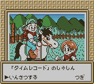
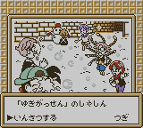
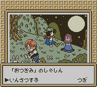
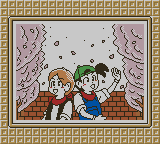

也有一些分男女的事件是没有特殊图片的。比如这个月下泡妞。
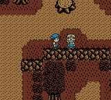
看图片挺扫兴的吧。当年看不懂对话觉得非常非常扫兴。现在能看懂对话了，非常非常非常扫兴！
游戏到大约第二年冬天以后就变得非常非常枯燥。除了小事件带来的小惊喜，每天就是机械化的喂动物种田。重温这个游戏的时候，几次睡着。休闲游戏实在做得太休闲了。

通关的评价是由三年内你盖了几间房子，卖了价值多少钱的农牧产品，家里牛羊鸡的熟练，养死了几个小动物等综合评价得出的。据说有好几个档次，最差的结果是牧场被没收。其实吧，反正评价是什么，你也看不懂……
通关和staff画面。
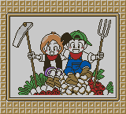
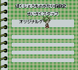

P.S：这应该是在这幢住了23年的房子里最后一次写游戏评论了。