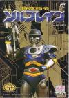

[特救指令](https://pewae.com/gaan/aHR0cHM6Ly93d3cuZG91YmFuLmNvbS9nYW1lLzI2MzY3NTA4Lw==)

原名：特救指令ソルブレイン别名：机械战警3机种：FC厂商：Natsume类别：ACT发行年月：1991-10耗时：8

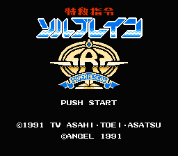
这其实又是一部“有生之年”。对于这个游戏，我也说不好到底应该算玩过还是没玩过。
而且在当年，把它列入有生之年列表的人应该还挺多的——
盗版合集里的“机械战警3”，第二关BOSS永远打不死。而且盗版卡有个按上+SELECT加满血的秘技。于是，恭喜你，一个BOSS可以打到你妈拔插头……
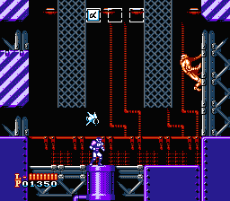

盗版商怎么把这个游戏跟机械战警扯上关系的，早已不可考。无非是想蹭个热度之类的吧。可问题是红白机上的机械战警1和2操作都特别别扭，并不算是十分出彩的游戏啊！反倒是本作有独特的组合枪的设计，在当时的射击过关类游戏中也算是独树一帜的了。写东西前特意去查了一下资料，这个游戏竟然是来自特摄的IP，是系列作品的第10作，而前面的第9作名字里带有“特警”二字。港台地区有自己的译名也未可知。
这日版片头里的造型倒真跟机械战警有几分神似。
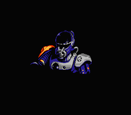

但一上手就知道这个游戏跟机械战警毫无关联了。倒是从美术风格上能看到《赤影战士》的影子。没错，这两个游戏是同一班人马制作的。
NATSUME这个公司也不知道哪里得罪了盗版商，《赤影战士》被叫做水上魂斗罗，《最终任务》被叫做空中魂斗罗，《特救指令》被叫做机械战警3。
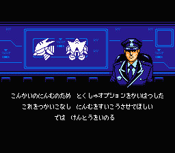
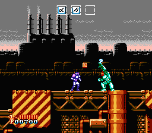

本作的音乐非常出色，既紧张又明快，个人认为比赤影战士还要出彩。作曲是红白机作曲大神水谷郁。音乐跟《鸟人战队》略有些雷同感，可能大师也有江郎才尽的时候吧。
看资料NATSUME的主要成员是从KONAMI跳槽出来的，而水谷郁早年则是矩形波俱乐部的一份子，据说主导了绿色兵团的作曲。这风格跳得可就厉害了。
选关画面也跟鸟人战队很像。这么一想鸟人战队可能只有后面的机器人大战是另写的代码……
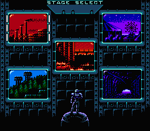
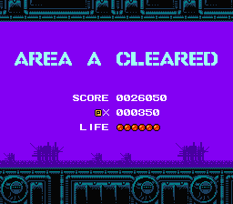

这个游戏当年即使没有无限循环，我也是打不了通关的。对我来说太HARDCORE了，感觉比赤影战士还要难。虽然，赤影战士我也打不到最后一关。
最后一关尤其变态，中间有一段是天花板和地面都有重力的，而上下都设置了碰了掉血的地刺，方向感不好或者版子背不好的，真是被秒杀的份儿。
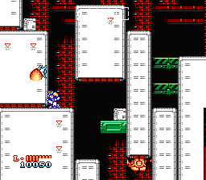

本作最鲜明的特征就是那个辅助射击的系统了，收集αβ两种零件，集满3个就出现一个辅助的机器人，正好是8种不同的方案，虽然其中凑数的比较多。
第二次收集到相同的副枪还能进入变身模式，相当爽。
这副枪的用法跟他们社另一部名作《最终任务》各有千秋，算是不大不小的传承吧。
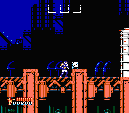
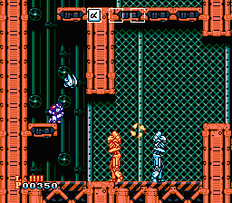

前几关的BOSS也跟赤影战士有些类似，起码人物比例差不多。最难的是AREA E的那个拿刀的，出招太快，感觉比最终BOSS还要难。
最后一关里，AREA A、B、F的BOSS都出现了。紧张坏了，生怕学洛克人把所有BOSS再轮一圈。好在并没有
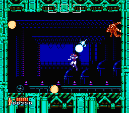
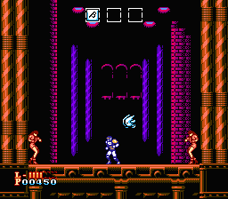
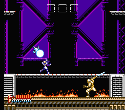
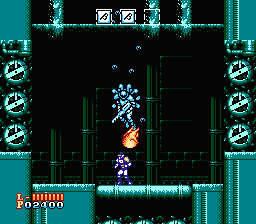
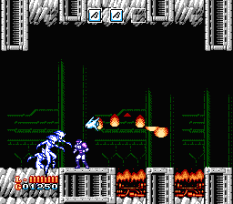

最后的BOSS原来就是AREA A的BOSS穿了层盔甲。除了血长最讨厌的是跟赤影战士一样，边打边毁地面，要是不能快速解决，就得不停地蹦来蹦去了。
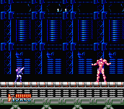
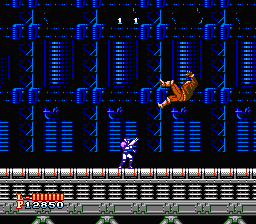

通关！
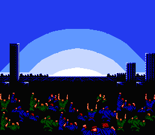
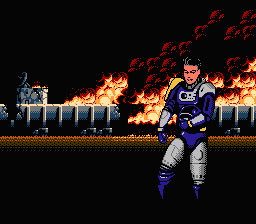
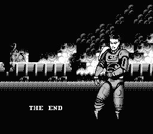