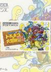

[特鲁尼克大冒险2](https://pewae.com/gaan/aHR0cHM6Ly93d3cuZG91YmFuLmNvbS9nYW1lLzI2MzY4MDg2)

原名：ドラゴンクエストキャラクターズ トルネコの大冒険2 不思議のダンジョン机种：GBA厂商：Chunsoft类别：rougelike / RPG发行年月：2001-12耗时：210

[攻略](https://pewae.com/gaan/aHR0cDovL3dpa2kucGV3YWUuY29tL2Rva3UucGhwP2lkPXdpa2k6Z2JhOiVFNyU4OSVCOSVFOSVCMiU4MSVFNSU4NiU4NSVFNSU4NSU4QiVFNSVBNCVBNyVFNSU4NiU5MiVFOSU5OSVBOTI=)
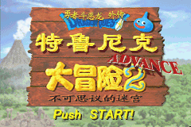

这是一个神往已久的游戏，差不多惦记了有20年。也就是大学期间的某期电软的简略介绍，让我知道了“不可思议迷宫”不光有西林，还有特鲁尼克。但是我同时也知道，不可思议迷宫系列是个超级时间杀手，如果没有足够的空闲，还是不要妄动的好。上次重温[《风来的西林GB~月影村的怪物》](https://pewae.com/2016/03/fuurai_no_siren_gb_tukikagemura_no_kaibutu.html)已经过去8年半了。可以说我是攒了打一场抗战那么多的勇气，才敢再次踏进rougelike这个火坑。
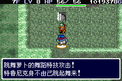

狭义的“不可思议的迷宫”系列指的是CHUNSOFT公司开发的“特鲁尼克大冒险”、“风来的西林”、“口袋妖怪不思议迷宫”、“世界树与不思议的迷宫”这四个系列[[1]](https://pewae.com/2024/11/dragon-quest-tornekos-adventure-2-advance.html#inner_anchor_1)。其中，特鲁尼克1是系列的开山之作，选用了《勇者斗恶龙4》里的商人特鲁尼克作为系列的主角。CHUNSOFT是DQ进入PS时代以前的游戏程序开发公司，特鲁尼克这个形象是从友商艾尼克斯那边借来的，后面的西林才是他们公司自己的IP。
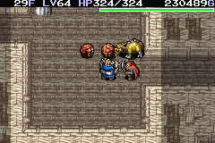

本作是2001年发行的、1999年PS游戏的复刻版。从不可思议的迷宫这个大系列来看，是系列第四作，正好跟我之前玩过的月影村GB挨着。所以两作的主干设定几乎没什么区别，除了人物和怪物形象是非原创的以外。但是DQ系列的怪物其实并不友好，简单说就是不挨一下打很难知道敌人有什么特殊技能，挨了一下之后，又容易跟[《DQM》](https://pewae.com/2018/08/dragon-warrior-monsters.html)搞混，就还是记不住。
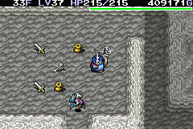

跟月影村相比，本作的优点当然是画面更精美，音乐更动听。其他的就不那么好说了。
最大的缺点是，有点——————简单。具体说来就是最终的大迷宫不够难，到了80层以后就不出现新的难缠的敌人了，你甚至能从容地练到90级以上；而最难的那个迷宫又不够久，只要装备够好，运气不差到同时出现3只黄金史莱姆，也比较容易混过去。单就迷宫本身来说，怪物房间出现的频率实在是太低了，7、8层才出现一次，怎么够嘛！
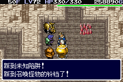

另一个缺点是前戏过长。前6个迷宫都只能算是教学关卡，没什么用处又跳不过去，真真急煞人。
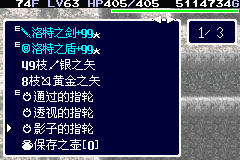

通关后特鲁尼克能转职成战士或者魔法师，说实话不算太好玩。战士玩法固然有很多特技，但特技在一次迷宫中跟剑盾绑定这个设定有点莫名其妙。脑子不太灵光的会陷入“这次该换哪个武器”的自我怀疑中，到后面甚至干脆不装备特技了。而魔法师玩法太虐了。你攻击力不足、血量少、魔法随机这些都能忍，但是踩个机关就掉魔法这个设定实在是太坑了！而且设计了太多魔法无效的怪物，硬骨头太多，咯牙啊。
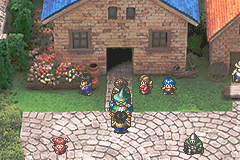

最大的乐趣也是痛点，就是本作有收集要素。之前说过的，我对收集这件事抗性极低，有表可填就要填满。这可把我坑惨了。各种变态的死法、全武器防具合成这种还是小儿科，战士的所有特技和魔法师的所有魔法习得就实在太痛苦了。战士的特技有好多概率极低，我为了刷面包术花了5个小时，为了刷防落穴刷了2天！魔法师的所有魔法里有两三个出现率极低，最后想明白了，在有降级怪物的迷宫里反复遗忘–降级–升级，刷了1天，才刷出来。
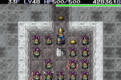

即使是这样，为了达成最后的11级头衔“迷宫之神”，我还是动了修改器，改了冒险回数。我花了200多小时，才下了66次迷宫，想达到1000次，即使是最简单的迷宫，也至少要再刷80个小时。妈的这一个游戏已经够我用最磨叽的打法打三五个RPG了，再来80小时的无聊刷？我去你的吧！
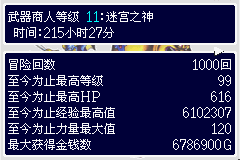
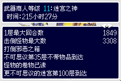
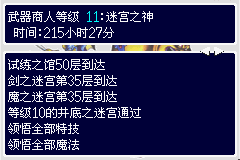
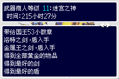
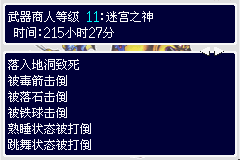
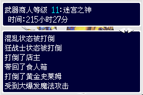
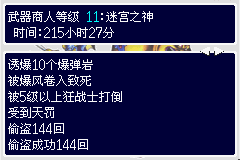

通关。虽然不可思议的迷宫系列的乐趣根本不是通关。

---

- [(1)](https://pewae.com/2024/11/dragon-quest-tornekos-adventure-2-advance.html#inner_ref_1)：陆行鸟迷宫系列版权和开发都是史克威尔，但系列的前两作是CHUNSOFT的社长中村作监督，所以有时也被归类进不可思议迷宫系列中