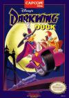

[狡猾飞天德](https://pewae.com/gaan/aHR0cHM6Ly93d3cuZG91YmFuLmNvbS9nYW1lLzIyODA2NDkw)

原名：Darkwing Duck别名：怪鸭历险记 / 唐老鸭机种：FC厂商：卡普空类别：STG发行年月：1992-06耗时：12

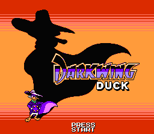
这是个名字难产的游戏。某些合卡里被叫做《怪鸭历险记》，但被八零后所熟知的《Count Duckula》是另一个来自英国的IP，跟迪士尼可以说毫无瓜葛。另一些合卡里也有直接叫做《唐老鸭》的。但是红白机上另有《Donald Duck》和《Duck Tales》(两作)，那才是更正宗的唐老鸭。现在资讯发达了以后，才确定是《狡猾飞天德》这个IP。据说小神龙俱乐部播放过？
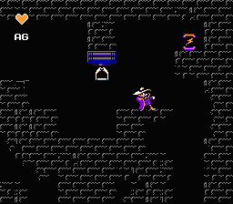

但实际上我玩这个游戏的时候，它可不是上面三个名字中的任何一个。而是白纸蓝字的《洛克人5》。
彼时班里有个很有商业头脑的口水鱼同学，总喜欢倒腾卡带卖我。某日口水鱼塞给我一盘《洛克人5》让我试玩，说玩好了再买。我回家插上没到10分钟，就感觉到这个游戏不真——一个洛克人题材，剧情交代时没出现威利博士，反倒有一堆鸭子，这算怎么回事？玩了半个月之后把卡还给口水鱼，跟他说：“你这卡是假的，我不要。”
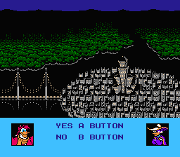

口水鱼当然不太乐意，于是我们就趁一个周末约了趟旧货市场[[1]](https://pewae.com/2022/11/darkwing-duck.html#inner_anchor_1)找游戏机店老板，如果是真的，我就要买下来，如果是假的，他送我一盘《影子传说》。
我们没跟那老板说要鉴定自己的卡的真假，而是直接问他买《洛克人5》。老板很和气，说：“洛克人5有两个版本，真的比假的贵20块钱。假的是别的游戏改的，很好认，因为所有的洛克人不管几代，一出来都是小蓝人。假的一出来是个小黄人。”
我赢了。之前我真不知道《影子传说》这样的游戏也能出盗版单卡。
也就是说，当年我其实并没有玩过这个游戏的真身，而是玩了一个用洛克人替换飞天德的“换头游戏”。上次 @石樱灯笼说起换头游戏，我第一时间就想到了它。
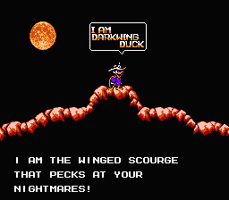

这个游戏跟真正的洛克人5的确身出同门，据说用的是同一引擎，玩法也确实比较像。有血槽，有普通子弹和特殊子弹，跳跃的手感也很接近。唯一的不同是跟洛克人相比，飞天德多了一招“挂墙”。
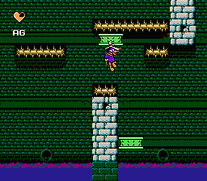

其实还有一招，按住上的时候飞天德有一个把斗篷挡在身前的耍帅动作，这时可以挡一些飞行道具。当年玩的洛克人版根本没优化这个动作，我也照样打通关了，可见这招有多没用。
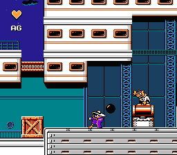

难度还凑合。除了少数地形杀以外，都可以用洛克人系列的无限刷怪打道具的特点把血和特殊子弹补满。特殊子弹的种类比较少，用途也不广泛，一般情况直接用普通的豆豆枪都能解决。
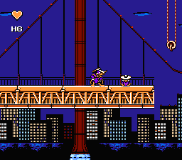

有特色的敌人不多。印象最深的是一种把龟壳甩出来打人的乌龟，还挺搞笑的。
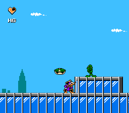

另外某关的BOSS简直跟松鼠大战2一毛一样。联系到上一次的聪明与笨伯2，我有一个大胆的想法，会不会松鼠大战2才是抄袭糊弄的那个？
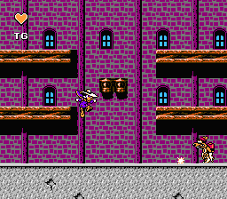

其余的每关BOSS们。
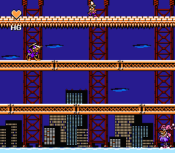
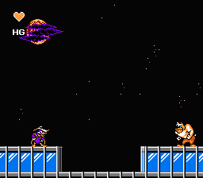
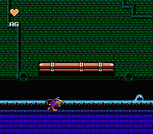
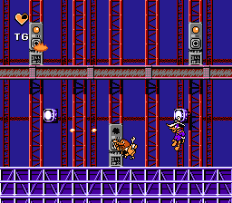
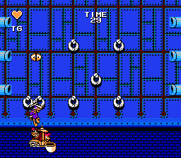

最终BOSS是一只鸡，前半段在右上角的主控室里猫着，不太好打。用特殊枪把它打下来之后就不堪一击。
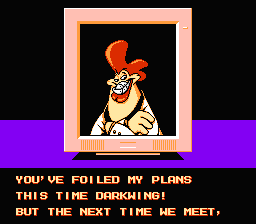
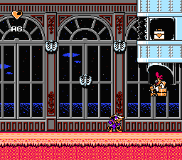

通关！
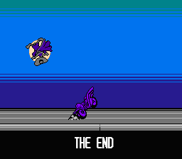

---

- [(1)](https://pewae.com/2022/11/darkwing-duck.html#inner_ref_1)：当时有三家比较大的游戏机商贩。