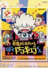

[王子外传GB](https://pewae.com/gaan/aHR0cHM6Ly93d3cuZ2lhbnRib21iLmNvbS9raWQtZHJhY3VsYS8zMDMwLTE5MTMv)

原名：悪魔城すぺしゃる ぼくドラキュラくん别名：恶魔城外传——德拉古拉君机种：GB厂商：科乐美类别：ACT发行年月：1993-01耗时：5

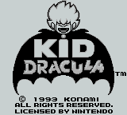
首先，王子外传并不是个正经名字，正经翻译是括号里的那个。但小时候玩的盗版卡上印的都是王子外传。

90年的时候，KONAMI在红白机上出了这款游戏的第一作。不知什么原因，只有日版而没有发行美版。所以等到93年GB上的本作发布的时候，欧美玩家对本作给予了极高的评价，纷纷表示这游戏太好玩了。其实FC上的一代也同样好玩，只能说，支持正版吧。
本作名义上是续作，但实际上系统跟FC差别不大，关卡也有雷同的感觉。我之所以在GB时代才介绍这个游戏的原因是GB版比FC简单：FC我连第三关都过不去，GB可以打到第五关。
同样是动作游戏大家，KONAMI对GB的掌控比CAPCOM好得多。单以画面来比较，恶魔城外传比魔界村外传来得干净得多。
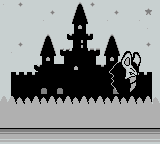

因为是外传，KONAMI骨子里的恶搞基因又开始发挥作用，所有的敌人形象都变得很Q，故事的结局也令人哭笑不得。恶魔城里常见的敌人好多以另外的形象示人。
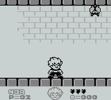
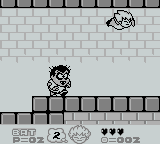
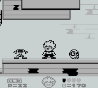

开篇。熊孩子少年德拉古拉在外面愉快地瞎折腾，听到老爹要抓他回去的消息，懵逼了。用4级灰度、160线的画面能表现出如此细致的表情，送美工一个大写的服。
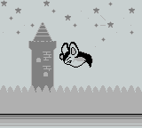
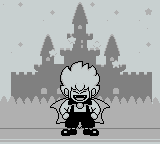
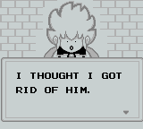

前四关都是在讲德拉古拉如何在外面胡作非为，欺负手下啥的。每过一关都会获得n个能力，比如散弹啊炸弹啊跳天花板啊能挡子弹的雨伞啊之类。过关的时候还可以通过小游戏买命。
本作的特色之一是每个BOSS都有一次变身。比如第一关，打了小的来了老的。
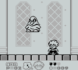
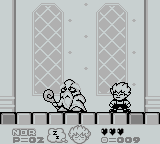
第二关BOSS斧头男，二次变身是放子弹的。
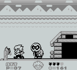
第三关打一只鸡。打死之后掉下一只蛋。千万不要下意识地去捡那个蛋，那是BOSS的二次变身。
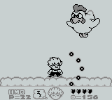
第四关是恶魔城系列的老熟人。一如既往地难缠。变身之后的机器人注意躲好就挺容易打。
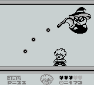

第四关之后，德古拉就收集齐了全部的武器。这时前代被打倒的BOSS出来跳反，德古拉决定向对方的城堡进军，再收拾他一次。
看这BOSS长得像不像尼多王？也不知KONAMI有没有告过老任。
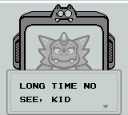
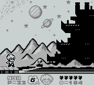

接下来他就出场了。对付他非常简单，这家伙怕炸弹，打死之后果然有后续，就说科纳米的游戏就没有出现过奇数关卡的情况嘛！
年轻时我为啥只能打到第五关咧？第五关开头连续往上蹦的地方过不去啊！！要不是即时存档依旧过不去。
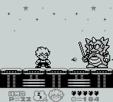
原来第五关打的其实不是BOSS的真身，而是个画皮外星人。所以还有第六关。这关开头的火海一下就让人想到沙罗曼蛇。BOSS除了血长就没别的特长了，二次变身是最弱的一个。
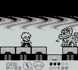
第七关的BOSS是最讨厌的。因为只能用炸弹间接地炸。长按接跳跃的操作累手啊！
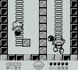
最终关一上来是个“是男人就下100层”的场景，接着又是传送带往上送的场景。BOSS战之前的一小段路非常难，前有追兵后有堵截，唯一通过的办法是把伞打开……
最后的BOSS，怎么看怎么像弗丽萨跟短笛交配的生下来的，我表示还是尼多王的形象好看一点。抓住规律趁张嘴的时候扔炸弹，挺好打的。
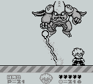

通关。所谓的有趣的故事，是值管家并没有表扬小德古拉打败坏蛋的行为，而是在关心他有没有弄坏家传的宝伞。
其实，无论是当年还是现在，有几个人会关心动作游戏的故事情节呢？
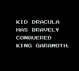
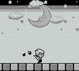
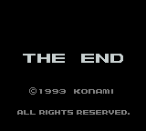