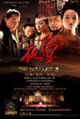

[夜宴](https://pewae.com/gaan/aHR0cHM6Ly9tb3ZpZS5kb3ViYW4uY29tL3N1YmplY3QvMTQxODYwNS8=)

导演：冯小刚主演：刘燕斌 / 吴彦祖 / 周中和 / 周迅 / 徐熙颜 / 曾秋生 / 章子怡 / 葛优 / 郑春雨 / 项斌类型：剧情 / 动作 / 古装 / 武侠地区：大陆 / 香港首映时间：2006

虽然之前恶评如潮，但是俺还是抱着对冯导的迷信，看了《夜宴》。

应该说，冯导这个烂片，实在是还没有烂透。章子怡小姐的演出应该说是很到位的。
可是，问题是，其他人，演得太烂了：吴彦祖处处在装酷，完全跟片子脱节；周迅完全没有发挥；葛优倒是演得很有当年刁世贵的感觉。

编剧很恶心。网上骂得完全不够。半文不白的台词听起来怪怪的。香港人不笑场那是因为他们根本没听懂。最恶心的其实是剧情的硬伤。就只说说俺自己看出来的问题。
1、羽林军的杀手杀王子失败的时候，自杀用的是明晃晃的钢刀；到了王子带剑进宫的时候，竟然拿了把青铜的越女剑！难道他是古董爱好者？章假惺惺的说什么“最宜近身格斗”时，笑喷了。
2、那个前任幽州节度使根本是在侮辱别人的智商！节度使唉，有兵权的说！他要真想忠于王室，就应该派兵勤王，要么就应该依附帝王攫取利益，就算他吃饱了撑的当面谤君，就一点准备也没有？另一个方面厉帝根本疯了才会登基几天就击杀这种有兵权的人。新节度史阴损也有BUG，接任才不到100天就敢起兵谋反？？
3、让我们看看五代十国的地图。在这个战乱频仍的年代，王子能跑到吴国去学什么舞蹈？还动不动就发配岭南，岭南和幽州什么时候同时归您老人家管过！！还有什么流放3000里，一共才多大点地方，直接说驱逐出境就完了呗！
4、太常什么时候成三公了？？九卿，九卿，九卿！
5、诛九族才跪了不到20个人，诛三族的时候是不是就只剩5个人了啊？？

最最最难以忍受的问题是：片子的节奏太拖沓了，很多莫名其妙的剧情，什么杀人啊跳舞啊之类，根本不知所云！杖杀那个老头那段既残忍血腥又毫无必要，把片子的节奏祸害得一塌糊涂。难道冯导是为了对得起广大观众的票价故意加了料？

最后的那碗翡翠汤，逗留在画面的时间太长了，俺都忍不住去找切歌键了……

==== Update 14.10.6 ====
话说早了。应该是珍爱生命，远离国产片。