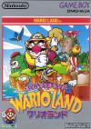

[超级马里奥大陆3：瓦里奥大陆](https://pewae.com/gaan/aHR0cHM6Ly93d3cuZG91YmFuLmNvbS9nYW1lLzI2MzkyMTI2Lw==)

原名：スーパーマリオランド3 ワリオランド机种：GB厂商：任天堂类别：ACT发行年月：1994-01耗时：120

这个游戏是我非常喜欢的，GB动作游戏中百玩不厌的殿堂级游戏。
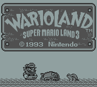
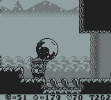

瓦里奥最初是在GB的马里奥大陆2上诞生的，作为反派出现。GB的马里奥2副标题角6个金币，也是一款非常精彩的游戏。
后来设计者觉得瓦里奥这个反派角色干的不错，就以他为主角制作了GB上的马里奥大陆3。这也是本作完整标题《瓦里奥大陆——超级马里奥大陆3》的由来。
瓦里奥凭借本作一飞冲天，正式成为了任氏招牌角色之一，后面GBC时代的瓦里奥2和3，就彻底跟马里奥断绝关系了。
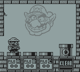
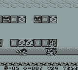

故事是从六个金币的结束开始的，瓦里奥被打败之后，划个小破筏子来到了一个岛上……
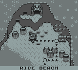

瓦里奥在这个岛上的任务只有一个，那就是疯狂地捞金币——当然这只是玩家的乐趣之一。
过关之后有两个小游戏，一个是拽水桶赌博，能增加钱，另一个是扔手雷加红心（命）。
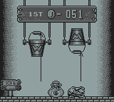
一般来说，过关需要花10个金币买路，挺肉疼的。
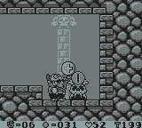
跟命比起来，显然是钱更重要。我几乎从来不去玩炸命的小游戏。
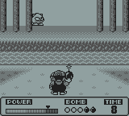
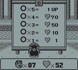
至于某些关卡能用特殊的敌人和地形增加收入的，更是轻车熟路。这种特殊敌人在游戏里共有三种。
第一是某些关会出现睡觉的母鸡。把敌人扔到母鸡后背上，母鸡会下出来三个金币；
第二中是天上有雷云的关，引雷把敌人劈死，敌人会变成10金币；
第三种就是有断头台机关的地方，把敌人扔到下面，断头台会把敌人砸成10金币。
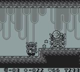

对于玩家来说，瓦里奥这个游戏的难度并不大，甚至后来的2代3代都不难。有趣的是对宝物的搜集和对隐藏地形的探索。
当然老任还算厚道，有的地方是给了明确的提示的。比如这里有隐藏关，明摆着用金币给画了个箭头提示。
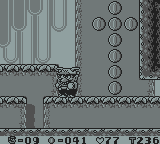
而且老任在设置隐藏的时候完全没有为难的意思，在地图上，有隐藏路线的关卡都画了两层圆圈。
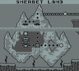

秘宝的两大要素是钥匙和门，看到其中的一样就要想办法去找另一样了。
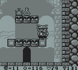
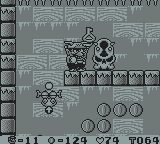

当年一直找不到的一个秘宝，其实是利用了心理误区，只要往黑乎乎的地方再走一段就豁然开朗了……
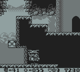

头回玩这个游戏是在97年春天，第一波通关真是如履薄冰，最后神灯给造了个鸟窝还给美得不行。
后来不久，电软出的《97秘技宝典》上就登出来了超级秘技，才把所有的精力放到了隐藏要素上。
这个秘技至今扔熟烂于胸：
游戏中按下暂停，连续按16次选择键，画面下方会出现一个小框，按住B+左右能移动小框，小框移动到红心、金币、时间、命上都可以用上下调整里面的数字。按住A和B按左，能把小框移到瓦里奥头像上，解除暂停，瓦里奥会变装。顺序是：小瓦里奥-›普通瓦里奥-›牛角瓦里奥-›飞行瓦里奥-›喷火瓦里奥-›小瓦里奥。
本人最喜欢用的还是飞行瓦里奥。
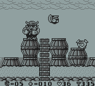

利用敌人这回事，是后面二代和三代的特色。其实在一代的时候已经出现端倪，比如这种需要利用敌人扔出的匕首往高处蹦。
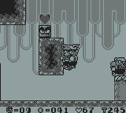

小BOSS时间多说几句。
第一关的BOSS是马里奥系列的熟人，可我总记不住名字。
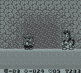
第二关也是毫无难度，白给的一样。
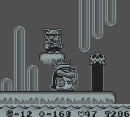
隐藏的第三世界没有BOSS，第四关的牛头，倒是不难打，但讨厌的是要把它顶到擂台下面去。第一次玩的时候完全不知道，楞是菜鸡互啄耗到了timeout。
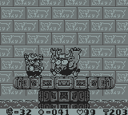
第五关开始稍微有些难了。第五关要在一定时间内搞定，不然BOSS会把脚下扎个乱七八糟。有的人会对这个BOSS感到不适，因为要抓住它喷出来的鼻屎砸回去才行。
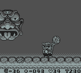
第六关的鸟，不留神会被吹飞。
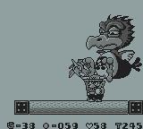
第七关的幽灵，非常讨厌，碰到会让你麻痹，然后被它放的小弟扎死，第一次通关时完全是拿命填撞大运过的。
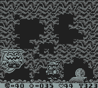

最终ＢＯＳＳ在一城堡里，是个拥有神灯的女人（茉莉公主？），打败神灯怪就可以通关了。
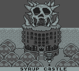
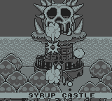
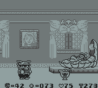
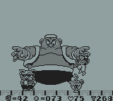
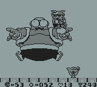

你以为打败BOSS就完了？不不，游戏才刚刚开始。把秘宝收集满了才是正经事。
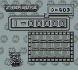
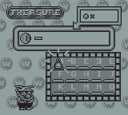

打完BOSS以后，地图上有秘宝未获得的关都会发光，诱惑你去拿。
为什么要拿秘宝呢？这要从通关故事说起了。
瓦里奥抢了神灯。
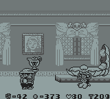
茉莉公主一气之下扔了个大炸弹，把城堡炸了。
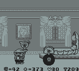
里面露出一座金光闪闪的碧奇公主雕像来。还没等瓦里奥高兴，邪恶的马里奥开着直升飞机把雕像弄走了。（磁铁，估计是个铸铁镀金件）。
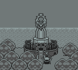
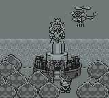
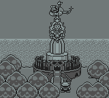
瓦里奥悻悻地擦了擦神灯，我了个去，神灯怪出现了！它说：“我能满足你一个愿望。”
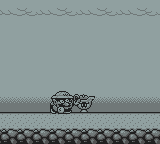
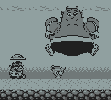
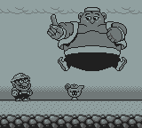
瓦里奥说：“我要一所大房子，有很大的落地窗户，阳光洒在地板上，也温暖了我的被子……”
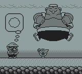
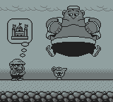
神灯怪说：“房地产成本很高的，你得出钱啊！”
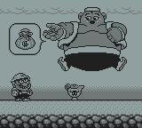
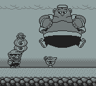

然后呢，获得什么样的通关结局，就看你之前打到了多少钱了。那么秘宝的意义是什么呢？一个秘宝跟井盖一样，值好几千块啊！
根据金币数量的不同，一共有6个结局。我打的时候不小心手欠先打了两个秘宝，后悔已经晚了，所以并没有打到最砢碜的结局。
下面截图的房屋装逼程度，跟打到的金币成正比。
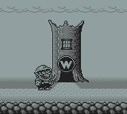
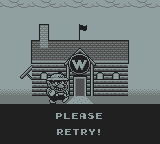
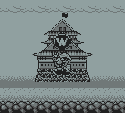
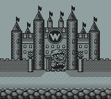

集齐15个秘宝，再打到1万块，就能见到真正的结局了。
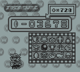
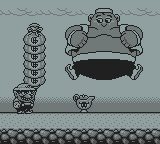
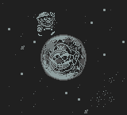
