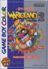

[瓦里奥大陆2：被盗的财宝](https://pewae.com/gaan/aHR0cHM6Ly93d3cuZG91YmFuLmNvbS9nYW1lLzE5OTQ4MzA5)

原名：ワリオランド2 盗まれた財宝 / Wario Land 2 别名：瓦力欧大陆2 / 瓦力欧乐园2机种：GBC厂商：任天堂类别：ACT发行年月：1998-10耗时：55

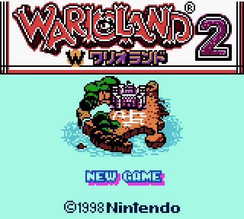
在我的游戏生涯里，这是款命运多舛的倒霉蛋。这个游戏的通~~过~~关画面，我已经等了快25年。
1999年从汤球球手里盘来二手GBC的时候，他打包给了我两盘卡：《[R-TYPE](https://pewae.com/2017/12/r-type-dx.html)》、和《[勇者斗恶龙怪兽篇](https://pewae.com/2018/08/dragon-warrior-monsters.html)》。不久之后我又自己买了两盘，正是本作《瓦里奥大陆2》和《口袋妖怪银》。
大部分时间在玩银了，但本作也没少玩。不幸的是，GBC和这4盘卡不久之后就丢了。丢的时候打了十几关吧。
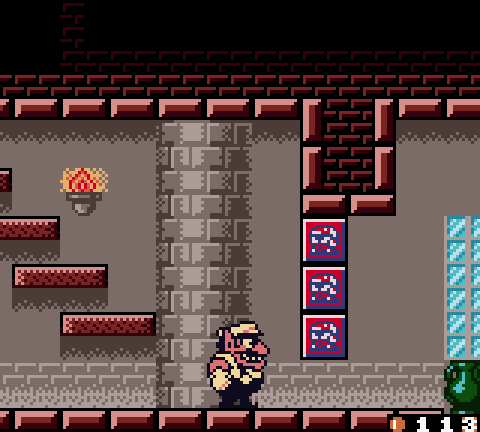

实机丢了，就在模拟器上找回来。2001年的GBC模拟器已经相当成熟，作为GBC首发游戏的本作当然不在话下。
又打了20多关，不幸的事情又发生了，寝室的PC，硬盘挂了，啥都不剩。于是心灰意冷，这一扔下，20多年就过去了。
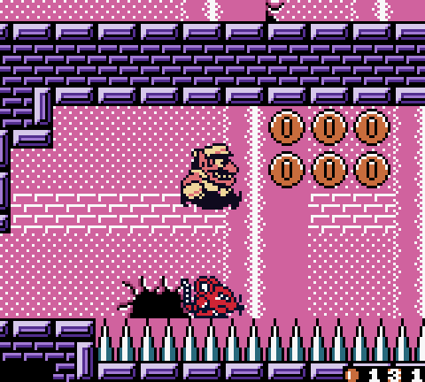

有实体卡的时候，因为资讯的不完全，担心一旦错过关卡中的秘宝和关卡末的拼图之后没有后悔的机会，故而玩得叫一个步步为营，每关拿不到秘宝和拼图就立刻软重启。
实际上我是被没有选关这件事吓到了。这一作有5大结局。只要打到任意一个结局，就可以像一代一样开启选关画面，一次一次地陷入刷金币和秘宝的桎梏之中。
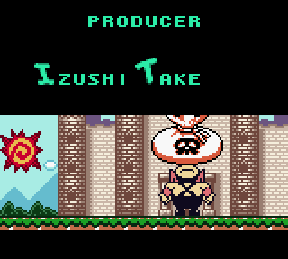

本作故事承袭前作，说的是瓦里奥盖好了城堡之后，每天宅在城里呼呼大睡。结果某日遭了贼，前作的BOSS，长得像茉莉公主的那个女人带了三个枪栗，把瓦里奥的钱给偷了。瓦里奥睡醒后勃然大怒，奋起追回财产。
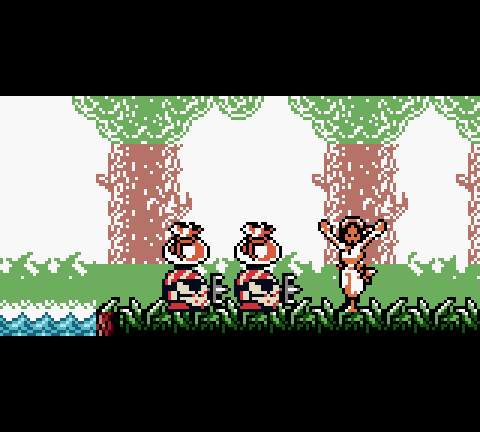

本作的秘宝固定成了“神经衰弱”小游戏，而金币的左右也变成了开启隐藏关和过关后换取刷碎片的机会。于是在可以任意使用SL大法的模拟器上，过关变成了简单的找秘宝和隐藏分支，前作中拼老命挣钱为了达成完美结局的动力不复存在。不使用SL大法？臣妾做不到啊！
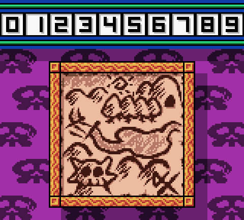

窃以为本作的耐玩性是不如一代的。虽然瓦里奥有多种新变身以及不死之身，但“变身不能出门”这一特点，使得变身的乐趣大大降低。有变身的场景，唯一要判断的就是要利用变身找隐藏门还是个干扰条件。而限于GBC的机能限制，场景不可能很大，所以变身的谜题设计也就只能流于表面表面了。
唯一眼前一亮的“变身”是“金币钓人”，第一次遇见的时候不由得大呼我艹。
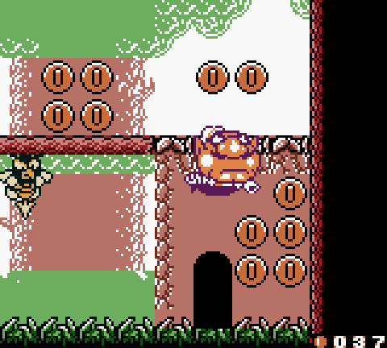
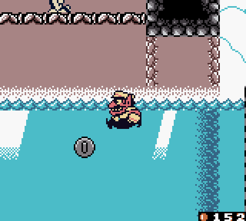
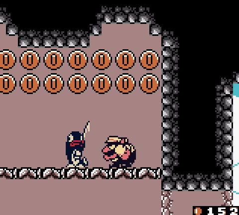

BOSS有些敷衍，一小半的BOSS沿用前作，还有一百倍枪栗出现了多次，颇有些缺钱的感觉。
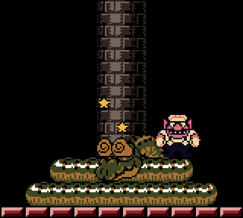
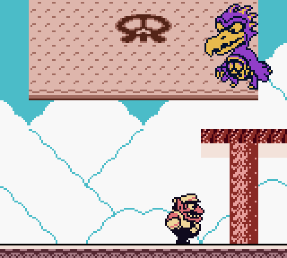
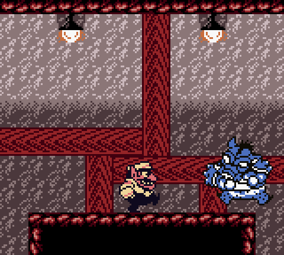
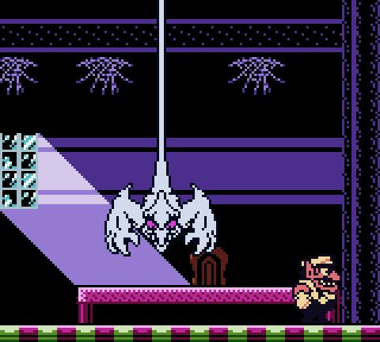

隐藏门的设置也比较单调，大部分是通关开关改变地形达成。而秘宝的数量虽然从15个增加到了50个，却鲜有留下深刻印象的谜题。
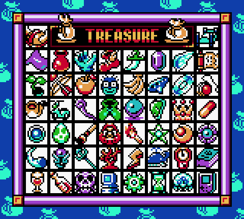

5大分支剧情也差不多。不过是在不同的场景追上金币小偷，把钱抢回来而已。5个BOSS特色也不很鲜明。
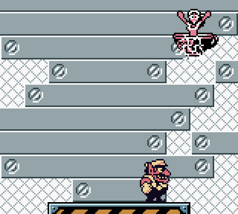
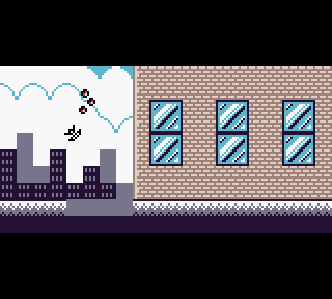
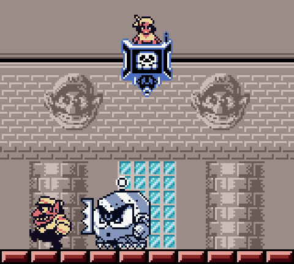
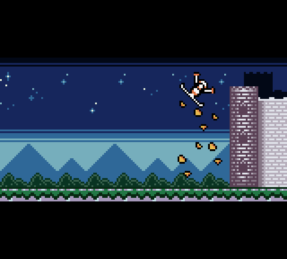
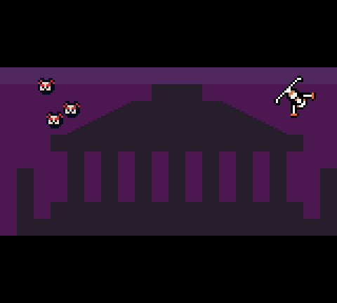
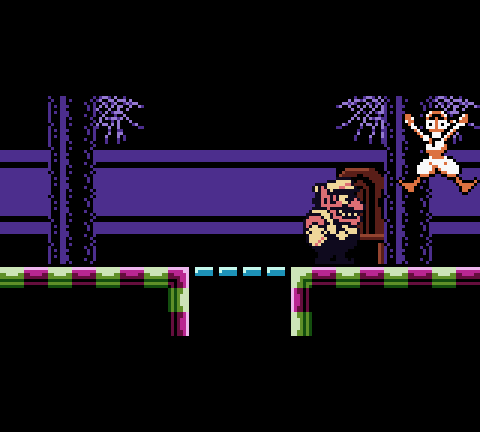
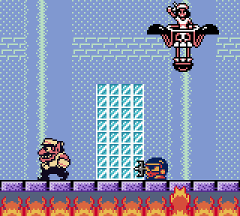
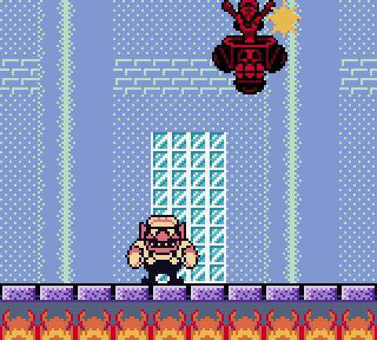

倒是城堡内分支路线的进入方法有点脑洞：游戏开始的时候瓦里奥听到闹钟响之后，只要不起床（不按任何按键），就可以进入隐藏分支了。
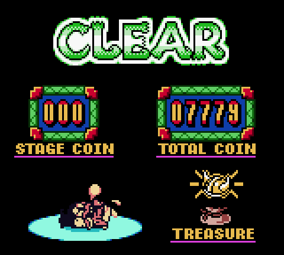

每种结局的通关画面都差不多。收集全部秘宝和地图碎片后倒是会出现一个非常俗烂的特殊画面。
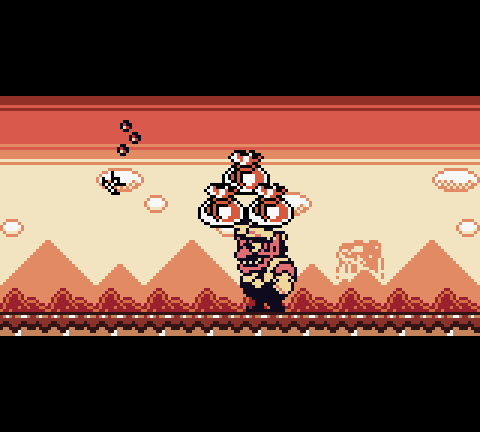

5大结局都看完之后，会出现最终的隐藏关。
隐藏的最后一关，是我最讨厌的类型。是容错率很低的动作极限操作。包括变态的加速后下蹲，变态的加速后高挑，变态的跳起后拉右立刻拉左，变态的踩敌人高跳。其中有个连踩敌人9次才能跳过去的大坑，我可是足足跳了三个小时，左手拇指都快脱臼了。
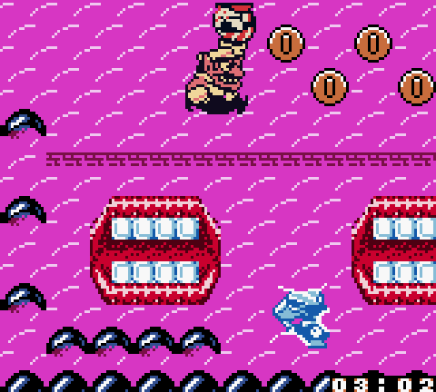
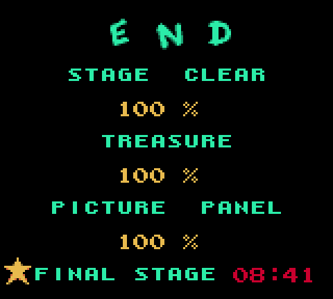