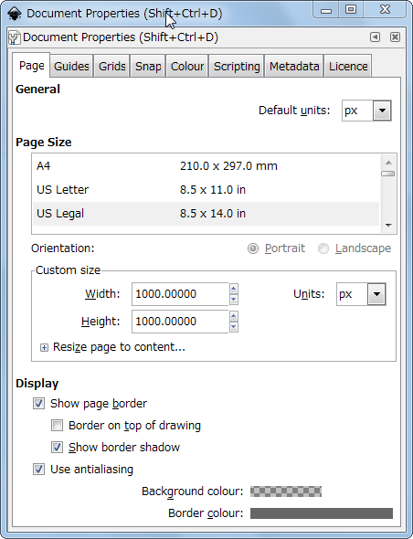
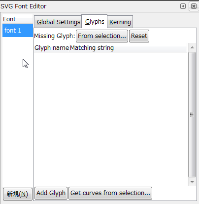
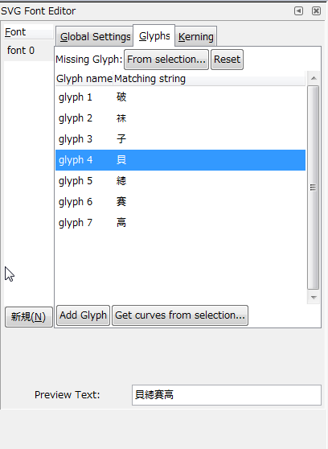
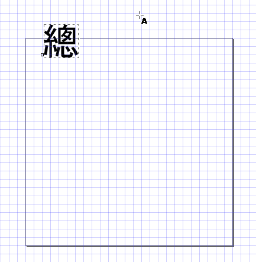

这项研究是制作新主题的副产品。

中文字体是咱玩博客的心中的痛，谷歌字体唯一的用途是拖慢网站速度，另外的在线字体服务要么收费要么不稳定，上传ttf字体的话动辄几M，真要用了会被访问者骂死。所以在标题、侧边栏等有限的地方，把少数的几个十几个字做成自己定义的字体就是一种比较好的办法。
其实这方面的教程不少，但多数是基于PhotoShop的，那玩意儿收费啊！
用Inkscape的就只找到一份，可惜语焉不详，我捣鼓了好半天才在某日文网站上找到使用方法，一点点试出来。所以写这份东西给自己做个备份。下面开始：
**〇、安装字体**
这不是一份自己画字的教程，所以想用什么字体还需要你安装到c:\window\fonts\下。注意字体的版权，你要是侵权被告了可别来找我麻烦。弄完了记得把字体删了，字体比较消耗系统资源且没卵用。
**一、用Inkscape制作svg字体。**
svg字体是一种矢量字体，其本质是一张矢量图。现在广泛应用的FontAwesome啊Iconfont啊其实都是把小图片做成了字体。其实这玩意咱也可以自己做。
Inkscape是一款遵循GPL发布的矢量图片编辑软件，而且有直接编辑svg字体的功能，所以跟PS比，一来没有道德负担，二来步骤可能更简单。
因为单位是日文系统，所以我用的是英文菜单，中文版对应应该也不难。我使用的是Inkscape 0.91。
1.1调整画布大小
File->Document Properties，把可页面设成1000*1000px。其实这一步不是必须的，矢量轨迹获取的时候是无所谓大小的，但设大一点会方便一点。做中文字体的时候最好把页面设成正方形。

1.2显示网格
View->Page Grid，显示网格。这一步也不是必须的，建议显示。
1.3编辑字体
1.3.1调出菜单
Text->SVG Font Editor
1.3.2创建一个字体
点击【New】按钮，建立一个font1

1.3.3添加符号
切换到Glyphs选项卡，点击【Add Glyphs】按钮，增加若干个文字符号。想做几个字，就增加几个条目。我这次要做的文字是“貝總賽高”，那么加四个字就可以了。依次在Matching String里添加“貝、總、賽、高”这几个字。这么做的意思是告诉字体，你加的字符对应的汉字是什么。一一对应就好了。
在preview里添加上你想预览的文字，那么随着你编一个字，就会出现一个字的效果。

1.3.4画字
1.3.4.1
点击左边工具栏的字母“A”，然后在网格编辑区域鼠标左键点击一下，会出现一个闪烁的光标。切换成中文输入法，输入对应的文字。

1.3.4.2
点击左上角的字体下拉列表，选择你想用的字体。
1.3.4.3
点击左边工具栏的黑色箭头，拖动刚才输入的字。点击字四周的箭头，缩放到合适大小。注意边框，出界的就显示不出来了！

1.3.4.4
点击左侧工具栏里的path工具（第二个），然后在字体上点一下。
点击Path->object to path，然后在黑色的部分双击。这时会出现自动做成的路径。这个路径可以拖动修改，但以咱的水平还是不改了吧。

1.3.4.5
选中SVG Font Editor里对应的字，点【Get Curves From Selection】按钮。设置了预览文字的话，看到字就算作成了。
1.3.4.6
点击左边工具栏的黑色箭头，选中字后把它删掉，然后重复上面的步骤，添加好每一个字。
1.4保存
每个字都画完并保存路径后，就可以点保存，存成你想要的名字。比如我这个字体的名字是bugest.svg。

**二、利用网络工具生成网络字体**
这种网站很多，我选择[https://www.font-converter.net/](https://pewae.com/gaan/aHR0cHM6Ly93d3cuZm9udC1jb252ZXJ0ZXIubmV0Lw==)
2.1
字体种类部分，把eot，svg，ttf，woff，woff2都选上。其中svg用自己这一份也行，不过网上生成的能稍微小一点。
2.2
点击【SELECT FONTS】，弹出的界面里选中本地的bugest.svg文件。Done。
2.3
下载，解压缩后把所有字体文件名都改为bugest。

**三、把字体加到wordpress中。**
3.1
在主题下建立一个fonts文件夹，把同名不同后缀的五种字体都放到这个文件夹下。
3.2
修改css

```
@font-face{
font-family:'bugest';	/*自定义字体名字*/
src: url('./fonts/bugest.eot');	/*IE9.0+*/
src: url('./fonts/bugest.eot?#iefix') format('embedded-opentype'),/*IE6-8*/
url('./fonts/bugest.woff2') format('woff2'),/*???*/
url('./fonts/bugest.woff?') format('woff'),/*大多数*/
url('./fonts/bugest.ttf') format('truetype'), /*Safari, Android, iOS*/
url('./fonts/bugest.svg') format('svg'); /*少数浏览器*/
font-weight: normal;
font-style: normal;
}

.site-description{		/*要修改的属性*/
font-family:bugest; /*自定义的字体名*/
}
```

3.3
最终效果
