## 摘要

年度佳作：《太阳之下》、《浊水漂流》、《乡村里的中国》、《假如我是真的》、《被嫌弃的松子的一生》、《那山那人那狗》、《完美的日子》、《教父》、《走走停停》
年度抵制：《发财联盟》、《月光武士》、《非诚勿扰3》、《自由》、《扫黑行动》、《逆鳞》、《黑火》、《巫术面具》、《黑暗之屋》
年度惊喜：《飞驰人生2》、《轻松+愉快》
年度失望：《年会不能停！》、《夜色撩人》、《中国机长》、《燃情岁月》、《自画像》、《神偷奶爸4》、《九龙城寨之围城》、《天狗》
年度特别推荐：《乡村里的中国》

年度最佳导演：《走走停停》龙飞
年度最佳剧本：《假如我是真的》沙叶新、李守诚、姚明德
年度最佳男主角：《东京奏鸣曲》香川照之（饰佐佐木隆平）
年度最佳女主角：《歌厅》丽莎·明奈利（饰莎莉）
年度最佳男配角：《浊水漂流》谢君豪（饰老爷）、《教父》詹姆斯·肯恩（饰山米·柯里昂）
年度最佳女配角：《浊水漂流》李丽珍（饰陈妹）
年度最佳音乐：《教父》
年度最佳画面：《教父》
年度最佳续集或翻拍：《飞驰人生2》
年度最佳网大：《兴安岭猎人传说》
年度最佳镜头：《涉过愤怒的海》梦境中被吊死的黄渤。
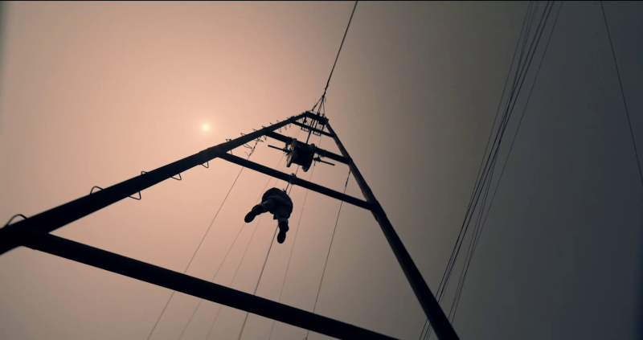

年度最差导演：《月光武士》虹影
年度最差剧本：《非诚勿扰3》冯小刚、张耀之
年度最差男主角：《热烈》王一博（饰陈烁）
年度最差女主角：《没有一顿火锅解决不了的事》杨幂（饰幺鸡）
年度最差男配角：《好像也没那么热血沸腾》王子异（饰林栋）
年度最差女配角：《姨妈的后现代生活》赵薇（饰刘大凡）
年度最差续集或翻拍：《功夫熊猫4》

## 总结

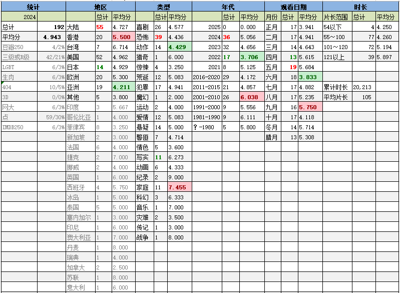
甲辰年是平年，全年353天。
今年观影192部，比癸卯年（去年）少了25部，减少11.5%。比壬寅年（前年）少了1部。考虑到闰年因素，这三年的刷片频率非常稳定，继续保持。并没有达成降量到185部的目标，毕竟还是受到了奥运会pee time的影响。乙巳年虽然没有大比赛，但闰六月，目标210部吧。

平均分4.94，比去年降了0.06，基本等于前年与去年之间的中间值，这三年的整体差距很小，比再往前三年的评价大为降低，可能跟疫情之后电影行业整体的摆烂有关。
从月份分布上看，全年都比较平均，最多的五月19部。应该是端午小长假跟“七一”前集中销有薪假共同作用的结果。奥运会期间的观影体验是最差的，连4分都不到，也是见鬼。

今年有1部满分作品。伟大的《教父》，无需赘述。
今年另有7部9分作品。
其中我评价最高的是（伪）纪录片《乡村里的中国》，虽然仍旧有些假，但已经很真了。我真正在意的并不是主角那个光说不练的主角小老头，或者夸夸其谈的村支书，而是镜头周边的乡村里的日常。对我来说，这些都很新鲜。今年的特别推荐的理由也正源于此。
其次是名作《那山那人那狗》，确实不负盛名。整片巴适得很，迄今为止看过最好的国产~~公~~山路片，只是邮资跟片头字幕的冲突有些恶心。
然后是2024的新片《走走停停》，片中幽默和煽情的比例刚好卡在我的舒适区，而且有精彩的结局。
接下来的《太阳之下》、《假如我是真的》，都是反映社会主义幸福生活的。
《完美的日子》是典型的日式温馨日常，拍得毫无问题，只是看多了稍微有些审美疲劳。
《被嫌弃的松子的一生》也不提了。

烂片方面，刨除网大后有3部0分作品：《自由》、《月光武士》和《扫黑行动》。《自由》有肉戏，但潦草，全片不知道讲啥。《月光武士》故事和表现手法都极其幼稚乏味。《扫黑行动》就是资方在侮辱观众的智商。
此外还有包括《非诚勿扰3》在内的5部片子只值一星，各有各烂，就不再多骂了。

年代分布上，25年春节来的早，元旦之后还没来得及刷新片。2024年当年的电影看的是最多的，达到36部，整体水平令人失望。除了《走走停停》外，包括《因果报应》、《姥姥的外孙》两部引进片在内的受关注作品都显得比较平庸。当然因为贫穷和时间的原因，还有一些口碑不错的作品（《里斯本丸沉没》、《破地狱》、《好东西》、《怪物》、《年少日记》……）没找到资源或者没来得及看，希望明年的这个时候2024出品的口碑能够反转。
2023年的片子比2024更差，2022又差于2023，这么看的话，反倒是电影行业有转好的趋势？未必，可能只是当年的好作品会被更早的点名罢了。
比较意外的是2001-2010这10年的口碑意外的好，其中有一小部分确实是冲着名声去的。

地区分布方面，内地片[时隔5年之后](https://pewae.com/2019/02/record-of-movies-2018.html)重新夺回刷片量的榜首。日本片的数量第一次掉出前四，其绝对数量并未减少多少，但是今年看的中港台日以外的亚洲地区的片子确实是不少——坚挺的印度、异军突起的菲律宾和杀回来的泰国。明年不能再刷那么多菲律宾小电影了，又浪费时间又拉低分数。
按地区划分，分数最高的其实是台湾地区，只是片量离统计标准差了一丢丢。总的来说台湾片虽然仍旧有墨迹的毛病，但题材真是丰富多彩，又适合华语文化。
世界地图点亮了冰岛、哥伦比亚和塞内加尔。冰岛电影《金属党》开始很冲，过半之后忽然回归到无聊的亲子话题上；哥伦比亚是一部平平无奇的小成本惊悚片；塞内加尔电影《猎杀令》开头的黑道仇杀加部落巫术也挺有意思的，结尾10分钟忽然外星人降临，见鬼了。

片子类型里，成本最低的恐怖片和喜剧片最多。动作片依旧是评价最低，家庭类依旧评价最高。我的口味这辈子就这样了。

跟之前的两年一样，进了两次电影院。《猩球崛起：新世界》和《抓娃娃》，分别是老婆大人和孩子翻的牌子，与我无关。

片长方面，150分钟以上的作品只看了4部，确实控制了一点点，除了《教父》都是平庸的作品；短片里有一部台湾动画《夜车》，相当有趣。

今年刷了3部豆瓣250[[1]](https://pewae.com/2025/01/records-of-movies-2024.html#inner_anchor_1)和6部IMDB250。《教父》是两榜都有的作品。豆瓣榜上的《燃情岁月》和IMDB的榜上的《奥本海默》、《瞬息全宇宙》，看过后都有些失望。倒是非常推崇前苏联的《自己去看》，相当野蛮和残酷。

R级片比去年多看了5部，上涨了4个点；某瓣未记录电影看了10部，是去年的2.5倍。说明有的东西只要肯用心，还是能找到资源的。

系列电影只刷了3部《断魂小丑》，在血浆片这个类型里还算有点特色，总体看来不值一提。倒是搜集了一批“拍摄在大连”的电影来看。资料还没整理完，届时应该会有一篇长文总结。

今年的年度特别推荐属于纪录片《乡村里的中国》。摄制组在山东农村蹲了一年，很多人嘴上的田园生活并不美好：种了一年的苹果卖价的毫厘之差对于农民来说都是头等大事；乡亲之间动手之后一地鸡毛；树被砍了根本没地方说理……真实而又魔幻。

## 详情

下面是影片的详细信息和三句话简评。右侧为本人评分，仅代表个人观点，拒绝客观公正。
评论皆原创。

[菜单](https://pewae.com/gaan/aHR0cHM6Ly9tb3ZpZS5kb3ViYW4uY29tL3N1YmplY3QvMzA0NTU2MTU=)

原名：The Menu导演：马克·米罗主演：保罗·安德斯坦 / 周洪 / 安雅·泰勒-乔伊 / 尼古拉斯·霍尔特 / 拉尔夫·费因斯 / 朱迪斯·赖特 / 珍妮·麦克蒂尔 / 约翰·雷吉扎莫 / 艾米·卡里诺 / 里德·伯尼类型：喜剧 / 恐怖 / 惊悚地区：美国首映时间：2022

实在人，汉堡救命。
主题的切入太生硬。

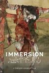

[忌怪岛](https://pewae.com/gaan/aHR0cHM6Ly9tb3ZpZS5kb3ViYW4uY29tL3N1YmplY3QvMzYxNDE4MzQ=)

原名：Immersion导演：清水崇主演：大谷凜香 / 山本美月 / 川添野爱 / 平冈祐太 / 当真亚美 / 水石亚飞梦 / 生驹里奈 / 祷云母 / 笹野高史 / 西畑大吾类型：恐怖地区：日本首映时间：2023

元宇宙结合日式恐怖片，每个吓人的点都被预判到了，无趣。

[猛虎还活着](https://pewae.com/gaan/aHR0cHM6Ly9tb3ZpZS5kb3ViYW4uY29tL3N1YmplY3QvMjY5NDI1ODE=)

原名：Tiger Zinda Hai导演：阿里·阿巴斯·札法主演：卡兰·狄尔 / 卡特莉娜·卡芙 / 吉里什·卡纳德 / 安加德·贝迪 / 帕莱什·拉瓦尔 / 库玛·米什拉 / 穆克什·卡纳 / 萨尔曼·汗 / 阿努普瑞雅·戈恩卡 / 阿南特·维哈特·夏尔马类型：冒险 / 动作 / 惊悚地区：印度首映时间：2017

印度版战狼2，过于政治正确，片尾同时举印巴两国国旗真是够了。
反派过于弱智，真实的伊斯兰国这么傻早被灭好几个来回了。
骑马追逐一段不错。

[D坂杀人事件](https://pewae.com/gaan/aHR0cHM6Ly9tb3ZpZS5kb3ViYW4uY29tL3N1YmplY3QvMjYyODU3ODA=)

原名：Murder on D Street导演：窪田将治主演：仁科贵 / 大谷英子 / 木下凤华 / 河合龙之介 / 祥子 / 草野康太 / 近藤芳正类型：悬疑 / 情色地区：日本首映时间：2015

情色的尺度恰到好处，合格的推理片。
听床跟一段拍得出色。
STAFF里有个人的职务是“绳师”。

[流沙](https://pewae.com/gaan/aHR0cHM6Ly9tb3ZpZS5kb3ViYW4uY29tL3N1YmplY3QvMzU5MzYwMDM=)

原名：Quicksand导演：安德列斯·贝尔特兰主演：Andrés Castañeda / Sebastian Eslava / 卡萝莱娜·盖坦 / 艾伦·霍科类型：惊悚地区：哥伦比亚首映时间：2023

大蛇感觉很委屈。
为了让男女主掉坑里而给他俩强行降智，这种做法真低级。

[三人行](https://pewae.com/gaan/aHR0cHM6Ly9tb3ZpZS5kb3ViYW4uY29tL3N1YmplY3QvMzY1NTMyMjc=)

原名：Patikim-Tikim导演：Jose Javier Reyes主演：Aerol Carmelo / Apple Dy / Yen Durano类型：剧情 / 情色地区：菲律宾首映时间：2023

男主太丑，两个女主也有些肉肉的。
女上司胸大无脑。

[发财联盟](https://pewae.com/gaan/aHR0cHM6Ly9tb3ZpZS5kb3ViYW4uY29tL3N1YmplY3QvMzYyMTc5NTc=)

原名：Fa cai lian meng导演：赖健雄主演：朱浩仁 / 李国煌 / 林德荣 / 程旭辉 / 莫小玲 / 颜薇恩类型：喜剧 / 犯罪地区：新加坡首映时间：2023

拍不好动作戏就别拍嘛，软绵绵的恶心巴拉的。
除李国煌外所有演员连横店群演的水平都不如。
几个女角色塑造极失败，没个性，也不漂亮。

[涉过愤怒的海](https://pewae.com/gaan/aHR0cHM6Ly9tb3ZpZS5kb3ViYW4uY29tL3N1YmplY3QvMzM0NTY1MTI=)

导演：曹保平主演：周依然 / 周迅 / 孙安可 / 张宥浩 / 王迅 / 祖峰 / 闫妮 / 阿部力 / 颜北 / 黄渤类型：剧情 / 悬疑 / 犯罪地区：大陆首映时间：2023

乌鲁奇奥拉被黑得这么惨，你们给久保带人钱了么？
影片最大的遗憾是有台风天赶飞机这个巨大的绕不开的BUG。
机场，西岗市民中心，碧桂园，跨海桥，七七街，中央大道，修竹街，中山广场（建行），东港，疏港路，东联路，七贤岭桥，老虎尾，排石村，龙王塘渔港。

[神探大战](https://pewae.com/gaan/aHR0cHM6Ly9tb3ZpZS5kb3ViYW4uY29tL3N1YmplY3QvMjY5OTU4OTM=)

导演：韦家辉主演：何珮瑜 / 刘青云 / 吴浩康 / 李若彤 / 林峯 / 汤怡 / 洪天明 / 蔡卓妍 / 谭凯 / 陈家乐类型：动作 / 悬疑 / 犯罪地区：香港首映时间：2022

颠佬是个筐，什么都可以装，这次装得有点多了。
蔡卓妍有点过于能打了吧。
香港街头乱写乱画没人管的吗？

[妖怪合租屋 电影版](https://pewae.com/gaan/aHR0cHM6Ly9tb3ZpZS5kb3ViYW4uY29tL3N1YmplY3QvMzU3NDU2NDc=)

原名：Youkai Share-house -Hakuba no oujisama ja nainkai-导演：丰岛圭介主演：大仓孝二 / 小芝风花 / 松本真理香 / 每熊克哉 / 池谷伸枝类型：喜剧 / 奇幻地区：日本首映时间：2022

浪费时间。
男主角长了一张欠扁的脸。

[子弹就是上帝](https://pewae.com/gaan/aHR0cHM6Ly9tb3ZpZS5kb3ViYW4uY29tL3N1YmplY3QvMzU3ODU0Njg=)

导演：Nick Cassavetes主演：乔纳森·塔克 / 伊桑·苏普利 / 卡尔·格洛斯曼 / 尼古拉·科斯特-瓦尔道 / 布兰登·萨克斯顿 / 杰米·福克斯 / 詹纽瑞·琼斯 / 麦卡·梦露类型：动作 / 惊悚 / 犯罪地区：美国首映时间：2023

血量尚可，剧情不值一提。
纹身的没好鸟。
太长。

[热烈](https://pewae.com/gaan/aHR0cHM6Ly9tb3ZpZS5kb3ViYW4uY29tL3N1YmplY3QvMzU1NTYwMDE=)

导演：大鹏主演：刘敏涛 / 卡斯柏 / 宋祖儿 / 小沈阳 / 岳云鹏 / 张子贤 / 王一博 / 王霏霏 / 蒋龙 / 黄渤类型：剧情 / 喜剧地区：大陆首映时间：2023

处处粗糙，小学生交作业的拼凑感。
王一博的面瘫演技被身边的街舞演员吊打。
偌大一个亚运会，竟然选了街舞这么个项目作献礼，没得献就别献了呗，瞎浪费钱。

[女巫也疯狂2](https://pewae.com/gaan/aHR0cHM6Ly9tb3ZpZS5kb3ViYW4uY29tL3N1YmplY3QvMzQ5ODUxNzE=)

导演：安妮·弗莱彻主演：凯茜·纳基麦 / 山姆·理查森 / 惠特尼·皮克 / 托尼·海尔 / 汉娜·沃丁厄姆 / 莉莉亚·白金汉 / 莎拉·杰茜卡·帕克 / 贝特·米德勒 / 贝莉莎·埃斯科贝多 / 道格·琼斯类型：喜剧 / 奇幻 / 恐怖 / 悬疑 / 爱情地区：美国首映时间：2022

三位女巫暮气沉沉。
过于合家欢了，完全感觉不到女巫的邪恶。
扫地机器人安排得还挺巧妙的。

[月光武士](https://pewae.com/gaan/aHR0cHM6Ly9tb3ZpZS5kb3ViYW4uY29tL3N1YmplY3QvMzU2NDE3NzI=)

导演：虹影主演：冯家妹 / 刘蕾 / 吕星辰 / 孙庆 / 左航 / 彭静 / 王钧赫 / 白恩 / 蔡珩 / 阚昕类型：剧情地区：大陆首映时间：2023

心痛把钱投给作家拍电影的傻叉老板。
这作家不仅完全没有当导演的能力，好像也不太会把小说变成剧本。
酸腐的故事。

[非常男女](https://pewae.com/gaan/aHR0cHM6Ly93d3cuaW1kYi5jb20vdGl0bGUvdHQwMjc3Mzcx)

原名：Not Another Teen Movie导演：Joel Gallen主演：50分 / 克里斯·埃文斯 / 凯乐·利 / 埃里克·克里斯蒂安·奥森 / 洁米·佩丝莉 / 米雅·柯许纳 / 莱西·察伯特类型：喜剧地区：美国首映时间：2001

恶搞青春喜剧，略无章法。
负责献身的女艺术家与美国派中的神似，但查了一下发现不是，这玩意儿也量产吗？

[非诚勿扰3](https://pewae.com/gaan/aHR0cHM6Ly9tb3ZpZS5kb3ViYW4uY29tL3N1YmplY3QvMjY3Njk1OTI=)

导演：冯小刚主演：关晓彤 / 姚晨 / 岳云鹏 / 常远 / 李诚儒 / 舒淇 / 范伟 / 葛优 / 虞书欣 / 邬逸聪类型：喜剧 / 爱情 / 科幻地区：大陆首映时间：2023

太多的回闪，是江郎才尽的表现，而且2这部三分电影有什么回闪的价值么？
李诚儒岳云鹏线根本是在浪费时间。
仿佛华谊和冯小刚给自己办的一场葬礼。

[年会不能停！](https://pewae.com/gaan/aHR0cHM6Ly9tb3ZpZS5kb3ViYW4uY29tL3N1YmplY3QvMzU3MjU4Njk=)

导演：董润年主演：大木 / 大鹏 / 孙艺洲 / 庄达菲 / 晃晃 / 李乃文 / 欧阳奋强 / 王迅 / 白客 / 童漠男类型：剧情 / 喜剧地区：大陆首映时间：2023

优点与缺点同样突出，优点是为打工人说话讽刺资本，缺点是除了白客都没演好打工人。
庄达菲这个最重要的女角色完全出戏，哪个外驻是她这样？
欧阳奋强这么蠢，是怎么当上首富的？

[PK.COM.CN](https://pewae.com/gaan/aHR0cHM6Ly9tb3ZpZS5kb3ViYW4uY29tL3N1YmplY3QvMjI4NjAwOQ==)

导演：小江主演：张博 / 房祖名 / 李勤勤 / 牛萌萌 / 罗家英 / 陈柏霖类型：剧情地区：大陆首映时间：2008

跟房祖名和牛萌萌一起拍戏，陈柏霖真的很难自证清白。
迷幻而又跳脱的纯意识流电影，不明觉厉。
大型新浪微博+动感地带+东软信息学院联合广告。

[自由](https://pewae.com/gaan/aHR0cHM6Ly9tb3ZpZS5kb3ViYW4uY29tL3N1YmplY3QvMzM0MTc5MzYv)

原名：Liberté导演：阿尔伯特·塞拉主演：Alexander García Düttmann / Baptiste Pinteaux / Francesc Daranas / Laura Poulvet / Theodora Marcadé / Xavier Pérez / 伊莲娜·扎贝斯 / 吕伊斯·塞拉 / 赫尔穆特·贝格 / 马克·苏西尼类型：荒诞地区：法国首映时间：2019

莫名其妙的电影和莫名其妙的长镜头。
鸟倒是溜得挺溜的。
所谓的欧洲贵族，办事的时候也要戴假发的？

[拍完就杀人](https://pewae.com/gaan/aHR0cHM6Ly9tb3ZpZS5kb3ViYW4uY29tL3N1YmplY3QvMjcxMDc3ODc=)

原名：Call Sheet导演：迈克尔E·R·沃克主演：Alex Hurt / Jay Devore / Josh Salt / Lexi Lapp / Phil Burke / Zanny Laird / 亚历珊德拉·索恰类型：恐怖地区：美国首映时间：2017

正片烂到跟片中烂片一样烂，以至无法分辨是否是一种行为艺术。
女主不如女配。

[三大队](https://pewae.com/gaan/aHR0cHM6Ly9tb3ZpZS5kb3ViYW4uY29tL3N1YmplY3QvMzUyMDg0NjM=)

导演：戴墨主演：张子贤 / 张译 / 曹炳琨 / 李晨 / 杨新鸣 / 王骁 / 艾丽娅 / 陈创 / 魏晨 / 黄璐类型：剧情 / 犯罪地区：大陆首映时间：2023

身为刑满释放人员，张译们异地追凶，就不用向派出所报到的？
张译你成天演这样的玩意儿自己不腻吗？
李晨脸上写满了道貌岸然。

[爱的界线](https://pewae.com/gaan/aHR0cHM6Ly9tb3ZpZS5kb3ViYW4uY29tL3N1YmplY3QvMzU2OTE4NDU=)

原名：Borders of Love,色界(台)导演：托马斯·温斯基主演：乔哈纳·马图斯科娃 / 伊莉斯卡·克伦科 / 伦卡·科若波托娃 / 吉里·伦德尔 / 哈娜·瓦格内洛娃 / 安东妮·弗玛诺娃 / 海尼克·塞马克 / 西里尔·多布雷 / 马丁·霍夫曼 / 马提亚斯·热兹尼切克类型：剧情地区：捷克首映时间：2022

片名倒是起得很好，男女之间还是不要过于坦诚了。
中后段还以为会有无遮大会，略失望。
女主的颜值忽高忽低。

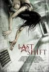

[最后一班](https://pewae.com/gaan/aHR0cHM6Ly9tb3ZpZS5kb3ViYW4uY29tL3N1YmplY3QvMjYyODc0MzQ=)

原名：绝魂夜(台)导演：安东尼·迪布拉西主演：Hank Stone / J·拉罗斯 / Lindsi Jeter / Mary Lankford Poiley / Matt Doman / 凯瑟琳·基尔格 / 娜塔丽·维多利亚 / 朱丽安娜·哈凯夫 / 约书亚·米克尔 / 萨拉·斯库尔科类型：恐怖 / 悬疑地区：美国首映时间：2014

无脑爽一下尚可，鬼的行动比较符合逻辑。
女主从意志坚定变得神经兮兮，魔鬼的手段值得夸赞。
喜欢鬼的造型。

[周处除三害](https://pewae.com/gaan/aHR0cHM6Ly9tb3ZpZS5kb3ViYW4uY29tL3N1YmplY3QvMzYxNTE2OTI=)

导演：黄精甫主演：刘子铨 / 曾珮瑜 / 李李仁 / 游安顺 / 王净 / 袁富华 / 谢琼煖 / 阮经天 / 陈以文 / 陈秉佑类型：动作 / 犯罪地区：台湾首映时间：2024

这个故事告诉我们，仿制枪有风险易卡壳。
从始至终，阮经天都没有什么善恶之分，他只是一个显眼包。
澎湖岛上竟然是有居民的。

[暴走曼谷](https://pewae.com/gaan/aHR0cHM6Ly9tb3ZpZS5kb3ViYW4uY29tL3N1YmplY3QvMzAxNzUyMjE=)

导演：梁德森主演：品川祐 / 夏菜 / 夏超 / 李灿森 / 绪方义博 / 罗霖 / 赵珂类型：剧情地区：香港首映时间：2018

偌大的香港，拍黑帮仇杀的黑色幽默片也要把地点改成泰国了，可悲。
这种片子请绪方义博，有种大炮打蚊子的荒谬感。
肉卖得还不够。

[出轨的女人](https://pewae.com/gaan/aHR0cHM6Ly9tb3ZpZS5kb3ViYW4uY29tL3N1YmplY3QvNTI5NDM0NA==)

导演：潘源良主演：余安安 / 冼色丽 / 叶璇 / 吴家丽 / 夏文汐 / 杜汶泽 / 林子祥 / 郑丹瑞 / 陈伟霆 / 韩君婷类型：剧情 / 爱情地区：香港首映时间：2011

如果让那些阔太太知道我这里有双向插头，我还怎么做生意？
陈伟霆的一人分饰两角意义不大。
韩君婷老了以后好丑。

[致命黑兰](https://pewae.com/gaan/aHR0cHM6Ly9tb3ZpZS5kb3ViYW4uY29tL3N1YmplY3QvNTAyODUzNg==)

原名：Colombiana导演：奥利维尔·米加顿主演：佐伊·索尔达娜 / 克利夫·柯蒂斯 / 山姆·道格拉斯 / 杰西·博雷格 / 詹迪·莫拉 / 辛希亚·阿戴-罗宾森 / 迈克尔·瓦尔坦 / 连尼·詹姆斯 / 马克斯·马蒂尼类型：剧情 / 动作 / 惊悚 / 犯罪地区：法国首映时间：2013

干如此大事还要养着小狼狗，活该死全家。
动作结合跑酷其实没那么美好。
流畅度不错。

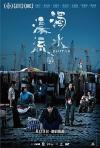

[浊水漂流](https://pewae.com/gaan/aHR0cHM6Ly93d3cuaW1kYi5jb20vdGl0bGUvdHQxMzg4NzEyOA==)

导演：李骏硕主演：叶童 / 吴镇宇 / 宝珮如 / 朱柏康 / 李丽珍 / 柯炜林 / 蔡思韵 / 谢君豪类型：剧情地区：香港首映时间：2021

港府见不得穷人，有了这部片；中央见不得吸毒自焚，没了这片的豆瓣条目。
我只是愤怒，我无法和解。
吴镇宇演得远不如谢君豪自如。

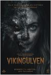

[维京恶狼](https://pewae.com/gaan/aHR0cHM6Ly9tb3ZpZS5kb3ViYW4uY29tL3N1YmplY3QvMzU1MDMwNTY=)

原名：Viking Wolf导演：Stig Svendsen主演：Elli Rhiannon Müller Osborne / Liv Mjönes / 亚瑟·哈卡拉赫蒂类型：恐怖 / 惊悚地区：挪威首映时间：2022

狼女的心理刻画尚可，狼妈明显不足。
姐妹情深的桥段还可以。
见多了为了表现野兽强大而做得水光溜滑的皮毛，这部片东一疙瘩西一块的狼皮反倒显得真实。

[我的朋友都恨我](https://pewae.com/gaan/aHR0cHM6Ly9tb3ZpZS5kb3ViYW4uY29tL3N1YmplY3QvMzU0NDI0MTQ=)

原名：All My Friends Hate Me导演：安德鲁·盖诺德主演：Graham Dickson / 乔治娜·坎贝尔 / 克里斯托弗·法里班克 / 基兰·霍奇森 / 安东尼娅·克拉克 / 汤姆·斯托顿 / 约书亚·麦圭尔 / 莎莉·克莱芙 / 达斯汀·德姆瑞·伯恩斯类型：喜剧 / 恐怖地区：英国首映时间：2021

世界上没有真正的感同身受。
聚会的时候就应该远离老婆。
当然没老婆更好。

[禁忌](https://pewae.com/gaan/aHR0cHM6Ly9tb3ZpZS5kb3ViYW4uY29tL3N1YmplY3QvMjYxMDEyNTg=)

原名：Kinki导演：和岛香太郎主演：仲野太贺 / 佐野史郎 / 兵藤公美 / 山内健司 / 山本剛史 / 月船沙罗罗 / 杉野希妃 / 森冈龙 / 藤村圣子 / 高嶋宏行类型：剧情地区：日本首映时间：2014

生硬。
猎奇的题材越演越普通。
女主身材不错。

[风之大陆](https://pewae.com/gaan/aHR0cHM6Ly9tb3ZpZS5kb3ViYW4uY29tL3N1YmplY3QvMzIyMTU4NQ==)

原名：The Weathering Continent导演：真下耕一主演：乡里大辅 / 佐藤正治 / 关俊彦 / 屋良有作 / 川津泰彦 / 平野正人 / 广中雅志 / 江森浩子 / 银河万丈 / 高山南类型：冒险 / 动画 / 奇幻地区：日本首映时间：1992

乏味。
这音乐长在了我的审美上。

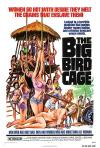

[大鸟笼](https://pewae.com/gaan/aHR0cHM6Ly9tb3ZpZS5kb3ViYW4uY29tL3N1YmplY3QvMjEyOTY2NA==)

原名：The Big Bird Cage导演：Jack Hill主演：Anitra Ford / Pam Grier / sid haig类型：剧情 / 动作 / 犯罪地区：菲律宾首映时间：1972

一群女囚强X看守也太猛了。
菲律宾七十年代初就有彩色电影了，跟对老大很重要。

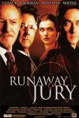

[失控陪审团](https://pewae.com/gaan/aHR0cHM6Ly9tb3ZpZS5kb3ViYW4uY29tL3N1YmplY3QvMTMwNzQ5Mw==)

原名：Runaway Jury导演：Gary Fleder主演：克利夫·柯蒂斯 / 吉恩·哈克曼 / 尼克·瑟西 / 布鲁斯·戴维森 / 布鲁斯·麦克吉尔 / 斯坦利·安德森 / 杰里米·皮文 / 约翰·库萨克 / 蕾切尔·薇兹 / 达斯汀·霍夫曼类型：剧情 / 惊悚 / 犯罪地区：美国首映时间：2003

虽然是讽刺陪审团制度缺点的，可怎么就觉得陪审团制度那么先进呢？
薇兹是真漂亮，可惜不怎么红。
达斯汀霍夫曼永远一身油

[太阳之下](https://pewae.com/gaan/aHR0cHM6Ly9tb3ZpZS5kb3ViYW4uY29tL3N1YmplY3QvMjY3MDA1MjA=)

原名：Under the Sun导演：维塔利·曼斯基主演：hye-yong / lee zin-mi / yu-yong类型：纪录地区：捷克首映时间：2015

朝鲜人民沉浸在乐观向上的氛围中。
成长于80年代的我，也能清晰地分辨出片中人物做了什么，为什么这么做，接下来会怎么做；感谢南非友人。
大饼子脸的班主任看着就想笑。

[哥，你好](https://pewae.com/gaan/aHR0cHM6Ly9tb3ZpZS5kb3ViYW4uY29tL3N1YmplY3QvMzUxMDI0Njk=)

导演：张栾主演：常远 / 张一鸣 / 李一宁 / 李志荟 / 贾冰 / 郝鹏飞 / 韩彦博 / 马丽 / 魏翔 / 黄允桐类型：剧情 / 喜剧 / 奇幻地区：大陆首映时间：2022

俗烂段子加俗烂人设，俗不可耐。
常远永远是最亮的明灯。
开心麻花解散吧。

[纹身室](https://pewae.com/gaan/aHR0cHM6Ly9tb3ZpZS5kb3ViYW4uY29tL3N1YmplY3QvMjYxMDE2Mzk=)

原名：Anarchy Parlor导演：Devon Downs / Kenny Gage主演：Ben Whalen / Claire Garvey / Joey Fisher / Robert LaSardo / Sara Fabel / 乔丹·詹姆斯·史密斯 / 安东尼·德尔·尼格罗类型：恐怖地区：美国首映时间：2015

仍旧是前赴后继送人头的剧情，俗套。
坏人的行为难以理解。

[疯狂暑假](https://pewae.com/gaan/aHR0cHM6Ly9tb3ZpZS5kb3ViYW4uY29tL3N1YmplY3QvMzYzNjM3MzE=)

导演：圣地亚哥·塞古拉主演：Leo Harlem / Marta González de Vega / Patricia Conde / 圣地亚哥·塞古拉 / 费尔南多·吉尔类型：喜剧 / 家庭地区：西班牙首映时间：2023

戴眼镜的小胖妞虽然小，却非常令人讨厌。
毫无新意。

[茱莉娅的眼睛](https://pewae.com/gaan/aHR0cHM6Ly9tb3ZpZS5kb3ViYW4uY29tL3N1YmplY3QvNDA0OTcwMA==)

原名：Los ojos de Julia导演：吉列尔莫·莫拉莱斯主演：克拉拉·塞古拉 / 巴勃罗·德尔基 / 弗兰塞斯克·奥雷利亚 / 茱莉亚·古铁雷兹·卡巴 / 贝伦·鲁埃达 / 赫克托耳·克拉拉蒙 / 路易斯·奥马类型：恐怖 / 惊悚地区：西班牙首映时间：2012

隐形的人设定很棒。
节奏很好，但强行制造悬念的地方过多。
即使是西班牙片，也脱离不了主角脑子不灵的窠臼。

[极寒之城](https://pewae.com/gaan/aHR0cHM6Ly9tb3ZpZS5kb3ViYW4uY29tL3N1YmplY3QvMjYzODYwMzQ=)

原名：Atomic Blonde导演：大卫·雷奇主演：埃迪·马森 / 山姆·哈格雷夫 / 托比·琼斯 / 查理兹·塞隆 / 比尔·斯卡斯加德 / 索菲亚·波多拉 / 约翰·古德曼 / 罗兰·默勒 / 詹姆斯·福克纳 / 詹姆斯·麦卡沃伊类型：动作 / 惊悚地区：美国首映时间：2017

为艺术献身的女艺术家之查理兹塞隆。
动作戏凌厉，文戏催眠。

[疯狂海盗团](https://pewae.com/gaan/aHR0cHM6Ly9tb3ZpZS5kb3ViYW4uY29tL3N1YmplY3QvMzAzNDkzMzM=)

原名：Captain Sabertooth and the Magic Diamond导演：Marit Moum Aune / 拉斯姆斯·A·西韦特森主演：Bartek Kaminski / Charlotte Frogner / Ida Leonora Valestrand Eike / Jan Martin Johnsen / Leonard Valestrand Eike / Siri Skjeggedal / 乔恩·奥伊登 / 凯瑞·豪根·西德尼斯 / 托拜厄斯·桑特尔曼 / 斯荣德·福斯·奥瓦格类型：冒险 / 动画地区：挪威首映时间：2021

过于简单。

[花街柳巷](https://pewae.com/gaan/aHR0cHM6Ly9tb3ZpZS5kb3ViYW4uY29tL3N1YmplY3QvMjU4NTM3Mzk=)

导演：吴家丽 / 翁秀兰主演：吴家丽 / 洪天照 / 符晓薇 / 许雅婷类型：情色 / 惊悚地区：香港首映时间：2015

前期作为低成本B级还行，后期buff叠的过多。
女主角很漂亮，但脸还是有些僵。
死法还是单调了些。

[猎凶风河谷](https://pewae.com/gaan/aHR0cHM6Ly9tb3ZpZS5kb3ViYW4uY29tL3N1YmplY3QvMjYzODk2MDE=)

原名：Wind River导演：泰勒·谢里丹主演：伊丽莎白·奥尔森 / 凯尔西·周 / 吉尔·伯明翰 / 坦图·卡丁诺 / 埃里克·兰格 / 杰瑞米·雷纳 / 格雷厄姆·格林 / 特欧·布里奥尼斯 / 茱莉亚·琼斯 / 阿佩萨纳赫克沃特类型：剧情 / 悬疑 / 犯罪地区：英国首映时间：2017

一种冷酷。
有点像美国版的生产建设兵团。
穿秋裤的绯红女巫。

[金属党](https://pewae.com/gaan/aHR0cHM6Ly9tb3ZpZS5kb3ViYW4uY29tL3N1YmplY3QvMjU2OTI0Mjg=)

原名：Metalhead导演：拉格纳·布拉加松主演：Amber Valentine / Edgar Livengood类型：剧情地区：冰岛首映时间：2013

对牛弹电吉他。
雨中点教堂还是很赞的。
死金最终还是变成了激流和哥特。

[猩球崛起：新世界](https://pewae.com/gaan/aHR0cHM6Ly9tb3ZpZS5kb3ViYW4uY29tL3N1YmplY3QvMzYwNjk4NTQ=)

原名：Kingdom of the Planet of the Apes导演：韦斯·鲍尔主演：凯文·杜兰 / 威廉姆·H·梅西 / 尼尔·桑迪兰兹 / 弗蕾娅·艾伦 / 彼德·梅肯 / 欧文·泰格 / 特拉维斯·杰弗里 / 艾卡·达维尔 / 莉迪亚·佩克汉 / 迪辰·拉克曼类型：冒险 / 动作 / 科幻地区：美国首映时间：2024

是我族类，其心也异。
人类耍尽心眼，只是为了能语音聊天。
秘密基地门朝大海，一层停满坦克，这是多大病啊。

[红灯](https://pewae.com/gaan/aHR0cHM6Ly9tb3ZpZS5kb3ViYW4uY29tL3N1YmplY3QvNjA2MDY1Mg==)

原名：Red Lights导演：罗德里戈·科尔特斯主演：乔莉·理查德森 / 伊丽莎白·奥尔森 / 伯恩·戈曼 / 克雷格·罗伯兹 / 基里安·墨菲 / 托比·琼斯 / 罗伯特·德尼罗 / 莱昂纳多·斯巴拉格利亚 / 西格妮·韦弗类型：剧情 / 恐怖 / 悬疑地区：美国首映时间：2012

演员还行，编剧故弄玄虚导致观感拉跨。
好想有人在年会上像片中大结局那样闹上一场。

[乡村里的中国](https://pewae.com/gaan/aHR0cHM6Ly9tb3ZpZS5kb3ViYW4uY29tL3N1YmplY3QvMjQ4Njc4NDU=)

导演：焦波类型：纪录地区：大陆首映时间：2013

年复一年，没有希望，没有悲伤。
邻里伤害的案件，大半年下来也没个结果；为了修路砍别人的树，没有任何补偿；这就是中国。
哪里有什么悠然见南山。

[没有一顿火锅解决不了的事](https://pewae.com/gaan/aHR0cHM6Ly9tb3ZpZS5kb3ViYW4uY29tL3N1YmplY3QvMzYyMDczNzE=)

导演：丁晟主演：于谦 / 余皑磊 / 哈丹 / 李九霄 / 李勇 / 杨幂 / 杨漫 / 田雨 / 谭飞 / 黄小蕾类型：喜剧 / 悬疑 / 犯罪地区：大陆首映时间：2024

黄小蕾为什么要站着尿尿？
导演根本没有拍出一点悬疑的感觉，可能剪辑的锅更大，但剪辑和导演是同一人。
杨幂演的既不像小三又不像神婆，她只是杨幂本人。

[身后事](https://pewae.com/gaan/aHR0cHM6Ly9tb3ZpZS5kb3ViYW4uY29tL3N1YmplY3QvMTk4NjU2Nw==)

原名：After.Life导演：阿格尼兹卡·沃特维兹-沃斯洛主演：乔西·查尔斯 / 克里斯蒂娜·里奇 / 爱丽丝·德拉蒙德 / 罗斯玛丽·墨菲 / 舒勒·汉斯利 / 西利亚·维斯顿 / 贾斯汀·朗 / 连姆·尼森 / 钱德勒·坎特布瑞 / 马拉奇·麦考特类型：剧情 / 悬疑 / 惊悚地区：美国首映时间：2009

薛定谔的女主角，我倾向于真死了。
女主角身材超正。

[飞驰人生2](https://pewae.com/gaan/aHR0cHM6Ly9tb3ZpZS5kb3ViYW4uY29tL3N1YmplY3QvMzYzNjk0NTI=)

导演：韩寒主演：冯绍峰 / 孙艺洲 / 尹正 / 张本煜 / 沈腾 / 范丞丞 / 贾冰 / 郑恺 / 魏翔 / 黄景瑜类型：剧情 / 喜剧 / 运动地区：大陆首映时间：2024

前半部分又散又碎又长，但后半部分真心不赖。
为全片不使用女性重要角色加一分。
铅封的小设定很棒，它就在那里，在别人眼里屁都不是——我还以为会出现在贾冰的厂里。

[热辣滚烫](https://pewae.com/gaan/aHR0cHM6Ly9tb3ZpZS5kb3ViYW4uY29tL3N1YmplY3QvMzYwODEwOTQ=)

导演：贾玲主演：乔杉 / 张小斐 / 李雪琴 / 杨紫 / 沙溢 / 贾玲 / 赵海燕 / 雷佳音 / 马丽 / 魏翔类型：剧情 / 喜剧地区：大陆首映时间：2024

缺少电影语言，就像一场浮于表面的大型MV。
水嫩的贾玲并不如当年充气的刘德华郑秀文能打动我。
唯一出彩的是杨紫的小反派。

[猛鬼出笼](https://pewae.com/gaan/aHR0cHM6Ly9tb3ZpZS5kb3ViYW4uY29tL3N1YmplY3QvMzAxMzA3OQ==)

导演：黎大炜主演：刘兆铭 / 温碧霞 / 秦山 / 萧玉龙 / 陈池水 / 黄一飞类型：剧情 / 恐怖 / 惊悚地区：香港首映时间：1983

前半截悬念不错，后半截拉跨。
女艺术家只演过这一部片子，没有更多资料，可惜。
最后一个镜头要表扬化妆师。

[圣剑的秘密](https://pewae.com/gaan/aHR0cHM6Ly9tb3ZpZS5kb3ViYW4uY29tL3N1YmplY3QvMjI5OTI3OA==)

原名：He-Man and She-Ra: The Secret of the Sword导演：Ed Friedman / Lou Kachivas主演：John Erwin / Linda Gary / Melendy Britt / 乔治·第桑佐 / 埃里卡·谢默 / 娄·谢默 / 艾伦·欧朋海默类型：动作 / 动画 / 奇幻地区：美国首映时间：1985

仔细一想，希瑞走的其实是男女通吃的路子，男孩子看到肌肉大长腿，女孩子看到公主花衣裳。
阿朵拉在一种歪瓜裂枣的反派中过于鹤立鸡群，谁还看不出她是个“说得”目标啊！
希瑞和希曼的老家竟然叫灰骷髅城堡。

[微交少女](https://pewae.com/gaan/aHR0cHM6Ly9tb3ZpZS5kb3ViYW4uY29tL3N1YmplY3QvMjI3MzQ5NjA=)

导演：翁子光主演：何浩文 / 余雨 / 冯志强 / 李静仪 / 温碧霞 / 王施千 / 蔚雨芯 / 许雅婷 / 郭子健 / 麥德和类型：情色地区：香港首映时间：2014

剧情单薄，演得也不太好。
顶个三级片的大名，露点镜头不到10秒，且拍且珍惜吧。
温碧霞啊，不是岁数大了就自动晋升老戏骨的好哇。

[玩命直播](https://pewae.com/gaan/aHR0cHM6Ly9tb3ZpZS5kb3ViYW4uY29tL3N1YmplY3QvMjYzMTM3NDA=)

原名：Nerve导演：亨利·朱斯特 / 阿里尔·舒曼主演：乔尼·波查普 / 戴夫·弗兰科 / 朱丽叶特·刘易斯 / 机关枪凯利 / 艾玛·罗伯茨 / 艾米丽·梅德 / 萨米拉·威利 / 贵美子·格伦 / 迈尔斯·赫尔泽 / 马克·约翰·杰弗瑞类型：冒险 / 动作 / 惊悚地区：美国首映时间：2017

是谁导演这场戏，恩恩怨怨又何必太在意。
艾玛罗伯茨演得过于刻板。
舔狗实惨。

[歌厅](https://pewae.com/gaan/aHR0cHM6Ly9tb3ZpZS5kb3ViYW4uY29tL3N1YmplY3QvMTI5NjI4Mg==)

原名：Cabaret导演：鲍勃·福斯主演：丽莎·明奈利 / 乔尔·格雷 / 伊丽莎白·诺伊曼-菲特尔 / 弗里茨·维伯 / 格尔德·费斯佩曼 / 海伦·维塔 / 西格丽德·冯·里希特霍芬 / 赫尔穆特·格里姆 / 马里莎·贝伦森 / 麦克尔·约克类型：剧情 / 歌舞 / 爱情地区：美国首映时间：1972

歌舞升平中，山雨欲来。
明奈利的表演颠而不狂。
波兰版海报帅得一塌糊涂。

[东北告别天团2](https://pewae.com/gaan/aHR0cHM6Ly9tb3ZpZS5kb3ViYW4uY29tL3N1YmplY3QvMzU5MzY0MDE=)

导演：崔志佳主演：于洋 / 大能 / 孙越 / 宋晓峰 / 崔志佳 / 张子栋 / 张百乔 / 李会长 / 李宗恒 / 梁龙类型：剧情 / 喜剧地区：大陆首映时间：2023

图个不乐呵。

[假如我是真的](https://pewae.com/gaan/aHR0cHM6Ly9tb3ZpZS5kb3ViYW4uY29tL3N1YmplY3QvMTMwNzk3MQ==)

导演：王童主演：吴巧玲 / 崔福生 / 常枫 / 张冰玉 / 胡冠珍 / 葛香亭 / 谭咏麟 / 陈慧楼 / 雷鸣类型：剧情地区：台湾首映时间：1981

假的才犯法吗？废话！
片中最恐怖的一幕是事情已经败露，还要把谭咏麟放到剧院里再抓，公开宣示权威。
话剧团长一个变态中年妇女演得惟妙惟肖，定睛一看，这不是灭绝嘛！

[枕边嫌疑人](https://pewae.com/gaan/aHR0cHM6Ly9tb3ZpZS5kb3ViYW4uY29tL3N1YmplY3QvMzY0NjI5MDc=)

原名：The Murderer导演：韦西·沙赞那庭主演：Boonyarit Wiangnon / Chananticha Chaipa / James Laver / Phetthai Vongkumlao / Sunaree Ratchasima / Thanavisutt Chene Battiata / 乔纳森·萨姆森 / 依莎亚·贺苏汪 / 萨尼·乌托玛类型：喜剧 / 悬疑 / 惊悚 / 犯罪地区：泰国首映时间：2023

废话有点多，多线叙事有点多余，警长有点抢戏，反转有点俗，光圈有点猛，但莫名其妙就觉得还不赖。
女主长在我的审美上。
泰国这么多白人女婿吗？

[好像也没那么热血沸腾](https://pewae.com/gaan/aHR0cHM6Ly9tb3ZpZS5kb3ViYW4uY29tL3N1YmplY3QvMzU4ODI3NDI=)

导演：高虎主演：刘斯博 / 刘沐琪 / 周大勇 / 岳亮 / 建康 / 王子异 / 王智 / 艾伦 / 韩笑 / 魏翔类型：喜剧 / 运动地区：大陆首映时间：2023

好像也没那么关爱残疾人，不然怎么从来不给那位唐氏小姑娘一个场上的镜头呢？
已经是给题材加了很多分的结果了。
王智明珠暗投。

[夜车](https://pewae.com/gaan/aHR0cHM6Ly9tb3ZpZS5kb3ViYW4uY29tL3N1YmplY3QvMzQ4MzY3Nzg=)

导演：谢文明主演：叶必立 / 李育芳 / 王醒民 / 蔡明修 / 郭尚兴 / 陈淑芳类型：动画 / 惊悚 / 短片地区：台湾首映时间：2019

海上升明月，千里不留行。
风格诡异暴力，故事本身比较俗烂。
夸大猴子的战斗力可以理解，贬低民工的战斗力简直剧情杀，几锹下去还拍不死一只小猴子？

[93国际列车大劫案：莫斯科行动](https://pewae.com/gaan/aHR0cHM6Ly9tb3ZpZS5kb3ViYW4uY29tL3N1YmplY3QvMTA4MTAyNjY=)

导演：邱礼涛主演：刘德华 / 尚语贤 / 张本煜 / 张涵予 / 徐小飒 / 文咏珊 / 白那日苏 / 谷嘉诚 / 赵炳锐 / 黄轩类型：剧情 / 动作 / 犯罪地区：大陆首映时间：2023

世纪初合拍片的拧巴感挥之不去。
刘德华的转变莫名其妙。
港片无美女，文咏珊当先锋。

[志明与春娇](https://pewae.com/gaan/aHR0cHM6Ly9tb3ZpZS5kb3ViYW4uY29tL3N1YmplY3QvNDMwNTQzNg==)

导演：彭浩翔主演：余文乐 / 司徒慧焯 / 张达明 / 方皓玟 / 杨千嬅 / 林兆霞 / 谷德昭 / 谷祖琳 / 陈逸宁 / 黄德斌类型：剧情 / 喜剧 / 爱情地区：香港首映时间：2010

把一段婚外恋拍得如此清新自然，不愧是彭浩翔。
哪里有什么爱情，不过是瞅对眼了而已。

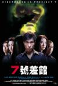

[7号差馆](https://pewae.com/gaan/aHR0cHM6Ly9tb3ZpZS5kb3ViYW4uY29tL3N1YmplY3QvMTQ4MDAwNw==)

导演：邱礼涛主演：李丽珍 / 许志安 / 雷宇扬类型：恐怖 / 悬疑 / 犯罪地区：香港首映时间：2001

求不得的鬼故事。
许志安的天生窝囊猥琐气质恰好与本片主题非常契合。
李丽珍的死法很邱礼涛。

[情窦初开](https://pewae.com/gaan/aHR0cHM6Ly9tb3ZpZS5kb3ViYW4uY29tL3N1YmplY3QvMzYyMTc1MjY=)

原名：Summer导演：Jose Javier Reyes主演：Aerol Carmelo / Ali Asistio / Axel Torres / Clifford Pusing / Franki Russell / Rolando Inocencio / Yen Durano / 马克·阿奎萨类型：剧情地区：菲律宾首映时间：2023

无聊兼无逻辑。

[性爱巴士](https://pewae.com/gaan/aHR0cHM6Ly93d3cuaW1kYi5jb20vdGl0bGUvdHQwMzY3MDI3)

原名：Shortbus导演：john cameron mitchell主演：peter stickles / pj deboy / sook-yin lee类型：剧情 / 喜剧 / 爱情地区：美国首映时间：2006

难得一见的自己口自己。
女主内心戏过多却缺少必要的情感递进。
音乐好听。

[还是觉得你最好](https://pewae.com/gaan/aHR0cHM6Ly9tb3ZpZS5kb3ViYW4uY29tL3N1YmplY3QvMzU1MDMxMjU=)

导演：陈咏燊主演：余香凝 / 古天乐 / 廖子妤 / 张继聪 / 林明祯 / 王丹妮 / 王菀之 / 邓丽欣 / 陈湛文 / 黄子华类型：喜剧 / 爱情地区：香港首映时间：2022

港名饭戏攻心更好，全是吃饭戏啊！
贵在流畅真实。

[邪恶骨血](https://pewae.com/gaan/aHR0cHM6Ly9tb3ZpZS5kb3ViYW4uY29tL3N1YmplY3QvMjU3MTYwNjU=)

原名：Wicked Blood导演：马克·杨主演：杰克·布塞 / 肖恩·宾 / 詹姆斯·鲍弗 / 阿丽夏·维加 / 阿比盖尔·布雷斯林类型：剧情 / 动作 / 惊悚地区：美国首映时间：2014

寡淡。

[兴安岭猎人传说](https://pewae.com/gaan/aHR0cHM6Ly9tb3ZpZS5kb3ViYW4uY29tL3N1YmplY3QvMzUwMjc3MTk=)

导演：刘轩狄主演：付赫安琪 / 尚铁龙 / 林枫烨 / 柯国庆 / 王佳希类型：冒险 / 恐怖 / 悬疑地区：大陆首映时间：2021

不是兴安岭传说，不是大马猴传说，而是狗尿苔传说。
氛围感不错，特效有些滥用。

[安乐战场](https://pewae.com/gaan/aHR0cHM6Ly9tb3ZpZS5kb3ViYW4uY29tL3N1YmplY3QvMTg2MzM2MQ==)

导演：曾志伟主演：余倩雯 / 保罗·杜 / 关宝慧 / 南燕 / 唐丽球 / 曾志伟 / 李志希 / 温碧霞 / 邓碧云 / 黄光亮类型：剧情 / 动作地区：香港首映时间：1990

一场精彩绝伦的强奸戏。
曾志伟身为导演，竟然没把自己留到最后死，点赞。
预测了几十年后的菲律宾人质事件，南燕yyds。

[我的美好欲望](https://pewae.com/gaan/aHR0cHM6Ly9tb3ZpZS5kb3ViYW4uY29tL3N1YmplY3QvMTA0MzY0OTc=)

原名：Barely Legal导演：Jose Montesinos主演：Alex Arleo / 劳伦·莫雷利 / 帕顿·阿什布洛克 / 梅丽莎·约翰斯顿 / 珍妮塔·圣克莱尔 / 米科·奥利维尔 / 约瑟夫·戴维-琼斯 / 艾丽卡·乔丹 / 莫根·本诺特 / 迪伦沃克斯类型：喜剧 / 情色地区：美国首映时间：2011

套路。

[东京奏鸣曲](https://pewae.com/gaan/aHR0cHM6Ly9tb3ZpZS5kb3ViYW4uY29tL3N1YmplY3QvMjAzMjE0Mw==)

原名：Tokyo Sonata导演：黑泽清主演：井之胁海 / 井川遥 / 小柳友 / 小泉今日子 / 役所广司 / 津田宽治 / 香川照之类型：剧情地区：日本首映时间：2008

一种澎湃的平静。
所谓钢琴，也不过是一挑装作很上进装作家人互相关心的幌子。
香川所在的公司要迁到大连，引发了一系列的事，现在这家公司已经迁回日本了吧。

[本日公休](https://pewae.com/gaan/aHR0cHM6Ly9tb3ZpZS5kb3ViYW4uY29tL3N1YmplY3QvMzQ4NTA1NTA=)

导演：傅天余主演：傅孟柏 / 方志友 / 施名帅 / 林柏宏 / 胡智强 / 陆小芬 / 陈庭妮 / 陈柏霖类型：剧情地区：台湾首映时间：2023

娓娓道来的家庭公路片。
儿子女儿的转变好可爱。
台湾的乡里风情好棒。

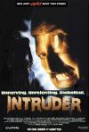

[变态杀人魔](https://pewae.com/gaan/aHR0cHM6Ly9tb3ZpZS5kb3ViYW4uY29tL3N1YmplY3QvMTMwNzEzNA==)

原名：Intruder导演：斯科特·斯皮格尔主演：Billy Marti / Dan Hicks / David Byrnes / Elizabeth Cox / 克雷格·斯塔克 / 尤金·罗伯特·格雷泽 / 山姆·雷米 / 布尔·斯蒂尔斯 / 泰德·雷米 / 蕾妮·艾斯特维兹类型：恐怖 / 惊悚 / 犯罪地区：美国首映时间：1989

抛开后面的杀人桥段，前面的轻喜剧还挺有趣的。

[性交易2](https://pewae.com/gaan/aHR0cHM6Ly9tb3ZpZS5kb3ViYW4uY29tL3N1YmplY3QvMzU4NzMxMTk=)

原名：X-Deal 2导演：Lawrence Fajardo主演：Josef Elizalde / Rob Quinto / 安吉拉·莫雷纳类型：剧情 / 情色地区：菲律宾首映时间：2022

废镜头太多。
调色好奇怪。
反转很突兀。

[作家的谎言：笔忠诱罪](https://pewae.com/gaan/aHR0cHM6Ly9tb3ZpZS5kb3ViYW4uY29tL3N1YmplY3QvMzAxNzAxMjA=)

导演：孙立基主演：何珮瑜 / 吴岱融 / 张建声 / 松冈李那 / 王宗尧 / 赵永洪 / 邹文正 / 郑诗君 / 陆永 / 陈嘉莉类型：悬疑地区：香港首映时间：2019

演员配不上导演，导演配不上编剧。
男主为了杀小三做实验，用了头猪还在身上挂了一堆水瓶子，这个小三是有多重啊！
要是能露就更好了。

[拜访者Q](https://pewae.com/gaan/aHR0cHM6Ly9iYWlrZS5iYWlkdS5jb20vaXRlbS8lRTYlOEIlOUMlRTglQTglQUElRTglODAlODVRLzYyMzI0MzQ=)

导演：三池崇史主演：不二子 / 中原翔子 / 内田春菊 / 武藤洵 / 渡边一志 / 远藤宪一 / 铃木一功类型：喜剧地区：日本首映时间：2001

湿了，啊，屎！
小三的骨盆拍得很漂亮。
喷奶算比较有创意。

[尸囚狱：前篇](https://pewae.com/gaan/aHR0cHM6Ly93d3cuaW1kYi5jb20vdGl0bGUvdHQ2ODU4MDAy)

原名：Corpse Prison: Part One导演：城定秀夫主演：50分 / 和合真一 / 片山萌美 / 立花安娜类型：恐怖地区：日本首映时间：2017

[尸囚狱：后篇](https://pewae.com/gaan/aHR0cHM6Ly93d3cuaW1kYi5jb20vdGl0bGUvdHQ2ODU4MDA2)

原名：Corpse Prison: Part Two导演：城定秀夫主演：50分 / 和合真一 / 片山萌美 / 立花安娜类型：恐怖地区：日本首映时间：2017

漫画就不够好，电影还不如漫画。
蛆女的部分完全没演出来。
小女孩倒是演得挺好。

[扫黑行动](https://pewae.com/gaan/aHR0cHM6Ly9tb3ZpZS5kb3ViYW4uY29tL3N1YmplY3QvMzUxOTc2Mzk=)

导演：林德禄主演：吕良伟 / 吴孟达 / 周一围 / 张智霖 / 曹卫宇 / 曾志伟 / 王劲松 / 王迅 / 秦海璐 / 邵兵类型：动作 / 犯罪地区：大陆首映时间：2022

片子剪成这样还好意思上映？
全员傻子。

[兔子暴力](https://pewae.com/gaan/aHR0cHM6Ly9tb3ZpZS5kb3ViYW4uY29tL3N1YmplY3QvMzAyODk4Mjg=)

导演：申瑜主演：万茜 / 俞更寅 / 周子越 / 方励 / 是安 / 李庚希 / 柴烨 / 潘斌龙 / 耐安 / 黄觉类型：剧情 / 家庭 / 犯罪地区：大陆首映时间：2021

剧本让万茜显得很白痴。
李庚希的小眼神还是不错的。
赌狗无药可救。

[瞒天过海](https://pewae.com/gaan/aHR0cHM6Ly9tb3ZpZS5kb3ViYW4uY29tL3N1YmplY3QvMzUxOTI2MTE=)

导演：陈卓主演：冯瓅 / 哈姆扎·阿萨尔 / 尹正 / 张钧甯 / 惠英红 / 薛旭春 / 许光汉 / 郑好 / 郭迈谦 / 钱漪类型：剧情 / 悬疑 / 犯罪地区：大陆首映时间：2023

失败的翻拍，一眼看到头。
张钧甯的发挥很好。

[无限春光27](https://pewae.com/gaan/aHR0cHM6Ly93d3cuaW1kYi5jb20vdGl0bGUvdHQ0MDc2MTY0)

原名：In the Room导演：邱金海主演：何超仪 / 吴宇卫 / 崔宇植 / 王冠逸 / 西野翔类型：剧情 / 喜剧 / 爱情地区：新加坡首映时间：2015

导演是新加坡首富之子，女主之一是何超仪，所以本片就是有钱人的玩具。
西野翔老师都多大岁数了，想想也怪可怜的。
几个部分的关联性太牵强。

[大海风](https://pewae.com/gaan/aHR0cHM6Ly9tb3ZpZS5kb3ViYW4uY29tL3N1YmplY3QvNjg3MjI3MQ==)

导演：于晓阳主演：于洋 / 于绍康 / 周丽华 / 荆明华 / 金鑫 / 马丽类型：剧情地区：大陆首映时间：1993

看开头就知道必会死人，只是没想到死的是玻璃球。
虽然我不懂造船，但离交船20个小时还在那咔咔焊是不是太扯了？船上不用装机器不用装修的吗？
120个党员，只有30个在一线，呵呵。

[功夫熊猫4](https://pewae.com/gaan/aHR0cHM6Ly9tb3ZpZS5kb3ViYW4uY29tL3N1YmplY3QvMjY3MTU0OTY=)

原名：Kung Fu Panda 4导演：斯蒂芬妮·斯汀 / 迈克·米切尔主演：伊恩·麦柯肖恩 / 关继威 / 吴汉章 / 奥卡菲娜 / 布莱恩·克兰斯顿 / 杰克·布莱克 / 洛瑞·坦·齐恩 / 维奥拉·戴维斯 / 达斯汀·霍夫曼 / 钱信伊类型：冒险 / 动作 / 动画 / 喜剧 / 奇幻地区：美国首映时间：2024

一部长片，最有趣的部分竟然是梦工厂的片头。
18年过去了，还在世上只有爸爸好，还在放烟花，死去吧！

[触摸她的躯壳](https://pewae.com/gaan/aHR0cHM6Ly9tb3ZpZS5kb3ViYW4uY29tL3N1YmplY3QvMjM2OTI3MQ==)

原名：The Touch of Her Flesh导演：迈克尔·芬德雷主演：angelique pettyjohn / michael findlay / suzanne marre类型：恐怖 / 惊悚地区：美国首映时间：1967

无聊

[夜色撩人](https://pewae.com/gaan/aHR0cHM6Ly9tb3ZpZS5kb3ViYW4uY29tL3N1YmplY3QvMjY0MjUwNzU=)

导演：夏钢主演：余男 / 南宫珉 / 潘斌龙 / 王千源类型：剧情 / 悬疑 / 犯罪地区：大陆首映时间：2017

余男和王千源的演出近乎于骗子。
磨磨唧唧。

[童年来客](https://pewae.com/gaan/aHR0cHM6Ly9tb3ZpZS5kb3ViYW4uY29tL3N1YmplY3QvMzU4MTIzOTY=)

原名：The Occupant导演：Samuel Krebs主演：David Flick / Megan Bolton / Rik Billock类型：恐怖 / 惊悚地区：美国首映时间：2021

编剧没脑子。

[烈杀令](https://pewae.com/gaan/aHR0cHM6Ly9tb3ZpZS5kb3ViYW4uY29tL3N1YmplY3QvMzU1NTU4MjU=)

原名：Saloum导演：Jean Luc Herbulot主演：Babacar Oualy / Cannabasse / Evelyne Ily Juhen / Henry Bronett / Marielle Salmier / Mentor Ba / Ndiaga Mbow / Renaud Farah / Roger Sallah / 雅恩·盖尔类型：恐怖 / 惊悚地区：塞内加尔首映时间：2021

非洲黑帮的故事多了一分粗粝。
最后的转折有些猝不及防。

[惊吓](https://pewae.com/gaan/aHR0cHM6Ly9tb3ZpZS5kb3ViYW4uY29tL3N1YmplY3QvMzYwOTgyNTI=)

原名：Sinphony导演：Nichole Carlson / Sebastien Bazile / 海莉·毕晓普主演：Alysse Fozmark / Amelia Macisaac / Jason Wilkinson / Julie Carney / Karen Sternberg / Kristine Gerolaga / Michael Pearson / Molly Ratermann / 斯特拉·斯托克尔 / 海莉·毕晓普类型：恐怖地区：美国首映时间：2022

三、四两个故事还行，其余有些做作。
整体节奏墨迹。

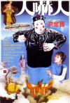

[人吓人](https://pewae.com/gaan/aHR0cHM6Ly9tb3ZpZS5kb3ViYW4uY29tL3N1YmplY3QvMTMwNDAyMQ==)

导演：午马主演：午马 / 林正英 / 洪金宝 / 钟楚红类型：动作 / 历史 / 喜剧 / 奇幻 / 恐怖地区：香港首映时间：1982

搞笑、打斗和鬼怪题材的完美结合。
红姑的古装也很顶，关键是年轻。
开头结尾的穿靴戴帽拔高主题多余。

[楼下的房客](https://pewae.com/gaan/aHR0cHM6Ly9tb3ZpZS5kb3ViYW4uY29tL3N1YmplY3QvMjY1NzU5Mzc=)

导演：崔震东主演：任达华 / 侯彦西 / 冯凯 / 庄凯勋 / 李康生 / 李杏 / 森竣 / 游安顺 / 邵雨薇 / 陈慕义类型：剧情 / 悬疑 / 惊悚地区：台湾首映时间：2016

这也太扯了吧。
邵雨薇身材和表现都表现不错。
导演能力配不上剧本，转场分镜都不够细致。

[猎鬼姐妹](https://pewae.com/gaan/aHR0cHM6Ly9tb3ZpZS5kb3ViYW4uY29tL3N1YmplY3QvMzA0NzQ3MDE=)

原名：Sisters导演：普拉奇亚·平克尧主演：普洛伊尤孔·罗贾纳卡塔尼奥 / 纳纳帕斯·洛特纳姆乔特萨昆 / 芮塔·彭安类型：奇幻 / 恐怖 / 惊悚地区：泰国首映时间：2019

除了飞头的噱头和结尾的飞头大战有看点，其余平平。
猎你奶奶个腿的鬼，被鬼猎还差不多。

[心理罪](https://pewae.com/gaan/aHR0cHM6Ly9tb3ZpZS5kb3ViYW4uY29tL3N1YmplY3QvMjY2OTgwMDA=)

导演：谢东燊主演：万茜 / 封佳奇 / 廖凡 / 张国柱 / 李易峰 / 李纯 / 范湉湉 / 蔡鹭 / 虞朗 / 谢君豪类型：动作 / 悬疑 / 犯罪地区：大陆首映时间：2017

心理分析看着高大上，其实毫无逻辑。
李易峰这个窝囊废，垃圾中的战斗机。
我要是制片人，我都不跟特效团队结尾款。

[抓娃娃](https://pewae.com/gaan/aHR0cHM6Ly9tb3ZpZS5kb3ViYW4uY29tL3N1YmplY3QvMzY2NTM5MTg=)

导演：彭大魔 / 闫非主演：于洋 / 史彭元 / 张子栋 / 李嘉琦 / 沈腾 / 肖帛辰 / 萨日娜 / 贾冰 / 马丽 / 魏翔类型：喜剧地区：大陆首映时间：2024

乐呵乐呵得了，不能想太多。
扒皮楚门的世界，干得还凑合，下次别干了。
片长是主要扣分点，沈腾的大段独白戏，就应该直接全删。

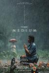

[灵媒](https://pewae.com/gaan/aHR0cHM6Ly9tb3ZpZS5kb3ViYW4uY29tL3N1YmplY3QvMzUyMDg4MjM=)

原名：The Medium导演：班庄·比辛达拿刚主演：Akkaradech Rattanawong / Arunee Wattana / Chatchawat Sanveang / Pakapol Srirongmuang / Sawanee Utoomma / Thanutphon Boonsang / 亚沙卡·柴松 / 纳瑞拉·库尔蒙科尔佩特 / 西拉尼·扬基蒂坎 / 邦松·纳卡普类型：恐怖地区：泰国首映时间：2021

好一场猝不及防的漏点戏。
邪劲是够的，但压迫感还稍显不足。

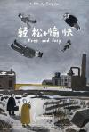

[轻松+愉快](https://pewae.com/gaan/aHR0cHM6Ly9tb3ZpZS5kb3ViYW4uY29tL3N1YmplY3QvMjYzMzU1NjA=)

导演：耿军主演：卿衣 / 张志勇 / 张迅 / 徐刚 / 薛宝鹤 / 袁利国 / 顾本彬类型：喜剧地区：大陆首映时间：2017

在一场骗子流氓的狂欢里，吃亏的永远是老实人。
被片名耽误的好片。
两个警察哪儿找来的，太到位了。

[我的美女老板](https://pewae.com/gaan/aHR0cHM6Ly9tb3ZpZS5kb3ViYW4uY29tL3N1YmplY3QvNDI3NTUwMg==)

导演：李虹主演：何润东 / 包小柏 / 印小天 / 吴大维 / 吴辰君 / 景甜 / 李子雄 / 范明 / 陶虹类型：剧情地区：大陆首映时间：2010

虽然剧情弱智，但景甜竟然完成得还不赖。
这种杰克苏片完全不能接受。

[照明商店](https://pewae.com/gaan/aHR0cHM6Ly9tb3ZpZS5kb3ViYW4uY29tL3N1YmplY3QvMzYwODYyMTA=)

导演：蔡耳朵主演：刘奕君 / 孙千 / 孙美林 / 张琪 / 柳岩 / 白宇帆 / 章若楠 / 郑恺 / 陈思诺 / 黄澄澄类型：剧情 / 奇幻 / 悬疑地区：大陆首映时间：2023

温馨而拖沓。
张琪是个老头，演了太多的老头，但他并不能很好地驾驭各种老头。
在一众绷着演的二线咖中间，竟然发现柳岩还蛮自然的。

[奇门密探](https://pewae.com/gaan/aHR0cHM6Ly9tb3ZpZS5kb3ViYW4uY29tL3N1YmplY3QvMzU2NTYyMjM=)

导演：张敏 / 王晶主演：何浩文 / 孟瑶 / 李嘉 / 林子善 / 甄琪 / 罗家英 / 胡然 / 苑琼丹 / 邱意浓 / 陈浩民类型：古装 / 喜剧地区：大陆首映时间：2021

我知道王晶一直在骗钱，但没想到这次投资方实在太吝啬了，死胖子也回天乏术。
就像小学生用一个下午写了个剧本，又用3个小时给拍了出来。
邱意浓的脸这么快就崩了？这医美不给力啊！

[中国机长](https://pewae.com/gaan/aHR0cHM6Ly9tb3ZpZS5kb3ViYW4uY29tL3N1YmplY3QvMzAyOTU5MDU=)

导演：刘伟强主演：张天爱 / 张涵予 / 李沁 / 杜江 / 杨祺如 / 欧豪 / 袁泉 / 雅玫 / 高戈 / 黄志忠类型：传记 / 剧情 / 灾难地区：大陆首映时间：2019

加了太多没意义的支线，搞得既单调又冗长。
原型在低温下操控飞机手都挂霜了一点不表现，却加个莫名其妙的雷暴，买椟还珠。
杨颖关晓彤焦俊艳赵亮朱亚文还有好多我叫不上名字的人，加塞加得太恶心人了。

[98惊魂记](https://pewae.com/gaan/aHR0cHM6Ly9tb3ZpZS5kb3ViYW4uY29tL3N1YmplY3QvMTI5MzkyMA==)

原名：Psycho导演：格斯·范·桑特主演：威廉姆·H·梅西 / 安妮·海切 / 文斯·沃恩 / 朱丽安·摩尔 / 维果·莫腾森 / 菲利普·贝克·霍尔类型：剧情 / 恐怖 / 悬疑 / 惊悚地区：美国首映时间：1998

这衣服左一件右一件换得这个频哟。
逐帧翻拍有诚意没有创意。

[黄雀在后！](https://pewae.com/gaan/aHR0cHM6Ly9tb3ZpZS5kb3ViYW4uY29tL3N1YmplY3QvMzAzNTk0NDA=)

导演：何文超 / 徐伟主演：冯绍峰 / 张海宇 / 杨烨儿 / 樊登 / 涂松岩 / 苏鑫 / 陈禹同 / 陶虹 / 黄梦莹 / 黄觉类型：剧情 / 悬疑 / 犯罪地区：大陆首映时间：2024

反转的悬念被进度条出卖了。
让陶虹用大段供述的方式来解释案情，过于简单粗暴。
音乐响起的时候总会出戏，陶虹再会哭也没用。

[嘶嘶秘事](https://pewae.com/gaan/aHR0cHM6Ly9tb3ZpZS5kb3ViYW4uY29tL3N1YmplY3QvMzY2MDg1ODU=)

原名：Ahasss导演：阿托·巴蒂斯塔主演：Gold Aceron / Janelle Tee / 安吉拉·莫雷纳类型：情色 / 惊悚地区：菲律宾首映时间：2023

喜欢最后的反转。
女二多露一些就更好了。
白人男作为黑社会大哥来说太不合格了，菲律宾创作团队还得跟老港片多汲取经验。

[被嫌弃的松子的一生](https://pewae.com/gaan/aHR0cHM6Ly9tb3ZpZS5kb3ViYW4uY29tL3N1YmplY3QvMTc4NzI5MQ==)

原名：Kiraware Matsuko no isshô导演：中岛哲也主演：中谷美纪 / 伊势谷友介 / 土屋安娜 / 市川实日子 / 柄本明 / 柴崎幸 / 永山瑛太 / 荒川良良 / 香川照之 / 黑泽明日香类型：剧情 / 歌舞地区：日本首映时间：2006

没什么，只是来看看这条河。
错误的选择之后，未必有修正的机会，性格决定命运。
黑泽明日香气场好强。

[第一炉香](https://pewae.com/gaan/aHR0cHM6Ly9tb3ZpZS5kb3ViYW4uY29tL3N1YmplY3QvMjcxMDI0NzY=)

导演：许鞍华主演：俞飞鸿 / 尹昉 / 张佳宁 / 张钧甯 / 彭于晏 / 梁洛施 / 白冰 / 秦沛 / 范伟 / 马思纯类型：剧情 / 爱情地区：大陆首映时间：2021

俞飞鸿硬吃小鲜肉。
马思纯是该控制一下了，学生装从背后看都是褶子。
张钧甯这个丫鬟怎么看也比夫人和小姐水灵啊！

[夜校](https://pewae.com/gaan/aHR0cHM6Ly9tb3ZpZS5kb3ViYW4uY29tL3N1YmplY3QvMzYzOTQ3MTE=)

导演：刘翁主演：凌文龙 / 吴肇轩 / 张天赋 / 方泳琳 / 李静仪 / 葛民辉 / 詹瑞文 / 郭奕芯 / 陈伊霖 / 黄曦谊类型：冒险 / 喜剧地区：香港首映时间：2023

创意还行，但犯了人物还没树立好就开始瞎搞的大忌。
所以观感非常之乱，看到一个人要先想这人是谁，干什么的。
葛民辉也混成了老艺术家了。

[尸体沐浴](https://pewae.com/gaan/aHR0cHM6Ly9tb3ZpZS5kb3ViYW4uY29tL3N1YmplY3QvMzY3NDc3NTg=)

原名：The Corpse Washer导演：Hadrah Daeng Ratu主演：Aghniny Haque / Amara Sophie / Djenar Maesa Ayu / Ibrahim Risyad / Nelly Sukma / Riafinola Ifani Sari / 冯尼·安格莱尼 / 米安·提亚拉 / 阿吉·桑托萨 / 鲁思·马里尼类型：剧情 / 恐怖 / 惊悚地区：印度尼西亚首映时间：2024

真主不敌巫术。
血量和闪现杀的程度把握都挺好的。
暗戳戳讽刺了一把印尼的重男轻女。

[刀尖](https://pewae.com/gaan/aHR0cHM6Ly9tb3ZpZS5kb3ViYW4uY29tL3N1YmplY3QvMzAxMjM4Nzk=)

导演：高群书主演：张译 / 徐励 / 成泰燊 / 李淳 / 沙溢 / 苏鑫 / 郎月婷 / 金世佳 / 高捷 / 黄志忠类型：剧情 / 悬疑地区：大陆首映时间：2023

一群弱智在秀智商。
张译你成天演这样的玩意儿自己不腻吗？x2
片尾的怀孕梗，高群书被下降头了吧。

[疫起](https://pewae.com/gaan/aHR0cHM6Ly9tb3ZpZS5kb3ViYW4uY29tL3N1YmplY3QvMzUyMTE5MjA=)

导演：林君阳主演：张永正 / 曾敬骅 / 李雪 / 王明台 / 王柏杰 / 薛仕凌 / 赖雨霏 / 陈家逵 / 项婕如 / 高伊玲类型：剧情地区：台湾首映时间：2023

真诚朴实的创作基调，比对岸强多了。
还是想法太多，加了太多的东西，比如出租司机大叔和无聊的恋爱戏。
护士长之死这条支线不错，不行了就是不行了，没有强行拔高。

[性别大派对](https://pewae.com/gaan/aHR0cHM6Ly9tb3ZpZS5kb3ViYW4uY29tL3N1YmplY3QvMzYwMzI4NjE=)

原名：Sex-Positive导演：皮特·伍德瓦德主演：朱丽安娜·戴斯特法诺类型：喜剧地区：美国首映时间：2024

当不穿衣服成为常态之后，真就觉得各种行为都稀松平常了。
婚礼上丈母娘的表现令人瞠目。
女主的妹妹没露，挺失望的。

[爆裂点](https://pewae.com/gaan/aHR0cHM6Ly9tb3ZpZS5kb3ViYW4uY29tL3N1YmplY3QvMzYwMTAxMzY=)

导演：唐唯瀚 / 林超贤主演：周秀娜 / 姜皓文 / 张家辉 / 戴耀明 / 李凯贤 / 杨祐宁 / 梁洛施 / 谭俊彦 / 陈伟霆 / 黄又南类型：动作 / 犯罪地区：香港首映时间：2023

动作场面还可以，比较get梁洛施的颜。
所有人的行动都缺乏逻辑，张家辉党性好强。
陈伟霆一言难尽。

[被我弄丢的你](https://pewae.com/gaan/aHR0cHM6Ly9tb3ZpZS5kb3ViYW4uY29tL3N1YmplY3QvMzYxNzM4Mjc=)

导演：韩琰主演：侯长荣 / 刘恋 / 吴玉芳 / 夏力薪 / 张大大 / 张婧仪 / 果靖霖 / 檀健次 / 蒋龙 / 黄小蕾类型：剧情 / 爱情地区：大陆首映时间：2024

爱伦坡不介意从棺材里爬出来，教教编剧什么是真正的惊悚故事。
张婧仪这张脸可真好看。
明目张胆地坐在货车车斗里从青岛跑到北京，真当警察叔叔吃干饭的？

[燃情岁月](https://pewae.com/gaan/aHR0cHM6Ly9tb3ZpZS5kb3ViYW4uY29tL3N1YmplY3QvMTI5NTg2NQ==)

原名：Legends of the Fall导演：爱德华·兹威克主演：亨利·托马斯 / 克里斯蒂娜·皮克勒斯 / 卡琳娜·隆巴德 / 坦图·卡丁诺 / 安东尼·霍普金斯 / 布拉德·皮特 / 朱莉娅·奥蒙德 / 约翰·诺瓦克 / 艾丹·奎因 / 高登·图托西斯类型：剧情 / 战争 / 爱情 / 西部地区：美国首映时间：1994

当个刺头虽然爽，却永远需要别人帮着擦屁股，这样不好。
印第安人隐忍着，隐忍着，终于有一天，死光了。

[孟买酒店](https://pewae.com/gaan/aHR0cHM6Ly9tb3ZpZS5kb3ViYW4uY29tL3N1YmplY3QvMjY3OTQ3MDE=)

原名：Hotel Mumbai导演：安东尼·马拉斯主演：刘承羽 / 安格斯·麦克拉伦 / 戴夫·帕特尔 / 纳赞宁·波妮阿蒂 / 维品·沙尔马 / 艾米·汉莫 / 萨钦·乔伯 / 蒂尔达·格哈姆-哈维 / 詹森·艾萨克 / 阿努潘·凯尔类型：剧情 / 历史 / 惊悚地区：澳大利亚首映时间：2018

能看但不够好。
印度警察的水平是在搞笑吗？
结尾强行上价值观，难受。

[钛](https://pewae.com/gaan/aHR0cHM6Ly9tb3ZpZS5kb3ViYW4uY29tL3N1YmplY3QvMzQ4MjA5MjU=)

原名：Titane导演：朱利亚·迪库诺主演：Céline Carrère / Mara Cisse / Marin Judas / Myriem Akheddiou / 加朗斯·马里利埃 / 拉易·萨拉梅 / 文森特·林顿 / 贝特朗·波尼洛 / 迪翁-克巴·塔库 / 阿加莎·罗塞勒类型：剧情 / 恐怖地区：法国首映时间：2021

如此车震太毁三观了。
整部片子重金属超标。

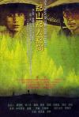

[那山那人那狗](https://pewae.com/gaan/aHR0cHM6Ly9tb3ZpZS5kb3ViYW4uY29tL3N1YmplY3QvMTMwNzc2Ng==)

导演：霍建起主演：党浩予 / 刘烨 / 滕汝骏 / 赵秀丽 / 陈好 / 龚业珩类型：剧情 / 家庭地区：大陆首映时间：1999

史上最败兴字幕：从信封上贴五毛钱能看出，这是明显发生于1996-1999年间的故事，硬生生改成80年代初，这两分丢得冤死了。
陈好这么水灵的村姑，请给我来一打。
片中村民对待邮递员的态度挺好：需要，但也不惯着你。

[红毯先生](https://pewae.com/gaan/aHR0cHM6Ly9tb3ZpZS5kb3ViYW4uY29tL3N1YmplY3QvMzU0OTQ4Mjk=)

导演：宁浩主演：余伟国 / 刘德华 / 单立文 / 宁浩 / 张子贤 / 杨千嬅 / 林熙蕾 / 梁家辉 / 王晶 / 瑞玛·席丹类型：剧情 / 喜剧地区：大陆首映时间：2024

想法太多，就不应该朝着喜剧的方向宣传。
不合时宜的老家伙这种话题真的很不合时宜。
拖沓。

[我爱你](https://pewae.com/gaan/aHR0cHM6Ly9tb3ZpZS5kb3ViYW4uY29tL3N1YmplY3QvMTMwODI4OA==)

导演：张元主演：佟大为 / 侯俊杰 / 张垒 / 徐静蕾 / 杜澎 / 潘星谊 / 王学兵类型：爱情地区：大陆首映时间：2002

徐静蕾在大银幕上还是有作品的。
作精再可爱也是作精。

[猛鬼故事](https://pewae.com/gaan/aHR0cHM6Ly9tb3ZpZS5kb3ViYW4uY29tL3N1YmplY3QvMzM0MTM3MzM=)

原名：Ghost Stories导演：卓娅·阿赫塔尔 / 卡伦·乔哈尔 / 迪巴卡尔·班纳吉 / 阿努拉格·卡施亚普主演：Bidita Bag / Mrunal Thakur / Sobhita Dhulipala / Vijay Varma / 苏雷卡·西克里 / 詹维·卡浦尔类型：恐怖 / 惊悚地区：印度首映时间：2020

第一个故事很好，后三个差了些意思。
印度片永远不缺美女。

[末路狂花钱](https://pewae.com/gaan/aHR0cHM6Ly9tb3ZpZS5kb3ViYW4uY29tL3N1YmplY3QvMzY0MzAzMjI=)

导演：乌日娜主演：于洋 / 刘嘉裕 / 小沈阳 / 张百乔 / 李嘉琦 / 李宗恒 / 李琦 / 董宝石 / 谭卓 / 贾冰类型：剧情 / 喜剧地区：大陆首映时间：2024

看到贾冰后半段的上衣，就想到德云社的闫鹤翔，老郭给徒弟起名前没去过殡仪馆？
套路明显，一切都是最正常的安排，但演得还算真诚。
90年代哪来那么窗明几净的游戏厅？

[灵异神探](https://pewae.com/gaan/aHR0cHM6Ly9tb3ZpZS5kb3ViYW4uY29tL3N1YmplY3QvMzU3OTgyMzc=)

原名：Fenómenas导演：Carlos Therón主演：冬妮·阿科斯塔 / 埃米利奥·古铁雷斯·卡巴 / 米伦·伊瓦古伦类型：恐怖 / 悬疑地区：西班牙首映时间：2023

野合万事兴。
调查人员怎么演得像俩傻子。
女主角身材不错，可惜一直装扑克脸。

[修道院怪案](https://pewae.com/gaan/aHR0cHM6Ly9tb3ZpZS5kb3ViYW4uY29tL3N1YmplY3QvMzAzNDQ2Njk=)

原名：Eerie导演：米哈伊尔·瑞德主演：切洛·桑托斯-孔奇奥 / 杰克·昆卡 / 比雅·阿隆佐 / 麦克斯尼·马加洛娜类型：剧情 / 恐怖 / 悬疑地区：菲律宾首映时间：2018

也太好睡了吧。

[爱的是你](https://pewae.com/gaan/aHR0cHM6Ly9tb3ZpZS5kb3ViYW4uY29tL3N1YmplY3QvMTkyNjAxOA==)

导演：许书绮主演：周伟童 / 张雨提 / 牛青峰 / 高昊类型：爱情地区：大陆首映时间：2006

周韦彤你除了嘟嘴能不能做点别的表情啊！
缅怀一下老版南大亭城堡。
完全没看出来兄弟为什么会情深。

[来都来了](https://pewae.com/gaan/aHR0cHM6Ly9tb3ZpZS5kb3ViYW4uY29tL3N1YmplY3QvMzQ2NzA3MDY=)

导演：刘奋斗主演：乔杉 / 佟丽娅 / 包贝尔 / 唐鉴军 / 廖凡 / 李蔓瑄 / 杜江 / 范伟 / 魏大勋 / 黄璐类型：喜剧地区：大陆首映时间：2024

《孩子还小》>《人都没了》>《大过年的》>《曾经爱过》>《来都来了》
风格严重不统一，《曾经爱过》缺少逻辑，而《来都来了》拍得太过儿戏。
佟丽娅真不错。

[打黑](https://pewae.com/gaan/aHR0cHM6Ly9tb3ZpZS5kb3ViYW4uY29tL3N1YmplY3QvMzY4MjI1NTA=)

导演：秦鹏飞主演：刘峰超 / 包贝尔 / 周开开 / 曲栅栅 / 李大强 / 王宏 / 王正权 / 赵润南 / 释小龙 / 高维蔓类型：动作 / 犯罪地区：大陆首映时间：2024

有种电影类型，叫暴打包贝尔。
各种不合理，就像花絮里包贝尔说的，八个亿就给小弟穿这个啊？
为了突出动作戏把警察拍得跟弱智一样，哪个正常警察抓人不是喊人，而是把小弟打发去买膏药？他不会拼夕夕先批量买好么？

[毕业生代表](https://pewae.com/gaan/aHR0cHM6Ly9tb3ZpZS5kb3ViYW4uY29tL3N1YmplY3QvMzY5NDYwMDY=)

原名：Top 1导演：Artemio Abad主演：Charm Miranda / Christy Imperial / Joseph Ryan Palero / Karen Gaanan / Maria Riya Palma Miranda / Mariane Saint / Myrnell Trinidad / Raffy Ngo / Renz Tantoco / 阿玛尼·赫克托类型：情色地区：菲律宾首映时间：2024

女主真不如女二好看。

[热带往事](https://pewae.com/gaan/aHR0cHM6Ly9tb3ZpZS5kb3ViYW4uY29tL3N1YmplY3QvMjk5ODQwMDA=)

导演：温仕培主演：姜珮瑶 / 张艾嘉 / 彭于晏 / 王砚辉 / 章宇 / 芦鑫 / 邓飞 / 陈永忠类型：剧情 / 悬疑 / 犯罪地区：大陆首映时间：2021

奇怪的调光让人浑身发痒。
没那个本事就不要用多线叙事，谢谢。
细碎。

[绿色地狱](https://pewae.com/gaan/aHR0cHM6Ly9tb3ZpZS5kb3ViYW4uY29tL3N1YmplY3QvMjQyOTgzMzM=)

原名：The Green Inferno导演：伊莱·罗斯主演：亚伦·伯恩斯 / 伊格纳西·阿尔曼德 / 可比·毕丝·布兰顿 / 尼古拉斯·马丁内斯 / 拉蒙·莱 / 斯凯·费雷拉 / 洛伦扎·伊佐 / 艾瑞尔·利维 / 达里尔·沙巴拉 / 麦达·阿帕诺威茨类型：冒险 / 恐怖地区：美国首映时间：2013

本子还不错，可惜不够血腥。
食素妹子决绝的自杀太酷了。
叶子逃跑法也比较有趣。

[玛利亚的乳房](https://pewae.com/gaan/aHR0cHM6Ly93d3cuaW1kYi5jb20vdGl0bGUvdHQzNjczNzA2)

原名：Maria no chibusa导演：takahisa zeze主演：kokone sasaki / shima Ônishi / tomori abe类型：犯罪地区：日本首映时间：2014

佐佐木心音有张倔强的脸孔和小萝卜腿。
女主的特异功能交待得并不清楚，以至于高潮部分有点莫名其妙。

[戏梦巴黎](https://pewae.com/gaan/aHR0cHM6Ly9tb3ZpZS5kb3ViYW4uY29tL3N1YmplY3QvMTI5MTg1Ng==)

原名：The Dreamers导演：贝纳尔多·贝托鲁奇主演：亨利·朗格卢瓦 / 伊娃·格林 / 吉尔伯特·阿代尔 / 安娜·钱斯勒 / 琼-皮尔里·卡尔弗恩 / 罗宾·瑞努奇 / 让-保罗·贝尔蒙多 / 让-皮埃尔·利奥德 / 路易·加瑞尔 / 迈克尔·皮特类型：剧情 / 情色 / 爱情地区：法国首映时间：2003

满眼都是伊娃格林的粉色的乳晕。
伟大的导师，伟大的领袖，伟大的统帅，伟大的舵手。
迷影元素过多，削弱了主题。

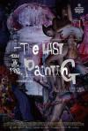

[自画像](https://pewae.com/gaan/aHR0cHM6Ly93d3cuaW1kYi5jb20vdGl0bGUvdHQ3MDEwMzY2)

导演：陈宏一主演：冈本孝 / 吕名尧 / 张乔翔 / 张寗 / 林哲熹 / 林微弋 / 郑人硕类型：剧情 / 神秘地区：台湾首映时间：2017

充满了生硬的政治隐喻，如此表现理想主义者的死不瞑目除了花哨一点意义不大。

[来福大酒店](https://pewae.com/gaan/aHR0cHM6Ly9tb3ZpZS5kb3ViYW4uY29tL3N1YmplY3QvMzYxNzM4MTk=)

导演：刘博文主演：任洛敏 / 刘洋 / 张哲华 / 徐小飒 / 李晓川 / 柳岩 / 王飞 / 葛四 / 董宝石 / 黄轩类型：剧情 / 喜剧 / 爱情地区：大陆首映时间：2024

老甘井子的场景殊为难得，可东北方言听着好别扭。
柳岩的演技上去了，脸倒是崩了，胸怎么好像缩了？
结尾大俗。

[道路](https://pewae.com/gaan/aHR0cHM6Ly9tb3ZpZS5kb3ViYW4uY29tL3N1YmplY3QvMzYyNDU2NDE=)

原名：Camino导演：波吉特·斯塔莫主演：Christian Rubeck / Danica Curcic / Darren Pettie类型：剧情 / 喜剧地区：丹麦首映时间：2023

生活终将继续。
一切仍靠自己。

[鬼作秀](https://pewae.com/gaan/aHR0cHM6Ly9tb3ZpZS5kb3ViYW4uY29tL3N1YmplY3QvMTI5NjAwOA==)

原名：Creepshow导演：乔治·A·罗梅罗主演：e·g·马绍尔 / 哈尔·霍尔布鲁克 / 斯蒂芬·金 / 特德·丹森 / 艾德·哈里斯 / 莱斯利·尼尔森 / 阿德里安娜·巴比欧类型：喜剧 / 奇幻 / 恐怖地区：美国首映时间：1982

史蒂芬金演的傻子好传神。
过场动画不错。
最后的蟑螂海简单粗暴，却很少有这么拍的。

[落水狗](https://pewae.com/gaan/aHR0cHM6Ly9tb3ZpZS5kb3ViYW4uY29tL3N1YmplY3QvMTI5OTYwMw==)

原名：Reservoir Dogs导演：昆汀·塔伦蒂诺主演：克里斯·潘 / 兰迪·布鲁克斯 / 劳伦斯·蒂尔尼 / 史蒂夫·布西密 / 哈威·凯特尔 / 昆汀·塔伦蒂诺 / 柯克·鲍兹 / 爱德华·邦克 / 蒂姆·罗斯 / 迈克尔·马德森类型：惊悚 / 犯罪地区：美国首映时间：1992

不管怎么看不起gay，他是最后活下来的那个。
昆汀的哪怕是处女作也是话密到脑壳炸开。
喜欢干死保安那段。

[猛鬼夜惊魂](https://pewae.com/gaan/aHR0cHM6Ly9tb3ZpZS5kb3ViYW4uY29tL3N1YmplY3QvMTMwNjA2NA==)

原名：Night of the Scarecrow导演：杰夫布尔主演：Elizabeth Barondes ···· Claire Goodman / Martine Beswick ···· Barbara / William Joseph Barker ···· Kyle类型：恐怖 / 科幻地区：美国首映时间：1995

纯粹的坏，也挺爽的，可惜略单调。
稻草人形象好评。

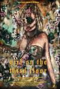

[三层楼的女孩](https://pewae.com/gaan/aHR0cHM6Ly9tb3ZpZS5kb3ViYW4uY29tL3N1YmplY3QvMzAzODAzMTY=)

原名：Girl on the Third Floor导演：特拉维斯·史蒂文斯主演：CM朋克 / 凯伦·沃迪奇 / 崔维斯·德尔加多 / 托妮亚·凯 / 毕肖普·史蒂文 / 翠斯提·凯莉·邓恩 / 艾丽莎·道林 / 莎拉·布鲁克斯 / 阿尼什·杰特玛拉尼 / 马歇尔·宾类型：恐怖地区：美国首映时间：2019

女鬼婊里婊气。
对玻璃球的使用相当有创意。
但狗子那段又太俗了。

[女鸨安](https://pewae.com/gaan/aHR0cHM6Ly9tb3ZpZS5kb3ViYW4uY29tL3N1YmplY3QvMzY4OTM1OTg=)

原名：Lady Guard导演：Bobby Bonifacio Jr·主演：Anthony Dabao / Gboy Pablo / Irish Tan / Izza Watanabe / MJ Abellera / 安吉拉·莫雷纳类型：剧情地区：菲律宾首映时间：2024

假奶之量。
剧情也很扯，能举报输钱的早就去举报了。

[姥姥的外孙](https://pewae.com/gaan/aHR0cHM6Ly9tb3ZpZS5kb3ViYW4uY29tL3N1YmplY3QvMzYzMjgyMTA=)

原名：How to Make Millions Before Grandma Dies导演：帕特·波尼蒂帕特主演：三亚·库纳康 / 乌萨·萨梅坎姆 / 当蓬·欧阿披叻 / 彤达婉·奔提维此弓 / 普提蓬·阿萨拉塔纳功 / 莎琳拉·托马斯 / 西玛瓦理·塔利吉 / 邦沙敦·宗威拉克类型：剧情地区：泰国首映时间：2024

人间哪有真情在，多赚五块是五块。
是泰国的重男轻女，还是华裔的重男轻女，傻傻分不清楚。
所谓的家和万事兴，不过是有人愿意和稀泥，有人愿意装糊涂。

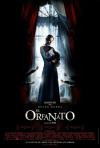

[孤堡惊情](https://pewae.com/gaan/aHR0cHM6Ly9tb3ZpZS5kb3ViYW4uY29tL3N1YmplY3QvMjEyMjc2Ng==)

原名：The Orphanage导演：J·A·巴亚纳主演：Edgar Vivar / Georgina Avellaneda / Mireia Renau / Montserrat Carulla / 奥斯卡·卡萨斯 / 安德烈斯·赫尔德鲁迪克斯 / 玛贝尔·里维拉 / 罗赫尔·普林赛普 / 贝伦·鲁埃达 / 费尔南多·卡约类型：剧情 / 恐怖 / 悬疑 / 惊悚地区：西班牙首映时间：2010

早会死，晚会死，早晚都会死。
求仁得仁的结局，死了也没什么不好。

[我开始自慰的那一年](https://pewae.com/gaan/aHR0cHM6Ly9tb3ZpZS5kb3ViYW4uY29tL3N1YmplY3QvMzU1MjQzNTA=)

原名：The Year I Started Masturbating导演：Erika Wasserman主演：Antonio Di Ponziano / Jesper Zuschlag / Pablo Leiva Wenger / Siw Erixon / Vera Carlbom / 亨里克·多尔辛 / 凯蒂娅·温特 / 努尔·埃尔-雷法伊 / 戴维·维贝格 / 汉内斯·福林类型：剧情 / 喜剧地区：瑞典首映时间：2022

太注重女性主义个性的表达，以至于故事完全背离了基本逻辑。
女主这样的人，无论男女，都不要出现在我身边。

[食人鱼3D](https://pewae.com/gaan/aHR0cHM6Ly9tb3ZpZS5kb3ViYW4uY29tL3N1YmplY3QvMjI2OTg5Mw==)

原名：Piranha 3D导演：亚历山大·阿嘉主演：伊丽莎白·苏 / 伊莱·罗斯 / 克里斯托弗·洛伊德 / 凯莉·布鲁克 / 史蒂夫·R·麦奎因 / 文·瑞姆斯 / 杰瑞·奥康奈尔 / 杰西卡·斯佐尔 / 理查德·德莱福斯 / 雷丽·斯蒂尔类型：喜剧 / 恐怖 / 惊悚地区：美国首映时间：2010

这样的导演才是真心为观众着想，会拍你就多拍点。
被马达绞下头皮那里真心不赖。

[性和死亡101](https://pewae.com/gaan/aHR0cHM6Ly9tb3ZpZS5kb3ViYW4uY29tL3N1YmplY3QvMTkxNzI5OQ==)

原名：Sex and Death 101导演：丹尼尔·沃特斯主演：罗伯特·维斯多姆 / 莱丝莉·比伯 / 薇诺娜·瑞德 / 西蒙·贝克类型：剧情 / 喜剧 / 爱情地区：美国首映时间：2007

既新颖又没诚意的套路。
整车跟大夫那里比较放飞，好评。
结尾无聊。

[神偷奶爸4](https://pewae.com/gaan/aHR0cHM6Ly9tb3ZpZS5kb3ViYW4uY29tL3N1YmplY3QvMzAxNzA4NDc=)

原名：Despicable Me 4导演：克里斯·雷纳德 / 帕特里克·德拉吉主演：乔伊·金 / 克里斯·雷纳德 / 克里斯汀·韦格 / 史蒂夫·卡瑞尔 / 威尔·法瑞尔 / 皮埃尔·柯芬 / 米兰达·卡斯格拉夫 / 索菲娅·维加拉 / 达纳·盖尔 / 麦迪逊·波兰类型：冒险 / 动画 / 喜剧地区：美国首映时间：2024

全程无笑点。
强化小黄人感觉就是40年前的段子。
至于那个反派，怕是有80年历史了吧。

[闹事之徒](https://pewae.com/gaan/aHR0cHM6Ly9tb3ZpZS5kb3ViYW4uY29tL3N1YmplY3QvMzYxODE5NjU=)

原名：The Instigators导演：道格·里曼主演：保罗·沃尔特·豪泽 / 卡西·阿弗莱克 / 周洪 / 托比·琼斯 / 文·瑞姆斯 / 朗·普尔曼 / 杰克·哈洛 / 迈克尔·斯图巴 / 阿尔弗雷德·莫里纳 / 马特·达蒙类型：剧情 / 动作 / 喜剧 / 悬疑 / 惊悚 / 犯罪地区：美国首映时间：2024

一般。

[断魂小丑](https://pewae.com/gaan/aHR0cHM6Ly9tb3ZpZS5kb3ViYW4uY29tL3N1YmplY3QvMjY5MjQzNTE=)

原名：Terrifier导演：达米安·利昂主演：Matt McAllister / 凯瑟琳·科科兰 / 凯蒂·马奎尔 / 吉诺·卡法雷利 / 大卫·霍华德·桑顿 / 波亚·穆赫辛尼 / 珍娜·凯内尔 / 科里·杜瓦尔 / 萨曼莎·斯卡菲迪 / 迈克尔·利维类型：恐怖 / 惊悚地区：美国首映时间：2018

血量和变态程度绝对在线。
被害人的智商断电拉低了整体效果。
场景肉眼可见的磕碜。

[断魂小丑2](https://pewae.com/gaan/aHR0cHM6Ly9tb3ZpZS5kb3ViYW4uY29tL3N1YmplY3QvMzQ4MTY4Nzc=)

原名：Terrifier 2导演：达米安·利昂主演：凯莉·海曼 / 凯蒂·马奎尔 / 凯西·哈特内特 / 劳伦·拉维拉 / 埃利奥特·富勒姆 / 大卫·霍华德·桑顿 / 杰基·阿德拉格纳 / 艾米莉·麦克莱恩 / 萨拉·沃伊特 / 费莉莎·罗斯类型：恐怖地区：美国首映时间：2022

变长了，也变差了。
地狱开门什么的真的很无聊。

[断魂小丑3](https://pewae.com/gaan/aHR0cHM6Ly9tb3ZpZS5kb3ViYW4uY29tL3N1YmplY3QvMzYyMjE5OTE=)

原名：Terrifier 3导演：达米安·利昂主演：丹尼尔·洛巴克 / 克里斯·杰里科 / 劳伦·拉维拉 / 埃利奥特·富勒姆 / 大卫·霍华德·桑顿 / 布拉德利·斯泰克尔 / 拜斯·约翰逊 / 杰森·帕特里克 / 玛格丽特·安妮·佛罗伦斯 / 萨曼莎·斯卡菲迪类型：恐怖地区：美国首映时间：2024

血量更大，紧张感又回来了。
把故事触发时间从万圣节挪到圣诞节是亮点。

[电钻狂魔](https://pewae.com/gaan/aHR0cHM6Ly9tb3ZpZS5kb3ViYW4uY29tL3N1YmplY3QvMTk0NzMwMg==)

原名：The Slumber Party Massacre导演：艾米·霍尔登·琼斯主演：米歇尔·迈克尔斯 / 罗宾·斯蒂尔类型：喜剧 / 恐怖地区：美国首映时间：1982

古早风就算了，金发美女们实在是过于傻缺。
杀手非要用电钻也是蠢得没边儿了。

[潇洒先生](https://pewae.com/gaan/aHR0cHM6Ly9tb3ZpZS5kb3ViYW4uY29tL3N1YmplY3QvMzA2MDcyOQ==)

导演：郑则仕主演：关之琳 / 张国强 / 成奎安 / 戚美珍 / 曹建南 / 柏安妮 / 楼南光 / 焦姣 / 郑则仕 / 陆剑明类型：喜剧地区：香港首映时间：1989

片尾催人泪下。
关之琳的角色有点婊啊。
楼南光和张国强同时演好人也真是罕见。

[一雪前耻](https://pewae.com/gaan/aHR0cHM6Ly9tb3ZpZS5kb3ViYW4uY29tL3N1YmplY3QvMzY4ODIxNTg=)

导演：于广义 / 于秋石主演：乔杉 / 修睿 / 刘奕铁 / 包贝尔 / 周大勇 / 潘斌龙 / 王乃训 / 艾丽娅 / 赵龙豪 / 马丽类型：剧情 / 喜剧 / 犯罪地区：大陆首映时间：2024

后半部分有点放飞，但就还好。
感受不到马丽的年龄特征，也挺神奇的。
演一毛一的赵龙豪真不错。

[大笑喜剧人](https://pewae.com/gaan/aHR0cHM6Ly9tb3ZpZS5kb3ViYW4uY29tL3N1YmplY3QvMzY5MDkyMDc=)

导演：柳航主演：刘亚津 / 孙建弘 / 张尧 / 那威类型：喜剧地区：大陆首映时间：2024

既不大笑也不喜剧更不当人。

[默杀](https://pewae.com/gaan/aHR0cHM6Ly9tb3ZpZS5kb3ViYW4uY29tL3N1YmplY3QvMzY4NzczMjI=)

导演：柯汶利主演：吴镇宇 / 张钧甯 / 徐娇 / 王传君 / 王圣迪 / 王成思 / 蔡明 / 金士杰 / 阿如那 / 黄明昊类型：剧情 / 悬疑 / 犯罪地区：大陆首映时间：2024

主线挺好，演得也行，没必要把吴镇宇和黄明昊搅进来搞的那么复杂。
国产的片子暴力到这个尺度可以了，可惜了在马来西亚拍。
蔡明是亮点。

[珀尔](https://pewae.com/gaan/aHR0cHM6Ly9tb3ZpZS5kb3ViYW4uY29tL3N1YmplY3QvMzU4MDE4MTk=)

原名：Pearl导演：缇·威斯特主演：加布·麦克唐纳 / 劳伦·斯图尔特 / 坦蒂·莱特 / 大卫·科伦斯韦 / 托德·里彭 / 米娅·高斯 / 艾玛·詹金斯·普罗 / 艾米莉亚·瑞德 / 阿利斯泰尔·休厄尔 / 马修·桑德兰类型：恐怖地区：加拿大首映时间：2022

全片没什么意思，但是女主的表演让人不寒而栗。
关于流感的内容真像是结合疫情加进去的。
我喜欢烤乳猪的造型。

[逆鳞](https://pewae.com/gaan/aHR0cHM6Ly9tb3ZpZS5kb3ViYW4uY29tL3N1YmplY3QvMzY4NDc3NDQ=)

导演：大庆主演：刘欢 / 张雨绮 / 曲哲明 / 沈腾 / 蒋冰 / 蔡文静 / 袁布 / 陶海 / 高捷 / 魏翔类型：剧情 / 犯罪地区：大陆首映时间：2024

澳门这屁大地方还称个城堡？
高捷演的大佬有毛病。
张雨绮以后出场还是用配音吧。

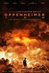

[奥本海默](https://pewae.com/gaan/aHR0cHM6Ly9tb3ZpZS5kb3ViYW4uY29tL3N1YmplY3QvMzU1OTMzNDQ=)

原名：Oppenheimer导演：克里斯托弗·诺兰主演：乔什·哈奈特 / 卡西·阿弗莱克 / 基里安·墨菲 / 大卫·克朗姆霍茨 / 小罗伯特·唐尼 / 弗洛伦丝·皮尤 / 杰森·克拉克 / 艾米莉·布朗特 / 阿尔登·埃伦瑞奇 / 马特·达蒙类型：传记 / 剧情 / 历史地区：美国首映时间：2023

想起我那聪明圆润刻薄又狡猾的前任业务经理，同样没什么有趣的故事可拍。
这哪里能叫迫害，不就是不让参与重要项目了么。
漏点戏完全get不到。

[屠夫](https://pewae.com/gaan/aHR0cHM6Ly9tb3ZpZS5kb3ViYW4uY29tL3N1YmplY3QvMzUxMzgwMTM=)

原名：Butchers导演：Adrian Langley主演：Anne-Carolyne Binette / Blake Canning / Frederik Storm / Jonathan Largy / Julie Mainville / Michael Swatton / Samantha De Benedet / 尼克·艾伦 / 西蒙·飞利普斯 / 詹姆斯·杰拉尔德·希克斯类型：恐怖地区：加拿大首映时间：2020

全是老套路且血量不足。

[屠夫2](https://pewae.com/gaan/aHR0cHM6Ly9tb3ZpZS5kb3ViYW4uY29tL3N1YmplY3QvMzY3ODI2OTU=)

导演：阿德里安·兰利主演：Michael Swatton / Sam Huntsman / 尼克·比斯库佩克类型：恐怖地区：加拿大首映时间：2024

直到最后也没看出来被绑架的是个女的还是女装大佬，这大脑门子。
调色蛮喜欢。
跟第一部同一个问题，血量太少。

[自己去看](https://pewae.com/gaan/aHR0cHM6Ly9tb3ZpZS5kb3ViYW4uY29tL3N1YmplY3QvMTQyMjE4Ng==)

原名：Come and See导演：依莱姆·克里莫夫主演：Evgeniy Tilicheev / G· Velts / Jüri Lumiste / Kazimir Rabetsky / 亚历山大·别尔达 / 佛拉德斯·巴格多纳斯 / 奥尔加·米罗诺娃 / 柳博米拉斯·劳恰维丘斯 / 维克托·洛伦茨 / 阿列克谢·克拉夫琴科类型：剧情 / 战争地区：苏联首映时间：1985

可能更接近战争的真实状态。
开头那段是战斗民族表现无知小孩对战争的向往吗？太狂暴了。
苏联游击队的装备非常具体。

[白昼如焚](https://pewae.com/gaan/aHR0cHM6Ly9tb3ZpZS5kb3ViYW4uY29tL3N1YmplY3QvMzU3MDA4NjM=)

导演：李保樟主演：刘以豪 / 刘林青 / 吕良伟 / 李靖筠 / 邓丽欣类型：剧情地区：香港首映时间：2024

什么年代了，验尸都不验DNA的。
邓丽欣也不年轻了，演女学生真的力不从心，而且完全没看出分饰的两角有什么区别。
现在的港片也非要坏人死掉或者进监狱了，真无聊。

[姨妈的后现代生活](https://pewae.com/gaan/aHR0cHM6Ly9tb3ZpZS5kb3ViYW4uY29tL3N1YmplY3QvMTc5NDQzNQ==)

导演：许鞍华主演：关文硕 / 卢燕 / 史可 / 周润发 / 斯琴高娃 / 方青卓 / 焦刚 / 王子文 / 赵薇 / 陈逸恒类型：剧情 / 喜剧 / 爱情地区：大陆首映时间：2007

前面大半精彩绝伦，后面一小段鞍山的故事没过脑子。
周润发饰演老骗子惟妙惟肖。
赵薇演的流于表面，东北话更是惨不忍睹。

[浴火之路](https://pewae.com/gaan/aHR0cHM6Ly9tb3ZpZS5kb3ViYW4uY29tL3N1YmplY3QvMzYyMTExNjk=)

导演：五百主演：冯德伦 / 刘烨 / 吴晓亮 / 宋宁峰 / 张百乔 / 潘斌龙 / 王宏伟 / 王迅 / 肖央 / 赵丽颖类型：剧情 / 犯罪地区：大陆首映时间：2024

主要人物都有大病，但最出彩的部分是婚礼上小刀对刺的动作戏。
赵丽颖从头到尾没什么情绪变化，这就是所谓的演技好？
都什么年代了，还玩傻儿子不傻这一套。

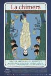

[奇美拉](https://pewae.com/gaan/aHR0cHM6Ly9tb3ZpZS5kb3ViYW4uY29tL3N1YmplY3QvMzU0NDg1Mzk=)

原名：La Chimera导演：阿莉切·罗尔瓦赫尔主演：Gian Piero Capretto / Giuliano Mantovani / Melchiorre Pala / Ramona Fiorini / 乔什·奥康纳 / 伊莎贝拉·罗西里尼 / 卡罗尔·杜阿尔特 / 文森佐·内莫拉托 / 阿尔芭·罗尔瓦赫尔 / 露·罗-伊莱科内类型：冒险 / 喜剧 / 奇幻 / 爱情地区：意大利首映时间：2023

看懂了也没看懂，哪儿来的那么高的评价？
女主的笑容很治愈。

[完美的日子](https://pewae.com/gaan/aHR0cHM6Ly9tb3ZpZS5kb3ViYW4uY29tL3N1YmplY3QvMzU5MDI4NTc=)

原名：Perfect Days导演：维姆·文德斯主演：三浦友和 / 中野有纱 / 山田葵 / 役所广司 / 柄本时生 / 田中泯 / 石川小百合 / 麻生祐未类型：剧情地区：日本首映时间：2024

完美的日子，向往的生活。
以后是以后，现在是现在。
唯一的缺点是屌丝同事演得过于浮夸。

[绑架游戏](https://pewae.com/gaan/aHR0cHM6Ly9tb3ZpZS5kb3ViYW4uY29tL3N1YmplY3QvMzUwMDcxMjY=)

导演：张哲主演：修睿 / 刘頔 / 史策 / 唐赟 / 姚橹 / 宋词 / 小爱 / 彭昱畅 / 胡冰卿类型：剧情 / 悬疑 / 犯罪地区：大陆首映时间：2024

正常人炖鸟不摘肠子？
胡冰卿很漂亮啊，光混电视剧可惜了。
有点假，有点装，但娱乐性还是到位了。

[无价之宝](https://pewae.com/gaan/aHR0cHM6Ly9tb3ZpZS5kb3ViYW4uY29tL3N1YmplY3QvMzU0NDgzODQ=)

导演：张大鹏主演：周依然 / 张国强 / 张懿曼 / 张译 / 方青卓 / 潘斌龙 / 程曦 / 袁晓旭 / 郝蕾 / 黄婧仪类型：剧情 / 喜剧 / 家庭地区：大陆首映时间：2023

小女孩长大之前真不错，然后就崩坏了。
张译你成天演这样的玩意儿自己不腻吗？x3
潘斌龙你成天演这样的玩意儿自己不腻吗？

[九龙城寨之围城](https://pewae.com/gaan/aHR0cHM6Ly9tb3ZpZS5kb3ViYW4uY29tL3N1YmplY3QvMjQyODQxNzU=)

导演：郑保瑞主演：任贤齐 / 伍允龙 / 刘俊谦 / 古天乐 / 廖子妤 / 张文杰 / 林峯 / 洪金宝 / 胡子彤 / 黄德斌类型：动作 / 犯罪地区：香港首映时间：2024

这年代还在拍这种复古动作戏，勇气可嘉但真没什么意思。
动作设计得不爽利，非常强的粘滞感，就是干了半天不死人。
郭富城演的啥臭狗屎。

[食人鱼3DD](https://pewae.com/gaan/aHR0cHM6Ly9tb3ZpZS5kb3ViYW4uY29tL3N1YmplY3QvNTMyMzkxMQ==)

原名：Piranha 3DD导演：约翰·古拉格主演：Adrian Martinez / Chris Zylka / Meagan Tandy / Paul James Jordan / 丹妮尔·帕娜贝克 / 克鲁·古拉格 / 大卫·科恩查内 / 让-卢克·比洛多 / 赫克特·吉门雷兹 / 马特·布什类型：喜剧 / 恐怖 / 惊悚 / 灾难地区：美国首映时间：2012

这拍续集咋还减预算了呢？
死法缺少新意，除了从女二BB里钻出的小鱼。
救护员找了霹雳游侠来自嘲。

[黑火](https://pewae.com/gaan/aHR0cHM6Ly9tb3ZpZS5kb3ViYW4uY29tL3N1YmplY3QvMTkxOTIyMw==)

导演：李妮主演：胡军 / 贾宏声 / 邹倚天类型：剧情 / 犯罪地区：大陆首映时间：1993

莫名其妙乱轰一气。
当年跟风上的动作片的典型。
不过有胡军和贾宏声两大帅哥，当卖肉片看也行。

[三叉戟](https://pewae.com/gaan/aHR0cHM6Ly9tb3ZpZS5kb3ViYW4uY29tL3N1YmplY3QvMjY5MDM5NTE=)

导演：高群书主演：姜武 / 欧豪 / 苏鑫 / 董勇 / 邢佳栋 / 郭涛 / 金士杰 / 韩庚 / 魏晨 / 黄志忠类型：犯罪地区：大陆首映时间：2024

剧本老套，剪辑稀碎。
三个男主角并不怎么来电。
你一个经济犯罪题材，整那么多混混干架的场面，是因为写不出来斗智戏么？

[教父](https://pewae.com/gaan/aHR0cHM6Ly9tb3ZpZS5kb3ViYW4uY29tL3N1YmplY3QvMTI5MTg0MQ==)

原名：The Godfather导演：弗朗西斯·福特·科波拉主演：斯特林·海登 / 理查德·卡斯特尔诺 / 理查德·康特 / 约翰·马利 / 罗伯特·杜瓦尔 / 艾尔·勒提埃里 / 詹姆斯·肯恩 / 阿尔·帕西诺 / 马龙·白兰度 / 黛安·基顿类型：剧情 / 犯罪地区：美国首映时间：1972

但你需要先喝杯酒。
政客跟黑手党并无什么差别，疑罪从杀。
第一幕出现的猫好可爱，可惜后面没戏份了。

[巫术面具](https://pewae.com/gaan/aHR0cHM6Ly9tb3ZpZS5kb3ViYW4uY29tL3N1YmplY3QvMzYzMjgzNDU=)

原名：Black Magic Mask导演：phasit panithocharoonroj / sathanapong limwongthong主演：Jack Jarupong / Milky Praiya Padungsuk / 因泰拉·贾龙珀拉类型：剧情 / 恐怖 / 情色地区：泰国首映时间：2023

又丑又土，还不肯脱。

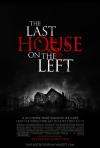

[杀人不分左右](https://pewae.com/gaan/aHR0cHM6Ly9tb3ZpZS5kb3ViYW4uY29tL3N1YmplY3QvMjk3NzM1Nw==)

原名：The Last House on the Left导演：丹尼斯·伊利亚迪主演：亚伦·保尔 / 加瑞特·迪拉胡特 / 托尼·戈德温 / 斯宾塞·崔特·克拉克 / 玛莎·麦萨克 / 瑞琪·琳德赫姆 / 约书亚·考克斯 / 莫妮卡·波特 / 萨拉·帕克斯顿 / 迈克尔·鲍文类型：剧情 / 惊悚 / 犯罪地区：美国首映时间：2009

没事别乱飞叶子。
重要的事情说三遍：学游泳，学游泳，学游泳！

[因果报应](https://pewae.com/gaan/aHR0cHM6Ly9tb3ZpZS5kb3ViYW4uY29tL3N1YmplY3QvMzY5MzQ5MDg=)

原名：谁偷了垃圾桶？(台),天道轮回,玛哈拉贾,What Goes Around Comes Around导演：尼蒂兰·萨米纳坦主演：玛玛塔·莫汉达斯 / 穆尼什坎特 / 维杰·西图帕提 / 萨沙纳·纳米达斯 / 辛加姆普利 / 迪维亚·巴拉蒂 / 那塔拉简·苏布拉马尼亚姆 / 阿努拉格·卡施亚普 / 阿比拉米 / 阿鲁多斯类型：动作 / 悬疑 / 犯罪地区：印度首映时间：2024

印度也有故事会?
脸盲第一个小时分不清男主角和大BOSS。
虽然没有出现歌舞，但是节奏仍旧比较拖沓。

[逆行人生](https://pewae.com/gaan/aHR0cHM6Ly9tb3ZpZS5kb3ViYW4uY29tL3N1YmplY3QvMzY3NzQwMDE=)

原名：英雄无泪导演：徐峥主演：丁勇岱 / 丁嘉丽 / 冯兵 / 刘美含 / 徐峥 / 王骁 / 贾冰 / 辛芷蕾 / 邬家楷 / 陈哈琳类型：剧情地区：大陆首映时间：2024

除去故事内核，叙事挺流畅的，但是故事的内核是偏的，看不到对于内卷的任何批判。
全片看不到对于规则的敬畏。
直接结束在徐峥被车撞死，片子的B格会提升很多。

[活色生香](https://pewae.com/gaan/aHR0cHM6Ly9tb3ZpZS5kb3ViYW4uY29tL3N1YmplY3QvMTMwMjM2OQ==)

原名：Live Flesh导演：佩德罗·阿莫多瓦主演：亚历克斯·安克吕罗 / 何塞·桑乔 / 佩内洛普·克鲁兹 / 利贝托·拉巴尔 / 哈维尔·巴登 / 安吉拉·莫利纳 / 弗朗西斯卡·内莉 / 碧拉尔·巴登 / 马蒂亚斯·普拉茨 / 马里奥拉·福恩特斯类型：剧情 / 情色 / 惊悚 / 爱情地区：西班牙首映时间：1997

你的青春不属于你。
轮椅篮球这么受欢迎？
飞叶子真的能放大情绪吗？

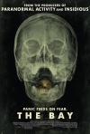

[恐怖海湾](https://pewae.com/gaan/aHR0cHM6Ly9tb3ZpZS5kb3ViYW4uY29tL3N1YmplY3QvNTMyNTMzNQ==)

原名：The Bay导演：巴瑞·莱文森主演：Beckett Clayton-Luce / Dave Hager / Kimberly Campbell / Nansi Aluka / 克里斯托弗·邓汉 / 克里斯汀·康奈利 / 凯瑟·多诺休 / 史蒂芬·坤肯 / 弗兰克·迪尔 / 维尔·罗杰斯类型：恐怖 / 惊悚 / 科幻地区：美国首映时间：2012

溃疡的皮肤是唯一亮点。
伪纪录片玩的不好，多线导致太散。
1：21：03惊现江苏新闻网。

[求爱敢死队](https://pewae.com/gaan/aHR0cHM6Ly9tb3ZpZS5kb3ViYW4uY29tL3N1YmplY3QvMTMwMTE2Mg==)

导演：王晶主演：丁羽 / 冯淬帆 / 吴君如 / 张曼玉 / 曾华倩 / 曾志伟 / 李美凤 / 林俊贤 / 王晶 / 邱淑贞类型：喜剧 / 爱情地区：香港首映时间：1988

扒皮版追女仔，王晶为了钱可以出卖一切。
王晶竟然比曾志伟要高不少……
兔牙版张曼玉真是青春无敌。

[性爱娃娃](https://pewae.com/gaan/aHR0cHM6Ly9tb3ZpZS5kb3ViYW4uY29tL3N1YmplY3QvMjY5NDI4NDQ=)

原名：Sex Doll导演：西尔薇·维尔海迪主演：保罗·艾米 / 卡罗尔·罗彻 / 杰瑞米·班尼特 / 林赛·卡拉莫 / 米丽娅姆·洁洁丽 / 艾拉·马克斯 / 西蒙·基利克 / 阿什·斯戴梅斯特 / 阿弗西娅·埃尔奇类型：剧情 / 情色地区：法国首映时间：2016

这片有什么意思，马夫爱上头牌，大明朝就不兴这么写了。
出来卖还一股子政治正确味儿。
男主颜值不错。

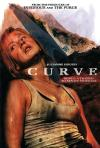

[搭车遇狼惊魂记](https://pewae.com/gaan/aHR0cHM6Ly9tb3ZpZS5kb3ViYW4uY29tL3N1YmplY3QvMjY2NDY5MDk=)

原名：Curve导演：伊恩·索夫特雷主演：佩内洛普·米契尔 / 库尔特·布莱恩特 / 德鲁·劳施 / 朱莉安·浩夫 / 泰迪·西尔斯 / 马达琳·侯切尔类型：恐怖 / 惊悚地区：美国首映时间：2015

女主非常漂亮，整体太一般。
男女主轮流脑子短路，根本是在拖延时间。

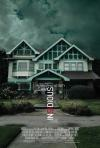

[潜伏](https://pewae.com/gaan/aHR0cHM6Ly9tb3ZpZS5kb3ViYW4uY29tL3N1YmplY3QvNDgxNzkwMQ==)

原名：Insidious导演：温子仁主演：安德鲁·阿斯特 / 安格斯·桑普森 / 希瑟·托奎尼 / 帕特里克·威尔森 / 林·沙烨 / 泰·辛普金斯 / 科比特·塔克 / 罗丝·伯恩 / 芭芭拉·赫希 / 雷·沃纳尔类型：恐怖 / 惊悚地区：美国首映时间：2010

平庸的开局有个牛叉的结尾。

[走走停停](https://pewae.com/gaan/aHR0cHM6Ly9tb3ZpZS5kb3ViYW4uY29tL3N1YmplY3QvMzU5NTYxOTA=)

导演：龙飞主演：刘仪伟 / 刘钧 / 周野芒 / 岳红 / 张鲁一 / 甘昀宸 / 胡歌 / 袁弘 / 金靖 / 高圆圆类型：剧情 / 喜剧 / 家庭地区：大陆首映时间：2024

生活没有那么好，也没有那么糟糕，习惯了就好，但是……
超级喜欢片子的结尾，在国内能把结尾拍得出色的导演比熊猫还珍贵。
唯一的缺憾是大美圆，在表演上实在没什么天赋，差了点点意思。

[熊猫计划](https://pewae.com/gaan/aHR0cHM6Ly9tb3ZpZS5kb3ViYW4uY29tL3N1YmplY3QvMzY0NDEzODU=)

导演：张栾主演：史策 / 安地 / 成龙 / 芮丹尼 / 莎莎 / 诺克 / 贾冰 / 韩彦博 / 马铁摩 / 魏翔类型：动作 / 喜剧地区：大陆首映时间：2024

普通的低龄合家欢。
如果以90年代的成龙电影标准要求，自然不行；以70年代的成龙标准看，中规中矩甚至出彩；以2010年代的成龙电影标准要求，则是大大的进步了。
为什么特意提熊猫的名字，还放在第一主演,难道片里不全是CG吗？

[死亡大乐透](https://pewae.com/gaan/aHR0cHM6Ly9tb3ZpZS5kb3ViYW4uY29tL3N1YmplY3QvMzYyOTM2MzY=)

原名：Jackpot!导演：保罗·费格主演：亚当·雷 / 凡妮莎卡特 / 刘思慕 / 奥卡菲娜 / 约翰·塞纳 / 艾登·梅耶里 / 莱斯利·大卫·贝克 / 西恩·威廉·斯科特 / 贝琦·安·贝克 / 迈克尔·希区柯克类型：动作 / 喜剧地区：美国首映时间：2024

无脑无惊无喜。
尚气里这俩亚裔演员还挺受欢迎的？
全球电影不思进取的缩影。

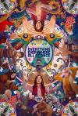

[瞬息全宇宙](https://pewae.com/gaan/aHR0cHM6Ly9tb3ZpZS5kb3ViYW4uY29tL3N1YmplY3QvMzAzMTQ4NDg=)

原名：Everything Everywhere All at Once导演：丹尼尔·施纳特 / 关家永主演：关继威 / 吴汉章 / 塔丽·梅德尔 / 岑勇康 / 杨紫琼 / 杰米·李·柯蒂斯 / 比夫·威夫 / 珍妮·斯蕾特 / 许玮伦 / 黎唯类型：冒险 / 喜剧 / 奇幻地区：美国首映时间：2022

这么点玩意儿不值得拍这么久。
多重宇宙的概念很好但是最后的和解主题过于平庸。

[天狗](https://pewae.com/gaan/aHR0cHM6Ly9tb3ZpZS5kb3ViYW4uY29tL3N1YmplY3QvMTk0NzI3MA==)

导演：戚健主演：刘子枫 / 周力 / 富大龙 / 朱媛媛类型：剧情地区：大陆首映时间：2006

前期情绪堆积非常到位，可惜最后拉了坨大的。
富大龙、朱媛媛、刘子枫，太有戏了。
从县长出现以后味道就不对了。

---

- [(1)](https://pewae.com/2025/01/records-of-movies-2024.html#inner_ref_1)：统计表里记作4部是因为有同名，公式如何修改还没想好