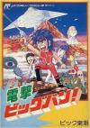

[电击作战](https://pewae.com/gaan/aHR0cHM6Ly93d3cuZ2lhbnRib21iLmNvbS9jbGFzaC1hdC1kZW1vbmhlYWQvMzAzMC0xNjE4OC8=)

原名：Clash at Demonhead别名：電撃ビッグバン! / 电击小子机种：FC厂商：Vic Tokai类别：STG发行年月：1989-01耗时：8

有生之年列表上又少了一条，好嗨森。
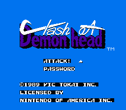

这个游戏我找了20多年。
1992，那是一个夏天。暑假，我在三舅家住了几天。最后一天准备回家前，表哥不知从哪里弄来一盘卡带，自己就玩上了。因为我着急回家，所以前后也就看了半个小时吧。但这短短的半小时给我留下了及其深刻的印象，因为红白机时代的迷宫类游戏还是挺缺稀的。半小时时间表哥光在大地图上瞎转悠了，一会儿地上一会儿地下，可以说毫无进展。后来我就在小伙伴中间打听，谁也没听说过这个游戏。直到后来红白机逐渐退出历史舞台，能提供信息的活人就更少了。
上网提问，以“地图”“枪械”作为关键字，也根本没人能出来解惑。
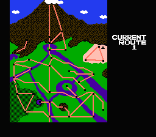

当年“每夜一游”栏目的初衷，是跟这个游戏有关的——我本来是想把每个游戏都过一遍，试图通过穷举法找到它。然后当捎地把好玩的游戏每个字母挑一个，写博文po出来。结果执行到B就变味儿了，变成了“穷举某字母开头的游戏，找到值得写博文的，打通并写博文，然后跳到下一个字母。”可惜C开头选的是天使之翼2，Captain

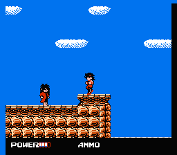

直到几天前，闺女的英语阅读作业里出现了underground一词。灵光一现，用“nes game over ground and under ground”作关键字，终于蒙中了！
图片出现的那一刻，热泪盈眶。
对，就是这个日文标题。
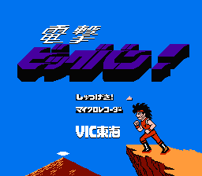

这个游戏我根本叫不上名字。
英文名一目了然，叫“冲击魔鬼脑袋”；日文名是“电击，BigBang！”——这个BigBang既是生活大爆炸的BigBang，也是棒子乐队的BigBang。也不知道搜索电击+big+bang找到这里的人会不会从网线那头摸过来揍我。看游戏的故事背景，这个Bang其实是主人公的名字= =
因为太冷门，中文相关很少。通过目前的资料看，中文译名有三个——电击、电击小子、电击作战。总得有个名吧，于是本文遵从有一定权威性的NES Dev上的叫法，把它叫做“电击作战”。
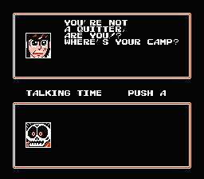

作为一款带有解谜要素的射击游戏，本作是有剧情的。当年的游戏无外乎两种模式，蓝波模式或者邦德模式。这一作就是邦德模式。主人公本来在度假，接个电话要去寻宝，出发之后才发现惊天大阴谋，有外星人绑架了科学家准备炸毁地球……
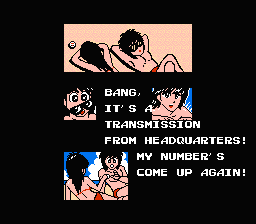

游戏操作则是借鉴洛克人的，不过增加了集中空中和水下的道具。另外满地图乱逛的形式也算是比较有新意。
操作性没有魂斗罗那么好，也没有绿色兵团那么糟糕，反正打小怪的时候需要一点点技巧。
道具、商店买卖的设定增加了一些趣味性。尤其这个游戏流程比较长，续关密码是要靠花钱买的。所以当年即使我有再多的时间跟表哥研究，也是打不通关的，我要到大半年之后才知道密码这回事。
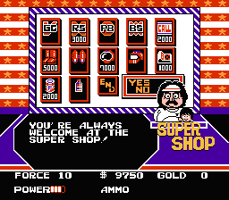
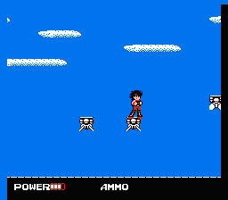

谜题算是很难的。因为没找到中文资料，所以我是一路照着英文攻略打的，打到收官阶段竟然卡关了。不得已上youtube搜录像，才发现看攻略的时候漏看了一行。
这阅读理解还是得好好学啊。
被卡住的地方是遇到一个BOSS要先死一次才能往下开展剧情，这种设定虽然不新鲜，但在一个动作射击类游戏上到也不多见。反正是思维误区了。
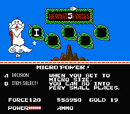

霰弹枪的威力非常巨大。除了一个特殊的BOSS需要用圣剑捅以外，其余BOSS硬撸就可以。
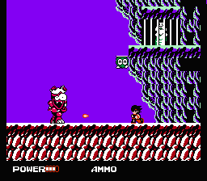
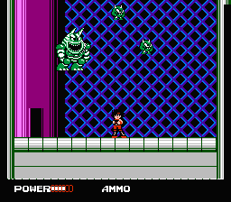
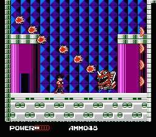
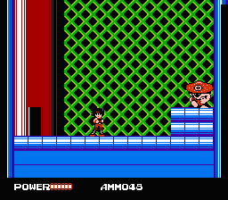
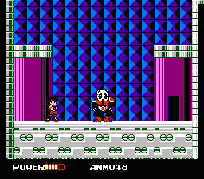
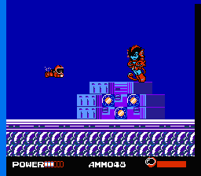
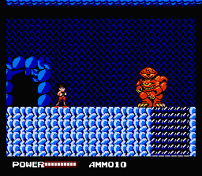

把异形干掉之后，后面的BOSS反而都很简单。
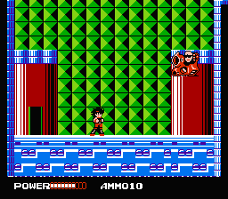
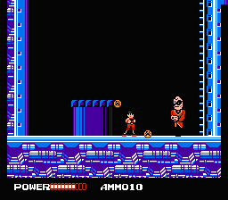
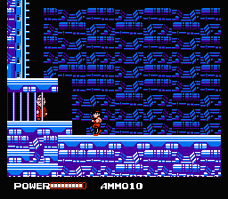
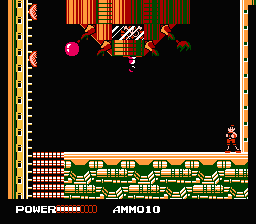
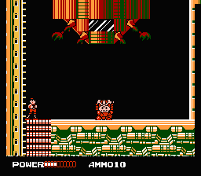

第一次看到这么实在的BOSS。
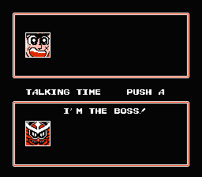

最后的结局有些特色，打完BOSS之后要玩一个小推理游戏，试出阻止爆炸的密码才行。
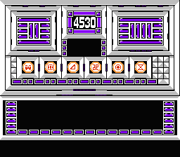

通关！
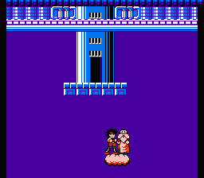
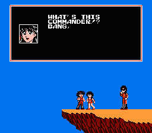
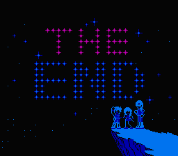