这个题材构思了差不多一年，一直是蠢蠢欲动懒得动的状态。
过去的这个夏天，石油七厂彻底关闭的消息，坚定了我在年内把它弄出来的决心。
我忽然意识到，40多年来在这座城市我已经经历了不少的沧海桑田，甚至是桑田又桑田。自己的脑子没那么好使，能想起来的就趁早吧。
特别鸣谢：豆瓣豆列[《在大连拍摄的电影》](https://pewae.com/gaan/aHR0cHM6Ly93d3cuZG91YmFuLmNvbS9kb3VsaXN0LzEzNjU5MzQv)

## 老甘井子

那么，就从这个极弱的关联事件开始吧。
去年看了一部电影，《来福大酒店》。片中有个老头，身份是石油七厂的退休工人，没什么专业技能，而是在特殊时期因为京剧唱的好而被招进厂里的。当时我看的眼都直了：“这说的不是我大爷么！”
老头的设定以及多处一闪而过的镜头说明，片子的编剧团队中一定有个不折不扣的石油子弟。
个人认为《来福大酒店》最感人一幕的发生地：蟹子湾。
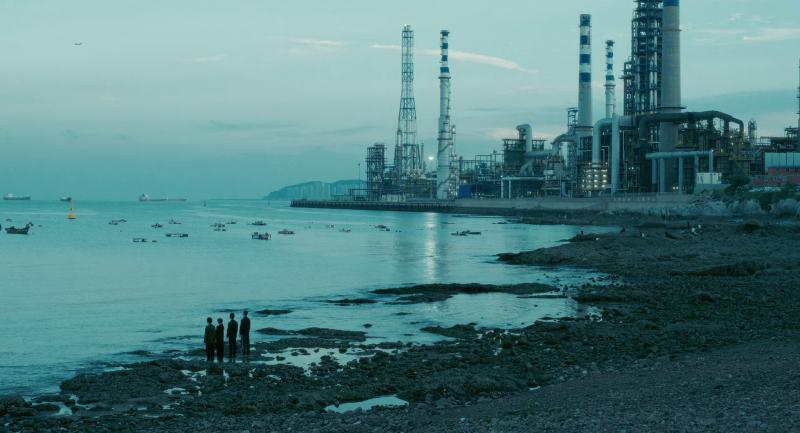
蟹子湾，《来福大酒店》，2024

蟹子湾这片地方原本不归石油，而是另一个叫“国营523厂”的工厂，一听名字就知道是干嘛的了对吧？这厂子黄的很早，90年代中期就没了，当时的石油七厂就把这块地弄了下来，搞了一大批新厂房，由名叫大连石化的小弟接手。钢铁林立的场景其实并不是始建于1933年的老厂。这也成了蟹子湾这里在摄影爱好者圈子里小有名气的原因，因为能出一张很有蒸汽朋克味道的片。看看人家电影里的构图，再看看我前两天拍的狗屎……
哦对了还有，蟹子湾这片其实不太吉利，当年震惊全国的五七空难，飞机就掉在这片海里。
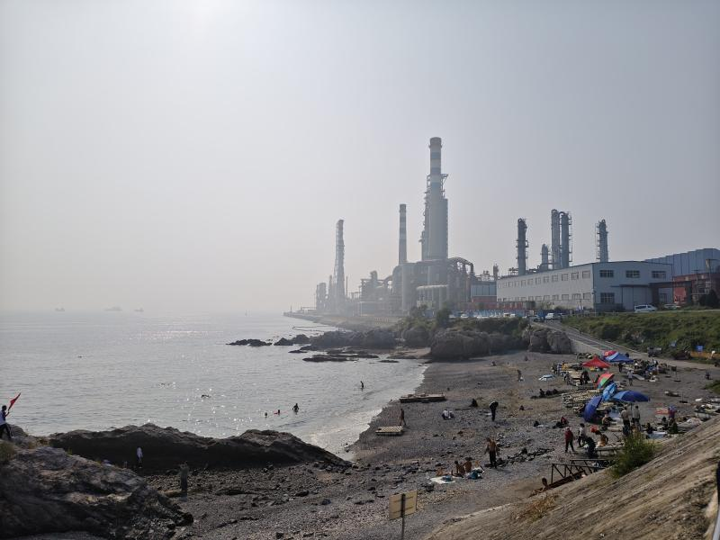
蟹子湾，2025/09

如同吉林省有吉林市、本溪市有本溪县一样，甘井子区也有甘井子街道。为了区分甘井子区和甘井子街道，一般本地人会把甘井子街道所在的区域称作“老甘井子”。老甘井子的核心区域在文体街，之前国营的甘井子百货商场和热闹一时的农贸市场的所在。文体街往东500米，是甘井子路和甘北路的十字路口。这个路口往东的广大区域，就是石油七厂的地盘了。石油七厂的覆盖范围是很好认的——什么时候你的鼻腔里出现了芳香烃的芳香，就到了。
文体街以东的甘井子区域堪称被遗忘的角落，之前除非石油或者523厂子弟，否则很难跟这片区域产生交集。我也是认识了新大娘带来的便宜堂哥这个正宗石油子弟之后，在某个暑假里跟他去他学校玩了一圈，才知道我大爷成天是在这样的环境中摸鱼的。
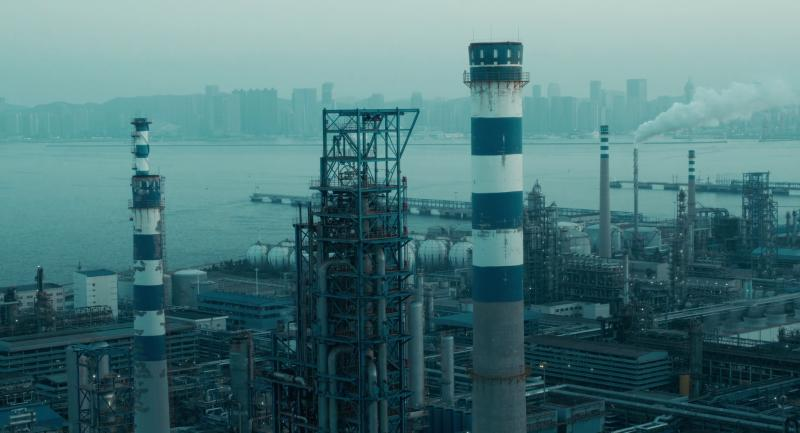
大连石化，《来福大酒店》，2024

本来以为《来福大酒店》中出现的黄轩喝大的烧烤店有多难找，没想到从蟹子湾出来转身就是。掐指一算，这地方我也有10年没来过了，空气中的石化厂气味早已消失殆尽，说不定柳岩来的时候，气味就已经散了呢。
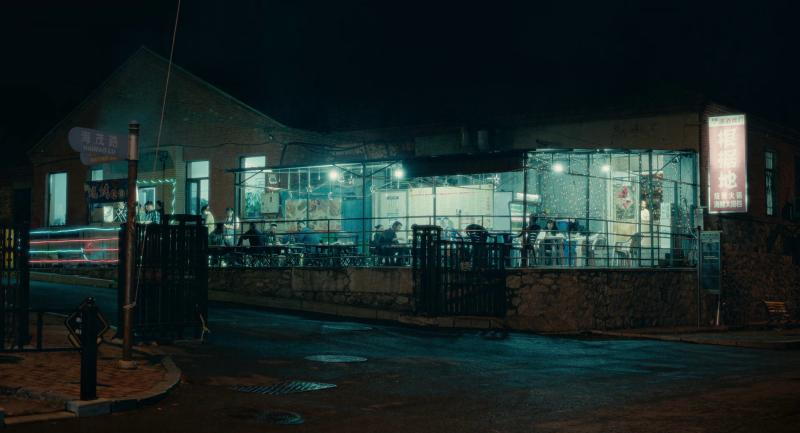
海茂街街景，《来福大酒店》，2024
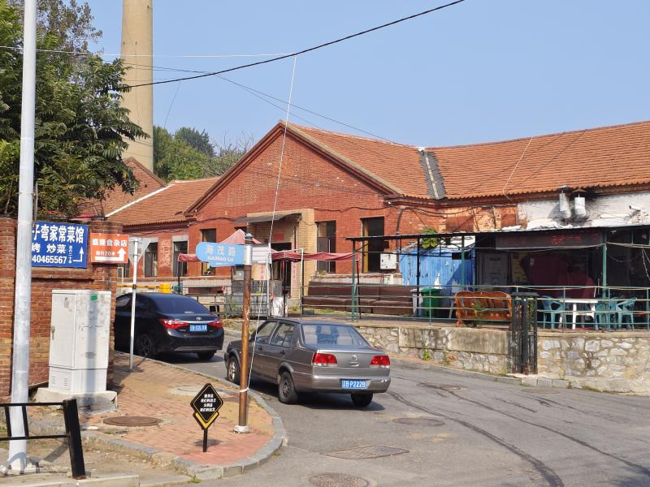
海茂街街景，2025/09

蟹子湾离《夏洛特烦恼》中马冬梅大爷名场面的发生地比较近。那应该是以前523的宿舍。没有亲自去拍，那边我去了也找不到。
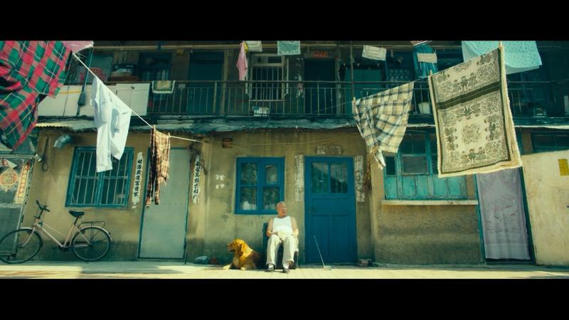
523厂宿舍，《夏洛特烦恼》，2015

为什么我不觉得马冬梅大爷的场景稀缺呢？因为那样的老家属楼，在大连还有很多。比如下面这张，《后来的我们》中周冬雨家的老宅，我感觉就是出自金家街，大钢的家属宿舍。
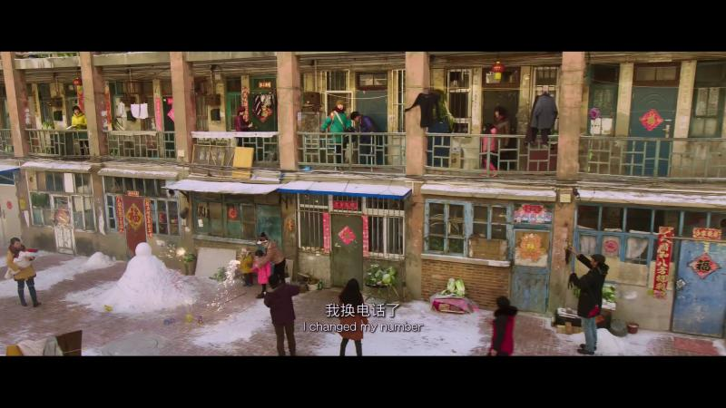
金二街大连钢厂宿舍，《后来的我们》，2018

## 大连港

跟石油七厂隔海相望的，是大连港。也就是所谓最早的大连市。大连港早期的标志是客运站楼，是80年代的大连地标性建筑，小时候《大连新闻》过后的天气预报里，市区的配图用的就是它。200X年的某天，大连港以嫌弃老港区设施陈旧为由，把大连港连同旁边的黑嘴子鱼市一起打包，卖给了李嘉诚。李嘉诚当时号称要把这片地打造成“~~东~~北方的维多利亚港”，搞商业和文旅开发。
没有港就没有市嘛，大连港在电影中那可是太热门了，按时间顺序展示一下。
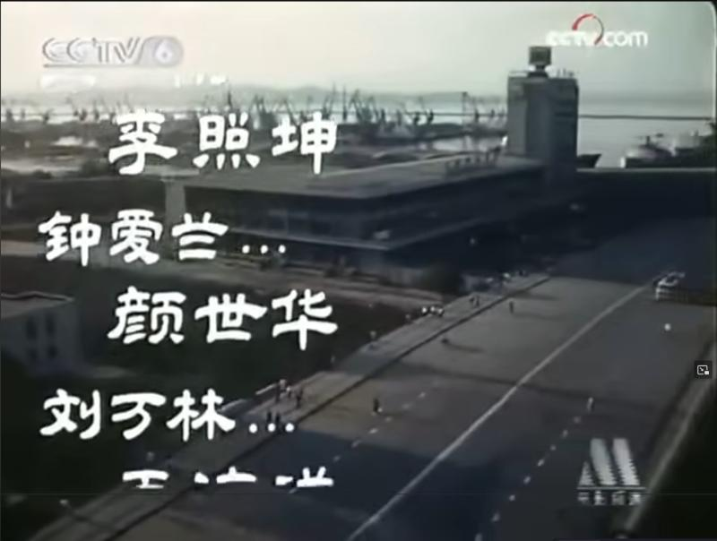
大连港客运站，《东方剑》，1982
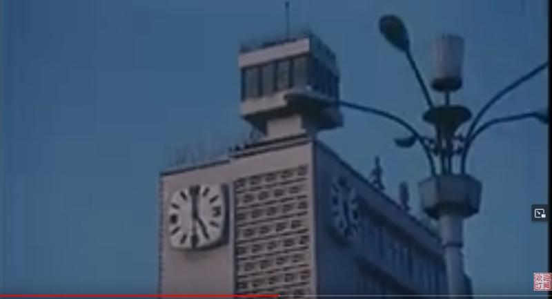
大连港客运站顶楼，《碰海人》，1984
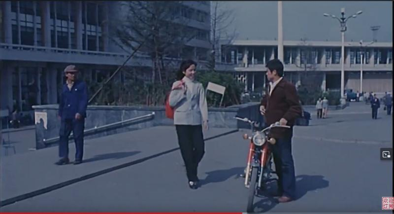
大连港客运站地面，《碰海人》，1984
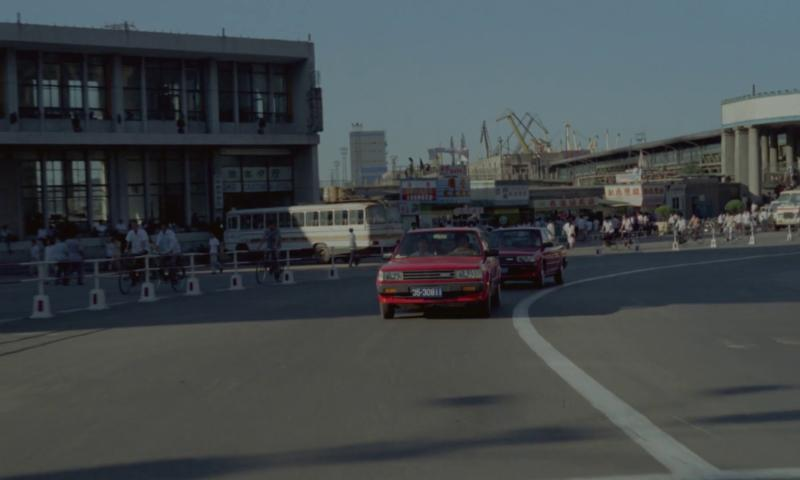
大连港客运站，《黑炮事件》，1987
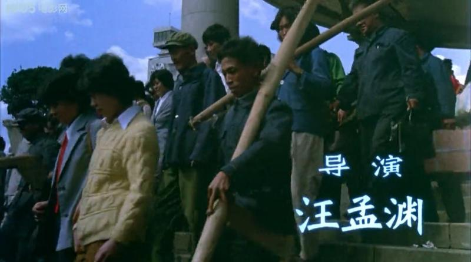
大连港出站口，《主犯在你身边》，1985
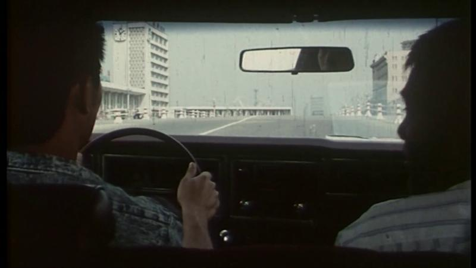
大连港客运站，《最后的疯狂》，1989
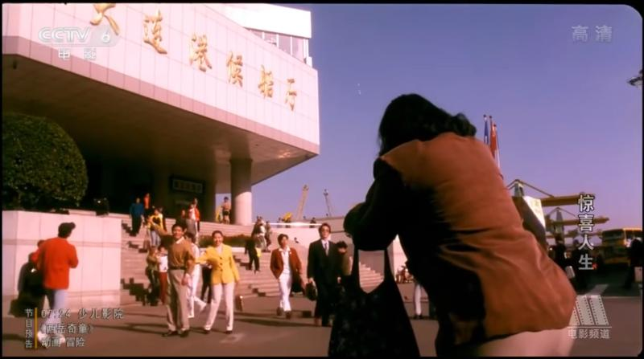
大连港出站口，《惊喜人生》，1999

李嘉诚这个老逼养的，把地在手里捂了几年，听到点风声，就跑了。接盘侠是融创。融创也不是什么好玩意儿，自己盖了几个楼，剩下又给分块卖了。这次去溜达一圈，发现工地挂的是中海的牌子。
哎，好好的个港啊，你就算不用了，搞个真正的文创项目，它不香吗？
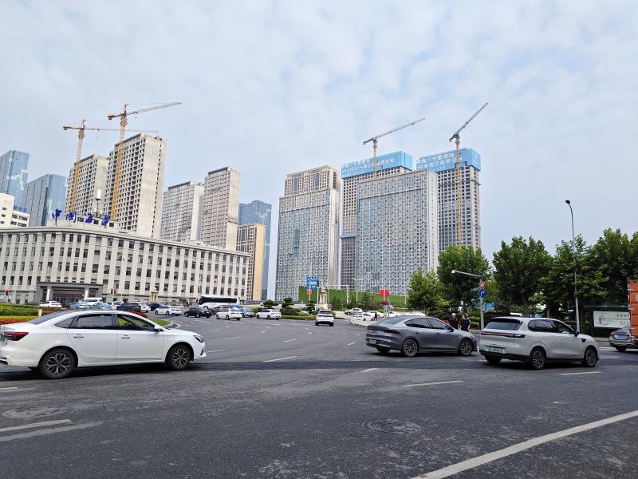
大连港客运站旧址工地，2025/09

刚好有个电影的长镜头记录下了被夷为平地的黑嘴子鱼市。注意图片右侧中间，海边的一片空地。感谢李嘉诚十八辈祖宗！从此大连市民过上了想吃便宜的新鲜鱼只能半夜跑到市郊的大连湾的好日子。
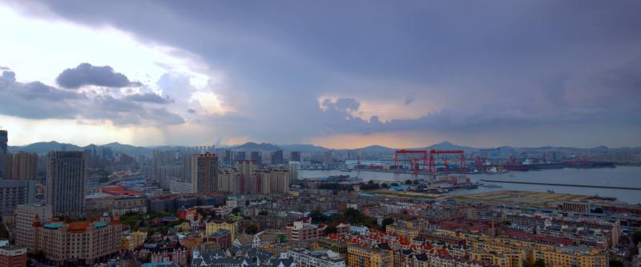
俯瞰大连港，《我是你妈》，2018

大连港的标志是一红一白两座灯塔。这两座灯塔在电影中，尤其是2000年代的电影中经常出现。这跟当时大连港准备让出地方搞旅游开发的政策有关。
白塔建于1912年，红塔建于1913年。据说按照航海惯例，红塔表示暗礁，白塔表示进港，但在我看来大连港的两座灯塔只是简单的表示护波堤的尽头而已。
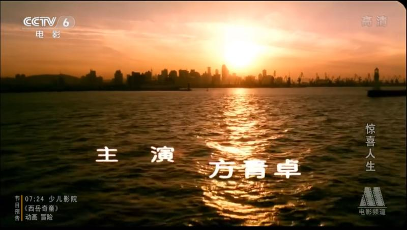
大连港入港远眺，《惊喜人生》，1999
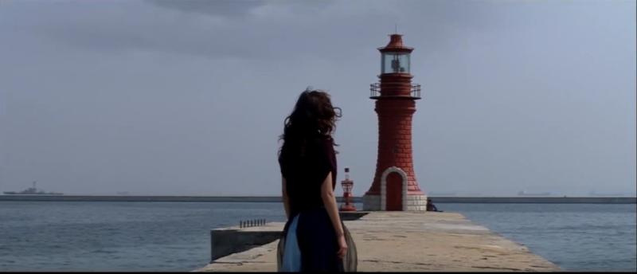
大连港红灯塔，《爱的是你》，2006
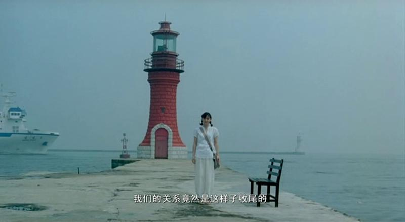
大连港红灯塔，《桃花运》，2008
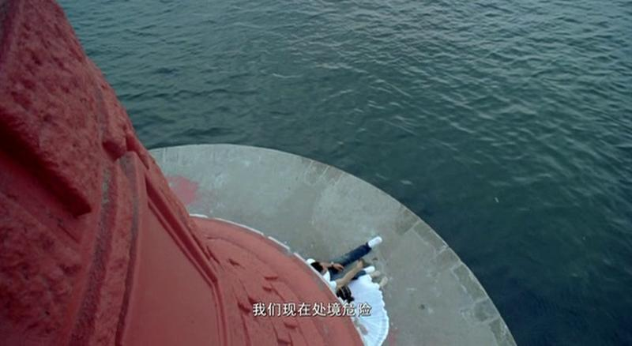
大连港红灯塔，《桃花运》，2008

要说搬迁也是对的。跟后来建成的大港相比，大连港设施老旧，地方也不大。从80年代的电影里也能看出港内的狭促。
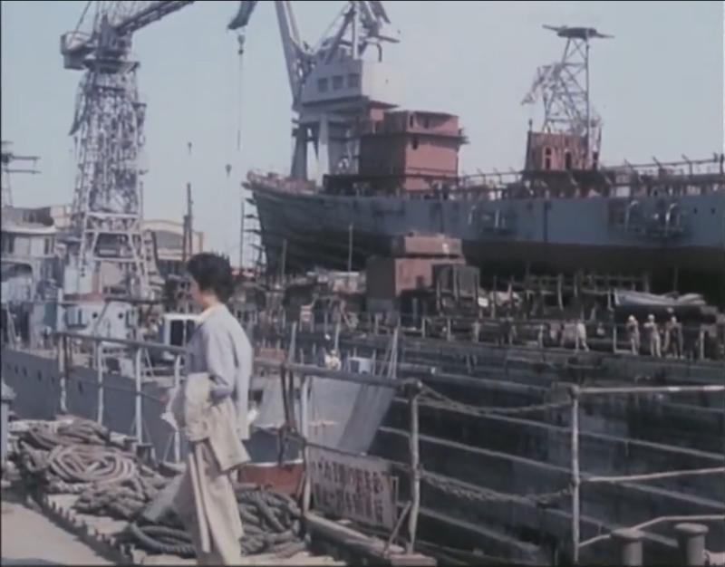
大连港内部，《明天回答你》，1981

新千年之后大连港把原来的15号仓库外的围墙拆掉，简单装修了一下，就成了遍布咖啡店的洋泾浜。十五库起初格调不错，能看海有码头有船的。但是好景不长，大连港的搬迁拖泥带水，旁边的客运站大楼倒是扒了，船还照样停，弄了个乱七八糟。里面的生意也没什么硬货，干不长久，逐渐没落了。
十五库旁边有个**“老码头”景区，千万不要去！千万不要去！千万不要去！**
40一张票，我本来是冲着红塔去的。进去以后里面一副国企摆烂的样子，码头历史展厅灯都不开，文创雪糕这种骗钱货都没得卖，火车头的门都是锁着的，甚至出口店蛇形货架都是空的！
最令人气愤的是红塔被一个类似修船厂的地方包在里面，闲人免进内有恶犬。想装作没看见硬闯，被拦下了。我说：“我买了票，为什么不让进！”
对方说：“好好看看你的票，‘灯塔雕塑’，不是灯塔本身。让你看的是进门的那个雕塑！”
是的，他们确实给给一座灯塔整了个1：1的雕塑。
没办法只能在外围拍一下。
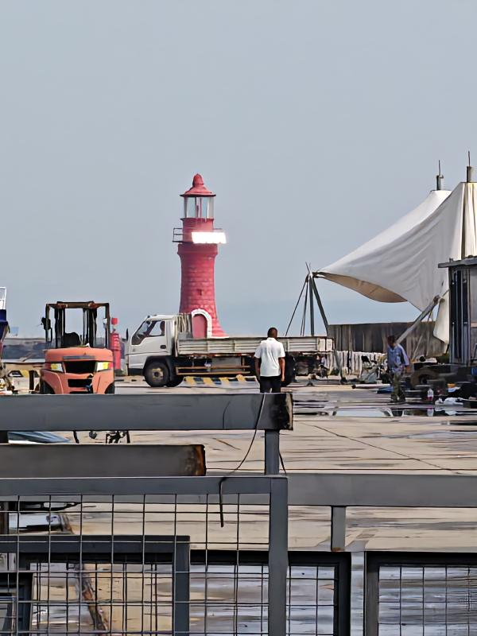
大连港红灯塔，2025/09
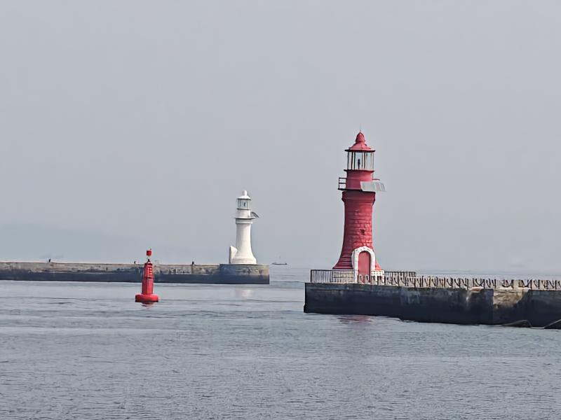
大连港红白灯塔，2025/09

## 造船厂

那么问题来了，李嘉诚为啥要跑呢？看哈，一个海湾，喇叭口型，北岸是石油厂，南岸是码头，西岸就是造船厂。
造船厂分两部分，紧挨着码头的是日据时期留下的老厂，西边香炉礁湾里的是新厂。从建国开始到80八十年代，电影里的特务们特别喜欢到造船厂里偷图纸搞破坏。
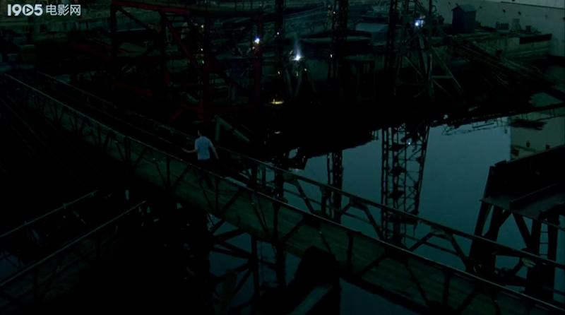
造船厂旧厂区，《主犯在你身边》，1985

造船厂一直就不归市政府管，而是从三机部——六机部——船舶工业总公司——船舶重工等一系列中央直属政企沿袭下来的钦差大人，跟前面提到的石油和后面要说的机车一样，“御三家”。造船厂在1993年拍了个自吹自擂的片子《大海风》，不然我还真不知道里面长啥样。
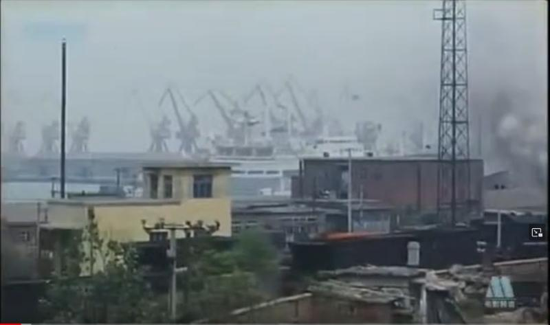
造船新厂，《大海风》，1993
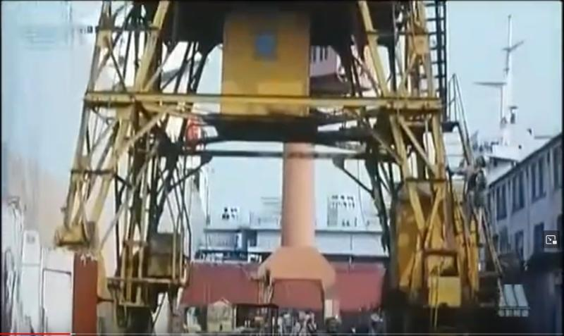
造船新厂，《大海风》，1993

传闻李嘉诚买港的时候，市政府已经打了报告，石油要搬，价钱问题；造船也要搬，新船坞的地方都找好了。但是，忽然有一天，有个人来画了一个圈，说：“我们不能跟某人一样，把工厂都搬走，原有的工业基础要保留。”于是，有了站在香炉礁奥特莱斯就能看见航母的新景观。换你是李嘉诚，你不跑？

## 工厂

那么问题又来了，某人都弄黄了哪些厂子呢？
我也不知道。那个时候大势所趋，也说不准是他弄走的，还是自己不行的。
御三家里的最后一位，机车厂，位于核心商业区，一直坚持到今年年初才搬迁，肯定不能算到某人头上。
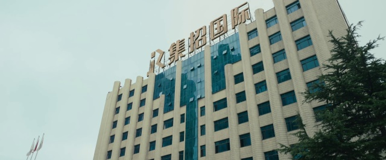
机车车辆厂，《保你平安》，2022

八十年代大连号称有八大厂矿，也有说十大的，问大人，也只有公认头部那几个厂子没有争议，大概数到第五就各说各的了。
厂矿的这个“矿”字，就很奇怪。大连市区范围内就没什么有名的矿，而八大里的“工矿”也不是挖矿，而是生产工程矿山用的重型机械的意思。唯一能想到的矿就是石灰石矿。可石灰石矿在还能挖的时候不归大连管，是鞍钢的飞地，一直到2016年左右，剩下个巨坑才还回来。后来注上水，起个名叫天空之湖，没去过。
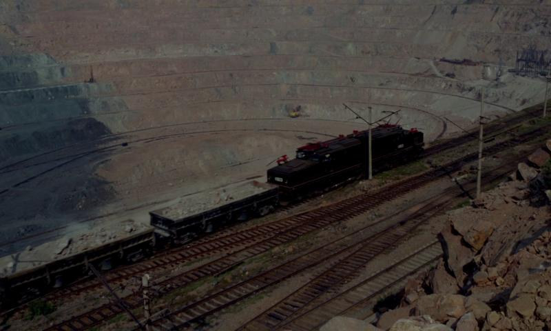
石灰石矿，《黑炮事件》，1986

大连冷冻机厂，简称大冷，上市后称冰山集团，没黄，只是搬出了市区。原址现在改叫冰山慧谷，以儿童游乐设施著称。
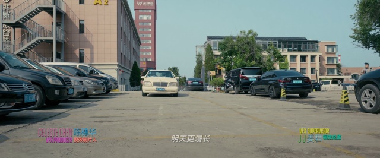
冰山慧谷，《保你平安》，2022
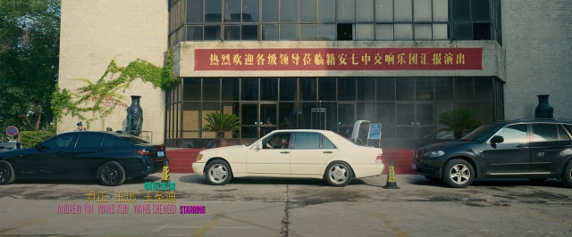
原大冷俱乐部，《保你平安》，2022

大连重型机器厂，简称大重，旧称工矿。工厂现搬离市区，研发部门在付家庄。
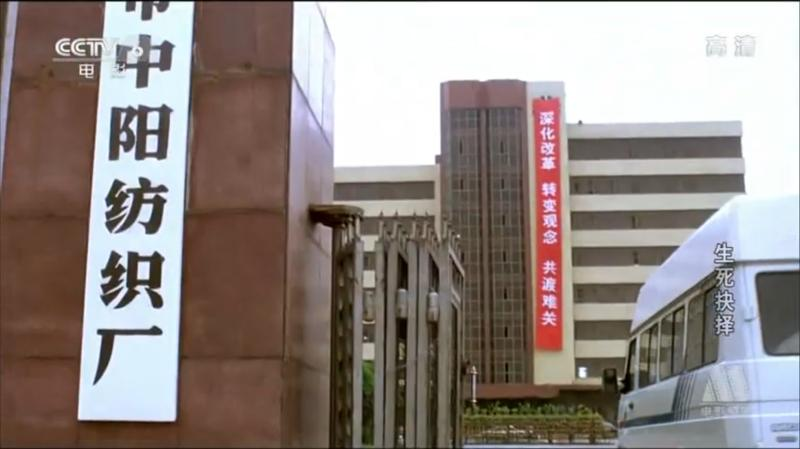
大连重型机器厂，《生死抉择》，2000

大连起重机厂，简称大起，与大重合并，后搬离市区。
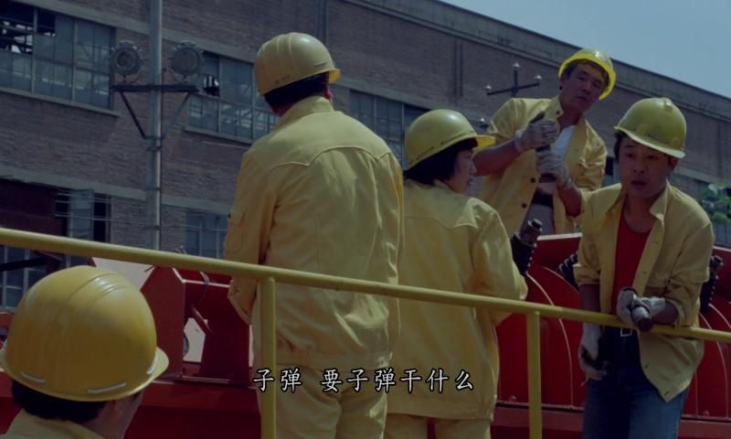
大连起重机厂，《黑炮事件》，1986
大重俱乐部，我们初中时看电影的指定地点之一。但是年代有些久远了，这些建筑又长得差不多，并不确实。
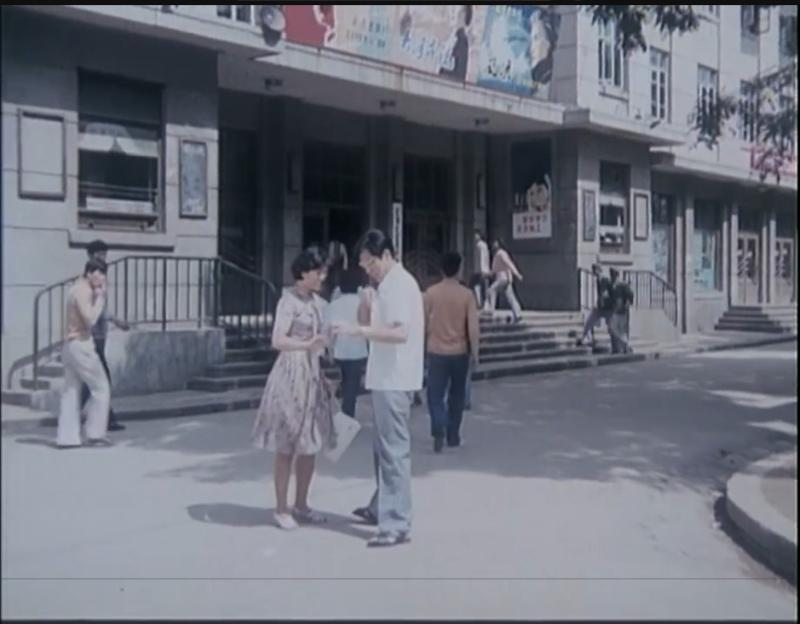
大重俱乐部，《明天回答你》，1981

大连轧钢厂，简称大轧钢，《幸福时光》拍摄的时候已经等着清算了。这厂子是真没了。
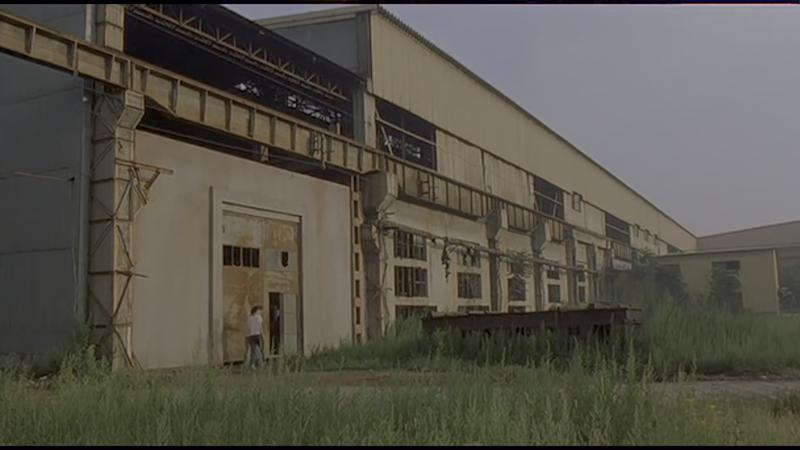
大连轧钢厂，《幸福时光》，2000

关于工厂的画面，除了沿街的办公楼我是见过的，车间里面哪个是哪个完全要靠电影后面的鸣谢单位。像《生死抉择》里有大量的纺织厂的镜头，但我找的片源把片尾掐了，我也不能确定2000年的时候大纺黄没黄，那就这样吧。

## 劳动公园和电视塔

父母的单位都是小型国企。对于各大型工厂的记忆其实来源于90年代初，劳动公园的灯会。哪个厂子的灯大，哪个厂子有钱；又大又会动的，更有钱；卧槽，大机床的“童子拜观音”不仅会动，还能滋水，牛逼大了！
很长一段时间，劳动公园都是市区里最大的公园，也是最早有儿童游乐场的地方，也是第一次知道有另外收费的园中园的地方。充满了回忆。
春天的紫藤花。
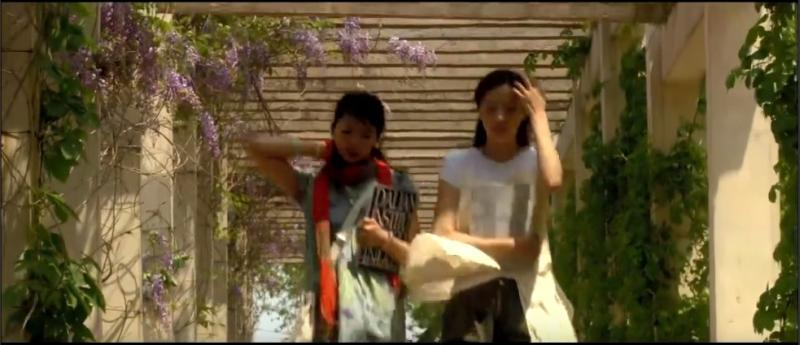
劳动公园，《爱的是你》，2006

荷花池。
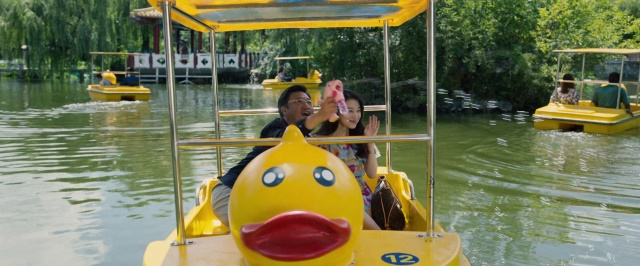
劳动公园荷花池，《保你平安》，2023

当年有个小伙伴，我跟他说，我1985年在劳动公园坐过孔雀形状的秋千，他不信。如今我找到了孔雀秋千存在的证据，却早忘了跟我争执的小伙伴是谁。
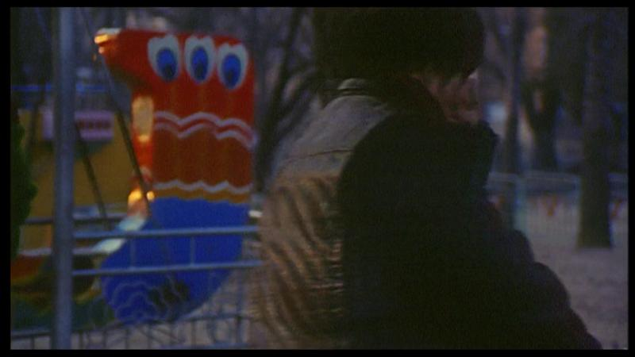
劳动公园儿童游乐区，《蜜月的阴谋》，1985

市区一共有三个摩天轮，劳动公园这个建成最早。
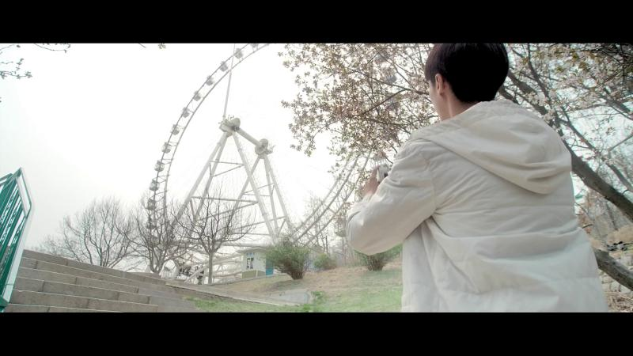
劳动公园摩天轮，《陪安东尼度过漫长岁月》，2015

《陪安东尼度过漫长岁月》的原著作者特别喜欢这个摩天轮，也喜欢公园外的麦当劳。从麦当劳的角度看摩天轮，能看到电视塔。
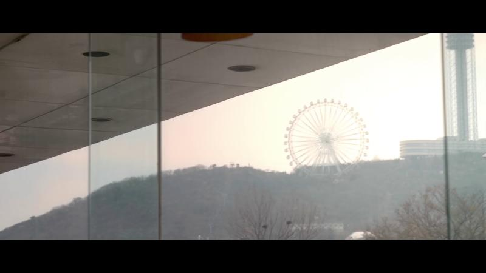
麦当劳大都会店，《陪安东尼度过漫长岁月》，2015

电视塔是电影拍摄的宠儿。虽然但是，它并不是市内的最高点，不妨碍各路电影从这里俯拍中山。
1993年的时候，左下角的圆明阁还在。
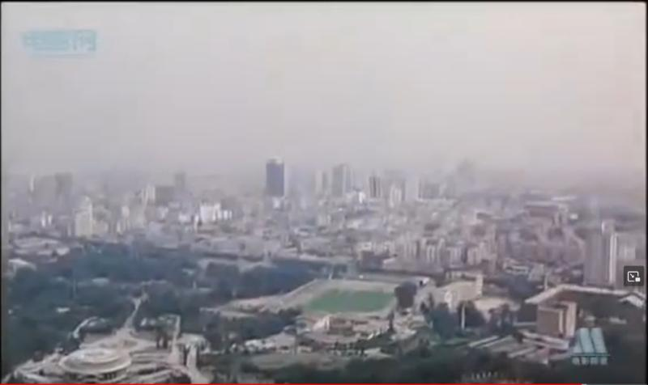
电视塔俯瞰，《大海风》，1993
1999年，圆明阁拆了，换成个球。球这个东西就不吉利，有球必硬嘛！现在球也没了。
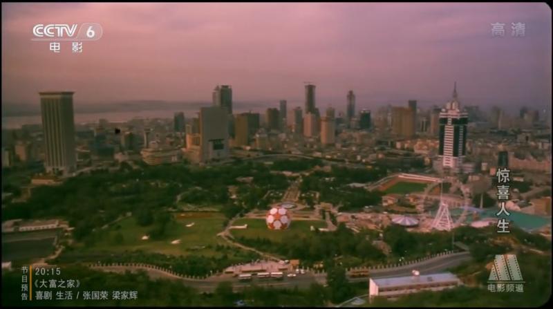
电视塔俯瞰，《惊喜人生》，1999
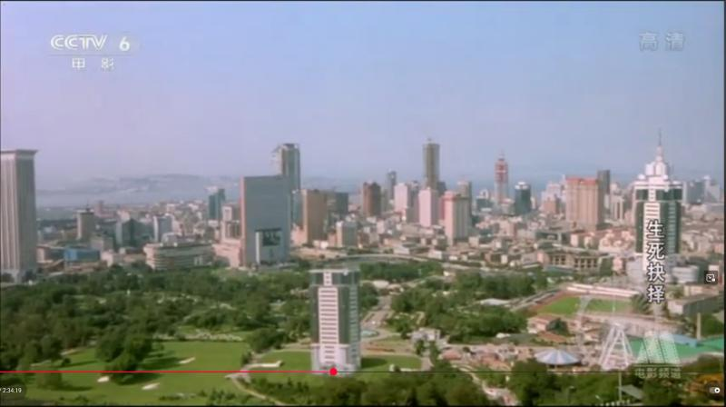
电视塔俯瞰，《生死抉择》，2000

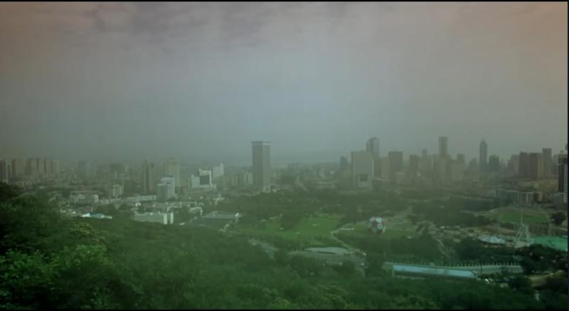
电视塔俯瞰，《蓝色爱情》，2000
电视塔内部，咱也没进去过，也不想进。只能通过电影了解一下。
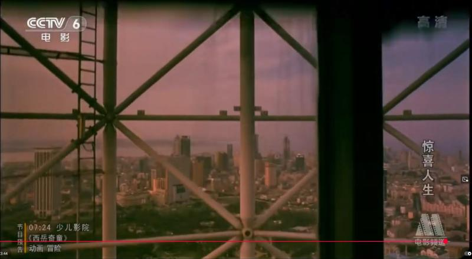
电视塔内部，《惊喜人生》，1999

惊喜人生的那张里，明显能看出胜利路上有个观景台。本地人把那里戏称为某人的观景台，因为胜利路是他主持修的，那个观景台也是他力主建好的。这里的视角明显不如塔上，付费版跟免费版的区别很明显。
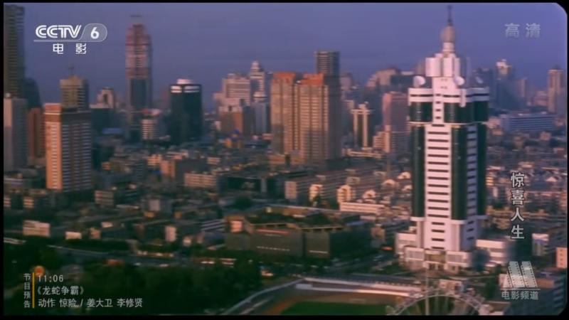
胜利路观景台，《惊喜人生》，1999

关于劳动公园多说一句，很多人说《幸福时光》中赵本山开的巴士炮房取景在劳动公园，我比对后感觉不是。最后吊装车厢拆除的时候，背景与劳动公园的山周围环境不一样，还是倾向是开发区佳能附近的山。

## 滨海路

某两年灯会改在老虎滩办。说老虎滩，先说滨海路。
滨海路分为三段，从东海头到老虎滩为东段，老虎滩到付家庄为中段，付家庄到南大亭为西段。东段的东海头到棒棰岛修缮的年份最晚，也被叫做北段。而西段的端点现在往往被算作星海广场，也没啥大毛病，反正咱也不是地名办的。
从东海头开始吧。1999年，某人主导在东海头修建了海之韵公园，立有雕塑，反正乱七八糟的寓意吧，庆祝建市100周年。同时，开通了滨海路的东北段，海之韵公园就是滨海路的新起点。这个雕塑一段时间内是城市地标，比如印在第一批的公交IC卡上。
具体的位置已不可考，只能找个大概，那片填海填得太厉害了，我也不常去。
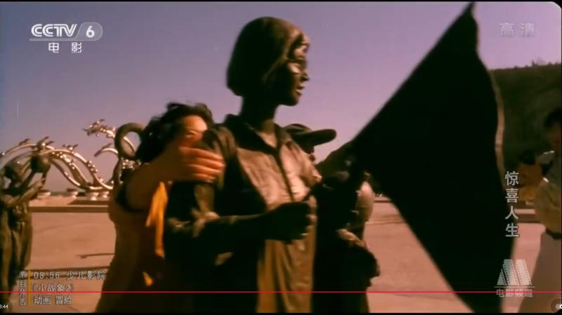
海之韵公园，《惊喜人生》，1999

旧海之韵被填平后，向海里延申的部分还是要靠海的。这爿木栈道下方的堤坝修的时候就故意搞的不高，追求海浪打上来的效果。所以下图中不可描述之人脚下的浪应该不是特效。当然冬天这里有冰溜子看。
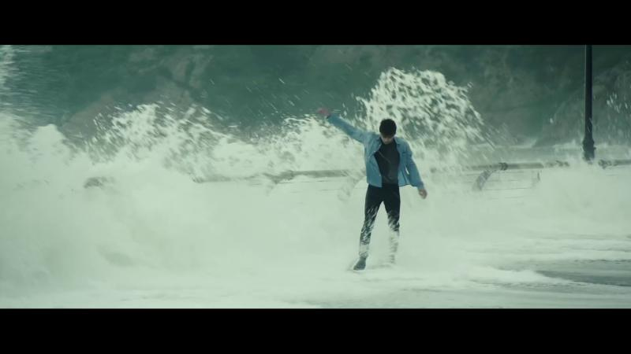
新海之韵海滨，《心理罪》，2017

新海之韵南面就是滨海路的入口，刚修建的时候名为十八盘。从东港填海盖楼，海之韵推倒重修之后，这里一度改为不准机动车驶入，又曾经改成单行，前年的时候听说又让机动车进了。好多年没去了。这个部分其实不靠海，全靠沿途的涂鸦壁画撑着，步行时间长了确实乏味。到了山顶，有一处景观：两棵参天大树。水泥浇筑的。
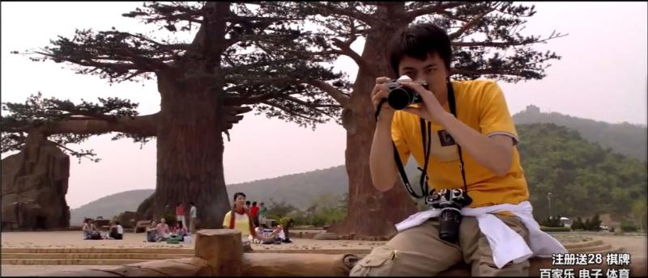
滨海北路大树雕塑，《爱的是你》，2006

滨海路北段与东段的交界便是棒棰岛。这是三胖用了都说好的地方，曾经普通市民进入是要批条子的，现在如果有特殊招待任务，也是会封闭管理。
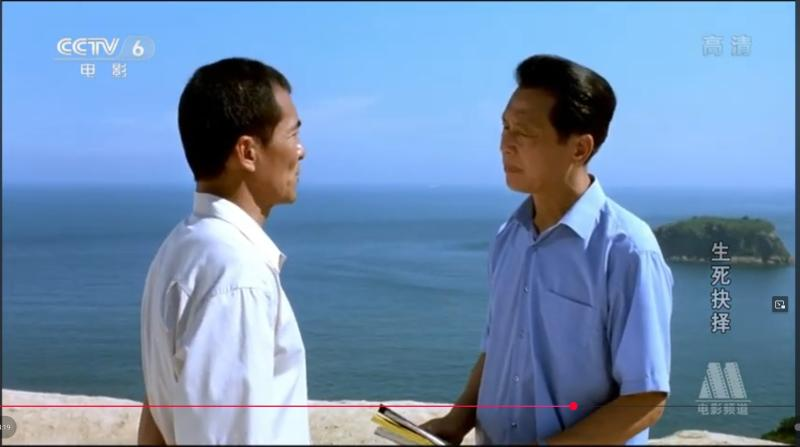
棒棰岛，《生死抉择》，2000
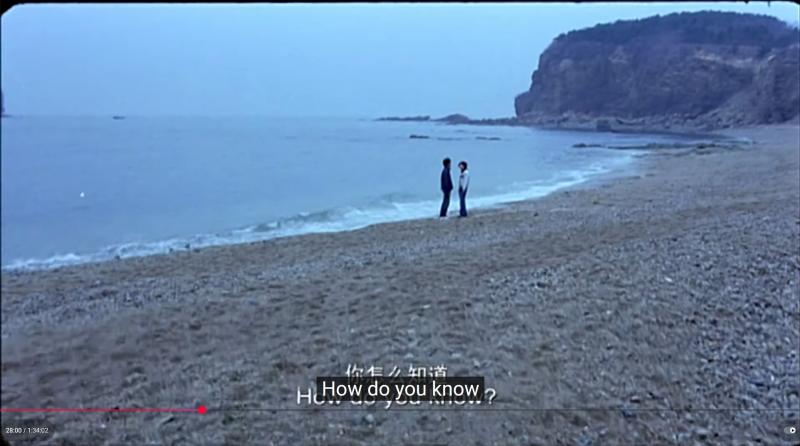
棒棰岛，《pk.com.cn》，2008

棒棰岛过后就进入了滨海东路。这部分可说的不多，有个高尔夫球场，也没在电影里见过。姑且把陈柏霖骑摩托这张当作是滨海东路吧，别让它空着。也不是完全没有理由，感觉上滨海东路靠东一段确实离海有点远。

滨海东路，《pk.com.cn》，2008

终于到了老虎滩，这开始才是小时候就熟知的滨海路。前面的部分靠四个轮子，这里就是用脚量过的了。
群虎雕，九十年代初期老虎滩大规模重修后建成的。并不是一块石头，而是由多块汉白玉拼出来的。

老虎滩群虎雕，《惊喜人生》，2008

再往西就厉害了，电影取景的热门景点，从上世纪八十年代红到现在。
北大桥。
北大二字，跟圆明园技术学院没有任何关系。北是大连的友好城市——日本北九州市。大连在日本一共缔结了三个友好城市，北九州是最早也是实力最强的一个。北大桥是北九州给大连援建的。虽然地处偏僻，对缓解交通几乎没什么作用，但依山傍海，摆着看是非常之漂亮了。

北大桥桥头，《最后的疯狂》，1989

北大桥桥头，《心理罪》，2017

北大桥，《蓝色爱情》，2000

北大桥，《pk.com.cn》，2008

北大桥，《夏洛特烦恼》，2015

注意一下最后的《夏洛特烦恼》这张里面，桥中间下方有个小风车。有一部电影真的用到了这座风车。画面里大S和刘烨领了个小孩，周围的花是P的。

北大桥下风车，《疑神疑鬼》，2005

特别说明一下《蓝色爱情》这部片，由袁泉准备跳桥被潘粤明救下开始，到袁泉假装跳桥引逗潘粤明真正跳桥结束，前前后后绕着北大桥拍了好多遍。我想说的是，导演可真会选地方，这里确实是曾经的跳海圣地，桥高水深。不过后来没那么圣了，毕竟交通不那么方便，晚上打车出租车都不愿意拉。从老虎滩车站走上来接近3公里，很容易没劲翻栏杆。

北大桥上的袁泉，《蓝色爱情》，2000

过了北大桥再往西，有一处地方，名曰燕窝岭。燕窝岭是另一处跳崖圣地。对，下面是石头，很容易脑浆迸裂那种。但跟北大桥一样，更加偏僻。后来燕窝岭还修了公园，开始收门票了，基本就每人搁这儿跳了。讽刺的是，燕窝岭这个公园叫“婚庆公园”。
大甜甜何润东骑摩托的地方，看着像燕窝岭。

滨海中路，《我的美女老板》，2010

滨海中路上后来修了木栈道，怀疑两部影片拍到的是同一个观景台。

滨海中路，《我的美女老板》，2010

滨海中路，《夏洛特烦恼》，2015

到达付家庄以前，还要先路过小付家庄。小时候小付家庄的正式名字是工人疗养院，这里的海很不友好，好多浅礁。唯一的好处是自古以来就允许动火。
小付家庄的标志是海里那块石头。电影里的这块石头可是绝版，因为2014年，这玩意儿渡劫遭雷击裂成了两瓣。

滨海中路小付家庄，《明天回答你》，1981

《我的美女老板》开头何润东摔车的戏码，好像就是在付家庄门口，但多年没去了，不敢断言，没截图。
过了付家庄，就进入了滨海西路。按说滨海西路是以前广大市民最熟悉的一段，木栈道修的最早，两端的交通也方便，可不知为什么，电影中出现甚少。只有早期的《主犯在你身边》有一张，疑似金沙滩。

滨海西路，《主犯在你身边》，1985

再向西就是传统意义滨海路的终点，南大亭了。自从某人把南大亭山洞炸了，改修贝壳城堡之后，滨海路西端就逐渐跟星海湾融为一体，没什么明显界限了。但在我心里，那个山洞一直都在。
《爱的是你》是部大烂片，却是唯一一部留下老的城堡（贝壳博物馆）的电影。这座城堡后来因为不明原因拆掉，原址上重建了一座城堡酒店，完全没有气势。

老贝壳博物馆，《爱的是你》，2006

## 星海广场

其实在地图上，滨海西路也是截至到马栏河的。只不过星海湾的概念一扩再扩，很多时候没人在乎那条界河了。
都到了，就写星海广场呗。
《惊喜人生》里1999年甚至更早些时候的广场，周边完全没有那些乱七八糟的建筑，视野开阔极了。

星海广场，《惊喜人生》，1999

说说那根华表吧。初代华表高达19.97米，直径1.997米，是非常夸张的存在。200X年，又粗又长的被换成一根又细又短的。2016年8月5日，华表被拆除。
电影中我只抓到了两个有华表的镜头，可惜都是又细又短版本的。聊胜于无，缅怀一下吧。《心理罪》里华表显得特别小，好在能看见尖。

星海广场，《我的美女老板》，2010

星海广场，《心理罪》，2017

建成之后星海广场周边的东西就越盖越多。赚钱嘛，能理解。
徐熙媛在马栏河上卖过单。

会展路桥，《疑神疑鬼》，2005

五阿哥在边上写字楼里吃过火腿肠。

沿海国际中心，《四个丘比特》，2010

龙少爷在百年城雕上玩过滑板。在城雕上玩滑板是违规行为。

百年城雕，《pk.com.cn》，2008

李晨在百年城雕旁边的海边扛过板。

星海广场海边，《桃花运》，2008

沈腾在广场上赶过场。

星海广场，《夏洛特烦恼》，2015

缝纫机仙人在挑月桥上放过高科技。

挑月桥，《心理罪》，2017

大甜甜在马栏河边玩过水。

马栏河口，《我的美女老板》，2010

何润东在东湾说：“你要过来呀！”

星海湾浴场东湾，《我的美女老板》，2010

魏翔在西湾上挨过刀。特别指出，片中魏翔被刺是在广场东侧的游乐场里，倒下是在西湾的沙滩上，步行需要1200米，血槽非同寻常的厚。

星海湾浴场西湾，《心理罪》，2017

这Part来个会展中心一期结尾吧，作为地标建筑之一，真没出现过太近距离的镜头。1997年建成，2024年拆除。

会展中心，《疑神疑鬼》，2005

## 星海公园

一路向西，就到了星海公园。

星海公园东门外面一直跟公园本身暧昧不清，一度停了条船，名曰海上乐园。因为额外买票，所以从来没进去过。
后来建了圣亚海洋世界，占了公园里的一小块地方。现在也没有人把那块叫成星海公园东门了。虽然确实还有个门。

圣亚海洋世界，《不动声色》，2023

星海公园最常用的景点是中部的一个小山，山上有亭，山下有礁。

星海公园，《明天回答你》，1981

星海公园，《蜜月的阴谋》，1985

星海公园亭子，《四个丘比特》，2010

以前有个探海洞，新千年之后因为危险，拆了。

星海公园探海洞，《黑三角》，1977

星海公园里也有一个摩天轮。

星海公园摩天轮，《四个丘比特》，2010

八十年代里面有个饭店，叫望海楼。

星海公园望海楼，《东方剑》，1982

夏洛他妈早年就是女流氓，也在里面吃过饭。

星海公园，《蜜月的阴谋》，1985

星海公园的海滨浴场，小时候以不干净著称，家长都不让从这下海。

星海公园海滨浴场，《四个丘比特》，2010

继续向西是黑石礁，就是我高中的势力范围了，离得近就一起说了。唯一的景点是自然博物馆，90年代中期从胜利桥搬过来，我从来没去过。

黑石礁海滨，《四个丘比特》，2010

黑石礁自然博物馆内部，《桃花运》，2008

## 石道街

提到星海，就不能不提南石道街。十几年前大连的公交车和广播里上有个臭名昭著的男科医院广告：“星海医院不在星海，而在南石道街。”
南石道街只是个普通的居民区，我完全体会不出西影厂1989年的电影《最后的疯狂》在这里取景的内在逻辑。难道就图个摩托车上楼梯？

南石道街居民小区，《最后的疯狂》，1989

南石道街公交站，《最后的疯狂》，1989

北石道街也必须安排上。老火葬场小时候我只去过一次，但笃定就是这里，因为大连市内只有一个火葬场。搬迁以后这里盖了个英雄纪念公园。

老殡仪馆，《蜜月的阴谋》，1985

北石道街和南石道街之间有一条道，名为新石道街。这条路两边种满银杏，这个季节去正好。深度怀疑《我的美女老板》就是为了这点银杏叶才拍的这个镜头。

新石道街，《我的美女老板》，2010

何润东身后这点地方，现在可不长这样了。因为这里刚好是跨海桥的一个起点。

## 星海湾跨海大桥

自从跨海桥建成，它就成了在大连取景的电影中的新宠儿。真的出片。不多说了，上图就好。

跨海桥全景，《风吹浪涌》，2021

跨海中段，《保你平安》，2023

跨海桥中段，《涉过愤怒的海》，2023

跨海桥中段，《来福大酒店》，2024

跨海桥头俯瞰，《心理罪》，2017

跨海桥桥面，《涉过愤怒的海》，2023

跨海桥头，《心理罪》，2017

跨海桥头夜景，《我是你妈》，2018

跨海桥头，《保你平安》，2023
还发现一张特别的：《夏洛特烦恼》拍摄时，跨海桥正在建。

跨海桥在建，《夏洛特烦恼》，2015

## 桥

除了北大桥和跨海桥，电影里也出现过一些其他的桥。

香炉礁立交桥，《惊喜人生》，1999

香炉礁立交桥，《我是你妈》，2018


疏港路桥，《谁说我不在乎》，2001


河口湾大桥，《涉过愤怒的海》，2023

河口这里也是地铁1号线与12号线的换乘站。刘若英的电影《后来的我们》里费尽心机地把这个站伪装成北京的地铁站，最后我是听背景音里的报站才确认出确实不是北京。是因为北京的地铁不配合吗？

河口地铁站，《后来的我们》，2018

河口旁边的山，我3岁以前在这里租住过几个月。早就被平没了。

河口民居，《蜜月的阴谋》，1985
河口通往小平岛的岔路口，以前去我妈厂子的必经之路，目光所及的这片海往里2000米在新千年之后被填没了。

河口海滨，《蜜月的阴谋》，1985


胜利桥，《陪安东尼度过漫长岁月》，2015

胜利桥咋了？铁路桥也是桥。胜利桥的桥头，是以前的自然博物馆。里面的鲸鱼骨架是镇馆之宝，小时候只去过一次，腥了吧唧的。

胜利桥老自然博物馆，《主犯在你身边》，1985

胜利桥老自然博物馆内部，《主犯在你身边》，1985


胜利桥长江路路口，《保你平安》，2023

胜利桥附近有以前大连市邮电局，这座楼从日据时代至今就一直是邮政电信方面的行政楼。90年代打国际长途是要在这里排队的。

大连市邮电局，《最后的疯狂》，1989

因为这里一直是邮政邮电相关的市局所在，所以以前的邮票市场也集中在这附近。现在民生街过长江路往北一点是市内仅存的最后几个邮票社了。

民生街长江路路口，《保你平安》，2023

多说一句，老自然博物馆西边那条路就是俄罗斯风情一条街。**千万不要去！千万不要去！千万不要去！**

## 火车站、青泥洼桥及周边

星海医院不在星海，胜利广场也不在胜利桥。
胜利广场，又名站前不夜坑，从1993年一直修到1997年，曾经是城市的地标和骄傲。我一直搞不清里面的复杂路况，尤其是B1夹层，进去就鬼打墙。最喜欢刚开业时的南梦宫，游戏是真先进，币也是真贵。
如今因其经营范围，跟某宝拼夕夕高度重合，故现状惨不忍睹。君不见那个著名的女装大佬胜利哥现在都改混西安路了。

胜利广场，《生死抉择》，2000

胜利广场，《蓝色爱情》，2000

《蜜月的阴谋》这部片子可真是宝藏。竟然被我找到了胜利广场修建前的车站的样子。

火车站前，《蜜月的阴谋》，1985

胜利广场的位置，覆盖了80年代的地下商店。其实就是个地下过街通道。1985年我妈在这给我买了个地球仪。

地下商场，《蜜月的阴谋》，1985

地下商场内部，《蜜月的阴谋》，1985

如同《惊喜人生》里描绘的，胜利广场与火车站脸对脸。

胜利广场-长江路-火车站，《惊喜人生》，1999

火车站哪都有。据说大连站跟东京站是同一张图纸。传说火车站、大工化院、大一中三个建筑组合起来在空中看构成三个字“大日本”，也没说从哪往哪看。在普通人能上天的今天楼宇林立早已无法证实。但是我深表怀疑啊，化院的建筑规模比另两个加起来还要大，那得是个多大的“日”啊！
《蜜月的阴谋》中把出站口改成了二楼，但其实《碰海人》里的一楼才是常态。

火车站一楼，《碰海人》，1984

火车站二楼，《蜜月的阴谋》，1985

火车站外围，《蜜月的阴谋》，1985

火车站马路对面视角，《蜜月的阴谋》，1985

胜利广场南侧隔着中山路是秋林公司，秋林公司往西是渤海饭店。这俩我都没怎么进去过。秋林公司为了求生一度把自己漆成粉红色，改名秋林女店；渤海饭店曾经改成自助餐，也都是没个卵用，早没了。

秋林公司，《蜜月的阴谋》，1985

渤海饭店，《碰海人》，1984

九十年代胜利与大商间有个天桥，天桥下总有贩子卖小猫小狗。过了天桥就是大商。

胜利广场与大商间的过街天桥，《幸福时光》，2000

八十年代的大商还分成南楼、北楼，后来完全合并了，不分彼此，因为也很少有人往二楼去了。

大连商场，《最后的疯狂》，1985

大连商场，《风吹浪涌》，2021

南楼的一部分后来又扩建，起名叫新玛特，修建了空中停车场。

大连商场新玛特空中停车场，《我的美女老板》，2010

大商东侧是百年城。里面的半截喽嗖的电梯让人蛋疼。现在也改名了，不知道叫个啥。

百年城，《疑神疑鬼》，2005

《来福大酒店》的小楼就藏在火车站东很不起眼的小胡同里。转腚就不见了那种。制片方能找到这样的地方我是佩服的。

吉庆街胡同里的小楼，《来福大酒店》，2024

吉庆街胡同里的小楼，2025/07

## 友好广场

吉庆街通常认为是天津街的附庸。来福那里上了坡就是天津街。

天津街修竹街路口，《涉过愤怒的海》，2023

天津街民意街路口，《保你平安》，2023

八十年代的天津街是核心商业区。进入九十年代之后开始改造，越改造越完蛋。新千年之后没人去了。
当下佳兆业已经死得差不多了，京东进去一年，希望能把天津街救活。
~~下面这张远处的应该是文物商店。文物商店这楼本身就是文物。~~
下面这张远处的是妇女儿童用品商店，其标志是楼顶有个巨大的五角星，但是这个五星在1992年失火焚毁。这幢建筑历史悠久，解放前是辽东饭店-辽东百货，解放后是大连饭店-妇女儿童用品商店。但进入市场经济之后每况愈下，至今已经空置了快20年了。第一次编辑的时候没认出来，是因为上面那层是失火以后重修时加盖的，我比对时没对上层数。

天津街，《蜜月的阴谋》，1985

出天津街就是友好。过去它俩总放一起讨论。其中的内在逻辑是这样的：在天津街逛完街总要去看场电影。而友好广场上有两家电影院：进步电影院和友好电影院。过去的电影院只有一个厅，所以友好广场是全市唯一一个还能有看片选择的地方。
友好广场的标识是玻璃球。

友好广场，《我的美女老板》，2010

友好广场，《来福大酒店》，2024
友好广场上除了两座电影院外，最出挑的建筑是个红色小楼。它长得像教堂，曾经是教堂，但现在是肯德基。外墙上有个牌子：大连市基督教协会旧址。这里从解放后就不再是教堂了，中山区文化馆搬走之后，进了一家“威廉士堡”快餐，干了好些年才换的肯德基。很多人以为这里是大连市第一家肯德基，显然是谬误。它只是最显眼的一家。大连市第一家肯德基倒是里友好广场不远，在天津街与友好路路口那里。

友好广场肯德基，《四个丘比特》，2010

现在把目光转向肯德基旁边的白楼，我要讲故事了。

姊妹楼，《黑炮事件》，1986

1996年8月，高中报到之后，军训开始之前，有几天准备时间。我爸给了400块钱，要我去买套运动服。那时还是国有和私有并存，假货横行的年代，于是老爹让我去友好广场姊妹楼后身的体育用品商店买。
我问：“姊妹楼在哪？”
我爹说：“你坐车到友好下车，因为它是姊妹楼，所以你一抬头就看见了。”
我心说，老爹你这句话逻辑何在啊！当时贪玩，没有直接去友好，而是从北边天津街的新华书店走过去的，一路靠嘴，没借助姊妹楼也找到了。再往后虽然知道了这栋双子楼，也没觉得如何惊艳。
直到我开始刷八十年代电影：

姊妹楼，《碰海人》，1984

从青泥洼桥方向看姊妹楼，《蜜月的阴谋》，1985

从中山广场方向看姊妹楼，《蜜月的阴谋》，1985

所以呢，我爸那句话根本没有逻辑错误。八十年代中前期全市第一高楼就是这么有牌面。15层的纯民居，住的全是港务局（彼时还没与远洋分家）家属。是的，即使是大锅饭的年代，有的锅里油水也比别的锅多得多得多。据说当时好多人跑去姊妹楼围观，就为了看电梯长啥样。
只是这种纯民居到了90年代在黄金地带就显得很别扭了，现在看起来的感觉就很矬。（它身后那个出眼的家伙是大连市第八高楼）

姊妹楼，2025/09

## 中山广场

中山广场是与城市同寿的老牌地标，那些我没入选的老电影，一眼能分辨出的怕也仅限于此。

中山广场，《碰海人》，1984

中山广场，《谁说我不在乎》，2001

中山广场，《疑神疑鬼》，2005

中山广场，《陪安东尼度过漫长岁月》，2015

中山广场，《我是你妈》，2018

中山广场建筑群中当之无愧的老大是大连宾馆。1914年竣工的大连宾馆是大连市内第一座3层以上的建筑物。又以因为其独特的巴洛克风格，特别受摄影机的偏爱。又似乎只需要一个门就够了。

大连宾馆，《末代皇帝》，1987

大连宾馆，《大海风》，1993

大连宾馆，《涉过愤怒的海》，2023

从大连宾馆出发，沿行车方向，越过永远脏兮兮的工行和没特色的交行，出现的是中信。

中信银行，《陪安东尼度过漫长岁月》，2015

过了中信是人民文化俱乐部，是广场上一圈里最年轻的建筑，建于1950年。可它却偏偏出现在片单中唯二历史题材之一的电影《末代皇帝》里。末代皇帝里这儿肯定是穿帮了，哪怕不管满洲国建立前的溥仪与1950年这层关系，那硕大明晃晃的“人民”二字，只能说明拍摄班底确实是意大利人。

人民文化俱乐部，《末代皇帝》，1987

再往下一格是中行。是广场上仅次于大连宾馆，第二受青睐的建筑。

中国银行，《末代皇帝》，1987

PASS掉市邮政局。接下来又是工行。广场一圈有两个工行，一个是大连市分行，一个是中山广场支行。我不能分辨出哪个是哪个。远一点的哥特式小楼是日据时期的关东民政署。

工商银行，《末代皇帝》，1987

广发与辽阳银行夹着的路叫玉光街，沿玉光街往前50米有座礼拜堂，也是座古董。

玉光街礼拜堂，《蜜月的阴谋》，1985

大连宾馆与工行（1）之间的路叫解放街，解放街走到尽头是本市在电影中最常出现的医院——铁路医院。现在的名字是大连大学附属中山医院。看一个人叫它铁路医院还是中山医院，能迅速区分这个人是否是本地人。
铁路医院的前身可以追溯到日据时期的满铁医院，环境优美，医疗水平也很高。

铁路医院，《蜜月的阴谋》，1985

铁路医院，《黑炮事件》，1986

铁路医院，《惊喜人生》，1999

铁路医院，《蓝色爱情》，2000

铁路医院，《谁说我不在乎》，2001

铁路医院，《疑神疑鬼》，2005

作为一部反应神经病生活的电影，2001年的《谁说我不在乎》的医院场景全程发生在铁路医院。也就是说，另一个影史名场面是属于大连的：

铁路医院，《谁说我不在乎》，2001

交行与中信间夹着的是人民路，往东到港湾广场间，是全市高楼最密集的区域。中间的富丽华和香格里拉是老牌五星级酒店。其实《幸福时光》就有场景是在富丽华拍的，但特征不太明显，不好抓。
《谁说我不在乎》中有个冯巩去蹦迪的镜头，结合当时的时代背景，我愿意相信是在富丽华楼下的芭娜娜里拍的。当然我去芭娜娜的时候，里面的小姐姐可没穿这么多。不管它是与不是，我就是想让人民路的话题终结于此。

芭娜娜迪厅？，《谁说我不在乎》，2001

## 南山

中山区的核心是中山广场吗？差不多。
前些年随着房地产热，产生出了一条大连人住房的鄙视链，处于顶端的是中山，仿佛住中山的就如何如何牛B了的样子。但是新大连人往往不知道，中山和中山是不一样的。传统意义上的中山，只有长江路以北、港湾桥-二七广场以东、胜利路-大外-植物园一线以北、劳动公园以东的区域才是中山。连近在咫尺的老鳖湾都受到鄙视，其余的什么寺儿沟、转山屯、老虎滩、自由河、岭前大狱、传染病医院，都别来沾边！
核心中的核心在儿童公园附近，简称南山。南山指的是南山路和南山街，而不是不远处那座真的叫南山的山。这片住的人非贵即贵，我不熟。
南山风情街的景色虽好，电影更青睐的是七七街。貌似南山街的日本房大多是推倒重盖的，而七七街保留的原始建筑更多。

七七街，《疑神疑鬼》，2005

七七街，《保你平安》，2023

七七街，《涉过愤怒的海》，2023

七七街，《来福大酒店》，2024

济南街，《我的美女老板》，2010

中南路七七街朝阳街路口，《生死抉择》，2000

儿童公园柳林街附近，全是小单行道，走不明白。

柳林街，《明天回答你》，1981

柳林街，《东方剑》，1982

儿童公园附近，《保你平安》，2023

## 人民广场与体育场周边

中山广场隔开了人民路和中山路，而人民广场就只挨着中山路。
大连市政府就坐落于人民广场，相貌平平一小楼。没找到正面怼着政府拍的镜头。

市政府，《最后的疯狂》，1989
《黑炮事件》片子的最后，黄建新在人民广场的草坪上摆了两垛砖，牛B！

人民广场，《黑炮事件》，1986

以前人民广场最显著的特征是苏军战士像。从某人[1999年把烈士像搬迁到旅顺](https://pewae.com/2014/11/rumors-of-the-mayor-bo.html)，之后就再没有电影拍过这里的喷泉。

苏军战士像，《东方剑》，1982

苏军战士像，《最后的疯狂》，1989

苏军战士像，《大海风》，1993

苏军战士像基座，《大海风》，1993

我甚至觉得可以把（父辈）是否见过人民广场的苏军烈士像当成识别新老大连人的一个标杆，1999恰好是外来人口大量涌入的拐点。
另外，《最后的疯狂》里有从烈士像下面发枪跑马拉松的场景。这是摆拍。因为当年马拉松举行的事件是11月第一个星期天，周边看热闹的老百姓是不可能穿短袖的。

苏军战士像，《最后的疯狂》，1989

战士像南一条马路之隔是春天大厦，也就是盆满钵满的烟草公司。

春天大厦，《疑神疑鬼》，2005

春天大厦往东一点，是大连市人力资源服务中心。一个大门好多牌子，我家姑娘出生的时候，生育保险也在这个门里办。《桃花运》里李晨在这找工作，挺真实的。

大连市人力资源服务中心，《桃花运》，2008

春天大厦平行往西，也在战士像南，六一幼儿园。是本市低等婆罗门和高等刹帝利指定幼儿园。

六一幼儿园，《疑神疑鬼》，2005

六一幼儿园往西不远是香洲花园酒店。在宋佳坐的这个位置吃过席。

香洲花园酒店，《桃花运》，2008

拉回到广场，西侧是法院，是很有特色的建筑。小时候“十一”在人民广场放礼花，我父母总带我在法院门口看，有时还站在法院的围墙上。因为这里是人民广场的最东侧，方便撤退回家。

法院，《大海风》，1993

法院，《疑神疑鬼》，2005

法院斜对面是本市综合实力最强的医院，大连医科大学附属第一医院，之前改过好几次名叫过二院也教过一院，成为一院后又建有分部，本地人为了避免误会，都把它叫做长春路医院。《来福大酒店》主场景身后是个整形医院，所以片中大量出现的医院镜头是在长春路医院里。

长春路医院，《来福大酒店》，2024

医院隔了长春路就是奥林匹克广场。体育场拆掉之后，奥林匹克这个名字还留着多少有些可笑。医院斜对角是长春路百盛。加长春路这个冠词，意思是有两个百盛。现在无所谓了，反正都黄了。

长春路夜景，《我是你妈》，2018

长春路，《我是你妈》，2018

百盛购物后满载而归的元秋老师，《桃花运》，2008

体育场一直是市民生活中重要的一环。对于没在片中找到体育场的清晰图片，深感遗憾。只找到了一个影子——下图中上方黑乎乎的一片，稍下一点是体育场对面的露天球场。

老体育场，《惊喜人生》，1999

紧挨着老体育场西侧的，是教师大厦。此处为了答谢洗稿摘抄的朋友们，讲个小段子：
很多外地游客来大连喜欢问一个问题：“你们大连人怎么看待某人？”
得到的答案往往是好啊好啊就是好。
这其实是一种幸存者偏差。因为某人大搞旅游业，所以受益的餐饮住宿服务业、导游、出租司机什么的当然说他好。
其实也有相当的人不喜欢他。某人当初为了搞钱，一声令下，国企和事业单位两年没涨工资。国企执行的松，但是事业编是踏踏实实执行了两年。
所以教师这个行业对他恨得咬牙切齿。偏偏这个行业还有很多的代表和委员，也是把它聒噪得不行，还时不时威胁搞个上访罢课什么的。
于是乎，手头稍微宽裕之后，就搞了个教师大厦出来，教育工作者有资格进，名额分给各区教育局，然后你们是评优啊还是评资历啊什么的，就跟我没关系了。教师们忙于分房的事，就不想着成天要工资了。是为阳谋。

教师大厦，《蓝色爱情》，2000

没盖教师大厦以前，这里大概长成这样：

新华街，《蜜月的阴谋》，1985

再往南是高尔基路，号称梧桐路。

高尔基路，《我的美女老板》，2010

但是从八十年代的电影能够得出，梧桐树长得挺快的。

中山路，《蜜月的阴谋》，2010

重新回到人民广场，顺中山路往东，之前在公安局旁边有个110指挥中心的楼，形状非常有特色，也是地标建筑之一。2010年前后拆了，之后再也没建，现在是空地停车场。

110指挥中心，《大海风》，1993

再往东能路过市民健身中心。这个市民健身中心是新建的，之前在星海。《涉过愤怒的海》中，黄渤在这里盯梢。

市民健身中心，《涉过愤怒的海》，2023

继续向东，仍旧是中山路。连接大工化院两侧有一座过街天桥。这桥早了没有，晚了拆了。要不是没了就不记它了。

一二九街过街天桥，《谁说我不在乎》，2001

## 电车

过街天桥，盖的多，拆的也多。其中印象最深的，还是兴工街这个。无它，从1996年到拆除之前，天天走。

兴工街过街天桥，《蓝色爱情》，2000

在天桥拆除之前，电车有三趟：201、202、203。拆除之后，201抹掉了一站，跟203合并，兴工街变成了新201的终点站。
说来也奇怪，电影中出现的要么是原来的201，要么是合并后的201，没有一辆202或者203出现过。没有202也可以理解，谁叫201是全程跑在马路中间，长得更像是电车呢。
片中的电车大了，背景的马路就小，所以这部分很可能认得不准。

大同街附近，《谁说我不在乎》，2001

大同街附近，《疑神疑鬼》，2005

往东，上个坡再下个坡，201的车站叫市场街，因为这里以前叫做西岗市场。不过这一站与下一站间有个更通俗的名字，东关街。

市场街车站附近，《蓝色爱情》，2000

东关街这里也是老的日本房。但是跟南山那边不同，南山多是一户建，是日本贵人住的地方，而东关街这边都排得密密麻麻的，是日本贱人住的。
这片房子80年代就是危房，因为人口太密集，地方也不大，没有财大气粗的开发商愿意动手。到2015年前后开始动迁，总有钉子户动不了，开发商换了一波又一波，就给搁置了。到了疫情期间，政府忽然想开了，不动了，大手一挥改成历史文化街区了。因为里面封了太久，所以哪些是拆了重盖的，哪些是原来保留的并不清楚。从现在的宣传语就能看出猫腻，保存了多少栋房子。它要是没拆就写全部保留了。


东关街，《蓝色爱情》，2000

东关街，《一个人的奥林匹克》，2008

这附近有一个北岗桥长客总站，后来陆陆续续建了好多长客站，都说要替代这里，却一直没拆。

长客总站，《涉过愤怒的海》，2023

继续往东，有个坡。

成功街附近，《蓝色爱情》，2000

向东，路过火车站、胜利桥，就到了民主广场。过去民主广场是很繁华的，因为这里是火车东站（货运站）的所在，鉴于西站一向拉跨，所以聚集了大量的人车货。另一方面从海港出来，走1000多米就到了，故此也有大量的PUB。往南一点就是天津街。

民主广场，《桃花运》，2008

民主广场，《陪安东尼度过漫长岁月》，2015

电车在民主广场这里拐了个大弯，转而向南，再折向东，穿过三八，就到了二七广场。
哦天啊！这是辆203，还是那辆装修得最华丽的标兵203。可惜路线标牌看不清楚。我还以为没有203呢！

二七广场，《惊喜人生》，1999

《惊喜人生》这部宣传片，指鹿为马，把女骑警安排到了二七广场指路。这可不是事实，女骑警只在人民广场附近出没。考虑到1999年的时候，可能在安排苏军战士像搬迁的事，拍出来不好看，才转移到这里吧。
某人的新闻学硕士别管水不水，至少是听过课的。他擅长搞这些噱头了，放现在一定是个搞网红的高手。我不知道女骑警现在还在不在了。
背景里的粉底红色米字是当时的粮店，招牌是“米米米”。

女骑警，《惊喜人生》，1999

以前203的终点站，现在叫华乐广场。这里据说是网红电车拍摄点。因为既有银杏又有电车。银杏叶黄就是这几天的事，估计那里现在要挤破头了吧。

华乐广场，《我的美女老板》，2010

## 广场

外地朋友常常吐槽，你们大连根本没那么多广场。对咯，我也是这么认为的。广场就是宽敞的平地嘛，除了人民广场、东港广场、星海广场、奥林匹克广场之外，很难跟宽敞二字产生交集。所谓的广场不过是个环岛，大多数环岛中间的地方，也就只能容纳50个大妈跳广场舞。甚至像五一广场、三八广场，为了缓解交通，都把环岛改成红绿灯了，就更加令人一头雾水。

东港音乐喷泉广场是比较新的城市景观，填海填出来的。广场上有造型夸张的大连国际会议中心。这栋建筑造型夸张倒没什么，但是外装修上的鲨鱼腮装饰太积灰，常年显得脏兮兮的。


国际会议中心，《涉过愤怒的海》，2023

大世界家居广场位于五一广场。一度曾经把广告打在电影院的每一块银幕上，在疫情之前就黄了，场地现在是空着的。

大世界家居广场，《四个丘比特》，2010

广电中心也在五一广场。

广电中心，《谁说我不在乎》，2001

[上次说过](https://pewae.com/2023/06/post-truth-and-something-before-my-graduation.html)的《保你平安》，西岗中学在八一广场附近。

西岗中学，《保你平安》，2023

和平广场就更扯了，连个环岛都没有。之前这里是个工厂，构件公司吧好像。工厂黄了之后，盖了一个主打射击的猎神俱乐部，没多久也黄了。

和平广场，《桃花运》，2008

和平广场，《四个丘比特》，2010

周水子广场倒是个形状复杂的广场。在城市一隅，没什么人来。
周水子站现在已经废掉了。

周水子站，《黑三角》，1977

华南广场是个环岛。华南家居大世界是个一眼能看出卖家具的地方。这地方离华南广场稍微有些远。但是我也没办法啊，只能硬拗了。想想李晨从这里扛着板走到星海广场，这点距离又算什么呢？

华南家居大世界，《桃花运》，2008

五四广场，有点小，也算是吧。当下的核心商圈西安路离五四广场不到500米吧。但是我也没办法啊，只能硬拗了。
《涉过愤怒的海》中，黄渤追着周迅，穿过了中央大道。虽然这里是目前人流最密集的地方，但电影中出现甚少，吃了没特色的亏。

中央大道，《涉过愤怒的海》，2023

长兴街，《涉过愤怒的海》，2023

马丽掀翻娜姐的KTV，在五四广场的另一侧。前两天路过发现还营业，开了20多年了，不得不说是个奇迹。

碧海蓝天KTV，《夏洛特烦恼》，2015

数码广场听着像卖盗版盘的，实际上是因为旁边的软件园而得名。几所高校勉强都可以算离数码广场比较近。但是我也没办法啊，只能硬拗了。
大工的一个楼，具体啥名说不上来。“大工”其实是改名前大连工学院的简称。而年初整出事的大连工业大学，并不叫“工大”，而也是用原来校名的简称“轻工”。

大连理工大学，《一个人的奥林匹克》，2008

东软信息学院，主楼和图书馆造型都很前卫。《PK.COM.CN》是一部相当意识流的动感地带的宣传片，很多镜头就是在东软的楼上瞎蹦跶。

东软信息学院，《桃花运》，2008

东软信息学院，《pk.com.cn》，2008

机场……算广场不？挺广的。给大连老乡董洁加个塞。她主演的《爸爸的3次婚礼》主场景发生在金石滩。
本次只搞市内四区，这片子市内就只出现了机场和我没敢进去过的时代广场。哦对鸣谢里还有一家罗森，但我总不能特意标个罗森出来吧。
不强加机场，这片子就加不进来了。
大连机场可以说毫无特色。而且太小了。

机场，《生死抉择》，2000

机场内部，《爸爸的3次婚礼》，2016

机场，《涉过愤怒的海》，2023

可能唯一算得上有意思的点是机场在市内，很容易看到飞机的起降。后来还在这地方修了个“仰望航空公园”，不管飞机大小，看起来都很大。

机场跑道，《涉过愤怒的海》，2023

## 剩下的实在没法归类了

辽宁警察学校，在大黑石郊区。没进去过，通过电影才知道里面的样子。

辽宁警察学校，《不动声色》，2023

现在的殡仪馆。

殡仪馆，《来福大酒店》，2024

普通的街道。

鞍山路沈阳路路口，《陪安东尼度过漫长岁月》，2016

西安街，《保你平安》，2023

## 地图

电影截图在地图上的分布（不一定准确）

---


2

2

24

3

5

6

9

64

3

6

4

[+](https://pewae.com/2025/10/dalian-in-movies.html "Zoom in")[−](https://pewae.com/2025/10/dalian-in-movies.html "Zoom out")

Powered by [Geoapify](https://www.geoapify.com/) | [© OpenMapTiles](https://openmaptiles.org/) [© OpenStreetMap](https://www.openstreetmap.org/copyright) contributors

---

## 物件

景物景物，除了景，还有物。下面是通过电影回忆起的老物件。
绿色垃圾箱，家门口用的就是这种，两个挂扣是给叉车用的。一直到新千年都长这个样子。

垃圾箱，《蜜月的阴谋》，1985
画有松鹤图案的塑料酒杯。小时候很少在外面吃饭。记忆里1993年以前，我们家自己花钱只在外面吃过两顿饭。小饭馆里用的都是这种塑料杯子。

塑料酒杯，《蜜月的阴谋》，1985
棒棰岛啤酒。大连啤酒厂的招牌啤酒，85年那种包装用了很久，是最熟悉的款，2000年的包装没用多久，这牌子就没了。“棒棰岛啤酒”被称为“大棒”，还有一种白色标签的“大连啤酒”被称为小棒。后来有郊区生产的“大雪大棒”是纯粹蹭热度的山寨玩意儿。

棒棰岛啤酒，《蜜月的阴谋》，1985

棒棰岛啤酒，《蓝色爱情》，2000
大尼根啤酒。大连啤酒厂出的另一种大连本地啤酒，标牌是白色中间一点蓝，口感略苦，我大爷的最爱。这个子品牌存在的时间最短。

大尼根啤酒，《大海风》，1993
星海电视。大连电视机厂出品。星海的黑白电视质量非常好，进入彩电时代品控极差。我二姑家用的就是星海电视，某天在我打炸弹人的时候冒烟了，我一时之间分不清是不是真有炸弹。

星海电视，《惊喜人生》，1999

## 遗憾

虽然没有取80年代以前更古老的片子，但还是有太多的场景让我无法辨别。
比如《黑三角》中出现了动物园里的老虎笼子，但我看到之后满心疑问：“我记忆中老虎不在这个位置啊！”是自己记错还是电影不是大连动物园，根本无法考证。
更有许多是无法分辨，经常出现的海滨、高档小区、商场内部、街道什么的，缺少明显地标，没怎么去过的，被大量舍弃了。
最放不下的是各色各样的“日本房”，似乎每座都似曾相识，但这样的房子放在全市范围内又太多。它们又往往是电影的核心置景，难以割舍。最后还是放在这里当成长期任务，看到了再补完吧。

？？？？，《明天回答你》，1981

？？？？，《明天回答你》，1981

？？？？，《蜜月的阴谋》，1985

？？？？，《大海风》，1993

？？？？，《惊喜人生》，1999

？？？？，《生死抉择》，2000

？？？？，《涉过愤怒的海》，2023

？？？？，《保你平安》，2023

## 后记

原本的策划是给每个地点拍一张现在的照片。后来意识到要真这么干再给5年也完不成，放弃了。
原本想带着旅顺金州及开发区，后来发现完全不认识，放弃了。
原本想把所有在大连拍摄的电影一网打尽，但是1977年的《黑三角》都有大量场景认不出，就截止到1977了。
《守望青春》、《城铁三号线》与《大道如天》三部影片，确定在大连拍摄而找不到免费片源。付费看这样的片子，钱包过得去，心理过不去。
《蓝色档案》只找到切片，且年代久远除鲁迅路外没看到特别的风景。
《风声》、《战狼2》的场景是临时搭建的，所以没有列入。
《这里有情况》、《爱呦，阿斗》、《三人游》非龙标作品，不列入。
《没出息的晓丽》随便找个街边公园拍的，尽力了，没看出是哪个。
《皮皮鲁与鲁西西之罐头小人》在旅顺影视基地拍摄，无法验证，不列入。
《幸福时光》、《爸爸的3次婚礼》、《夏洛特烦恼》、《后来的我们》、《风吹浪涌》、《不动声色》大部分剧情没有发生在市内，只截取市内部分。
我尽力了。

---

片中提到的电影(上映时间序)

[黑三角](https://pewae.com/gaan/aHR0cHM6Ly9tb3ZpZS5kb3ViYW4uY29tL3N1YmplY3QvMTMwNzkxMA==)

导演：刘春霖 / 陈方千主演：凌元 / 刘佳 / 张平 / 雷明类型：剧情 / 动作 / 悬疑地区：大陆首映时间：1977


[明天回答你](https://pewae.com/gaan/aHR0cHM6Ly9tb3ZpZS5kb3ViYW4uY29tL3N1YmplY3QvNDI5MDQwMg==)

导演：王亚彪主演：刘俊生 / 孙彦军 / 尉骞 / 李小力 / 杨蓉 / 欧阳儒秋 / 王润身 / 胡洁 / 霍克 / 魏巍类型：剧情地区：大陆首映时间：1981


[东方剑](https://pewae.com/gaan/aHR0cHM6Ly9tb3ZpZS5kb3ViYW4uY29tL3N1YmplY3QvMTMwNTQ4Ng==)

导演：王进 / 胡炳榴主演：丁家琳 / 于海洋 / 刘志影 / 夏宗佑 / 张力维 / 李照坤 / 罗玲 / 陈锐 / 颜世华 / 颜世魁类型：惊悚 / 犯罪地区：大陆首映时间：1982


[碰海人](https://pewae.com/gaan/aHR0cHM6Ly9tb3ZpZS5kb3ViYW4uY29tL3N1YmplY3QvMzIyMjc3Mg==)

导演：王枫主演：任玫 / 刘雪婷 / 孙玉珍 / 张丰毅 / 葛建军 / 詹靖波 / 赵露 / 马明类型：剧情地区：大陆首映时间：1984

[主犯在你身边](https://pewae.com/gaan/aHR0cHM6Ly9tb3ZpZS5kb3ViYW4uY29tL3N1YmplY3QvMjIzMDQwMw==)

导演：汪孟渊主演：于亚娜 / 于纯绵 / 孙宝光 / 孙宪元 / 尚丽娟 / 施锡来 / 李铁军 / 段春启 / 肖林 / 赵守凯类型：剧情地区：大陆首映时间：1985


[蜜月的阴谋](https://pewae.com/gaan/aHR0cHM6Ly9tb3ZpZS5kb3ViYW4uY29tL3N1YmplY3QvMzMyNDQzNw==)

导演：李育才主演：李希达 / 李萍 / 温谦 / 王大为 / 田英 / 许志崴 / 赵光 / 郝一平 / 陈牧 / 魏宗万类型：悬疑地区：大陆首映时间：1985


[黑炮事件](https://pewae.com/gaan/aHR0cHM6Ly9tb3ZpZS5kb3ViYW4uY29tL3N1YmplY3QvMTQzNDI2OQ==)

导演：黄建新主演：刘子枫 / 戈辉 / 杨亚洲 / 杨凤良 / 汪漪 / 王北龙 / 盖尔哈德·奥尔谢夫斯基 / 谢炜 / 赵秀玲 / 高明类型：剧情 / 喜剧地区：大陆首映时间：1986

[末代皇帝](https://pewae.com/gaan/aHR0cHM6Ly9tb3ZpZS5kb3ViYW4uY29tL3N1YmplY3QvMTI5MzE3Mg==)

原名：The Last Emperor导演：贝纳尔多·贝托鲁奇主演：丹尼斯·邓 / 吴涛 / 坂本龙一 / 尊龙 / 彼得·奥图尔 / 英若诚 / 邬君梅 / 陈冲 / 马吉·汉 / 黄自强类型：传记 / 剧情 / 历史地区：英国首映时间：1987


[最后的疯狂](https://pewae.com/gaan/aHR0cHM6Ly9tb3ZpZS5kb3ViYW4uY29tL3N1YmplY3QvMTMwMzcwNS8=)

导演：史晨风 / 周晓文主演：刘小宁 / 张建民 / 朱雷 / 王安庆 / 詹靖波 / 郑建华 / 金莉莉 / 金馥丽 / 马晓晴 / 马迎春类型：惊悚地区：大陆首映时间：1989


[大海风](https://pewae.com/gaan/aHR0cHM6Ly9tb3ZpZS5kb3ViYW4uY29tL3N1YmplY3QvNjg3MjI3MQ==)

导演：于晓阳主演：于洋 / 于绍康 / 周丽华 / 荆明华 / 金鑫 / 马丽类型：剧情地区：大陆首映时间：1993

[惊喜人生](https://pewae.com/gaan/aHR0cHM6Ly9tb3ZpZS5kb3ViYW4uY29tL3N1YmplY3QvMjI5NzA0Mg==)

导演：张晓春主演：刘爽 / 包海青 / 方青卓 / 李丁类型：剧情地区：大陆首映时间：1999


[生死抉择](https://pewae.com/gaan/aHR0cHM6Ly9tb3ZpZS5kb3ViYW4uY29tL3N1YmplY3QvMTI5OTkxMA==)

导演：于本正主演：孙毓才 / 左翎 / 廖京生 / 张洪铭 / 王庆祥 / 王振荣 / 谭增卫 / 雷明类型：剧情地区：大陆首映时间：2000

[幸福时光](https://pewae.com/gaan/aHR0cHM6Ly9tb3ZpZS5kb3ViYW4uY29tL3N1YmplY3QvMTI5Nzc0My8=)

导演：张艺谋主演：傅彪 / 孙红雷 / 张洪杰 / 李雪健 / 牛犇 / 范伟 / 董洁 / 董立范 / 赵本山 / 陶虹类型：剧情 / 喜剧地区：大陆首映时间：2000

[蓝色爱情](https://pewae.com/gaan/aHR0cHM6Ly9tb3ZpZS5kb3ViYW4uY29tL3N1YmplY3QvMTQwMTMzOA==)

导演：霍建起主演：崔敏捷 / 张晓军 / 徐秀林 / 李佳 / 滕汝骏 / 潘粤明 / 王刚 / 董勇 / 袁泉 / 郭晓东类型：剧情 / 爱情地区：大陆首映时间：2000


[谁说我不在乎](https://pewae.com/gaan/aHR0cHM6Ly9tb3ZpZS5kb3ViYW4uY29tL3N1YmplY3QvMTMwNTkwMi8=)

导演：黄建新主演：冯小刚 / 冯巩 / 吕丽萍 / 李小萌 / 王志文类型：剧情 / 喜剧 / 家庭地区：大陆首映时间：2001

[疑神疑鬼](https://pewae.com/gaan/aHR0cHM6Ly9tb3ZpZS5kb3ViYW4uY29tL3N1YmplY3QvMTg3NTMyMQ==)

导演：邱礼涛主演：刘烨 / 徐熙媛 / 战易琳 / 胡歌 / 龚蓓苾类型：恐怖地区：大陆首映时间：2005

[爱的是你](https://pewae.com/gaan/aHR0cHM6Ly9tb3ZpZS5kb3ViYW4uY29tL3N1YmplY3QvMTkyNjAxOA==)

导演：许书绮主演：周伟童 / 张雨提 / 牛青峰 / 高昊类型：爱情地区：大陆首映时间：2006


[PK.COM.CN](https://pewae.com/gaan/aHR0cHM6Ly9tb3ZpZS5kb3ViYW4uY29tL3N1YmplY3QvMjI4NjAwOQ==)

导演：小江主演：张博 / 房祖名 / 李勤勤 / 牛萌萌 / 罗家英 / 陈柏霖类型：剧情地区：大陆首映时间：2008

[桃花运](https://pewae.com/gaan/aHR0cHM6Ly9tb3ZpZS5kb3ViYW4uY29tL3N1YmplY3QvMzI2ODIxNi8=)

导演：马俪文主演：丛珊 / 元秋 / 宋佳 / 李晨 / 梅婷 / 耿乐 / 范冰冰 / 葛优 / 邬君梅 / 郭涛类型：剧情 / 喜剧 / 爱情地区：大陆首映时间：2008

[一个人的奥林匹克](https://pewae.com/gaan/aHR0cHM6Ly9tb3ZpZS5kb3ViYW4uY29tL3N1YmplY3QvMjE0NDU4NA==)

导演：侯咏主演：吴大维 / 孙海英 / 李兆林 / 石凉 / 福乐克 / 胡军 / 赵子琪 / 郭家铭 / 须藤正裕 / 马境类型：剧情 / 喜剧 / 运动地区：大陆首映时间：2008

[我的美女老板](https://pewae.com/gaan/aHR0cHM6Ly9tb3ZpZS5kb3ViYW4uY29tL3N1YmplY3QvNDI3NTUwMg==)

导演：李虹主演：何润东 / 包小柏 / 印小天 / 吴大维 / 吴辰君 / 景甜 / 李子雄 / 范明 / 陶虹类型：剧情地区：大陆首映时间：2010

[四个丘比特](https://pewae.com/gaan/aHR0cHM6Ly9tb3ZpZS5kb3ViYW4uY29tL3N1YmplY3QvNDcxMzk4MQ==)

导演：王才涛主演：于娜 / 四小凤 / 苏有朋 / 范明 / 颜丹晨类型：喜剧 / 爱情地区：大陆首映时间：2010

[陪安东尼度过漫长岁月](https://pewae.com/gaan/aHR0cHM6Ly9tb3ZpZS5kb3ViYW4uY29tL3N1YmplY3QvMjYyNjk1MTAv)

导演：秦小珍主演：刘畅 / 唐艺昕 / 宋芸桦 / 江一燕 / 潘虹 / 白举纲 / 白百何 / 禾浩辰 / 金世佳 / 高圣远类型：剧情 / 爱情地区：大陆首映时间：2015

[夏洛特烦恼](https://pewae.com/gaan/aHR0cHM6Ly9tb3ZpZS5kb3ViYW4uY29tL3N1YmplY3QvMjU5NjQwNzE=)

导演：彭大魔 / 闫非主演：宋阳 / 尹正 / 常远 / 李立群 / 李萍 / 沈腾 / 王智 / 田雨 / 艾伦 / 马丽类型：喜剧 / 爱情地区：大陆首映时间：2015

[爸爸的3次婚礼](https://pewae.com/gaan/aHR0cHM6Ly9tb3ZpZS5kb3ViYW4uY29tL3N1YmplY3QvMjU4ODQ4Nzc=)

导演：马楚成主演：冯婧 / 孙茜 / 张亮 / 张悦轩 / 王啸坤 / 董洁 / 隋凯 / 韩红类型：喜剧 / 家庭 / 爱情地区：大陆首映时间：2016

[心理罪](https://pewae.com/gaan/aHR0cHM6Ly9tb3ZpZS5kb3ViYW4uY29tL3N1YmplY3QvMjY2OTgwMDA=)

导演：谢东燊主演：万茜 / 封佳奇 / 廖凡 / 张国柱 / 李易峰 / 李纯 / 范湉湉 / 蔡鹭 / 虞朗 / 谢君豪类型：动作 / 悬疑 / 犯罪地区：大陆首映时间：2017

[后来的我们](https://pewae.com/gaan/aHR0cHM6Ly9tb3ZpZS5kb3ViYW4uY29tL3N1YmplY3QvMjY2ODM3MjM=)

导演：刘若英主演：井柏然 / 刘启恒 / 周冬雨 / 张子贤 / 施予斐 / 曲哲明 / 李剑青 / 田壮壮 / 苏小明 / 邹倚天类型：剧情 / 爱情地区：大陆首映时间：2018

[我是你妈](https://pewae.com/gaan/aHR0cHM6Ly9tb3ZpZS5kb3ViYW4uY29tL3N1YmplY3QvMjY5NjgwMjQv)

导演：张骁主演：吴大维 / 吴樾 / 吴若甫 / 廖学秋 / 张恒 / 曾江 / 耿乐 / 那威 / 邹元清 / 闫妮类型：剧情 / 喜剧地区：大陆首映时间：2018

[风吹浪涌](https://pewae.com/gaan/aHR0cHM6Ly9tb3ZpZS5kb3ViYW4uY29tL3N1YmplY3QvMzQ5MjY0OTY=)

导演：刘耿维主演：史可 / 吕一丁 / 孔庆三 / 崔可法 / 张秋歌 / 李文安 / 石小满 / 赵岩松 / 钱波 / 高峰类型：剧情地区：大陆首映时间：2021

[保你平安](https://pewae.com/gaan/aHR0cHM6Ly9tb3ZpZS5kb3ViYW4uY29tL3N1YmplY3QvMzU0NTcyNzI=)

导演：大鹏主演：大鹏 / 宋茜 / 尹正 / 李雪琴 / 杨迪 / 王圣迪 / 王迅 / 白宇 / 贾冰 / 马丽类型：剧情 / 喜剧地区：大陆首映时间：2023

[涉过愤怒的海](https://pewae.com/gaan/aHR0cHM6Ly9tb3ZpZS5kb3ViYW4uY29tL3N1YmplY3QvMzM0NTY1MTI=)

导演：曹保平主演：周依然 / 周迅 / 孙安可 / 张宥浩 / 王迅 / 祖峰 / 闫妮 / 阿部力 / 颜北 / 黄渤类型：剧情 / 悬疑 / 犯罪地区：大陆首映时间：2023

[不动声色](https://pewae.com/gaan/aHR0cHM6Ly9tb3ZpZS5kb3ViYW4uY29tL3N1YmplY3QvMzY2MzcwMTI=)

导演：刘耿维主演：宋庆 / 李佳璇 / 那志东 / 钱波类型：犯罪地区：大陆首映时间：2023

[来福大酒店](https://pewae.com/gaan/aHR0cHM6Ly9tb3ZpZS5kb3ViYW4uY29tL3N1YmplY3QvMzYxNzM4MTk=)

导演：刘博文主演：任洛敏 / 刘洋 / 张哲华 / 徐小飒 / 李晓川 / 柳岩 / 王飞 / 葛四 / 董宝石 / 黄轩类型：剧情 / 喜剧 / 爱情地区：大陆首映时间：2024

===== UPDATE 25.12.1 =====
订正：将妇女儿童用品商店误认成文物商店。