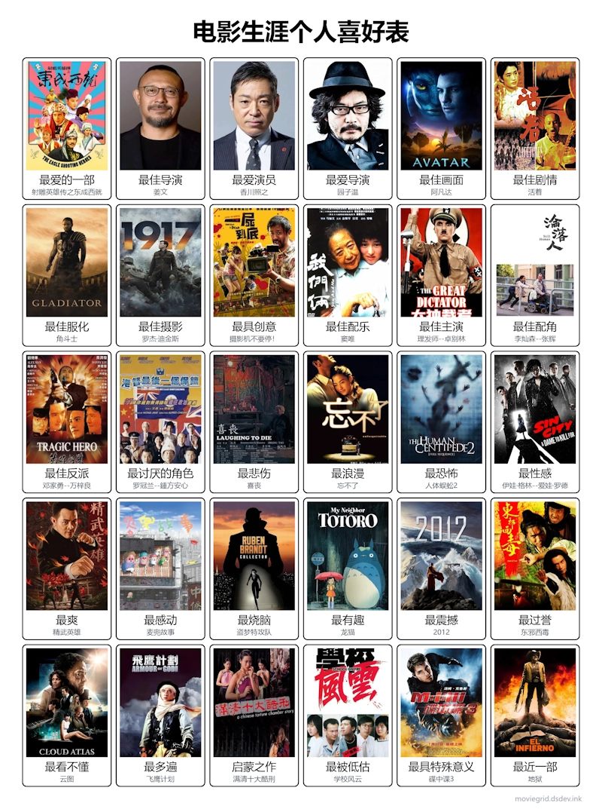

昨日青山（yinji.org）邀我填写“电影生涯喜好表”（https://moviegrid.dsdev.ink/），正好是我喜欢的话题。填完之后分享之。

数个条目需要额外补充说明一下。

**最佳导演**
没理解题意。是指像评奖那样，某部片子成功全靠导演，还是某个导演一直牛逼？我给理解成了后者。导演这个职业很容易晚节不保拉坨大的，昆汀和曹保平都因为这样的原因被排除了。邵艺辉样本太少。只能填目前即使最下限我也能接受的老姜。

**最爱演员**
我觉得演员最高的境界是演什么像什么。这样其实只有梁家辉和香川两个选项。本来梁家辉占优，因为香川不够帅，还是存在盲区的。但是梁家辉近几年有点不爱惜羽毛了。

**最佳剧情**
这个没要求原创剧情是吧？

**最佳服化**
有点为难，我看片不重视这个。

**最佳配乐**
我的理解先排除了音乐片。

**最浪漫**
这题不会。爱情片不是我的菜，选了部心目中最好的爱情片，但好像一起坐小巴不算什么浪漫的事。

**最恐怖**
这题本来想空着。选了心目中最好的恐怖片，但不是最恐怖。

**最性感**
这题好几个答案。是问穿衣服最性感还是不穿衣服最性感啊？是某个角色最性感还是拍摄得最性感啊？最后选了穿和不穿都好看的伊娃。

**最有趣**
这种问法不是问最佳喜剧片吧？

**最看不懂**
其实好多。涉及宗教、哲学、硬科幻、没接触过的历史的题材好多看不懂。挑了个最有名的。

**最多遍**
录像带时代我们家经常用《飞鹰计划》[招待客人](https://pewae.com/2017/07/memories_of_vhs.html)。

**启蒙之作**
想问的是这个吧？这是我看的第三部三级片。前两部30多年过去了，我至今还没找到，无法确定名字。

**最具特殊意义**
跟我老婆第一次见面看的。