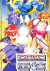

[电精](https://pewae.com/gaan/aHR0cHM6Ly93d3cuZG91YmFuLmNvbS9nYW1lLzI2MzMwNzky)

原名：ゴーストチェイサー電精别名：電神魔傀 机种：SFC厂商：BANPRESTO类别：ACT发行年月：1994-09耗时：6

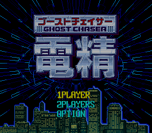
我只碰过两次超任真机，都是打街霸II。之前是根本没接触过任何一款超任动作游戏的。
所以这次就找个该平台上（可能是）最有名的动作过关类游戏来试水。
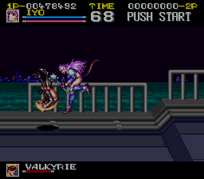

说起电精，就不能不提《电神魔傀》。
《电神魔傀》一共两作，是眼镜厂出品的极为稀有的机器人题材以外的街机游戏。其中一代在国内非常少见，而二代几乎跟《三国战纪》、《西游记释厄传》同时期，已经不是我的菜了，但据说非常受欢迎。
SFC版是一代的缩水移植版。最水的地方是，街机版原本有6个可选人物，但SFC版给简化成了三个，另三个只在过场动画里出现。
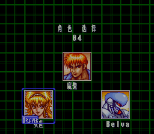
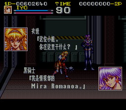

SFC的普及率在中国很可怜，但这款游戏在国内的知名度却不低。盖因为港台盗版商做了反向移植，把SFC版又移回了街机上，还进行了一番魔改。这款还珠格格式的游戏在街厅还很受欢迎，以至于街机的《电神魔傀2》在大多人嘴里被叫成了《电精2》。殊不知正统电精是没有2的。
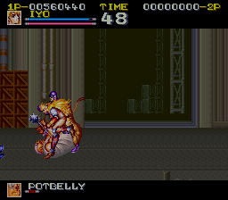

前面提过，眼镜厂因高达和机器人大战而闻达于诸侯。换句话说，他们家做的其它游戏水准都不怎么样。
这款游戏在我看来，水准一般般，评价虚高。跟隔壁的《格斗三人组》一对比，节奏、音乐、爽快感方面都落在下风。
当然这跟我单打有关系。看介绍丰富的组合技应是一大亮点。
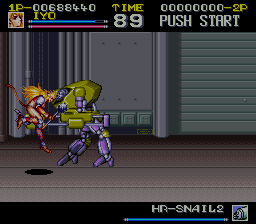

三个主角当中，第一个红发男主角就叫“魔傀”，各方面比较平均，特殊技加在“大招”上，空中放大招的时候特别猛。
第三个机器人是当时特流行的男-女-壮搭配里的那个“壮”。动作具慢，非常不实用。
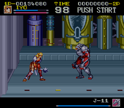

我的原则一直是有女的选女的。
女主角的操作感还是挺棒的。具体表现为，即使知道最有效的杀敌策略是换线连续A，却还是忍不住要跳。因为有两个动作练出来能大大提高爽感——其一是高空空擒，类似街机吞食天地2里赵云的操作，抓住人后却是以桑吉尔夫梅花大坐一般的动作坐下来，伤害高且有短时间无敌状态。其二是对付地面上的敌人，跳至对方脑袋的高度时按下+攻击，会用出神似拳皇中玛丽蜘蛛固一样的关节技。同样很爽，缺点是站起来时容易被打。
当然用钉头锤这件事本身已经挺酷的了。
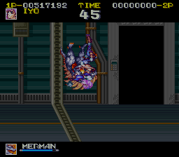
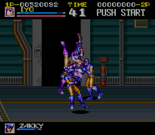

作为动作过关类游戏，本作最大的问题在流程设计上。敌人的种类少就罢了，打BOSS前的流程还特别漫长。一波一波打重复的小兵，消耗的是玩家的耐心。
加上BOSS们都不怎么有特色，雷同感很强，打的时候毫无紧张感，就不单列了。
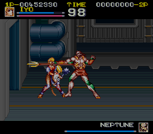

最终的BOSS有两重变身。第一层从造型到动作都酷似金家藩。金棒子早在92年的恶狼2就登场了，所以此处眼镜厂绝对是“借鉴”过了。
第二层变身又酷似世界英雄里的迪奥。眼镜厂啊眼镜厂，你请个美工会死吗？
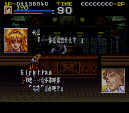
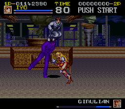
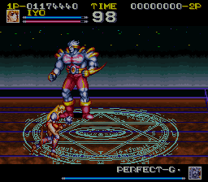

通关，故事竟然整得跟黑客帝国似的，讨论起了“我是谁”的问题。
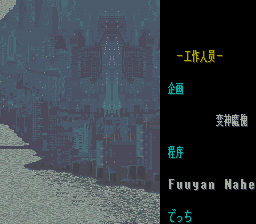
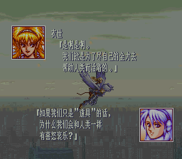
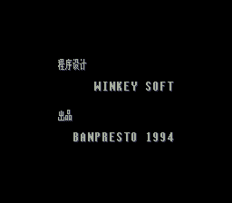