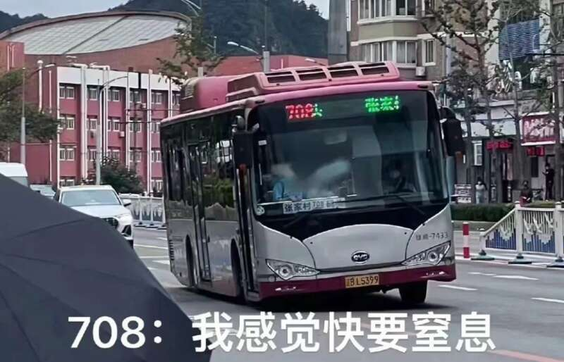
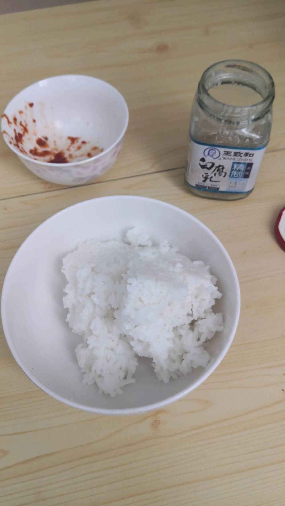

经历了2022上半年，本以为“瘟都”这个外号要被魔都抢走了。没想到她用实际行动捍卫了我这张“只有起错的名字，没有起错的外号”的乌鸦嘴。
就像你们所知道的，2022年8月30日起，这座城市“静态”了。目前，静态期已经延期至9月11日，所以周记应该是两篇。我也衷心地希望只有两篇。
鉴于爱记日记的都没有什么好结果这一事实，我只写官方的和我看到的。

虽然静态化是从8月30日开始，但故事的起点却要往前推一天半……
如同无数伟大的日本艺术作品一样，最有趣的戏码都发生在前戏阶段。

## 8月28日（日），静态化第-1天 / 8月29日（一），静态第0天

从周四（8月25日）开始，中山那边的风声就很紧张。但是所有人也只能得到官方消息。官方消息的特点就是很官方。周四一波核酸，周五到周六又是一波核酸，反正有脑子的人都知道事情可能不太妙。
不妙归不妙，马照跑，舞照跳。
周六还是风平浪静，周日便波谲云诡了。因为周日凌晨公布了最近一轮的“常态化”核酸检查结果有多处异常。所以周日下午紧急要求再做一轮核酸。至此所有老百姓都认识到要有事儿，但又不知道有多大事儿。
老婆的好朋友小鸟同学闹了肚子，所以老婆大人周六出去逛街的计划取消了。否则我就不一定在什么地方打这篇字了。

周日是一轮空前的大抢购。不过因为不是第一次闹这样了，这次老百姓理智了一些，整袋往家里扛米面少了很多。当然也可能是3月份扛回家的米面还没吃完。毕竟愿意抢米面的人总是固定的那些人。

傍晚时分，周边店铺吃的东西几乎已经被席卷一空，各个微信群开始活跃。有人说要静态化，就有人搬出辽宁省要求各地不得静态化的文件；有人说上街要戴N95，就有街道工作的邻居出来说没接到通知是谣言。
倒是有一个消息半真半假——当天晚上七点以后公交车全停，结果是有的线路停了，有的没停。

瘟都的某位不知哪个级别的领导是个首鼠两端的家伙，既不想疫情扩散，又不想违反省里的规定，或者担负上停工影响冲击万亿大计的恶名。鸡贼领导挑了鸡贼时间发布了鸡贼政策。
半夜11点左右，防疫指挥部出台了“23号令”。“因为疫情形势严峻”，所以规定8月29-31日减少公交车车次。早晚高峰半小时一趟，其余时段2小时一趟。
凌晨1点多，交通部门依据23号令，出台了“细则”，制定了具体发车时间表，以及强调所有司乘人员和所有乘客必须佩戴“N95以上级别口罩”。

因为情况确实特殊，早晨出门的时候先刷了本地新闻，已经看到了公交车减少班次和要求戴N95的消息。但是，老婆大人休息，实在不知道那两个N95放在哪。我心想：“我就死咬一个不知道，地铁还能不让我进吗？”
因为公交车几乎等于没了，所以步行1千米到地铁站。还没进站，门口出来抽烟的保安就提醒了我一句：“乘客啊，你这口罩不行，不是N95不让进。”
好歹也要试一下，还是坐电梯下去了。下面的口站的是警察，真的是不让进。如果只是保安我还能装疯卖傻两句，警察就只好算了。灰溜溜从另外一个口出来，等公交。
半个小时一趟，说的是始发站。途中每个站台都占满了人，上车时间自然就没了保证。在公交车站等了20分钟觉得没什么指望，刚好看到有出租车下客，那位司机也只是戴了普通口罩而不是N95，一问果然可以载我。
周一早高峰，打车真呵呵。
司机开的交广。广大司机朋友们关心最多的问题是，公交车车次都减少了，那么公交专用道能不能不专用？
交广则在乐此不疲地解释23号令对于区域划分的概念：南部区域是旅顺，中南区域是市内5区，中北是金普新区，北部是普兰店剩下的部分、庄河和瓦房店。之前闹得凶的两次都在金普新区，这次轮到市区了。
所有车站都是人，各个线路执行的标准也不一样，有的线路司机就是严格要求不戴N95不能上车，有的线路则还是医用口罩即可。反正所有的公交车都挤成了沙丁鱼罐头。
打车用时1小时05分，其中低速行驶39分钟，正常应该32或33块，这次51。8:07分下车，这个时间就很微妙。我们有个迟到的缓冲时间，是8:10分。这个缓冲时间的意思是不算迟到，但是离开公司的时间跟打卡时间差额必须满9小时（1小时午休）。所以急匆匆就往公司大门跑。保安让刷一个新出现的二维码。这玩意儿第一次使用要发短信验证码，我手机上显示的是验证失败，但是进去了。亮屏幕往里走，被一位全副防护服的大叔拦下了，说不看这个画面，要我再刷一次。大叔脾气很好，可能一早上见多了这种情况，解释说：“不看‘辽事通’里面的界面，而是要看刚刷出来的绿色对号（位置码确认，表示你是在某某场所刷的‘辽事通’）。”定睛一瞧，这位大叔竟然是公司主管非业务事务的总经理……
后来一想，第一次验证失败可能是该小程序的BUG，因为我手机里插了两张卡，卡1没有通信功能，它应该是卡1不通走了卡2，但卡1的失败信息还是报了出来，失败信息的弹出带走了绿色对号界面。
反正同事们陆陆续续也都到了，竟然没有一位受该事件影响而请假的。当然领导也说了，这天迟到考勤都给走特殊处理。

就没什么心思干活。隔十几二十分钟就跑出去刷消息。什么司机和乘客干起来了啊，什么乘客不戴N95司机报警啊，什么愤怒的乘客把车门干碎了啊，什么负重前行的708啊……

公司这边，看到还允许上班，就根本没有让居家的意思。下午吧，给了应对方案：“因为交通不便，所以允许疫情期间弹性工作制，以半小时为计时单位，每天两次最长打卡时间间隔9小时以上即可。”

吃完早饭就给老妈打了个电话，让她赶紧出门能买点什么买点什么，这样子接下来不封城才叫有鬼。
上午去趟公司楼下药店，离门老远呢，门口“大声公”的声音便先到了：“顾客朋友们，本店目前没有N95口罩，请不要在门口聚集。有需要的顾客可以扫描门上的二维码进群，到货后我们会立刻在群里通知……”
中午从老姜那里化缘化到一只N95（她3月份屯的）。
饭店堂食前一天便禁止了。离公司最近的大排档，竟然要求N95才能进。别的店又没这要求，可谓薛定谔的N95。

傍晚下班，有了N95傍身，直奔地铁站。可能是白天的热搜让有关方面亡羊补牢了，地铁车次恢复了。17:10的一号线地铁，竟然空空如也。

17:00过一点儿，“24号令”出台了。可怜的“23号令”的生命周期还不到20小时便无疾而终，没活过一天。
“24号令”就是静态令。捞干货的说就是：

> 8月29日24时至9月3日24时期间——
> 公交地铁全部停运。
> 出租车网约车正常，自驾正常。
> 市民非必要不出门（这句话非常常见，却又从来不解释什么是“必要”）。
> 所有人出门必须佩戴N95。
> 建议所有企业居家办公，实在需要出门办公的，要出示带单位公章的出勤证明。

约莫晚上八点半，接到领导通知，单位给我们办好了证明，发过来了照片。并且说“如果明天小区非要说没有纸质证明不让出门，给领导打电话，领导给开车送，反正弹性工作时间了。”
没有比较就没有伤害。老婆单位通知直接居家，不用上班。

8月28日，新增2例无症状；8月29日，新增15例无症状。

## 8月30日（二），静态第1天

疫情最严重的中山区，全区封闭，不让出也不让进。
其余四区全市统一执行24号令，带纸条可以上班。

闹表响起，还是照平常日子起床（5：50）出门（6：10）。保安根本没上班，一腔准备好的说辞也算喂了狗。
下楼刚好有空车。上车后才反应过来我应该叫滴滴（电子发票报销更方便），于是顺手团了三张快车优惠券。路上简直太顺畅了，20分钟就到了单位。
早餐店正常营业，只是不能堂食。

除了家住旅顺的小孩，全组全伙到齐。那个小孩因为不能跨大区，而且打车来成本太高的原因，直接居家了。

眼瞅着各个中小学开始安排起在线上课的计划来，我们学校却依旧没有分班的消息。
老姜的孩子同样是上初一，人家学校从小学要来了家长的联系方式，班主任老师挨个打电话加微信。
午饭也很正常，甚至由于路上车少，外卖小哥送餐速度还更快了。
下午老姜还请假了，他们孩子学校老师要家长去学校领书。
这种状态下也没什么心思干活，下午两位同事组团去楼下测核酸，因为不是本社区居民而被拒了。她俩又步行去了500米外的另一核酸检测点，做上了。把消息传回开发间，两位男同事联袂也出发去做，到地方之后人家也开始以非本社区为由给拒绝了。这让我想起了“就你有爷爷啊”的那个笑话，看来社区核酸检测点之间也是有联系的。
每周二四来卖临近保质期酸奶的那位大哥竟然也出摊了。卖得特别便宜，按他的说法，趁着我们还没全部居家，赶紧处理了。要都不上班了，他这些货就全得扔。

下班前，经理表示：“23号令都作废了。交通状况其实很好，打车很容易，8月份剩这两天就继续弹性工作了，9月份开始恢复正常考勤。”
下班打到了快车，花掉了一张券。我忽然觉得自己是个傻缺——单位给报销，券的钱反而是自己出的啊。

8月30日，新增40例无症状。

## 8月31日（三），静态第2天

早起后根本打不到网约车，我不常用这个，也无法判断是不是常态。出租车司机大哥说他从明天开始就不干了——出租公司这回破了天荒，你要出来干，公司给开证明；要是不出来，给免份子钱。
上午9点得到的消息：高新区规定，今天以后，高新区内的员工可以继续上班，高新区以外的就不能来了。一组10个人，只有两位家住高新区。便开始着手准备居家用的机器。
组里5男5女，有几台空闲笔记本正好每位女士一台。男的只能搬台式机。
稍微解释一下，搬的机器并不是工作用的机器，而是要格式化之后只装一个VPN软件别的啥都没有。我们用自己专用的帐号登陆这台远程台式机，然后用专用的VPN帐号进入公司内部网络，再远程连接到自己的工作机器干活。
所以只有验证了VPN功能好使且其余功能都不好使之后，机器才能出公司。

到中午情况就非常不对劲了，因为高新区又下了新规定：
高新区以外的，晚上8点以前全回家，9月1号起不准进入高新区；高新区以内的，各回各家，非要到单位值班的，要申报区疫情指挥部开通行证。
这还不止，午休前把楼下用餐室给贴了封条，且下午进楼来检查好几次，在座位上也必须戴好N95。甚至单位大门还贴了象征性的封条，只出不进。

IT部门干活的只有一个小胖子。全公司接近200台机器要重做系统。谁也不比谁更重要，只能等小胖子做好一台搬回来调一台。快到5点的时候才堪堪弄好。结果小语忽然多了一句嘴：“帮我们看看麦克风好不好用呗？teams要用。”这下可好，小胖子当场表示，所有的台式机都得更新声卡驱动才能好使。小胖子给了个安装路径，并且把刚收回的管理员权限又给加了回来，就匆匆下楼继续装机器去了。5台台式机的声卡装完测完，再删掉管理员权限，已经7点半了。这天原本大多数人为了早走，7点半不到就来公司了，也就是说，在单位的时间已经超过了12小时，弹性弹性，把自己弹进去了。
最可悲的是，往下搬机器的时候，贵哥忽然说了一句：“只有跟客户开会才用teams，咱哥几个除了王哥（我），都不用跟客户开会啊，把王哥自己的机器声卡配好了不就行了？”
我说：“teams走的是公网，我用自己PC就能上，也不用装啊……”

公司门口搬了一排要搬回家的机器，以及低头刷打车软件的同事。
空出租车就停在那里。我一抬下巴，司机一点头，就上车了。
上车后醒悟过来，人事间最最痛苦的事情就是，居家了，优惠券没用完。

台式机回家，保安小哥殷勤地给我开门：“哥，终于居家了啊！”
我心想，完了，这哥们认识我了，再用出门证他会不会把我给我拦下来？

老婆大人在家里跟闺女一起完成了分班和开学前召集工作。
一大早7点多，小学班主任在群里发了（应该是）小学班的最后一条官方消息，给了一个初中的分班链接。家长点进去之后自行查看班级并加班主任微信。9点班主任准时开会召集，布置初中要准备的东西，10点散会，效率就是这么高。
一个重点是：“因为疫情要求，不发书。”
班主任和各科任老师把教材和第一周要用的上课小卷和课后练习题都发到了群里。“有条件的尽量打印，没有条件的卷子要抄下来，书上课看电子版也行。”
语数英的教材因为假期上课本身就有，不用打。史地生政教材的第一单元，加上各科练习卷，一共打了103面。打到第40面的时候，加了回墨。觉得投胎做打印机好可怜。

8月31日，新增4例确诊和101例无症状。

## 9月1日（四），静态第3天，开学第1天，居家办公第1天

除中山外的几个区陆续发布了“致辖区居民的一封信”的小作文，再怎么情真意切，也无非是一个意思：“我要动真格的了。”
要不然你就直接下红头文件，要不然你就闭嘴，弄这些臭氧层子有啥用啊？什么年代了还写信，难道你要写信告诉我今天海是什么颜色（的码）？

接下来便是各种耳提面命但就是不落纸面的各个区各个街道甚至各个社区的土政策。
我在这座城市待了40多年，除了1996年初升高考试，“区”这个东西从来不曾这么有存在感。

不管哪个区，都开始不让出不让进。必须出门工作的，要持有区一级防疫办盖戳的上岗证明。

早上带闺女做了核酸，顺路去罗森买了早餐和咖啡。

三年了，终于享受到了居家办公，好激动啊！
折凳上（平）放机箱，上摞显示器。另一个折凳上垫上一个跟机箱差不多高的箱子，放键盘。
也就是说，我得猫着腰写代码。
半天下来，脖子酸得不行。下午想通了，也没啥会要开，半躺摸鱼。
脑子里的天使说：“摸鱼啊，不应该用来写博吗？”
脑子里的魔鬼说：“不不，打游戏看片才是正道啊。”
反正领导也不会看你写了多少代码，开会前整两页PPT得啦……

因为我不喜欢看手机，所以不得不装一堆通信和办公用的软件在PC上面。其中，某国企内部的那个工具最讨厌——十几个置顶的通知群，不能删除，而且一半不能免打扰。而公司又规定，但凡涉及到公司业务和客户相关的内容，就只能用那个软件。所以再不喜欢用也只能开着听它叽哇乱叫。

臭宝在客厅上课。
我在书房上班。
老婆在卧室看剧——窗口行业，不在单位有什么事可干！

所有人都在期盼着的“23号令”的笑话，虽迟但至。白纸黑字的行动轨迹上面，赫然有两位29号上午乘坐公交车的记录。

全市除了中山区和中高风险小区以外，都可以出家门自由活动。不管你是腿着，自驾还是打车，只要不跨区怎么都行。

9月1日，新增3例确诊和112例无症状。

## 9月2日（五），静态第4天，开学第2天，居家办公第2天

在机场工作（某航空公司地勤）的队长被要求不能回家。当天在岗的，继续值班，晚上安排到机场宾馆住；不在岗的就直接在家静态了。出勤算加班，过后给串休。
——可是他们因为疫情影响，业务量都砍了一半了，本来就经常放假好吧。

调整了公司机器的位置。把公司显示器搬到了电脑桌上，把原来桌上的打印机搬到了小折凳上。这下终于可以直起腰干活了！
打印机是疫情还没出现的那个秋天开学买的，当时图便宜，买的不带任何高级功能的喷墨机。但凡它能连个网而不是靠USB线连在我PC上，我挪腾起来都没这么费尽。

市里或者区里不知道哪一级，可能是看了增长数据觉得不好看，也可能觉得大家静态得太休闲了，下午的时候甘井子区忽然放出了新龟腚：“为了配合全市防疫大局，周六周日，全区所有小区静态化管理，不出不进，希望大家提前做好准备。”
顿时，周边几个既做团购又有门头的商家门口都排起了长队。而有自己供应链、号称卖绿色蔬菜的“良运欧宝”，平常卖菜比别的店贵出30%这时看来简直是天使。店里的人比腊月二十八的超市里还要密。

我们这个楼盘二期三期在一个院里，地盘很大，跟一所普通大学占地面积差不多。有人傍晚跑步，被隔壁小区的人拍了照片，发了微博也不是朋友圈，配字：“都什么时候了还出来瞎晃荡！”
20分钟后，警察街道全来了。巡警进院，把院里的闲杂人等一律撵回家。
弄了辆警车围着我们这片绕8字，反复广播：“特殊时期，请广大市民做好防护，不要在户外逗留……”
MMP的。

晚上7点多，跟老婆出去最后一次遛弯，路过平常常去的那家店，老板娘竟然罕见地在店外面抽烟。看到我俩开始诉苦：“姐，这买卖干的真憋屈，你不知道啊，下午4点多，街道的人来，说店里密闭不安全，让把所有货搬到门口，店里不准进人；6点多来一帮城管，又说都什么时候了还在街上卖东西，让都搬回去。俺老头腰都抻坏了。现在只能你搁门口站着，要什么我进店给你拿。”
于是老婆花36块钱买了5个桃子。
回家一看，烂了俩。
虽然给退钱了，心里还是隔央。
特殊时期，你还不能把她微信删了。

9月2日，新增6例确诊和106例无症状。

## 9月3日（六），静态第5天

黑哥本来在百合当志愿者，帮忙测核酸。核酸测到早上7:30，突然接到通知，头一天结果出现阳性，所有待核酸检测人员回家不能出户。又要黑哥留下等待命令进行上门核酸检测。黑哥又说自己没有医学知识，又说自己手笨，总算把自己摘了出来。
黑哥消息发出来我立刻就慌了，因为那正是我爸妈所在的小区。
后来的结果是当天待在家里不准外出，接到通知后按单元在楼道口测核酸，测完的可以出单元但不能出小区。

甘区禁令正式生效，除做核酸外不准出小区门。西岗区也同样如此。市内只剩沙河口区还能自由出小区。
“元初食品”最后一天线下营业。街道的人在门外守着，店内一次限容5位顾客。
这时周边还开着的店已经不多了。元初门口排的队伍比做核酸的还要长。

中午老婆订的烤鱼，还给送，也允许出小区门接。平台送这种外卖已经非常不及时了，所以是店老板开车亲自出来送。
导航把老板送去了100米外的二期。
感谢时间差，我下楼的时候门口保安吃午饭去了。我意识到这个中秋节有极大可能要静态着过了，赶紧跑去小超市，拎了一提啤酒上来。
感谢迷路的烤鱼店老板。

晚上，老婆大人忽然接到未知电话。对方上来问的是老丈人所在的门牌号。这是社区的电话啊，她心里一惊，怕老头出了什么事儿。
话题继续，倒是没什么大事儿。人家是上门来送买菜出门通行卡的。老丈人家的楼道对讲坏了两年多了。老头儿耳背，人家在门外敲门、喊，他什么也听不见。老丈人是一楼第一家，他不给开门，社区的人根本进不来。对门那老头比他还大八岁呢……
电话打通了，老婆让老丈人去开门，事情便解决了。而且捎带着，第三天，还有人来把对讲给修了。

9月3日，新增5例确诊和101例无症状。

## 9月4日（日），静态第6天

大清早开始下雨。
出门做核酸的时候，保安让把静态第一天发的卡换成新的采购通行卡——
卡分红黄蓝三种。就是日期跟3取模，分别对应当天出门、第二天出门和第三天出门。每卡每三日限出门一人，限时2小时。出（车库）门前通知管家，保安给手动抬杆。天知道他们要如何计算时间。
领卡的时候没多想，因为家里有存货，就选择了第三天的蓝卡。
拿到之后有些忐忑：你说要是情况变好的话，第三天放宽了，你的卡有没有就一样了；要是情况变糟了，第三天变严了，你的卡也不能用了；只有不好不坏维持原状，这卡才能用。

情况最好的沙河口区也是发卡进出，不过人家是按2取模，而且出门以后不限制时间。

上午，官方宣布24号令有效期延长至9月11日，中秋节被正式宣告静态。

京东到家的沃尔玛店还显示正常配送。老婆大人买了一堆东西。
盯着APP刷送货员的位置，还是超时了1个多小时。10根雪糕早已经化成了浆糊。天知道家里领导为什么要买雪糕。

外卖是不给送了，但各种送货群还是相当活跃的。中午吃的是烧排骨配菠菜汤。晚饭只一道菜，99块钱3斤飞蟹，这价格就算没遇上疫情也是相当公道了。
咱瘟都人，9月1日开海了，加上临近八月十五正是海货肥美的时候，不整点鲜的会内分泌失调的。
我妈那里也传来了好消息——他们那个老小区，封的面积太大，以至于大约1200米以外的地方有个菜市场和中型超市。我爸去买到了新鲜鱼和豆腐，也没比平日贵多少。
这次封锁的差异性实在太大，每个社区乃至每个小区的情况都不一样。
老婆把啃螃蟹的照片发了朋友圈，招来一位她的同事。
这位是个一个人死了全家火葬场的精神小伙，住在本来是城乡结合部开发了一半有一多半房子没卖出去的小区，又在8月28号就因为出现密接直接被封楼里了。
他给我老婆传来的照片是酱婶儿的：

二期出现了混管异常，下午封了8个单元。巡警也再次回来了，小区里也不能散步。

我们家的物资储备出现了第一只黑天鹅。
上一包猫砂质量不好，小宝尿了两次之后就结了大疙瘩。铲完之后味道仍旧很大，大到小宝都不愿意进去拉尿，就在沙发上憋着、趴着，特别可怜。
老婆赶紧满世界找能给送的猫砂。
要说现在做生意的也真是拼命，半夜11点多楞是给我送来了。保安小哥不知道我半夜下去等快递，还以为我要翻墙出去，就那么直勾勾盯着我。

9月4日，新增9例确诊和86例无症状。

## 9月5日（一），静态第7天，开学第3天，居家办公第3天

从早上8点上班开始，连着开了3个会，中间只休息了15分钟，午休晚了20分钟。口干舌燥不说，耳朵（塞耳机塞的）还贼涨，真是比上班累多了。

临近的一个市场，虽然是隔壁沙河口区的，但是离我们这儿不到2千米，一个海鲜摊主阳性。而且是进入静态之后的阳性。受此影响，老丈人家楼门也不让出了。

持黄卡出门的邻居在群里说，ta去了1千米外的沃尔玛，东西很全，价格也不贵，只是——
沃尔玛的停车场不让用了，ta停路边被电子眼拍了。

晚上，徐二哥家因为旁边楼有人被带走，所以也被上了封条。

22:00，臭宝好朋友的妈妈趁她们家门口保安没注意，跑来送了代买的史地生政教材。
滴水之恩当以涌泉相报，您未来三年的“三年中考五年模拟”，在下包了！

9月5日，新增2例确诊和85例无症状。

To be continued.