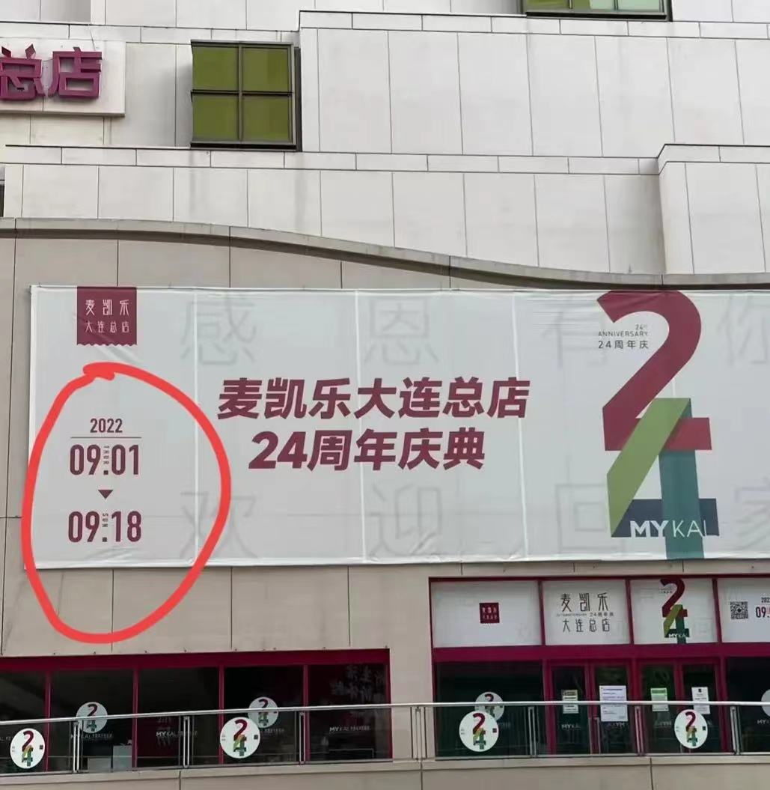

## 9月13日（二），静态第15天，开学第8天，居家办公第8天

上午开始，西岗区、甘井子区的数个小区，紧急封闭。因为西岗区出现一例混管异常。该管中包括一位医大一院护士，家住甘井子某小区，被派往西岗区一个测试点援助核酸测试。
所有接受该护士检测的人都再次被封回家里。
至晚间，警报解除。

虽然沙区白天允许外出，但是晚上还是有人把守的。
耐不住寂寞的黑哥翻墙出小区喝酒撸串。不知喝了多少，回家的时候摔了。挺重，小腿骨折，更麻烦的是膝关节有错位。

9月13日，新增10例无症状。

## 9月14日（三），静态第16天，开学第9天，居家办公第9天

下午，山东路千山心城附近再次风声鹤唳。因为出了一例，中华路街道把已经出门的人又都赶回了社区，继续执行不准出小区的政策。山东路接近2千米店铺比较集中的路段，全部上了挡板。
社会面无新增计数再次归零，但是不这么提了，只是说甘区中华路街道重点监控，某某路某某路区域限行。

9月14日，新增6例无症状，其中“**在重点管控区域核酸筛查中发现1例**，其余5例均在集中隔离管控人员例行核酸检测中发现”。

## 9月15日（四），静态第17天，开学第10天，居家办公第10天

受台风影响，中午开始下雨。
下午直到到深夜，路上什么都没有，城市陷入真正的沉寂。

9月15日，无新增。

## 9月16日（五），静态第18天，开学第11天，居家办公第11天

台风雨持续了一整夜。午前雨停，狂风大作。
连续做了21天核酸后，终于不用早起抠嗓子眼了。不知是疫情真的减弱了还是受台风影响。
同事在会议室里瞎聊的时候，普遍反应，美团总是没有骑手，饿了么能正常给送。
高新区、西岗区解禁。时隔17天，我妈终于有机会出小区了。

9月16日，无新增。

## 9月17日（六），静态第18又2/3天，解除静态第1/3天

才停一天的核酸又得接着测。
中午步行去1000米外的米线店自提，发现路上又多了一个出区的卡子。
政府发布了17日晚18点可以跨区以及9月18日恢复公共交通的消息。虽然仍有部分线路改线或停运，但这意味着终于解除静默了。
所以中午多出来那个卡子是最后的疯狂吗？
窗外陆续传来稀疏的鞭炮声。

黑哥准备住院手术，特殊时期，住院要先隔离三天。

新精神要求进出所有公共场所要扫“场所码”。每个小区门口也有，也要刷。很多小区门口有人查。问题是家也算“公共场所”吗？没智能机或者没流量了连家都不让回？

9月17日，无新增。

