## 摘要

年度佳作：《不要抬头》、《黑炮事件》、《隐入尘烟》、《保你平安》、《再见列宁》、《烈日灼人》、《怪宴》、《美国往事》
年度抵制：《真人快打》、《绝望主夫》、《超能一家人》、《女囚风暴1995》、《地狱血脉》、《敢死队4：最终章》、《你猜我是不是英雄！》
年度惊喜：《保你平安》、《宇宙探索编辑部》、《最佳导演》、《椒麻堂会》
年度失望：《明日战记》、《坏蛋联盟》、《咒》、《复仇者》、《人类清除计划》、《豪勇七蛟龙》、《杀人者唐斩》、《精灵旅社4：变身大冒险》、《逃亡》、《和平饭店》
年度特别推荐：《黑炮事件》

年度最佳导演：《美国往事》赛尔乔·莱昂内
年度最佳剧本：《隐入尘烟》李睿珺
年度最佳男主角：《何必有我？》郑则仕（饰肥猫）
年度最佳女主角：《南方车站的聚会》桂纶镁（饰刘爱爱）
年度最佳男配角：《七个神经病》克里斯托弗·沃肯（饰汉斯）
年度最佳女配角：《黑炮事件》汪漪（饰周玉珍）
年度最佳音乐：《惊变28天》
年度最佳画面：《疯狂的麦克斯4：狂暴之路》
年度最佳续集或翻拍：《惊声尖叫6》
年度最佳网大：《远山淡影》

年度最差导演：《地狱血脉》约翰·亚当斯
年度最差剧本：《长沙夜生活》张冀
年度最差男主角：《绝望主夫》常远（饰胡铁男）
年度最差女主角：《绝望主夫》辣目洋子（饰许薇薇）
年度最差男配角：《超能一家人》韩彦博（饰郑德义）
年度最差女配角：《X战警：黑凤凰》杰西卡·查斯坦（饰沃克）
年度最差续集或翻拍：《我唾弃你的坟墓：似曾相识》

## 总结

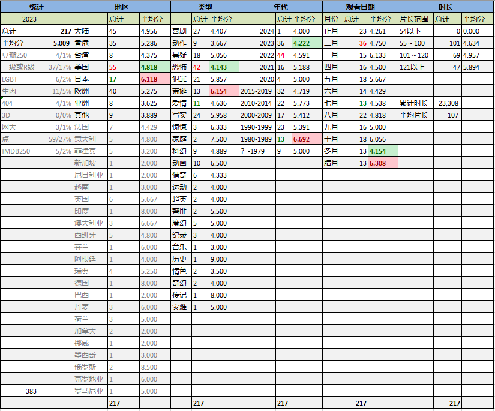
癸卯年是闰年，全年383天。
本年度看片217部，比去年增加24部，增加了12%，考虑到闰年多出的一个月，这是个非常正常的看片频率。
平均分5.00，比去年高了0.1，堪堪回到了5分，说明本人仁慈了不少。

刷片量最多的是在农历二月。有两个因素：第一当然是闰月，懒得动表格，所以把两个二月统计到了一起。第二是因为出差，我带了12部片子，酒店的盒子里也刷了几部，甚至还看了久违的电影频道。其余的月份都还比较平均。

今年没有产生满分作品。给了8部作品9分。其中最接近满分的是年底刷的《美国往事》，这是一部很man又很细腻的伟大作品，我扣分的理由是片子采用三个年代穿插叙事的方法，尤其是1933年和1968年两个时间点来回横跳，想了解剧情就得二刷。但这片子导演剪辑版长达4小时10分钟，实在是有些不友好。《不要抬头》、《怪宴》都是黑色幽默，前者讽刺了美式自由民主，后者讽刺侦探小说的故弄玄虚。《烈日灼人》是俄罗斯电影，用最温情的画面控诉最邪恶的大清洗。以及另外要隆重推荐的《最佳导演》——不要被片名骗了，这是一部描绘婆媳关系和婚礼琐事的浮世绘，导演对新郎两头受气又无可奈何的心态把握得很到家。
烂片方面，开心麻花真是吃相难看不要碧莲了。麻花系演员和泛麻花作品在本人的恶评榜上继续霸榜。烂片里比较可惜的是吴家丽监制导演的《女囚风暴1995》。本来年轻一代的香港女星气场就不行，片子更是被剪到只剩68分钟，故事都圆不上，可惜。

从年代分布上看，最多的是2022年产的片子，高达44部。显然这很大一部分是去年长期居家手欠欠下的债。2023年的新片也有36部占据第二，评分确是最低的。在我心目中全球电影业的颓势还是遏制不了了。上世纪片子的刷片数量跟去年差不多，有所区别的是今年刷的80年代的片子质量更高，呃，也不一定是更高，主要是之前没单独统计。

地区分布方面，日片仍旧只列第四，美国片仍旧占据第一，只不过今年二者的评分反了过来，好莱坞成了评分更低的一方。菲律宾成了观影范围里的新常客，今年又刷了5部VIVA出品的那啥。相对的，竟然一部泰国片都没看，也挺意外。电影新版图拓展了个尼日利亚，看了一部非常无聊的黑帮片，后悔。

今年只进了两次电影院。一次是为了满足自己的《超级马力欧大电影》，一次是陪闺女去看的《孤注一掷》。公历年底的《涉过愤怒的海》挺想看的但没调配出时间，遗憾。还是那句话，在全球电影水平飞降的今天，能吸引我进影院的片子可不多。
R级片比去年多看了8部，上升了2个百分点，但却只有庚子年34%峰值的一半。豆瓣未收录作品只看了4部，是去年的1/4，前年的1/8。一方面是没有真的去搜，另一方面这种东西确实存货不多了。

没有特意去刷名作。豆瓣250看了4部，IMDB是5部。《疯狂的麦克斯4》和《美国往事》是两榜都有的作品。《末路狂花》和《疯狂动物城》是豆瓣独占，这俩在我心中都挺水的。《末路狂花》不是不好，但它是我眼瞅着豆瓣榜干掉了几个异端之后杀进前250，然后一路爬升的，跟现在的豆瓣受众用户范围不无关系；而《疯狂动物城》则代表了豆瓣一向偏爱迪士尼和皮克斯的光荣偏见，不是不好，是没那么好。IMDB那边的三部是《钢铁巨人》、《杰伊·比姆》和《谋杀绿脚趾》。《谋杀绿脚趾》在我看来多少沾点神经病，另外两部还算对得起自己的排名。

150分钟以上的作品看了7部。其中最长的是前面提到的名作《美国往事》。7部中的5部是2021年以后的作品，可以说这几年业界对于剪辑的藐视是越来越放肆了。今年没看任何短片。

今年以消化过去两年下载的存货为主，并没有认真刷某个导演或者系列。只是又多补了两部园子温。其中失落的处女作《坏电影》，粗糙而有趣。
本打算打穿《人类清除计划》系列。但第一部令我非常失望，连带着整个系列都不想看了。

《黑炮事件》是近年来比较受推崇的讽刺电影，但我仍要把它作为年度特别推荐介绍出来。除了黑色幽默讽刺体制这个显而易见的优点外，我还喜欢里面的浓郁的八十年代国营工厂气息。镜头从车间掠过，沾着机油的抹布味和喷漆的香蕉水喂扑面而来。那是我小时候熟悉的味道。

明年甲辰年是平年，但是会有个时间比较别扭的奥运会，所以，目标就定成185部以下吧。

## 详情

下面是影片的详细信息和三句话简评。右侧为本人评分，仅代表个人观点，拒绝客观公正。
评论皆原创。

[不要抬头](https://pewae.com/gaan/aHR0cHM6Ly9tb3ZpZS5kb3ViYW4uY29tL3N1YmplY3QvMzQ4ODQ3MTI=)

原名：Don't Look Up导演：亚当·麦凯主演：乔纳·希尔 / 凯特·布兰切特 / 提莫西·查拉梅 / 朗·普尔曼 / 梅丽尔·斯特里普 / 泰勒·派瑞 / 罗布·摩根 / 莱昂纳多·迪卡普里奥 / 詹妮弗·劳伦斯 / 马克·里朗斯类型：喜剧 / 科幻地区：美国首映时间：2021

黑了疫情下的各国政府，虽然刻意但勇气可嘉。
傻儿子比较传神。
所以狗上鸡究竟跟悲伤有没有关系？

[太子传说](https://pewae.com/gaan/aHR0cHM6Ly9tb3ZpZS5kb3ViYW4uY29tL3N1YmplY3QvMTc2ODYxOQ==)

导演：邱礼涛 / 黄泰来主演：关之琳 / 刘嘉玲 / 张学友 / 李克勤 / 秦豪 / 陈元 / 陈惠敏类型：剧情 / 动作地区：香港首映时间：1993

节奏差，剧本老掉牙。
刘嘉玲表现不错。

[明月照尖东](https://pewae.com/gaan/aHR0cHM6Ly9tb3ZpZS5kb3ViYW4uY29tL3N1YmplY3QvMTMwNzc4MA==)

导演：黄泰来主演：余国乐 / 关之琳 / 吴孟达 / 夏占士 / 张学友 / 李殿朗 / 程东 / 黎明类型：动作 / 爱情地区：香港首映时间：1992

故事的格局其实很小，但是所有演员表现在线。
这可能时我看过的年轻的关之琳表现最好的电影。
学友哥戏份很少，但最后一个镜头碾压黎明。

[阿姆斯特丹](https://pewae.com/gaan/aHR0cHM6Ly9tb3ZpZS5kb3ViYW4uY29tL3N1YmplY3QvMzM0MzQ4MDI=)

原名：Amsterdam导演：大卫·O·拉塞尔主演：亚历桑德罗·尼沃拉 / 克里斯·洛克 / 克里斯蒂安·贝尔 / 安德丽娅·赖斯伯勒 / 安雅·泰勒-乔伊 / 玛格特·罗比 / 约翰·大卫·华盛顿 / 迈克尔·珊农 / 马提亚斯·修奈尔 / 麦克·梅尔斯类型：历史 / 喜剧 / 悬疑地区：美国首映时间：2022

医生、律师和女神经病。
片子缺少重点，悬疑片可不应该是这个节奏。
泰勒的客串中规中矩。

[丧尸不要停（法）](https://pewae.com/gaan/aHR0cHM6Ly9tb3ZpZS5kb3ViYW4uY29tL3N1YmplY3QvMzU0MTMwMzc=)

原名：Final Cut导演：米歇尔·阿扎纳维西于斯主演：卢安娜·巴杰拉米 / 拉斐尔·奎纳德 / 查理·杜邦 / 格莱高利·嘉德波瓦 / 玛蒂尔达·鲁茨 / 罗曼·杜里斯 / 莱耶·塞伦 / 让-帕斯卡尔·扎迪 / 贝热尼丝·贝乔 / 费尼肯·欧菲尔德类型：喜剧 / 恐怖地区：法国首映时间：2022

缺少创新的翻拍。
时间没必要搞那么长。
唯一有趣的新笑点就是日文人名了。

[我唾弃你的坟墓2](https://pewae.com/gaan/aHR0cHM6Ly9tb3ZpZS5kb3ViYW4uY29tL3N1YmplY3QvMjQ4NzAwNjY=)

原名：I Spit on Your Grave 2导演：史蒂文·R·蒙若尔主演：Aleksandar Aleksiev / George Zlatarev / Peter Silverleaf / 乔·阿布索隆 / 凯茜·克拉克 / 杰玛·达兰德 / 玛丽·萧克莱 / 瓦伦丁·佩尔卡 / 迈克尔·迪克森 / 雅沃尔·巴哈罗夫类型：恐怖 / 惊悚地区：美国首映时间：2013

跟第一部区别不大，不过主角的心理刻画要更细腻一些。
这几个人有那么大本事把活人弄到保加利亚去，还用得着在纽约拍小电影混日子？
黑东欧算是米国日常了。

[我唾弃你的坟墓：复仇在我](https://pewae.com/gaan/aHR0cHM6Ly9tb3ZpZS5kb3ViYW4uY29tL3N1YmplY3QvMjY2MTczMTQ=)

原名：I Spit on Your Grave: Vengeance Is Mine导演：R·D· Braunstein主演：Christopher Hoffman / 凯伦·斯特拉斯曼 / 加布里埃尔·霍根 / 哈莉·简·科扎克 / 拉塞尔·皮茨 / 沃特尔·派瑞兹 / 米歇尔·赫德 / 莎拉·巴特勒 / 詹妮弗·兰登 / 道格·麦克昂类型：恐怖 / 惊悚地区：美国首映时间：2015

变成真正的复仇题材，恐怖片搞那么深刻干嘛？
那位中年大叔的设置相当不错。
私刑总是看着过瘾。

[人食人实录](https://pewae.com/gaan/aHR0cHM6Ly93d3cuaW1kYi5jb20vdGl0bGUvdHQwMDc4OTM1)

原名：Cannibal Holocaust导演：ruggero deodato主演：francesca ciardi / perry pirkanen / robert kerman类型：冒险 / 恐怖地区：意大利首映时间：1980

虽然吃人是假的，但杀甲鱼和杀猴子也足够血腥了。
伪纪录片不新鲜。
片末竟然还带了一点儿批判。

[我唾弃你的坟墓：似曾相识](https://pewae.com/gaan/aHR0cHM6Ly9tb3ZpZS5kb3ViYW4uY29tL3N1YmplY3QvMjY0MjA0MzU=)

原名：I Spit on Your Grave: Deja Vu导演：梅尔·扎奇主演：Holgie Forrester / Jamie Bernadette / Jeremy Ferdman / Jonathan Peacy / Roy Allen III / 卡米尔·基顿 / 吉姆·塔瓦雷 / 本·瓦伦 / 梅尔·扎奇 / 玛利亚·奥尔森类型：恐怖 / 惊悚地区：美国首映时间：2019

太过于拖沓了。
每个角色都处于癫狂状态，这样的片子看着太累。
仿佛拍个片子只是为了让当年的女主出来露个脸。

[恐惧直播](https://pewae.com/gaan/aHR0cHM6Ly9tb3ZpZS5kb3ViYW4uY29tL3N1YmplY3QvMzYxNTYzODM=)

原名：Livescream导演：Percival M·Intalan主演：elijah canlas / katrina dovey / phoebe walker类型：恐怖地区：菲律宾首映时间：2022

相当无趣的电影，氛围主要靠喊。
坏人的战斗力水平忽高忽低，到了影响影片逻辑的程度。

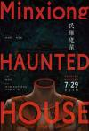

[民雄鬼屋](https://pewae.com/gaan/aHR0cHM6Ly9tb3ZpZS5kb3ViYW4uY29tL3N1YmplY3QvMzUzNTIzOTg=)

导演：刘邦耀主演：刘韦辰 / 夏靖庭 / 宥凯 / 杨谨华 / 沛小岚 / 游安顺 / 麦语彤类型：恐怖地区：台湾首映时间：2022

普普通通。
男主角塑造相当失败。
野道士的设定比较有特点。

[纸人回魂](https://pewae.com/gaan/aHR0cHM6Ly9tb3ZpZS5kb3ViYW4uY29tL3N1YmplY3QvMzYyMDA3MDM=)

导演：成思毅主演：张皓然 / 钟雷 / 陈国坤 / 陈紫函 / 韩栋 / 魏璐类型：恐怖 / 悬疑地区：大陆首映时间：2023

所有人物智商都不在线的流水线网大恐怖片。
都什么年代了还要用重男轻女这个老引子。

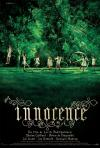

[纯真](https://pewae.com/gaan/aHR0cHM6Ly9tb3ZpZS5kb3ViYW4uY29tL3N1YmplY3QvMTQ0NDIzMg==)

原名：Innocence导演：露西尔·哈兹哈利洛维奇主演：Bérangère Haubruges / 伊莲娜·德·芙吉霍尔 / 玛丽昂·歌迪亚类型：剧情 / 悬疑地区：比利时首映时间：2004

虽然没有什么真正的儿童色情，但总觉得是拍给恋童癖看的。
跟语言无关，完全没看懂。

[靓汤](https://pewae.com/gaan/aHR0cHM6Ly9tb3ZpZS5kb3ViYW4uY29tL3N1YmplY3QvMjYzMzk3NDc=)

原名：Lang Tong导演：罗胜主演：Angeline Yap / Vivienne Tseng / William Lawandi类型：情色 / 惊悚地区：新加坡首映时间：2015

偌大的新加坡，已经找不到合适的美女了么？
有没有排骨汤，故事都一样。
反正要下毒，为啥不早点下？

[隐形狂人](https://pewae.com/gaan/aHR0cHM6Ly9tb3ZpZS5kb3ViYW4uY29tL3N1YmplY3QvMTMwNzM4OA==)

原名：The Invisible Maniac导演：亚当·里夫金主演：Savannah JasonLogan MarilynAdams DanaBentley类型：喜剧 / 恐怖地区：美国首映时间：1990

想法还行，只是制作太粗糙了。
前半部分冗长，入戏太慢。
男主角演技不错。

[白雪公主杀人事件](https://pewae.com/gaan/aHR0cHM6Ly9tb3ZpZS5kb3ViYW4uY29tL3N1YmplY3QvMjQ4NTg0MTQ=)

原名：The Snow White Murder Case导演：中村义洋主演：井上真央 / 小野惠令奈 / 染谷将太 / 生濑胜久 / 绫野刚 / 莲佛美沙子 / 菜菜绪 / 谷村美月 / 贯地谷栞 / 金子统昭类型：剧情 / 悬疑地区：日本首映时间：2014

比陈大导的《搜索》好10个点。
最后的结局和结局前的蜡烛都相当不错。
缺点是悬疑感还不够强。

[嘿 你叫什么名字](https://pewae.com/gaan/aHR0cHM6Ly9tb3ZpZS5kb3ViYW4uY29tL3N1YmplY3QvMzYxMzk3MTc=)

原名：Hey You!导演：Uyoyou Adia主演：Ebisan Arayi / John Promise Adurable / Okwuonye Chuks / Oluwaseyi Awolowo / Rita Anwarah / Tope Olowoniyan / Tunbosun Aiyedehin类型：情色 / 惊悚 / 爱情地区：尼日利亚首映时间：2022

无聊

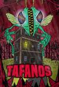

[食人虻入侵](https://pewae.com/gaan/aHR0cHM6Ly9tb3ZpZS5kb3ViYW4uY29tL3N1YmplY3QvMzQ0NjE0Nzg=)

原名：Killer Mosquitos导演：Riccardo Paoletti主演：Giulio Greco / Maria Chiara Giannetta / Stefano Chiodaroli类型：喜剧 / 恐怖地区：意大利首映时间：2018

没什么逻辑，但挺欢乐的。
围绕大麻玩梗，还算可以。
特效五毛。

[致命录像带99](https://pewae.com/gaan/aHR0cHM6Ly9tb3ZpZS5kb3ViYW4uY29tL3N1YmplY3QvMzYwMjU3MTc=)

原名：V/H/S/99导演：Maggie Levin / Vanessa Winter / 泰勒·麦金泰尔 / 约瑟夫·温特 / 约翰内斯·罗伯茨 / 飞莲主演：Archelaus Crisanto / Brittany Gandy / Dashiell Derrickson / Duncan Anderson / Isabelle Hahn / Kim Abunuwara / Kyle Bales / Rolando Davila-Beltran / Tybee Diskin / 维罗娜·布鲁类型：恐怖地区：美国首映时间：2022

拖沓。
上世纪的年代感塑造得不错。
恶魔这个题材好像翻不出什么花了。

[春风沉醉的夜晚](https://pewae.com/gaan/aHR0cHM6Ly9tb3ZpZS5kb3ViYW4uY29tL3N1YmplY3QvMzY5MDI4OQ==)

导演：娄烨主演：吴伟 / 张颂文 / 江佳奇 / 秦昊 / 谭卓 / 陈思诚类型：剧情 / 同性地区：大陆首映时间：2009

无法理解。
谭卓的妆容真是酷似郝蕾，那为什么不直接找郝蕾来演？
很喜欢片子的现实部分，比如“中围石油”和冷漠的路人。

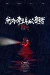

[南方车站的聚会](https://pewae.com/gaan/aHR0cHM6Ly9tb3ZpZS5kb3ViYW4uY29tL3N1YmplY3QvMjc2NjgyNTA=)

导演：刁亦男主演：万茜 / 奇道 / 廖凡 / 张奕聪 / 曾美慧孜 / 李志鹏 / 桂纶镁 / 胡歌 / 陈永忠 / 黄觉类型：剧情 / 犯罪地区：大陆首映时间：2019

黑色而市井，这种题材在现今的内地实在不多见，值得大大鼓励。
当所有人都希望你死的时候。
动物园一场戏虽然没什么大用但很有趣。

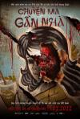

[越南恐怖故事](https://pewae.com/gaan/aHR0cHM6Ly9tb3ZpZS5kb3ViYW4uY29tL3N1YmplY3QvMzU3NDA4Mzg=)

原名：Chuyen Ma Gan Nhà导演：陈友进主演：Can Mac / Huu Tien / Lê Bê La / Thanh Truc Huynh / Tran Phong / Trinh Tai / 云庄 / 玉侠 / 阮春福 / 陈可如类型：恐怖地区：越南首映时间：2022

故事老套。

[长安道](https://pewae.com/gaan/aHR0cHM6Ly9tb3ZpZS5kb3ViYW4uY29tL3N1YmplY3QvMjU3NDcyMDQ=)

导演：李骏主演：余皑磊 / 大力 / 宋洋 / 毛爱宁 / 沈瑶 / 焦俊艳 / 王奕权 / 田征 / 范伟 / 陈数类型：剧情 / 悬疑 / 犯罪地区：大陆首映时间：2019

其实故事还行，但被导演和服化道搞得浑身上下一股土味。
猎枪这东西放在国内太突兀了，怎么都圆不回来，是剧本上的失败。
结尾是个什么玩意儿？

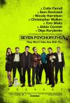

[七个神经病](https://pewae.com/gaan/aHR0cHM6Ly9tb3ZpZS5kb3ViYW4uY29tL3N1YmplY3QvNjc1MzE2Ng==)

原名：Seven Psychopaths导演：马丁·麦克唐纳主演：伍迪·哈里森 / 克里斯托弗·沃肯 / 加布蕾·丝迪贝 / 哈利·戴恩·斯坦通 / 山姆·洛克威尔 / 海伦娜·马特森 / 科林·法瑞尔 / 艾比·考尼什 / 迈克尔·斯图巴 / 迈克尔·皮特类型：喜剧 / 犯罪地区：英国首映时间：2012

气氛确实是相当神经质。
没什么整体性，东一榔头西一棒槌的。

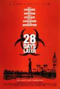

[惊变28天](https://pewae.com/gaan/aHR0cHM6Ly9tb3ZpZS5kb3ViYW4uY29tL3N1YmplY3QvMTMwNjQyMQ==)

原名：28 Days Later导演：丹尼·博伊尔主演：亚历克斯·帕尔墨 / 克里斯托弗·埃克莱斯顿 / 基里安·墨菲 / 大卫·施奈德 / 娜奥米·哈里斯 / 宾杜·德·斯图潘尼 / 布莱丹·格里森 / 托比·塞奇威克 / 梅根·伯恩斯 / 诺亚·亨特雷类型：恐怖 / 科幻地区：英国首映时间：2002

如此配乐给这部普通的惊悚恐怖片用太浪费了。
早在2002年女黑人和小孩就不会死了。
整体普通。

[杰伊·比姆](https://pewae.com/gaan/aHR0cHM6Ly9tb3ZpZS5kb3ViYW4uY29tL3N1YmplY3QvMzU2NTI3MTU=)

原名：Jai Bhim导演：塔·塞·纳纳维尔主演：Guru Somasundaram / Lijo Mol Jose / M·S· Bhaskar / Manikandan / Rajisha Vijayan / Rao Ramesh / Sibi Thomas / V· Jayaprakash / 普拉卡什·拉贾 / 苏利耶·西瓦库马类型：剧情 / 犯罪地区：印度首映时间：2021

不错但不到封神的程度，感动更多来源于事件本身而不是电影语言。
这是印度主旋律电影吧，批评了警察黑暗的同时，可是在表扬司法公正啊。
难得印度片出了个没那么漂亮的女主。

[喊·山](https://pewae.com/gaan/aHR0cHM6Ly9tb3ZpZS5kb3ViYW4uY29tL3N1YmplY3QvMjYxMDY5NTg=)

导演：杨子主演：余皑磊 / 张籽沐 / 徐才根 / 成泰燊 / 李思颖 / 王紫逸 / 赵晨东 / 郎月婷 / 郭金类型：剧情 / 爱情 / 犯罪地区：大陆首映时间：2016

故事讲得太松，年代感也不好。
女主角十岁被拐走，能写出那么漂亮的毛笔字太扯了，不看看1984年往前倒10到15年是什么年代。

[咒](https://pewae.com/gaan/aHR0cHM6Ly9tb3ZpZS5kb3ViYW4uY29tL3N1YmplY3QvMzQ4NTA1NjE=)

导演：柯孟融主演：宋燕旻 / 彭海义 / 林敬伦 / 温庆禹 / 蔡亘晏 / 谢采洁 / 陈昭妃 / 高英轩 / 黄歆庭 / 黄玲类型：恐怖地区：台湾首映时间：2022

华语电影敢诅咒观众也算勇气可嘉了。
编排还是不够紧凑，而且从开始就没什么悬念。
女主角满脸字的形象还挺可爱的。

[雷利博](https://pewae.com/gaan/aHR0cHM6Ly9tb3ZpZS5kb3ViYW4uY29tL3N1YmplY3QvMzYxMTEyMDc=)

原名：Relyebo导演：Crisanto Aquino主演：Carlene Aguilar / Christine Bermas / Francis Mata / Giovanni Baldisseri / Jeffrey Hidalgo / Jela Cuenca / Jeric Raval / Juliana Parizcova Segovia / Lara Morena / Sean De Guzman类型：惊悚地区：菲律宾首映时间：2022

比香水有毒还有毒。
男主老婆比出轨对象好看多了吧。
结局倒胃口。

[谋杀绿脚趾](https://pewae.com/gaan/aHR0cHM6Ly9tb3ZpZS5kb3ViYW4uY29tL3N1YmplY3QvMTMwMDA0NA==)

原名：The Big Lebowski导演：乔尔·科恩 / 伊桑·科恩主演：史蒂夫·布西密 / 塔拉·雷德 / 大卫·霍德尔斯顿 / 彼得·斯特曼 / 朱丽安·摩尔 / 杰夫·布里吉斯 / 约翰·古德曼 / 菲利普·塞默·霍夫曼 / 菲利普·穆恩 / 马克·佩雷格里诺类型：喜剧 / 犯罪地区：美国首映时间：1998

癫狂是有的，但没有那么出人意料。
一口一个Chinaman，辱华量极高。
为艺术献身的女艺术家之朱丽安·摩尔。

[香蕉](https://pewae.com/gaan/aHR0cHM6Ly9tb3ZpZS5kb3ViYW4uY29tL3N1YmplY3QvMTI5Mjk4OA==)

原名：Bananas导演：伍迪·艾伦主演：伍迪·艾伦 / 卡洛斯·蒙塔尔万 / 露易丝·拉塞尔类型：喜剧地区：美国首映时间：1971

讽刺格瓦拉和古巴革命吧，还行，剧情轻重没处理好。
伍迪艾伦的小身板演小人物确实自带喜感。
有的笑话过于美式了，即使能看懂也不觉得多有趣。

[东北猛兽](https://pewae.com/gaan/aHR0cHM6Ly9tb3ZpZS5kb3ViYW4uY29tL3N1YmplY3QvMzYyMjg2ODY=)

导演：文松 / 李春啸主演：夏梓桐 / 崔志佳 / 张子栋 / 文松 / 贾冰类型：剧情 / 喜剧地区：大陆首映时间：2023

猛兽是假的猛兽，但制片方是真没把观众当人啊。
2023年了，不是1943年，怎么好意思把东北老乡编排的跟傻子一样。
每一秒都知道之后的10分钟会发生什么。

[感受大海的时刻](https://pewae.com/gaan/aHR0cHM6Ly9tb3ZpZS5kb3ViYW4uY29tL3N1YmplY3QvMjU4NTM3Mjk=)

原名：Undulant Fever导演：安藤寻主演：三浦诚己 / 中村久美 / 市川由衣 / 池松壮亮 / 高尾祥子类型：剧情 / 情色 / 爱情地区：日本首映时间：2014

日本的女浴室小水龙头都得坐地上用？太不卫生了吧。
女主角的颜值在片中跳得厉害，可能跟打光有关。

[子狐物语](https://pewae.com/gaan/aHR0cHM6Ly9tb3ZpZS5kb3ViYW4uY29tL3N1YmplY3QvMTc5Njc3OA==)

原名：Kogitsune Heren导演：河野圭太主演：大泽隆夫 / 小林凉子 / 松雪泰子 / 深泽岚类型：剧情 / 家庭地区：日本首映时间：2006

乏善可陈，不过小狐狸太漂亮了。

[何必有我?](https://pewae.com/gaan/aHR0cHM6Ly9tb3ZpZS5kb3ViYW4uY29tL3N1YmplY3QvMTQ2NDkzNg==)

导演：郑则仕主演：周润发 / 焦姣 / 郑则仕 / 郑文雅类型：剧情地区：香港首映时间：1985

肥猫之所以是肥猫。
周润发好做作，郑文雅身材好棒。
结局强行喂屎，哪怕停留在肥猫被一枪崩了都好很多。

[疯狂的麦克斯4：狂暴之路](https://pewae.com/gaan/aHR0cHM6Ly9tb3ZpZS5kb3ViYW4uY29tL3N1YmplY3QvMzU5Mjg1NA==)

原名：Mad Max: Fury Road导演：乔治·米勒主演：丽莉·吉欧 / 乔什·赫尔曼 / 休·基斯-拜恩 / 佐伊·克罗维兹 / 内森·琼斯 / 尼古拉斯·霍尔特 / 查理兹·塞隆 / 汤姆·哈迪 / 罗茜·汉丁顿-惠特莉 / 阿比·丽类型：冒险 / 动作 / 科幻地区：澳大利亚首映时间：2015

末世废土流不是我的菜。
故乡是永远回不去的地方。
惠特莉的脸真精致。

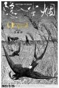

[隐入尘烟](https://pewae.com/gaan/aHR0cHM6Ly9tb3ZpZS5kb3ViYW4uY29tL3N1YmplY3QvMzUxMzEzNDY=)

导演：李睿珺主演：曾建贵 / 杨光锐 / 武仁林 / 武赟志 / 海清 / 王彩兰 / 王翠兰 / 续彩霞 / 赵登平 / 马占红类型：剧情地区：大陆首映时间：2022

前进的车轮滚滚，谁在乎身后的尘烟。
虽然还不够精致，但题材值得褒扬。
燕子、麦田、外套、收粮等小细节充满烟火气。

[明日战记](https://pewae.com/gaan/aHR0cHM6Ly9tb3ZpZS5kb3ViYW4uY29tL3N1YmplY3QvMjYzNTM2NzE=)

导演：吴炫辉主演：万国鹏 / 刘嘉玲 / 刘浩良 / 刘青云 / 古天乐 / 吴倩 / 姜皓文 / 张家辉 / 谢君豪 / 赫子铭类型：动作 / 科幻地区：香港首映时间：2022

水唧唧的剧情，看了犯困。

[坏蛋联盟](https://pewae.com/gaan/aHR0cHM6Ly9tb3ZpZS5kb3ViYW4uY29tL3N1YmplY3QvMzAxNjUzMTE=)

原名：The Bad Guys导演：彼埃尔·佩里菲尔主演：克雷格·罗宾森 / 奥卡菲娜 / 安东尼·拉莫斯 / 山姆·洛克威尔 / 理查德·艾欧阿德 / 艾利克斯·布诺斯町 / 芭芭拉·古德森 / 莉莉·辛格 / 莎姬·贝兹 / 马克·马龙类型：冒险 / 动画 / 喜剧地区：美国首映时间：2022

普通。

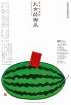

[北京的西瓜](https://pewae.com/gaan/aHR0cHM6Ly9tb3ZpZS5kb3ViYW4uY29tL3N1YmplY3QvMTQwMTE3NA==)

原名：Beijing Watermelon导演：大林宣彦主演：南伸坊 / 岩松了 / 斋藤晴彦 / 木野花 / 本格尔 / 林泰文 / 柄本明 / 柳原晴郎 / 笹野高史 / 罇真佐子类型：剧情地区：日本首映时间：1989

故事的选取有些刻意，但戏中戏的设定很棒。
《大海啊故乡》贯穿始终，这可是咱大连人从小的必修曲目，可能留学生团队里有很多大连人吧。
难以前往不再平静的北京……

[真人快打](https://pewae.com/gaan/aHR0cHM6Ly9tb3ZpZS5kb3ViYW4uY29tL3N1YmplY3QvMjEzMTY2NA==)

原名：Mortal Kombat导演：西蒙·麦奎德主演：乔·塔斯利姆 / 刘易斯·陈 / 杰西卡·麦克娜美 / 林路迪 / 浅野忠信 / 真田广之 / 约什·劳森 / 麦克斯·黄 / 麦卡德·布鲁克斯 / 黄经汉类型：冒险 / 动作 / 奇幻地区：美国首映时间：2021

找不到好编剧就算了，找不到好武指这题材还拍个屁啊！
主角全程打酱油。
刘康的一身腱子肉还能看。

[钢铁巨人](https://pewae.com/gaan/aHR0cHM6Ly9tb3ZpZS5kb3ViYW4uY29tL3N1YmplY3QvMTI5Mzg2Mw==)

原名：The Iron Giant导演：布拉德·伯德主演：M·埃梅特·沃尔什 / 克萝丽丝·利奇曼 / 克里斯托弗·麦克唐纳 / 小哈里·康尼克 / 约翰·马奥尼 / 艾力·马伦斯奥 / 范·迪塞尔 / 詹妮弗·安妮斯顿 / 詹姆斯·盖蒙 / 鲍伯·伯根类型：冒险 / 动作 / 动画 / 喜剧 / 科幻地区：美国首映时间：1999

蓬生麻中不扶自直，这才是爱死亡与机器人的故事。
虽然片子不讨厌，但那也是相当美国主旋律了。
因为格局不大所以显得真挚。

[奇奇与蒂蒂：救援突击队](https://pewae.com/gaan/aHR0cHM6Ly9tb3ZpZS5kb3ViYW4uY29tL3N1YmplY3QvMzM5NTc3MTc=)

原名：Chip 'n Dale: Rescue Rangers导演：阿吉瓦·沙弗尔主演：丹尼斯·海斯伯特 / 威尔·阿奈特 / 安迪·萨姆伯格 / 弗卢拉·博格 / 特蕾丝·麦克尼尔 / 琪琪·莱恩 / 科甘-迈克尔·凯 / 约翰·木兰尼 / 艾瑞克·巴纳 / 蒂姆·罗宾逊类型：冒险 / 动画 / 喜剧 / 悬疑地区：美国首映时间：2022

素质一般，但是眼花缭乱的客串和彩蛋很有意思。
只玩过松鼠大战的游戏，并且在米老鼠与唐老鸭中见过这俩家伙，没想到松鼠大战过场动画里的人物都是有故事的。
3D+2D没结合好。

[黑炮事件](https://pewae.com/gaan/aHR0cHM6Ly9tb3ZpZS5kb3ViYW4uY29tL3N1YmplY3QvMTQzNDI2OQ==)

导演：黄建新主演：刘子枫 / 戈辉 / 杨亚洲 / 杨凤良 / 汪漪 / 王北龙 / 盖尔哈德·奥尔谢夫斯基 / 谢炜 / 赵秀玲 / 高明类型：剧情 / 喜剧地区：大陆首映时间：1986

我以后再也不下棋了。
80年代真是文艺的黄金时期，重要的是有想法。
其实片中也不全是讽刺，是暗褒“厂长责任制”的，黄健新这鸡贼的哟。

[怪猫土耳其浴场](https://pewae.com/gaan/aHR0cHM6Ly9tb3ZpZS5kb3ViYW4uY29tL3N1YmplY3QvNDEyMzg2NQ==)

原名：A Haunted Turkish Bathhouse导演：山口和彦主演：大原美佐 / 室田日出男 / 谷ナオミ类型：恐怖地区：日本首映时间：1975

猫妖最后变成了观音菩萨，太离谱了。
女主角身材很好。
毫无逻辑。

[奸杀犯](https://pewae.com/gaan/aHR0cHM6Ly9tb3ZpZS5kb3ViYW4uY29tL3N1YmplY3QvMzU2MDY0Mjc=)

原名：Silent Hours导演：Mark Greenstreet主演：Annie Cooper / Elizabeth Healey / Vicki Michelle / 休·博纳维尔 / 德乌拉·基尔万 / 汤姆·比尔德 / 苏西·阿米类型：惊悚地区：英国首映时间：2021

节奏太慢，悬念消耗殆尽。

[绝望主夫](https://pewae.com/gaan/aHR0cHM6Ly9tb3ZpZS5kb3ViYW4uY29tL3N1YmplY3QvMzU4OTE1NDI=)

导演：张琦主演：周大勇 / 常远 / 李嘉琦 / 李海银 / 王宁 / 王成思 / 郭祥鹏 / 陶亮 / 魏翔 / 黄才伦类型：喜剧地区：大陆首映时间：2022

吃着女权的福利，散发着封建的恶臭，编剧该杀。
出品方列表里虽然没有开心麻花，可这些个主要演员都是他们家的，这块牌子是不想要了。
辣目洋子这样的，有什么挽留价值……

[西迪奥魔鬼帮](https://pewae.com/gaan/aHR0cHM6Ly9tb3ZpZS5kb3ViYW4uY29tL3N1YmplY3QvMzYwNjU0NzE=)

原名：Sitio Diablo导演：Roman Perez Jr·主演：A·J·拉瓦尔 / Azi Acosta类型：剧情 / 情色地区：菲律宾首映时间：2022

有一丢丢混乱世界的感觉，但更是一部编排混乱的电影。
女主角还挺飒的。
男朋友跟老哥火并，已经很难拍出新意了。

[人生得意衰尽欢](https://pewae.com/gaan/aHR0cHM6Ly9tb3ZpZS5kb3ViYW4uY29tL3N1YmplY3QvMTc4MDU1Mg==)

导演：赵崇基主演：刘青云 / 叶蕴仪 / 李丽珍 / 李子雄 / 杨丽菁 / 袁洁莹 / 黄子华类型：喜剧地区：香港首映时间：1993

不搞笑也不爽，但是杨丽菁李丽珍袁洁莹叶蕴仪拍得各具风情也算难得。
李子雄没演坏人。
黄子华和叶蕴仪的角色设定都有问题，性格非常奇怪。

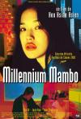

[千禧曼波](https://pewae.com/gaan/aHR0cHM6Ly9tb3ZpZS5kb3ViYW4uY29tL3N1YmplY3QvMTg3MzUzNQ==)

导演：侯孝贤主演：彭康育 / 徐慧霓 / 段钧豪 / 竹內康 / 竹內淳 / 舒淇 / 钮承泽 / 陈顗亘 / 高捷类型：剧情 / 爱情地区：台湾首映时间：2001

无聊的扯淡伪小资电影。
唯有舒淇被拍得很漂亮。

[中国爱经](https://pewae.com/gaan/aHR0cHM6Ly9tb3ZpZS5kb3ViYW4uY29tL3N1YmplY3QvMTQ1MTM4Mw==)

原名：Chinese Kamasutra导演：乔·达马托主演：Giorgia Emerald / Leo Gamboa / Li Yu / Liezl Santos / Lim Yao / Marc Gosálvez类型：奇幻 / 爱情地区：意大利首映时间：1993

标题是中国，但怎么看怎么是一帮东南亚人，看STAFF却真是跟香港合拍的。
女主角大长腿，感觉还不错。
没什么剧情，就是篇看小黄书的读书笔记。

[悬崖](https://pewae.com/gaan/aHR0cHM6Ly9tb3ZpZS5kb3ViYW4uY29tL3N1YmplY3QvMzAxMjI2NDg=)

导演：韩志主演：刘洋 / 刘超 / 张婉儿 / 张磊 / 明子煜 / 本杰明 / 李易祥 / 王佳佳 / 王槊 / 王迅类型：剧情 / 喜剧 / 悬疑地区：大陆首映时间：2021

前面多线叙事虽不严谨却还乐呵，上车之后立崩。
王迅这糟心钱挣的啊。

[中国乒乓之绝地反击](https://pewae.com/gaan/aHR0cHM6Ly9tb3ZpZS5kb3ViYW4uY29tL3N1YmplY3QvMzAzMjMzODA=)

导演：俞白眉 / 邓超主演：丁冠森 / 吴京 / 孙俪 / 孙浠伦 / 梁超 / 段博文 / 蔡宜达 / 许魏洲 / 邓超 / 阿如那类型：剧情 / 运动地区：大陆首映时间：2023

天津世锦赛的故事本身就没那么激动人心，改编得更差，马文革有什么好重点塑造的。
片中的90年代搞得跟70年代末似的，失败！
高潮不高是最大的问题。

[交换人生](https://pewae.com/gaan/aHR0cHM6Ly9tb3ZpZS5kb3ViYW4uY29tL3N1YmplY3QvMzU1MTM5Njg=)

导演：苏伦主演：丁嘉丽 / 余皑磊 / 刘敏涛 / 吴彦姝 / 张宥浩 / 张小斐 / 曹桐睿 / 杨恩又 / 沙溢 / 雷佳音类型：喜剧 / 奇幻 / 家庭地区：大陆首映时间：2023

张小斐唱K那块，真是又要钱又要命啊。
为什么这年头的烂片都喜欢把颜色调成这样？
找王莎莎这种糊咖客串意义何在？

[银河补习班](https://pewae.com/gaan/aHR0cHM6Ly9tb3ZpZS5kb3ViYW4uY29tL3N1YmplY3QvMzAyODIzODc=)

导演：俞白眉 / 邓超主演：任素汐 / 吴亚衡 / 孙浠伦 / 李建义 / 梁超 / 王戈 / 王西 / 白宇 / 邓超 / 邵兵类型：剧情地区：大陆首映时间：2019

俞白眉把素质教育这道题彻底解偏了。
班主任老师和教导主任的傻儿子这两个角色俗套而多余。
开场的火炬传递简直不是正常人能写出来的剧情。

[美国大屠杀](https://pewae.com/gaan/aHR0cHM6Ly9tb3ZpZS5kb3ViYW4uY29tL3N1YmplY3QvMzU5MjE3MDE=)

原名：American Carnage导演：迭戈·哈尔维斯主演：Andrew Kaempfer / Bella Ortiz / Catherine McCafferty / Yumarie Morales / 埃里克·迪恩 / 小豪尔赫·兰登伯格 / 布莱特·卡伦 / 珍娜·奥尔特加 / 豪尔赫·迪亚斯 / 阿伦·马尔多纳多类型：喜剧 / 恐怖地区：美国首映时间：2022

题材劲爆，拍得一般，恶心川普政策的。
人肉的准备工序太久了，不符合资本利益。
卧底一段太烂。

[头七](https://pewae.com/gaan/aHR0cHM6Ly9tb3ZpZS5kb3ViYW4uY29tL3N1YmplY3QvMzU0NDg5OTM=)

导演：沈丹桂主演：任家萱 / 吴以涵 / 纳豆 / 赫容 / 邓志鸿 / 陈以文 / 陈家逵 / 高宇蓁类型：恐怖地区：台湾首映时间：2022

作为鬼片最大的失败是不吓人。
陈以文和纳豆演得都不错。

[人渣](https://pewae.com/gaan/aHR0cHM6Ly9tb3ZpZS5kb3ViYW4uY29tL3N1YmplY3QvMjAyNjkxNg==)

原名：Scum导演：阿兰·克拉克主演：Julian Firth / 米克·福德 / 雷·温斯顿类型：剧情 / 犯罪地区：英国首映时间：1979

这片子好凶戾。
主角不是好人，这事儿不新鲜，放在70年代末也就还行吧。
躁动劲好棒。

[妓院回忆](https://pewae.com/gaan/aHR0cHM6Ly93d3cuaW1kYi5jb20vdGl0bGUvdHQxNjYwMzc5)

原名：L'Apollonide导演：bertrand bonello主演：céline sallette / hafsia herzi / noémie lvovsky类型：剧情地区：法国首映时间：2011

老一套的剧情，节奏比较慢，而且女主角不久就被毁容了。
片子就像是拍来给老鸨洗白的。

[超级马力欧兄弟大电影](https://pewae.com/gaan/aHR0cHM6Ly9tb3ZpZS5kb3ViYW4uY29tL3N1YmplY3QvMjcxOTk4OTQ=)

原名：The Super Mario Bros. Movie导演：亚伦·霍瓦斯 / 迈克尔·杰勒尼克主演：克里斯·帕拉特 / 凯文·迈克尔·理查德森 / 塞巴斯蒂安·马尼斯科 / 塞斯·罗根 / 安雅·泰勒-乔伊 / 弗莱德·阿米森 / 朱丽叶·杰勒尼克 / 杰克·布莱克 / 查理·戴 / 科甘-迈克尔·凯类型：冒险 / 动画 / 喜剧 / 奇幻 / 爱情 / 科幻地区：美国首映时间：2023

[我为青春买了一次单](https://pewae.com/2023/05/a-bill-from-my-teenage.html)

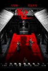

[满江红](https://pewae.com/gaan/aHR0cHM6Ly9tb3ZpZS5kb3ViYW4uY29tL3N1YmplY3QvMzU3NjY0OTE=)

导演：张艺谋主演：余皑磊 / 岳云鹏 / 张译 / 易烊千玺 / 欧豪 / 沈腾 / 潘斌龙 / 王佳怡 / 郭京飞 / 雷佳音类型：剧情 / 古装 / 喜剧 / 悬疑地区：大陆首映时间：2023

节奏很棒，翻转比较爽，但是底和人物完全经不起推敲。
女主角第一场戏过了，后面赴死就演得很好。
张艺谋使用了极致的灰色调，已经暗示了故事的内核是悲剧。

[无名](https://pewae.com/gaan/aHR0cHM6Ly9tb3ZpZS5kb3ViYW4uY29tL3N1YmplY3QvMzUzNzI3NDI=)

导演：程耳主演：周生昊 / 周迅 / 大鹏 / 张婧仪 / 梁朝伟 / 森博之 / 江疏影 / 王一博 / 王传君 / 黄磊类型：剧情 / 历史 / 悬疑地区：大陆首映时间：2023

迅哥老了。
如此晦涩昏暗的片子选在春节档上映真是头铁。
两段打戏跟全片节奏格格不入，突兀又多余。

[铁面战警](https://pewae.com/gaan/aHR0cHM6Ly9tb3ZpZS5kb3ViYW4uY29tL3N1YmplY3QvMjA2NzUzNw==)

原名：Mutant Action导演：Álex de la Iglesia主演：Álex Angulo / Antonio Resines / Frédérique Feder类型：喜剧 / 惊悚 / 犯罪 / 科幻地区：西班牙首映时间：1993

瞎胡闹的比重太高，或者说就是瞎胡闹。
前半截还不错，残疾人犯罪集团的设定很有喜感，后半截出事故之后就没法看了。

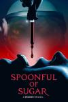

[一勺糖](https://pewae.com/gaan/aHR0cHM6Ly9tb3ZpZS5kb3ViYW4uY29tL3N1YmplY3QvMzYyODExMTA=)

原名：Spoonful of Sugar导演：Mercedes Bryce Morgan主演：凯特·福斯特 / 摩根·塞勒 / 米科·奥利维尔类型：恐怖地区：美国首映时间：2023

结尾的悬念设置非常棒，可惜前面拍得太一般。
女二的花痴设定有些多余。
小孩的眼神不错。

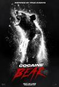

[熊嗨了](https://pewae.com/gaan/aHR0cHM6Ly9tb3ZpZS5kb3ViYW4uY29tL3N1YmplY3QvMzU2MDY0MDk=)

原名：Cocaine Bear导演：伊丽莎白·班克斯主演：克里斯托弗·海维尤 / 克里斯蒂安·康佛瑞 / 凯丽·拉塞尔 / 小伊塞亚·维特洛克 / 小奥谢拉·杰克逊 / 布鲁克琳·普林斯 / 杰西·泰勒·弗格森 / 玛格·马丁戴尔 / 阿尔登·埃伦瑞奇 / 雷·利奥塔类型：喜剧 / 惊悚地区：美国首映时间：2023

死法过于雷同，20分钟之后就失去看点了。
就算是熊，这可卡因的量也太多了些，搞得像假药似的。
小男孩的线没表现出来。

[孵化](https://pewae.com/gaan/aHR0cHM6Ly9tb3ZpZS5kb3ViYW4uY29tL3N1YmplY3QvMzQ5NTM3NDQ=)

原名：Hatching导演：汉娜·伯格霍尔姆主演：Aada Punakivi / Hertta Nieminen / Ida Määttänen / Oiva Ollila / Stella Leppikorpi / 亚尼·沃拉宁 / 索菲娅·黑基莱 / 萨伊亚·伦托宁 / 西里·索拉林纳 / 雷诺·诺丁类型：恐怖地区：芬兰首映时间：2022

每个人都有善与恶共存的两幅面孔。
简单的寓言，鸟人长大以后一定是另一个妈妈。
母亲的假笑假得很到位。

[杀出个黄昏](https://pewae.com/gaan/aHR0cHM6Ly9tb3ZpZS5kb3ViYW4uY29tL3N1YmplY3QvMzQ4NTIyNDk=)

导演：高子彬主演：何雁诗 / 冯宝宝 / 李灿森 / 林耀声 / 林雪 / 符家浚 / 谢贤 / 贾晓晨 / 顾定轩 / 颜子菲类型：剧情 / 犯罪地区：香港首映时间：2021

虽然荒诞，却很好地表达出了老人的无助。
高开低走，少女线过于啰嗦，而婆媳线还有很多潜力可挖。
谢贤演的真好，李灿森演的真好，可惜他俩没有对手戏。

[飞虎出征](https://pewae.com/gaan/aHR0cHM6Ly9tb3ZpZS5kb3ViYW4uY29tL3N1YmplY3QvMjA1MTUwNzE=)

导演：麦咏麟主演：余文乐 / 刘安琪 / 刘江 / 曾国祥 / 杜汶泽 chapman to / 林兆霞 / 王敏德 / 邵音音 / 邹凯光 / 雷宇扬类型：喜剧 / 情色地区：香港首映时间：2013

难得的新世纪三级喜剧精品，除了女演员丑了点没大毛病。
对同性恋的态度可谓是相当政治不正确了。
还有陪睡员这个职业，新知识get。

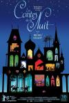

[夜幕下的故事](https://pewae.com/gaan/aHR0cHM6Ly9tb3ZpZS5kb3ViYW4uY29tL3N1YmplY3QvNTkzODAwMA==)

原名：Tales of the Night导演：米歇尔·欧斯洛主演：伊夫·巴萨克 / 伊莎贝尔·嘉德 / 奥利维耶·克拉弗里 / 朱利安·贝朗米斯 / 米歇尔·伊莱亚斯 / 马里内·格里泽类型：动画 / 奇幻地区：法国首映时间：2011

朴素的故事通过华丽的手法表现出来。
太喜欢表现形式了。
动画片中的法语显得好有爱。

[天生胆小](https://pewae.com/gaan/aHR0cHM6Ly9tb3ZpZS5kb3ViYW4uY29tL3N1YmplY3QvMTQyODMwMQ==)

导演：彦小追主演：李媛媛 / 李耕 / 梁天 / 牛星丽 / 葛优 / 谢园 / 马羚类型：剧情地区：大陆首映时间：1995

害怕球迷闹事这根主线选得太有时代特色了，还有国安队训练出镜。
李耕演的那场太有北京大爷气势了，只是“魂斗罗三代”为什么要配2代的音乐？
特别接地气。

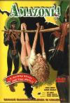

[食人族大屠杀](https://pewae.com/gaan/aHR0cHM6Ly9tb3ZpZS5kb3ViYW4uY29tL3N1YmplY3QvMjI4MDE4Ng==)

原名：White Slave导演：马里奥·格里亚绰主演：Elvire Audray / Will Gonzales类型：冒险 / 剧情 / 恐怖 / 爱情地区：意大利首映时间：1985

故事什么的倒还好，只是主角太平了。

[十三条命](https://pewae.com/gaan/aHR0cHM6Ly9tb3ZpZS5kb3ViYW4uY29tL3N1YmplY3QvMzUwNTYyNDM=)

原名：Thirteen Lives导演：朗·霍华德主演：乔什·赫尔曼 / 乔尔·埃哲顿 / 保拉·加西亚 / 刘易斯·菲茨-杰拉德 / 扎赫拉·纽曼 / 汤姆·巴特曼 / 科林·法瑞尔 / 简·拉金 / 维他亚·潘斯林加姆 / 维果·莫腾森类型：传记 / 剧情 / 惊悚地区：美国首映时间：2022

救援的细节表现得很棒。
柯林法瑞尔多久没演像样的角色了。
有点主旋律的刻板。

[夜半一点钟](https://pewae.com/gaan/aHR0cHM6Ly9tb3ZpZS5kb3ViYW4uY29tL3N1YmplY3QvMTM4ODIzNA==)

导演：叶伟信主演：叶玉卿 / 徐锦江 / 袁咏仪 / 陈小春 / 黄耀明类型：恐怖地区：香港首映时间：1995

三个普通的鬼故事，完全不吓人。
叶玉卿袁咏仪担纲的前两个故事演得都很夸张，倒是第三部分陈小春很自然。

[茜茜](https://pewae.com/gaan/aHR0cHM6Ly9tb3ZpZS5kb3ViYW4uY29tL3N1YmplY3QvMzU3NjAzODM=)

原名：Sissy导演：Kane Senes / 汉娜·巴洛主演：Alea O'Shea / Daniel Monks / Darcie Irwin-Simpson / Emily De Margheriti / Victoria Hopkins / 叶林·韩 / 汉娜·巴洛 / 瑞安·帕尼萨 / 艾莎·迪伊 / 露西·巴雷特类型：喜剧 / 恐怖 / 爱情地区：澳大利亚首映时间：2022

叫你丫多嘴。
该流血的时候绝不吝啬血浆，这点很棒。
这年头还有人敢霸凌黑命贵？我不信。

[X战警：黑凤凰](https://pewae.com/gaan/aHR0cHM6Ly9tb3ZpZS5kb3ViYW4uY29tL3N1YmplY3QvMjY2NjcwMTA=)

原名：X-Men: Dark Phoenix导演：西蒙·金伯格主演：亚历山德拉·希普 / 埃文·彼得斯 / 尼古拉斯·霍尔特 / 杰西卡·查斯坦 / 柯蒂·斯密特-麦菲 / 泰伊·谢里丹 / 苏菲·特纳 / 詹妮弗·劳伦斯 / 詹姆斯·麦卡沃伊 / 迈克尔·法斯宾德类型：冒险 / 动作 / 科幻地区：美国首映时间：2019

戏份不够，动作来凑，这部X战警被搞得很塑料的样子。
果然自己把自己说中了：第三部永远是最差的。
劳模姐的反派完美契合这部剧情上的莫名其妙。

[宇宙探索编辑部](https://pewae.com/gaan/aHR0cHM6Ly9tb3ZpZS5kb3ViYW4uY29tL3N1YmplY3QvMzQ5NDE1MzY=)

导演：孔大山主演：关云桐 / 杨皓宇 / 洛翼云 / 王一通 / 盛晨晨 / 罗娟 / 艾丽娅 / 蒋奇明 / 郭帆 / 龚格尔类型：喜剧 / 科幻地区：大陆首映时间：2023

题材和手法在国产片里算非常少见的，值得鼓励。
主角团可以穷，但场景不应该穷，对比不够强烈，这是不好的地方。
结尾如果没有那突兀的蘑菇会更好。

[保你平安](https://pewae.com/gaan/aHR0cHM6Ly9tb3ZpZS5kb3ViYW4uY29tL3N1YmplY3QvMzU0NTcyNzI=)

导演：大鹏主演：大鹏 / 宋茜 / 尹正 / 李雪琴 / 杨迪 / 王圣迪 / 王迅 / 白宇 / 贾冰 / 马丽类型：剧情 / 喜剧地区：大陆首映时间：2023

电影里的吉E是现实中的辽B，大连现在就这档次了。
同样的网暴题材，大鹏比陈大导接地气多了，现在的环境下拍这种题材值得褒扬。
马丽的行为在过去叫挖绝户坟，是缺了大德的，片子这么拍也算隐晦讽刺有钱为所欲为吧。

[人肉农场](https://pewae.com/gaan/aHR0cHM6Ly9tb3ZpZS5kb3ViYW4uY29tL3N1YmplY3QvMzAxODc2MTc=)

原名：The Farm导演：Hans Stjernswärd主演：Alec Gaylord / David Air / Gael Carrion / Jola Cora / Julie Meghan Brown / Kelly Mis / Ken Volok / Rob Tisdale / Sandra Cruze / 诺拉·叶莎耶类型：恐怖地区：美国首映时间：2018

最后一个镜头不错，其余部分太无聊。
人类为什么要替乳猪和奶牛着想？

[拳拳到肉](https://pewae.com/gaan/aHR0cHM6Ly9tb3ZpZS5kb3ViYW4uY29tL3N1YmplY3QvMjY1Nzc0ODI=)

原名：Tiger, Blood in the Mouth导演：赫尔南·贝隆主演：Aldo Onofri / Benicio Mutti Spinetta / Camila Zolezzi / Diego Chavez / Erica Banchi / Eva De Dominici / Richard Wagener / 克劳迪奥·里西 / 奥斯马·努涅斯 / 莱昂纳多·斯巴拉格利亚 Leonardo Sbaraglia类型：剧情 / 情色地区：阿根廷首映时间：2016

一个中年老色皮的故事。
女主的身材实在太好了。

[阖家辣](https://pewae.com/gaan/aHR0cHM6Ly9tb3ZpZS5kb3ViYW4uY29tL3N1YmplY3QvMzU0OTcxNjg=)

导演：郑晋轩主演：何启华 / 卢海鹏 / 吕爵安 / 吴君如 / 吴嘉龙 / 林家熙 / 梁咏琪 / 胡子彤 / 袁澧林 / 郑中基类型：喜剧地区：香港首映时间：2022

无趣。
假。

[复仇者](https://pewae.com/gaan/aHR0cHM6Ly9tb3ZpZS5kb3ViYW4uY29tL3N1YmplY3QvMTI5MzAxMA==)

原名：The Avengers导演：耶利米·S·谢奇克主演：乌玛·瑟曼 / 拉尔夫·费因斯 / 肖恩·康纳利类型：冒险 / 动作 / 科幻地区：美国首映时间：1998

虽然我已经记不起三个侦探讲什么了，但肯定不像这部电影版这么无聊。
乌玛瑟曼一人分饰两角，两个角色都神经兮兮的。

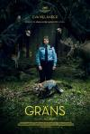

[边境](https://pewae.com/gaan/aHR0cHM6Ly9tb3ZpZS5kb3ViYW4uY29tL3N1YmplY3QvMzAxOTQ3NTI=)

原名：Border导演：阿里·阿巴西主演：埃娃·梅兰德 / 埃罗·米罗诺夫 / 安·彼得伦 / 斯坦·伦格伦 / 约根·托尔松 / 纳塔莉·明妮威克 / 维克托·奥克布卢姆-尼尔松 / 马蒂·博斯泰特类型：剧情 / 奇幻 / 惊悚地区：瑞典首映时间：2018

这种不讲逻辑的扯还挺令人感动的。
男女主人公的妆容大赞。
女主角的父亲还挺伟大的。

[人肉毯](https://pewae.com/gaan/aHR0cHM6Ly9tb3ZpZS5kb3ViYW4uY29tL3N1YmplY3QvMzAzNTcxNjE=)

原名：Flesh Blanket导演：Brandon Graham主演：Adam Hunter / Alicia Becker / Amanda Harrison / Brandon Calhoun / Denise Carroll / Dinah Leffert / Hahn Cho / Kato Kaelin / 克莉丝缇娜·德萝莎类型：喜剧 / 恐怖地区：美国首映时间：2018

解锁新死法:被男人的胸闷死。
男主角这样的人能出镜已经很不容易了，还对片子质量要求些什么呢？
胖人面前不说短话。

[寄生兽](https://pewae.com/gaan/aHR0cHM6Ly9tb3ZpZS5kb3ViYW4uY29tL3N1YmplY3QvMjU3NzQwNTA=)

原名：Parasyte: Part 1导演：山崎贵主演：东出昌大 / 丰原功补 / 大森南朋 / 山中崇 / 岩井秀人 / 染谷将太 / 桥本爱 / 池内万作 / 深津绘里 / 阿部隆史类型：剧情 / 动作 / 恐怖 / 科幻地区：日本首映时间：2014

中规中矩。

[寄生兽：完结篇](https://pewae.com/gaan/aHR0cHM6Ly9tb3ZpZS5kb3ViYW4uY29tL3N1YmplY3QvMjU3NzQwNTE=)

原名：Parasyte: Part 2导演：山崎贵主演：丰原功补 / 大森南朋 / 山中崇 / 岩井秀人 / 新井浩文 / 染谷将太 / 桥本爱 / 泷正则 / 深津绘里 / 阿部隆史类型：剧情 / 动作 / 恐怖 / 科幻地区：日本首映时间：2015

中规中矩，节奏拖沓。

[高卢英雄：中国大战罗马帝国](https://pewae.com/gaan/aHR0cHM6Ly9tb3ZpZS5kb3ViYW4uY29tL3N1YmplY3QvMzUwNzI1ODk=)

原名：Asterix & Obelix: The Middle Kingdom导演：吉约姆·卡内主演：何塞·加西亚 / 兹拉坦·伊布拉西莫维奇 / 吉尔·勒卢什 / 吉约姆·卡内 / 弗兰克·盖思堂彼得 / 文森特·卡索 / 梅兰尼·蒂埃里 / 玛丽昂·歌迪亚 / 皮埃尔·里夏尔 / 范林丹类型：冒险 / 喜剧地区：法国首映时间：2023

两位主演尽显老态，唯一的亮点竟然是客串的伊布。
找越南人来演中国人也算是法国电影传统艺能了。
范林丹太丑了。

[神算](https://pewae.com/gaan/aHR0cHM6Ly9tb3ZpZS5kb3ViYW4uY29tL3N1YmplY3QvMTQ1MTg5NQ==)

导演：许冠文主演：刘小慧 / 方刚 / 田启文 / 许冠文 / 许冠英 / 陈德森 / 陈晓莹 / 黄子华 / 黎明类型：喜剧 / 犯罪地区：香港首映时间：1992

你说准不准，方芳芳督察？
小时候抓不住黎明的颜值，现在看确实帅。
也算反毒教育片了。

[利刃出鞘2](https://pewae.com/gaan/aHR0cHM6Ly9tb3ZpZS5kb3ViYW4uY29tL3N1YmplY3QvMzQ5MzkwMzc=)

原名：Glass Onion导演：莱恩·约翰逊主演：丹尼尔·克雷格 / 凯特·哈德森 / 凯瑟琳·哈恩 / 加奈儿·梦奈 / 小莱斯利·奥多姆 / 戴夫·巴蒂斯塔 / 杰西卡·亨维克 / 爱德华·诺顿 / 玛德琳·克莱因 / 诺阿·西甘类型：剧情 / 喜剧 / 悬疑 / 惊悚 / 犯罪地区：美国首映时间：2022

没有什么悬念，挺失败的。
蒙娜丽莎的梗一点也不好玩。
最关键的燃料这个线索太假。

[最后的食人族世界](https://pewae.com/gaan/aHR0cHM6Ly9tb3ZpZS5kb3ViYW4uY29tL3N1YmplY3QvMjEzMzYxOQ==)

原名：Jungle Holocaust导演：ruggero deodato主演：Ivan Rassimov / Massimo Foschi / Me Me Lai类型：冒险 / 恐怖地区：意大利首映时间：1977

吃人场面太过含蓄，好在女主身材不错。
活剖鳄鱼还挺刺激的。
整体完全没逻辑。

[使徒行者](https://pewae.com/gaan/aHR0cHM6Ly9tb3ZpZS5kb3ViYW4uY29tL3N1YmplY3QvMjYzMzYyNTM=)

导演：文伟鸿主演：佘诗曼 / 古天乐 / 吴镇宇 / 张家辉 / 张慧雯 / 朱璇 / 李光洁 / 梁琤 / 许绍雄 / 黄祥兴类型：剧情 / 动作 / 犯罪地区：大陆首映时间：2016

无聊。
佘诗曼不具备演电影的能力和运气。

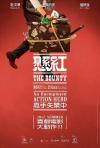

[悬赏](https://pewae.com/gaan/aHR0cHM6Ly9tb3ZpZS5kb3ViYW4uY29tL3N1YmplY3QvMTE1MzE3MjU=)

导演：冯志强主演：万梓良 / 张晋 / 杜汶泽 / 王紫逸 / 葛民辉 / 薛凯琪 / 许冠文类型：剧情 / 动作 / 喜剧 / 犯罪地区：香港首映时间：2012

万梓良演的神经病大叔真不错。
小格局制造冲突，很像当年的许氏风格。
薛凯琪可可爱爱的，真好。

[恐怖循环](https://pewae.com/gaan/aHR0cHM6Ly9tb3ZpZS5kb3ViYW4uY29tL3N1YmplY3QvMzQ5MjgwNDU=)

原名：Choose or Die导演：托比·米金斯主演：George Taylor / Ioanna Kimbook / Iola Evans / 凯特·弗利特伍德 / 卡罗琳·朗奎 / 埃迪·马森 / 安吉拉·格里芬 / 瑞安·盖奇 / 罗伯特·英格兰德 / 阿萨·巴特菲尔德类型：剧情 / 恐怖 / 惊悚地区：英国首映时间：2022

特别喜欢亚裔女侍者的死法。
以小成本恐怖片的标准来看相当可以。
最后的泳池对决很过瘾。

[再见列宁](https://pewae.com/gaan/aHR0cHM6Ly9tb3ZpZS5kb3ViYW4uY29tL3N1YmplY3QvMTI5MjA1NQ==)

原名：Good Bye Lenin!导演：沃尔夫冈·贝克主演：丘尔潘·哈马托娃 / 丹尼尔·布鲁赫 / 亚历山大·拜尔 / 卡特琳·萨斯 / 弗洛里安·卢卡斯类型：剧情 / 喜剧地区：德国首映时间：2003

一位东德青年的孝心。
片子其实非常唯心主义，只要人高兴，待在舒适区也挺好。
好大支的宜家广告。

[失踪](https://pewae.com/gaan/aHR0cHM6Ly9tb3ZpZS5kb3ViYW4uY29tL3N1YmplY3QvMzU1ODkyNTE=)

原名：Missing导演：片山慎三主演：Katsuki Suzuki / Shotaro Ishii / 伊东苍 / 佐藤二朗 / 品川彻 / 成嶋瞳子 / 松冈依都美 / 森田望智 / 清水寻也类型：剧情 / 悬疑 / 惊悚 / 犯罪地区：日本首映时间：2021

悬念的设置一般，但对于犯罪心理的描述不错。
卖橘子的老大爷好有范儿。
最后父女无球打乒乓设计的太棒了。

[疯狂动物城](https://pewae.com/gaan/aHR0cHM6Ly9tb3ZpZS5kb3ViYW4uY29tL3N1YmplY3QvMjU2NjIzMjk=)

原名：Zootopia导演：拜伦·霍华德 / 杰拉德·布什 / 瑞奇·摩尔主演：J·K·西蒙斯 / 伊德里斯·艾尔巴 / 内特·托伦斯 / 唐·雷克 / 奥克塔维亚·斯宾瑟 / 杰森·贝特曼 / 汤米·钟 / 珍妮·斯蕾特 / 邦尼·亨特 / 金妮弗·古德温类型：冒险 / 动画 / 喜剧地区：美国首映时间：2016

精巧而又套路。
中文译名完全不能表现出英文名的意味。
狐狸为什么要进体制？

[最佳导演](https://pewae.com/gaan/aHR0cHM6Ly9tb3ZpZS5kb3ViYW4uY29tL3N1YmplY3QvMzQ4MjU5Mzc=)

导演：张先主演：孟义真 / 张牡丹 / 杨会琴 / 王少龙 / 程波 / 肖垚 / 蒋楚依 / 金靖承类型：剧情 / 喜剧地区：大陆首映时间：2021

没受过三年婆媳两头气的人写不出这么有趣的剧本。
一众配角据说都是业余演员，死党、妈和前女友太到位了。
剪接不太好，再简练一些更好。

[中华战士](https://pewae.com/gaan/aHR0cHM6Ly9tb3ZpZS5kb3ViYW4uY29tL3N1YmplY3QvMTI5MjgzOQ==)

导演：钟志文主演：冯克安 / 刘芊蒂 / 卢冠廷 / 吴耀汉 / 尔冬升 / 张耀星 / 杨紫琼 / 松井哲也 / 赵志凌 / 陈敬类型：剧情 / 动作地区：香港首映时间：1987

单调。
为了打斗而打斗，剧情没什么说服力。
不丹风光。

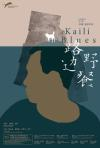

[路边野餐](https://pewae.com/gaan/aHR0cHM6Ly9tb3ZpZS5kb3ViYW4uY29tL3N1YmplY3QvMjYzMzc4NjY=)

导演：毕赣主演：余世学 / 刘林艳 / 曾帅 / 杨卓华 / 秦光黔 / 罗飞扬 / 谢理循 / 赵达清 / 郭月 / 陈永忠类型：剧情地区：大陆首映时间：2016

能理解，不能欣赏。
总觉得这片子拍得脏兮兮的，好像摄影机的旁边总有苍蝇在飞舞。
反正凯里这地方是不想去了。

[抬头见喜](https://pewae.com/gaan/aHR0cHM6Ly9tb3ZpZS5kb3ViYW4uY29tL3N1YmplY3QvMzYyMDc2ODc=)

导演：刘江江 / 吴有音 / 胡国瀚 / 高可主演：付航 / 张雅钦 / 李胤维 / 潘斌龙 / 王迅 / 王鹤棣 / 罗京民 / 蒋易 / 黄小蕾 / 龚蓓苾类型：剧情地区：大陆首映时间：2023

6，5，2，0
鼓励生育搞得越来越明目张胆的，恶心。
为什么中国涉及到小孩的影视作品总要给他安排个小胖子队友？

[豪勇七蛟龙](https://pewae.com/gaan/aHR0cHM6Ly9tb3ZpZS5kb3ViYW4uY29tL3N1YmplY3QvMTMwMzM3Mw==)

原名：The Magnificent Seven导演：约翰·斯特奇斯主演：史蒂夫·麦奎因 / 埃里·瓦拉赫 / 尤·伯连纳 / 布拉德·德克斯特 / 查尔斯·布朗森 / 罗伯特·沃恩 / 詹姆斯·柯本 / 霍斯特·布赫霍尔茨类型：动作 / 西部地区：美国首映时间：1960

没拍出七武士那股狠劲儿。
牛仔配音乐，仿佛小时候看的万宝路广告的大长篇。

[白日焰火](https://pewae.com/gaan/aHR0cHM6Ly9tb3ZpZS5kb3ViYW4uY29tL3N1YmplY3QvMjE5NDE4MDQ=)

导演：刁亦男主演：余皑磊 / 倪景阳 / 常凯宁 / 廖凡 / 李克伟 / 李彩霞 / 桂纶镁 / 洛成 / 王学兵 / 王景春类型：剧情 / 悬疑 / 犯罪地区：大陆首映时间：2014

悬疑感不是特别强，但是感觉非常对路。
廖凡非常有东北老爷们又虎又怂的意思。
片尾遭遇无妄之灾的小两口太好笑了。

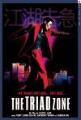

[江湖告急](https://pewae.com/gaan/aHR0cHM6Ly9tb3ZpZS5kb3ViYW4uY29tL3N1YmplY3QvMTMwODI1Mg==)

导演：林超贤主演：吴君如 / 张耀扬 / 彭敬慈 / 曾志伟 / 梁家辉 / 罗兰 / 谷祖琳 / 陈奕迅 / 陈辉虹 / 黄秋生类型：喜剧 / 犯罪地区：香港首映时间：2000

前半截非常精彩，后半段略微尿不尽。
吴君如全程激凸。
江湖奸杀令。

[极道公主](https://pewae.com/gaan/aHR0cHM6Ly9tb3ZpZS5kb3ViYW4uY29tL3N1YmplY3QvMzUxNTYwOTU=)

原名：Yakuza Princess导演：威森特·阿莫里姆主演：Lucas Oranmian / Mariko Takai / MASUMI / Toshiji Takeshima / 乔纳森·莱斯·梅耶斯 / 伊原刚志 / 尼可拉斯·特列维扬诺 / 尾崎英二郎 / 查尔斯·帕拉文蒂 / 肯尼·梁类型：惊悚地区：巴西首映时间：2021

剧本像是AI从三流网文里抄的。

[成人级爱情](https://pewae.com/gaan/aHR0cHM6Ly9tb3ZpZS5kb3ViYW4uY29tL3N1YmplY3QvMzU0NTk5NzU=)

原名：Loving Adults导演：芭芭拉·罗森博格主演：Karoline Hamm / Milo Campanale / Natali Vallespir / Susan Spano / 拉斯·兰特 / 摩顿·伯安 / 松佳·里奇特 / 米凯尔·比克耶 / 苏丝·威尔金斯 / 达尔·萨利姆类型：剧情 / 惊悚 / 犯罪地区：丹麦首映时间：2022

北欧人也是讲面子的。
最喜欢没撞死还要接着上床这种黑色设定。
小三很漂亮，可惜戏份不多。

[阿姆斯特丹的水鬼](https://pewae.com/gaan/aHR0cHM6Ly9tb3ZpZS5kb3ViYW4uY29tL3N1YmplY3QvMTk1MDgxMA==)

原名：Amsterdamned导演：迪克·麦斯主演：Door van Boeckel / Hidde Maas / Lou Landré / Pieter Lutz / Tatum Dagelet / 休伯·史塔普 / 坦内克·哈茨祖克 / 塞尔日-亨利·瓦尔克 / 维姆扎默 / 莫妮卡·梵·德·冯类型：动作 / 恐怖 / 悬疑 / 惊悚 / 犯罪地区：荷兰首映时间：1988

除了结局突然蹦出一个坏人以外，一切都像模像样。
水城阿姆斯特丹。
荷兰的女人感觉一个个都虎背熊腰的。

[关公大战外星人](https://pewae.com/gaan/aHR0cHM6Ly9tb3ZpZS5kb3ViYW4uY29tL3N1YmplY3QvMjk4ODg0Ng==)

导演：陈洪民主演：唐沁 / 谢玲玲 / 谷名伦 / 陈又新类型：奇幻 / 科幻地区：台湾首映时间：1976

除了类型独特一无是处。
打斗场面特别僵硬。

[逃出白垩纪](https://pewae.com/gaan/aHR0cHM6Ly9tb3ZpZS5kb3ViYW4uY29tL3N1YmplY3QvMzUxOTc3NjY=)

原名：65导演：布莱恩·伍兹 / 斯科特·贝克主演：亚当·德赖弗 / 克洛伊·科尔曼 / 妮卡·金 / 布莱恩·达尔 / 阿丽亚娜·格林布拉特类型：冒险 / 剧情 / 动作 / 惊悚 / 科幻地区：美国首映时间：2023

毫无快感。

[人类清除计划](https://pewae.com/gaan/aHR0cHM6Ly9tb3ZpZS5kb3ViYW4uY29tL3N1YmplY3QvMTA0NTM3MjM=)

原名：The Purge导演：詹姆斯·德莫纳克主演：伊桑·霍克 / 琳娜·海蒂 / 瑞斯·维克菲尔德 / 艾德文·霍德吉 / 阿黛莱德·凯恩 / 马克斯·博克霍德类型：惊悚 / 犯罪 / 科幻地区：美国首映时间：2013

创意很牛叉，拍的真不怎么样。
熊孩子可以熊，但不能完全熊的不讲道理。
血量严重不足。

[惊声尖叫6](https://pewae.com/gaan/aHR0cHM6Ly9tb3ZpZS5kb3ViYW4uY29tL3N1YmplY3QvMzU3NjMwOTE=)

原名：Scream VI导演：泰勒·吉勒特 / 马特·贝蒂内利-奥尔平主演：乔什·塞加拉 / 德蒙特·莫罗尼 / 斯基特·乌尔里奇 / 杰克·尚皮永 / 柯特妮·考克斯 / 梅丽莎·巴雷拉 / 梅森·古丁 / 珍娜·奥尔特加 / 罗格·杰克逊 / 贾思敏·萨沃伊·布朗类型：恐怖 / 悬疑 / 惊悚地区：美国首映时间：2023

我们活在系列电影里。
20年不见，啦啦队长已经这么老了。
猜到鬼面人有两个，没猜到有三个，这点上编剧赢了。

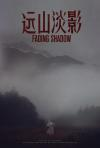

[远山淡影](https://pewae.com/gaan/aHR0cHM6Ly9tb3ZpZS5kb3ViYW4uY29tL3N1YmplY3QvMzUxODI5Nzk=)

导演：贺泉主演：叶硕 / 周楚濋 / 杨骏 / 聂礎一 / 董浩然 / 谢宇朦类型：剧情 / 悬疑地区：大陆首映时间：2022

故事比较容易看透，节奏也拖沓，但在网大里算质量上乘。
死的和没死的长得难以分辨。
哪有人能画那么准的，这故事的主线就扯得很。

[回廊亭](https://pewae.com/gaan/aHR0cHM6Ly9tb3ZpZS5kb3ViYW4uY29tL3N1YmplY3QvMzU0MDEyOTA=)

导演：来牧宽主演：任素汐 / 侯雯元 / 刘敏涛 / 吴昊宸 / 明星 / 李传缨 / 汤敏 / 王宫良 / 胡可 / 芦芳生类型：悬疑 / 爱情 / 犯罪地区：大陆首映时间：2023

选角出了大问题，除了任素汐只认识一个刘敏涛，那哪还不知道她身上有事儿啊？！
演员演的没毛病，但剧本改得太白痴了。
后半部分异常拖沓。

[绝命小魔星](https://pewae.com/gaan/aHR0cHM6Ly9tb3ZpZS5kb3ViYW4uY29tL3N1YmplY3QvMTI5NzE1Mg==)

原名：Ticks导演：托尼·兰德尔主演：罗莎琳德·艾伦 / 赛斯·格林 / 阿米·多伦兹类型：恐怖 / 科幻地区：美国首映时间：1993

各种设定堪称恐怖片模板。
可能过于早期的缘故，人死得还不够干脆。
可惜最后活下来的人有点多。

[鬼眼刑警](https://pewae.com/gaan/aHR0cHM6Ly9tb3ZpZS5kb3ViYW4uY29tL3N1YmplY3QvMTc1ODMzOQ==)

导演：王晶 / 霍耀良主演：元华 / 张文慈 / 彭敬慈 / 方中信 / 梁敏仪 / 森美 / 洪天明 / 王天林 / 罗兰 / 谷祖琳类型：惊悚地区：香港首映时间：2006

中规中矩，方中信的角色有些窝囊。
谷祖琳的小女鬼演的不错。
梁敏仪的脱戏加得太勉强。

[了不起的夜晚](https://pewae.com/gaan/aHR0cHM6Ly9tb3ZpZS5kb3ViYW4uY29tL3N1YmplY3QvMzU4MTQxNzY=)

导演：马凯主演：孔连顺 / 梁龙 / 梦涵 / 王子璇 / 甘昀宸 / 范丞丞 / 蒋易 / 蒋诗萌 / 蒋龙 / 许馨文类型：喜剧 / 惊悚地区：大陆首映时间：2023

本来可以给2分，抄袭再扣1分。
几个配角还凑合，范丞丞演了个寂寞啊。
人物缺乏逻辑。

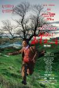

[Hello！树先生](https://pewae.com/gaan/aHR0cHM6Ly9tb3ZpZS5kb3ViYW4uY29tL3N1YmplY3QvNDEzNTcxMA==)

导演：韩杰主演：何洁 / 李京怡 / 王亚彬 / 王大治 / 王宝强 / 白培将 / 谭卓 / 邱士鉴类型：剧情地区：大陆首映时间：2011

王宝强表演不错，却被台词拖累了。
王大治和谭卓表现都非常好。
树疯了后的部分可以更癫狂些。

[地狱血脉](https://pewae.com/gaan/aHR0cHM6Ly9tb3ZpZS5kb3ViYW4uY29tL3N1YmplY3QvMzU1MDM1MDU=)

原名：Hellbender导演：John Adams / 托碧波塞尔 / 泽尔达·亚当斯主演：John Adams / Judy Rosen / Khenzom / Rinzin Thonden / Shawn Wilson / Tess McKeegan / 托碧波塞尔 / 泽尔达·亚当斯 / 罗布·菲格罗亚 / 露露·亚当斯类型：恐怖地区：美国首映时间：2021

一坨迷幻主义垃圾。

[得闲炒饭](https://pewae.com/gaan/aHR0cHM6Ly9tb3ZpZS5kb3ViYW4uY29tL3N1YmplY3QvNDE0NTQ3Ng==)

导演：许鞍华主演：万绮雯 / 冯宝宝 / 吴君如 / 周慧敏 / 张兆辉 / 林二汶 / 谷祖琳 / 陈伟霆类型：剧情 / 同性 / 爱情地区：香港首映时间：2010

周慧敏老了以后反倒放得开了。
这种完全女性主义的三观也就许鞍华能搞出来吧，但有点过了。
万绮雯显得好老。

[孤注一掷](https://pewae.com/gaan/aHR0cHM6Ly9tb3ZpZS5kb3ViYW4uY29tL3N1YmplY3QvMzUyNjcyMjQ=)

导演：申奥主演：周也 / 咏梅 / 孙阳 / 张艺兴 / 林威 / 王传君 / 王大陆 / 邓萃雯 / 金晨 / 黄艺馨类型：剧情 / 犯罪地区：大陆首映时间：2023

前半部分还行，后半部分拖沓，导演和剪辑应该给编剧和王传君磕一个。
金晨这嘴啊，是越来越歪了。
对于程序员的理解太脸谱化了。

[母亲](https://pewae.com/gaan/aHR0cHM6Ly9tb3ZpZS5kb3ViYW4uY29tL3N1YmplY3QvMzQ4OTQ2MzE=)

原名：Mother导演：大森立嗣主演：仲野太贺 / 土村芳 / 夏帆 / 奥平大兼 / 木野花 / 皆川猿时 / 荒卷全纪 / 郡司翔 / 长泽雅美 / 阿部隆史类型：惊悚地区：日本首映时间：2020

这么能作的人是有的，但是长泽雅美没演出那种劲儿。
阿部隆史已经这么老了。
没必要搞这么长。

[末路狂花](https://pewae.com/gaan/aHR0cHM6Ly9tb3ZpZS5kb3ViYW4uY29tL3N1YmplY3QvMTI5MTk5Mg==)

原名：Thelma & Louise导演：雷德利·斯科特主演：吉娜·戴维斯 / 哈威·凯特尔 / 布拉德·皮特 / 苏珊·萨兰登 / 迈克尔·马德森类型：剧情 / 惊悚 / 犯罪地区：美国首映时间：1991

女权觉醒意味浓郁的典型好莱坞冲奖片。
这片能杀回TOP250，并且两年里排名还缓慢爬升，充分说明当下豆瓣成员什么成分更多。
布拉德皮特真是鲜的冒水，帅的掉渣。

[天降神兵](https://pewae.com/gaan/aHR0cHM6Ly9tb3ZpZS5kb3ViYW4uY29tL3N1YmplY3QvMTI5NTY0MQ==)

原名：Howard the Duck导演：威拉德·赫依克主演：Lisa Sturz / Mary Wells / Peter Baird / Steve Sleap / 奇普·兹恩 / 杰弗瑞·琼斯 / 艾迪·盖尔 / 莉·汤普森 / 蒂姆·罗宾斯 / 蒂姆·罗斯类型：冒险 / 动作 / 喜剧 / 爱情 / 科幻地区：美国首映时间：1986

可怜的侏儒男主角，难得主演却从头到尾也没露个脸。
里面的八十年代摇滚还挺对胃口的。

[林中女妖](https://pewae.com/gaan/aHR0cHM6Ly9tb3ZpZS5kb3ViYW4uY29tL3N1YmplY3QvMTA0NjIyMTE=)

原名：Thale导演：亚历山大·诺达斯主演：Erlend Nervold / Jon Sigve Skard / Silje Reinåmo类型：剧情 / 奇幻 / 恐怖地区：挪威首映时间：2012

故事利用的是欧洲人的女巫情节，但剪得稀烂。
过于简陋，而作女妖和女妖尾巴的特效又要花钱。

[锦绣前程](https://pewae.com/gaan/aHR0cHM6Ly9tb3ZpZS5kb3ViYW4uY29tL3N1YmplY3QvMTMwMzg2Mg==)

导演：陈嘉上主演：关之琳 / 张国荣 / 曾江 / 梁家辉 / 梁思敏 / 王敏德 / 陈妙瑛 / 黄子华类型：剧情地区：香港首映时间：1994

只要长得帅，再渣的渣男也会被原谅。
王敏德难得的不油腻。
卖盗版真是难得的时代记忆。

[一射千金：Pornhub的故事](https://pewae.com/gaan/aHR0cHM6Ly9tb3ZpZS5kb3ViYW4uY29tL3N1YmplY3QvMzYyNTMxMjY=)

原名：Money Shot: The Pornhub Story导演：苏珊妮·希林格尔主演：Asa Akira / 切丽·德维尔 / 娜塔莎·德雷姆斯 / 格温·阿朵拉 / 沃尔夫·哈德逊 / 艾丽·诺克斯 / 西丽·达尔类型：纪录地区：美国首映时间：2023

我真的去P站搜了那个名叫adora的胖妹，因为另一个adora是希瑞啊！
一堆众所周知的废话，没多少价值。

[巴科街](https://pewae.com/gaan/aHR0cHM6Ly9tb3ZpZS5kb3ViYW4uY29tL3N1YmplY3QvMjcxMTU1NTc=)

原名：Rue du Bac导演：加布里埃尔·阿吉翁主演：Facundo Bo / Frédéric Constant / Marucha Bo / Yves Dangerfield / 弗朗索瓦·布里昂 / 爱迪丝·斯考博 / 詹妮薇芙·布卓类型：剧情 / 喜剧地区：法国首映时间：1991

一群奔放的老女人与一只鸭子。
结局俗套。
没跟保姆来一发，差评。

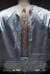

[尸体解剖](https://pewae.com/gaan/aHR0cHM6Ly9tb3ZpZS5kb3ViYW4uY29tL3N1YmplY3QvMjEzNjY1Mg==)

原名：Autopsy导演：亚当·格拉斯奇主演：Arcadiy Golubovich / Ashley Schneider / Gregg Brazzel / Ross Kohn / 杰西卡·朗德斯 / 罗伯特·帕特里克 / 罗伯特·拉萨多 / 罗斯·麦克科尔 / 詹妮特·戈德斯坦恩 / 迈克尔·鲍文类型：恐怖 / 悬疑 / 惊悚地区：美国首映时间：2008

血量足用料猛，人物缺少逻辑。
漫天挂内脏的镜头算有创意。
乘电梯逃跑这种强行降智的败笔太多。

[色情之后2](https://pewae.com/gaan/aHR0cHM6Ly93d3cuaW1kYi5jb20vdGl0bGUvdHQ1MTY4ODMy)

原名：After Porn Ends 2导演：bryce wagoner主演：darren james / georgina spelvin / lisa ann类型：纪录地区：美国首映时间：2017

一帮色情演员的自我吹捧，蛮无聊的。
拍摄者自己的视角缺失。

[维纳斯](https://pewae.com/gaan/aHR0cHM6Ly9tb3ZpZS5kb3ViYW4uY29tL3N1YmplY3QvMzU2Mjc2NTU=)

原名：Venus导演：豪梅·巴拉格罗主演：Alejandra Meco / Ángela Cremonte / Inés Fernández / Magüi Mira / 艾斯特·爱珀斯托 / 费尔南多·瓦尔迪维尔索 / 费德里科·阿瓜多类型：恐怖地区：美国首映时间：2022

邪教加黑帮加嗑药迷幻，可惜后面主角忽然智商消失了。
女主身材绝佳，邪教老太太很有魅力。
嗑药爆发是抄袭《超体》吧？

[蒂沃利](https://pewae.com/gaan/aHR0cHM6Ly9tb3ZpZS5kb3ViYW4uY29tL3N1YmplY3QvMjY3ODIzNzY=)

原名：Tívoli导演：Alberto Isaac主演：alfonso arau / lyn may / pancho córdova类型：剧情 / 喜剧 / 音乐地区：墨西哥首映时间：1975

墨西哥脱衣舞俱乐部的拆迁故事。
墨西哥的暴力拆迁可是猛多了。
歌舞过多。

[亿万富翁](https://pewae.com/gaan/aHR0cHM6Ly9tb3ZpZS5kb3ViYW4uY29tL3N1YmplY3QvMzAxNzIwMDI=)

原名：Kajillionaire导演：米兰达·裘丽主演：亚当·巴特利 / 吉娜·罗德里格兹 / 埃文·蕾切尔·伍德 / 帕特里夏·贝尔彻 / 德博拉·温格 / 戴安娜·玛丽亚·里瓦 / 理查德·詹金斯 / 贝琪·贝克 / 马克·伊瓦涅 / 马德琳·科格兰类型：剧情 / 犯罪地区：美国首映时间：2020

故事构思可以，拍摄比较差。
女主颜值能打，穿各种不合适的衣服都显得很酷。
最后的反转刻意而又毫不意外。

[捉迷藏](https://pewae.com/gaan/aHR0cHM6Ly9tb3ZpZS5kb3ViYW4uY29tL3N1YmplY3QvMjY3NTczNzM=)

导演：刘杰主演：万茜 / 春夏 / 秦海璐 / 董子健 / 霍建华类型：悬疑 / 惊悚 / 犯罪地区：大陆首映时间：2016

万茜演了个傻逼。
翻拍移植产生了各种不合理，当中国的小脚侦缉队是吃干饭的？
最后的火场太假了，哪有火烧那么慢的。

[糖果区域](https://pewae.com/gaan/aHR0cHM6Ly9tb3ZpZS5kb3ViYW4uY29tL3N1YmplY3QvMzU3NTM0MzE=)

原名：Candy Land导演：约翰·斯瓦布主演：Virginia Rand / 伊登·布洛林 / 吉娜薇·特纳 / 奥莉维亚·卢卡尔迪 / 威廉·鲍德温 / 布拉德·卡特 / 布鲁斯·戴维斯 / 欧文·坎贝尔 / 比利·布莱尔 / 珊·奎汀类型：剧情 / 恐怖 / 惊悚地区：美国首映时间：2022

cult程度一般，加上宗教成分就可怜了。
漏点集中在开篇，后面没了，实在缺乏吸引力。

[悍女](https://pewae.com/gaan/aHR0cHM6Ly9tb3ZpZS5kb3ViYW4uY29tL3N1YmplY3QvNjg3NDE2Ng==)

原名：Brimstone导演：马丁·寇霍文主演：保罗·安德森 / 卡拉·朱里 / 卡里斯·范·侯登 / 基特·哈灵顿 / 威廉·休斯顿 / 盖·皮尔斯 / 艾米莉亚·琼斯 / 艾薇·乔治 / 薇拉·维塔利 / 达科塔·范宁类型：悬疑 / 惊悚 / 西部地区：荷兰首映时间：2016

磨磨叨叨。
神权的残暴这一题材本来很好，但混杂上女权就变味了。
吊死的一场戏不错。

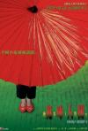

[幽灵人间II：鬼味人间](https://pewae.com/gaan/aHR0cHM6Ly9tb3ZpZS5kb3ViYW4uY29tL3N1YmplY3QvMTMwNzkyNg==)

导演：邝文伟主演：应采儿 / 张同祖 / 罗兰 / 谷祖琳 / 郭晋安 / 陈霁平类型：恐怖 / 悬疑地区：香港首映时间：2002

谷祖琳这一脸苦相，不演被鬼上身的都可惜了。
应采儿嫩出水啊。
陈奕迅的主题歌非常好听。

[超能一家人](https://pewae.com/gaan/aHR0cHM6Ly9tb3ZpZS5kb3ViYW4uY29tL3N1YmplY3QvMzUyMjg3ODk=)

导演：宋阳主演：安德烈·拉泽夫 / 康晞娅 / 张琪 / 沈腾 / 白丽娜 / 腾格尔 / 艾伦 / 陶慧 / 韩彦博 / 马丽类型：喜剧 / 奇幻 / 家庭地区：大陆首映时间：2023

一无是处的烂。
近年来中国电影界跟俄罗斯的合作令我非常不舒服。
麻花电影应该换另外的负责调色的工作室了。

[女囚风暴1995](https://pewae.com/gaan/aHR0cHM6Ly9tb3ZpZS5kb3ViYW4uY29tL3N1YmplY3QvMzI1Njg2MjU=)

原名：女子监狱导演：吕美凤主演：吴千语 / 吴家丽 / 周秀娜 / 夏嫣 / 袁嘉敏 / 郭奕芯 / 钟欣潼 / 陈嘉莉 / 陈庭欣 / 陈滢类型：传记地区：香港首映时间：2023

这几位主演本来戏就不行，片子更被剪得肉都没了。
剪成这样还不如不上。
冲着陈滢的名字下的，结果香港这么小的地方竟然有两个陈滢演电影。

[密室逃生2](https://pewae.com/gaan/aHR0cHM6Ly9tb3ZpZS5kb3ViYW4uY29tL3N1YmplY3QvMzA0Njk5MjI=)

原名：Escape Room: Tournament of Champions导演：亚当·罗比特尔主演：伊莎贝拉·弗尔曼 / 卡利托·奥利维罗 / 坦娅·范·格拉恩 / 托马斯·康奎尔 / 杰米-李·蒙尼 / 泰勒·拉塞尔 / 洛根·米勒 / 茵蒂娅·摩尔 / 詹姆斯·弗莱恩 / 霍兰·罗登类型：悬疑 / 惊悚地区：美国首映时间：2022

节奏流畅，剧情不出戏，合格的爆米花。
女主角有些圣母婊。
结局太普通。

[南方恶魔](https://pewae.com/gaan/aHR0cHM6Ly9tb3ZpZS5kb3ViYW4uY29tL3N1YmplY3QvMzU4Njc1Njg=)

原名：Frank and Penelope导演：肖恩·派特里克·弗兰纳里主演：Rick Budinich / 凯丽‧考恩 / 凯文·狄龙类型：惊悚 / 犯罪地区：美国首映时间：2022

凯莉考恩身材太顶了，诱惑死胖子一场戏好棒。
扯邪教什么的就很无聊。
最后还有个圣水淋头。

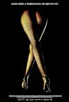

[迷夜](https://pewae.com/gaan/aHR0cHM6Ly93d3cuaW1kYi5jb20vdGl0bGUvdHQxNjYxMDk5)

原名：Exit/X:Night of Vengeance导演：jon hewitt主演：hanna mangan lawrence / peter docker / viva bianca类型：剧情 / 惊悚 / 犯罪地区：澳大利亚首映时间：2011

莫名其妙的友情和信任。
剧情俗套，节奏很好。

[十二夜](https://pewae.com/gaan/aHR0cHM6Ly9tb3ZpZS5kb3ViYW4uY29tL3N1YmplY3QvMTMwMjEwOQ==)

原名：12夜导演：林爱华主演：冯德伦 / 区淑贞 / 卓韵芝 / 卢巧音 / 张柏芝 / 张燊悦 / 谢霆锋 / 郑中基 / 陈奕迅类型：剧情 / 爱情地区：香港首映时间：2000

爱是折磨人的东西。
卢巧音表现的出乎意料地出色。

[烈日灼人](https://pewae.com/gaan/aHR0cHM6Ly9tb3ZpZS5kb3ViYW4uY29tL3N1YmplY3QvMTMwMTg2Nw==)

原名：Burnt by the Sun导演：尼基塔·米哈尔科夫主演：娜杰日达·米哈尔科娃 / 尼基塔·米哈尔科夫 / 尼娜·阿尔希波娃 / 弗拉基米尔·伊林 / 斯韦特兰娜·克留奇科娃 / 欧列格·缅希科夫 / 维亚切斯拉夫·吉洪诺夫 / 茵格保加·达坤耐特 / 阿宛盖·里昂惕夫 / 阿拉·A·卡赞斯卡亚类型：剧情 / 历史地区：俄罗斯首映时间：1994

画面越温馨亮眼，现实越阴森恐怖。
老爹和小女孩的相处令人羡慕。
锤子镰刀旗升起的那一刻，一种恐怖从心底迸发出来。

[逃出立法院](https://pewae.com/gaan/aHR0cHM6Ly9tb3ZpZS5kb3ViYW4uY29tL3N1YmplY3QvMzQ5NjQwODU=)

导演：王逸帆主演：庹宗华 / 林鹤轩 / 王中皇 / 禾浩辰 / 赖雅妍 / 高慧君类型：喜剧 / 恐怖地区：台湾首映时间：2020

癫狂的程度把握得不好，不过题材难得。
台湾演员的老毛病，模式化严重。

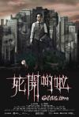

[死开啲啦](https://pewae.com/gaan/aHR0cHM6Ly9tb3ZpZS5kb3ViYW4uY29tL3N1YmplY3QvMjU5NDk4MDA=)

导演：梁国斌主演：卢觅雪 / 吴浣仪 / 小肥 / 张继聪 / 林德信 / 河国荣 / 车婉婉 / 雷琛瑜类型：剧情 / 喜剧 / 惊悚地区：香港首映时间：2015

港式黑色幽默，嘲讽地产商。
林子祥的儿子还蛮帅的。
李超人还不是好好的当他的超人。

[铁板烧](https://pewae.com/gaan/aHR0cHM6Ly9tb3ZpZS5kb3ViYW4uY29tL3N1YmplY3QvMTI5NDI5Mw==)

导演：许冠文主演：刘允 / 卢海鹏 / 叶丽仪 / 叶倩文 / 李燕萍 / 许冠文 / 许英秀 / 车保罗 / 黄文慧 / 黎小田类型：喜剧地区：香港首映时间：1984

平平，只有厨房一段还凑合。
荒岛一段挺拉的。
叶倩文显得好黑。

[饭局也疯狂](https://pewae.com/gaan/aHR0cHM6Ly9tb3ZpZS5kb3ViYW4uY29tL3N1YmplY3QvNjc4ODI2NQ==)

导演：尚敬主演：代乐乐 / 刘亚津 / 刘桦 / 梁冠华 / 范伟 / 莫小奇 / 韩童生 / 黄渤类型：剧情 / 喜剧地区：大陆首映时间：2012

不搞笑，闹腾居多。
范伟的角色特别离谱而又特别关键，这个人物不行，整个故事都不行。
既然这样了，为什么不多给大奶妹几个镜头呢？

[决战丧尸谷](https://pewae.com/gaan/aHR0cHM6Ly9tb3ZpZS5kb3ViYW4uY29tL3N1YmplY3QvMzQ5OTY1NzI=)

原名：Valley of the Dead导演：Alberto de Toro / 哈维尔·鲁伊斯·卡尔德拉主演：Manel Llunell / Mouad Ghazouan / 塞尔吉奥·托里科 / 奥拉·加里多 / 玛丽亚·博托 / 米奇·艾斯巴尔贝 / 赫苏斯·卡罗萨 / 路易斯·卡叶赫 / 达芬斯·巴尔杜兹 / 阿尔瓦罗·塞万提斯类型：动作地区：西班牙首映时间：2020

西班牙片子，先反纳粹后反苏联，可你西班牙哪来的脸呀？
制作不算差，但无聊透顶。

[疯女人的舞会](https://pewae.com/gaan/aHR0cHM6Ly9tb3ZpZS5kb3ViYW4uY29tL3N1YmplY3QvMzQ5NDMzNDk=)

原名：The Mad Women's Ball导演：梅拉尼·罗兰主演：Grégoire Bonnet / 凯撒·东布瓦 / 埃马纽埃尔·贝克特 / 塞德里克·康 / 安德烈·马尔孔 / 本杰明·瓦赞 / 梅拉尼·罗兰 / 玛尔蒂娜·舍瓦利 / 璐·德·拉格 / 科拉莉·吕西耶类型：惊悚地区：法国首映时间：2021

保持倔强，直到机械降神。
女主角的脸和身材都不错。
跑出去了就完了？也太不负责任了。

[妖怪图鉴](https://pewae.com/gaan/aHR0cHM6Ly9tb3ZpZS5kb3ViYW4uY29tL3N1YmplY3QvMzU2NzkyMjI=)

原名：Ghost Book导演：山崎贵主演：下野纮 / 吉村文香 / 城桧吏 / 大塚明夫 / 新垣结衣 / 杉田智和 / 柴崎枫雅 / 田中泯 / 神木隆之介 / 钉宫理惠类型：冒险 / 奇幻地区：日本首映时间：2022

普通。

[血腥姐妹会](https://pewae.com/gaan/aHR0cHM6Ly9tb3ZpZS5kb3ViYW4uY29tL3N1YmplY3QvMzAyNDk2OTM=)

导演：马蒂·贝克曼主演：Lala Kent / Sarah McDaniel / 兰迪·库卓 / 梅莉尔·罗斯 / 泰勒·乔恩·奥尔森 / 科林·伊格斯菲德 / 米娅·罗斯·弗兰普顿 / 莱克西·阿特金斯 / 迪伦·斯派比利 / 雷卡·雷内类型：惊悚地区：加拿大首映时间：2018

故事一般，肉少，警察一如既往跟傻子一样。
帅哥坏蛋的出现有些突兀。
讨厌的柔光滤镜。

[我们X她](https://pewae.com/gaan/aHR0cHM6Ly9tb3ZpZS5kb3ViYW4uY29tL3N1YmplY3QvMzYxNjEzOTA=)

原名：Us x Her导演：朱尔斯·卡坦亚格主演：A·J·拉瓦尔 / Angeli Khang / Giselle Sanchez类型：剧情地区：菲律宾首映时间：2022

渣男的梦想。
化妆不好，两个女主脸上好像都好多坑。
剧情转折缺少逻辑。

[为何不去死](https://pewae.com/gaan/aHR0cHM6Ly9tb3ZpZS5kb3ViYW4uY29tL3N1YmplY3QvMzAzODY4OTI=)

原名：Why Don't You Just Die!导演：Kirill Sokolov主演：Evgeniya Kregzhde / 亚历山大·库兹涅佐夫 / 伊戈尔·格拉布佐夫 / 叶莲娜·舍甫琴科 / 小亚历山大·多莫伽罗夫 / 米哈伊尔高里沃 / 维塔利·哈耶夫类型：剧情 / 喜剧 / 惊悚地区：俄罗斯首映时间：2018

小场景黑色幽默，癫狂有趣血量足。
光头老爹符合俄罗斯黑帮的典型形象。
最棒的是一家人死得整整齐齐。

[魂魄唔齐](https://pewae.com/gaan/aHR0cHM6Ly9tb3ZpZS5kb3ViYW4uY29tL3N1YmplY3QvMTQzOTI0MQ==)

导演：梁柏坚主演：容祖儿 / 谢霆锋 / 郑希怡 / 陈奕迅 / 黄秋生类型：喜剧 / 奇幻 / 恐怖地区：香港首映时间：2002

美艳不可方物的郑希怡。
陈奕迅和容祖儿鬼上身一段好有趣。
陈奕迅的旦角妆好丑。

[坏电影](https://pewae.com/gaan/aHR0cHM6Ly9tb3ZpZS5kb3ViYW4uY29tL3N1YmplY3QvNjkwMjczNQ==)

原名：Bad Film导演：园子温主演：园子温 / 鈴木桂子类型：剧情 / 动作 / 喜剧地区：日本首映时间：2012

点着引火线把这个破地球给炸了。
虽然比较稚嫩，但园子温疯魔的特色已经非常明显了。
帮派毁于同性恋，好有创意的点子。

[人生大事](https://pewae.com/gaan/aHR0cHM6Ly9tb3ZpZS5kb3ViYW4uY29tL3N1YmplY3QvMzU0NjAxNTc=)

导演：刘江江主演：刘陆 / 吴倩 / 朱一龙 / 李春嫒 / 杨恩又 / 王戈 / 罗京民 / 郑卫莉 / 钟宇升 / 陈创类型：剧情 / 家庭地区：大陆首映时间：2022

演员很努力，编剧很脑残，尤其是那个莫名其妙的亲妈，毁了结局。
片中所有的转折都非常生硬。
需要配字幕。

[生人勿进](https://pewae.com/gaan/aHR0cHM6Ly9tb3ZpZS5kb3ViYW4uY29tL3N1YmplY3QvMjk2ODgxMw==)

原名：Let the Right One In导演：托马斯·阿尔弗莱德森主演：Henrik Dahl / Ika Nord / Karin Bergquist / Karl-Robert Lindgren / Peter Carlberg / 凯尔·赫德布朗特 / 汤姆·柳恩格曼 / 皮尔·拉格纳 / 米卡尔·拉姆 / 莉娜·林德尔森类型：剧情 / 恐怖 / 爱情地区：瑞典首映时间：2008

无聊。
为什么暮光之城这么渣的电影还有人借鉴。
北欧瑞典的惨白色调还是挺舒服的。

[饥饿站台](https://pewae.com/gaan/aHR0cHM6Ly9tb3ZpZS5kb3ViYW4uY29tL3N1YmplY3QvMzQ4MDUyMTk=)

原名：The Platform导演：加尔德·加兹特鲁·乌鲁蒂亚主演：亚历山德拉·玛桑凯 / 伊万·马萨格 / 佐伦·伊格 / 埃米利奥·布阿勒 / 埃里克·古德 / 安东尼亚·圣胡安 / 特苏比奥·费南德斯·德·尤雷吉 / 阿尔吉斯·阿洛斯卡斯 / 马里奥·帕尔多 / 齐哈拉·拉纳类型：惊悚 / 科幻地区：西班牙首映时间：2019

下面的人不管怎样也会吃的。
上面的人根本不知道下面有多少层。
维护个屁的秩序。

[怪宴](https://pewae.com/gaan/aHR0cHM6Ly9tb3ZpZS5kb3ViYW4uY29tL3N1YmplY3QvMTMwMzU0NQ==)

原名：Murder by Death导演：罗伯特·穆尔主演：亚历克·吉尼斯 / 埃尔莎·兰彻斯特 / 大卫·尼文 / 彼得·塞勒斯 / 彼得·法尔克 / 杜鲁门·卡波特 / 玛吉·史密斯 / 艾琳·布伦南 / 詹姆斯·克伦威尔 / 詹姆斯·可可类型：喜剧 / 悬疑 / 惊悚 / 犯罪地区：美国首映时间：1976

推理小说大吐槽，很欢乐。
在我看来最后的结局一点儿也不重要。

[长安三万里](https://pewae.com/gaan/aHR0cHM6Ly9tb3ZpZS5kb3ViYW4uY29tL3N1YmplY3QvMzYwMzU2NzY=)

导演：谢君伟 / 邹靖主演：凌振赫 / 刘校妤 / 卢力峰 / 吴俊全 / 孙路路 / 宣晓鸣 / 李诗萌 / 杨天翔 / 胡亚捷 / 路熙然类型：动画 / 历史地区：大陆首映时间：2023

高适从未喊过一声“太白”，别扭之极，还不如李白对他的称呼“高三十五”。
两人相见的场景，李白说高适是盗马贼，可李白明明骑的黑马，高适骑白马，李白这不是误会，是瞎。
高适总说自己家境贫寒太扯了，古代家境贫寒能随意出远门？而且在长安待一个月没事干又回老家了。

[在中国他们吃狗](https://pewae.com/gaan/aHR0cHM6Ly9tb3ZpZS5kb3ViYW4uY29tL3N1YmplY3QvMTkwNTY2Ng==)

原名：In China They Eat Dogs导演：拉斯·斯潘·奥尔森主演：Peter Gantzler / 加斯帕·克里斯滕森 / 尼古拉·雷·卡斯类型：动作 / 喜剧地区：丹麦首映时间：1999

有趣的黑色幽默，结局神叨叨的不喜欢。
片名的意思是要换个角度思考问题，弟控还真是会给自己找借口。
印度团伙挺有意思的。

[杀人者唐斩](https://pewae.com/gaan/aHR0cHM6Ly9tb3ZpZS5kb3ViYW4uY29tL3N1YmplY3QvMTMwMDM4NQ==)

导演：钟少雄主演：倪大红 / 关之琳 / 张丰毅 / 张光北 / 莫少聪类型：剧情 / 动作 / 恐怖 / 武侠地区：香港首映时间：1993

编剧真敢想，好色的魏忠贤……
关之琳演了个什么鬼！完全是打卡下班。
割裂感极强，大陆的张丰毅张光北倪大红跟莫少聪关之琳完全不在一个频道上。

[黑色星期五](https://pewae.com/gaan/aHR0cHM6Ly9tb3ZpZS5kb3ViYW4uY29tL3N1YmplY3QvMzU1NjI1NjU=)

原名：Black Friday导演：Casey Tebo主演：布鲁斯·坎贝尔 / 戴文·萨瓦 / 迈克尔·加·怀特类型：喜剧 / 恐怖地区：美国首映时间：2021

俗套且平庸。
女主的存在有讨好女权团体的意味。

[海鳝](https://pewae.com/gaan/aHR0cHM6Ly9tb3ZpZS5kb3ViYW4uY29tL3N1YmplY3QvMzU0NzgzODI=)

原名：Murina导演：安东尼塔·阿拉马特·库西扬诺维奇主演：Klara Mucci / 乔纳斯·斯莫德斯 / 克利夫·柯蒂斯 / 格拉西娅·菲利波维奇 / 莱昂·鲁塞夫 / 达妮卡· 库尔西奇类型：剧情地区：克罗地亚首映时间：2021

对于父权的抗争，全片比较直白。
商人的身份本来可以深挖利用的。
喜欢女主角的眼神。

[女优，摔吧！](https://pewae.com/gaan/aHR0cHM6Ly9tb3ZpZS5kb3ViYW4uY29tL3N1YmplY3QvMzUzNzMwOTc=)

导演：周美豫主演：吴映洁 / 夏于乔 / 孔令元 / 张睿家 / 曹兰 / 涂善存 / 白静宜 / 那维勋 / 郭文颐 / 黄心娣类型：剧情 / 动作 / 喜剧地区：台湾首映时间：2022

夏于乔身上那二两肉真没看头。
同样没什么演技，女二鬼鬼就比女一夏于乔自然很多。
对面杀人机器的香月明美身材不错。

[超越天堂](https://pewae.com/gaan/aHR0cHM6Ly9tb3ZpZS5kb3ViYW4uY29tL3N1YmplY3QvMzYwNjA4NTY=)

原名：Beyond the Sky导演：Jeffrey Hidalgo主演：Christine Bermas / Milana Ikemoto / quinn carrillo类型：剧情 / 情色地区：菲律宾首映时间：2022

就像是当年元元的小黄书被拍出来了。
男主的样子就不像很举。

[精灵旅社4：变身大冒险](https://pewae.com/gaan/aHR0cHM6Ly9tb3ZpZS5kb3ViYW4uY29tL3N1YmplY3QvMzA0NzI2NDM=)

原名：Hotel Transylvania 4: Transformania导演：德里克·德莱蒙 / 詹妮弗·克鲁斯卡主演：凯瑟琳·哈恩 / 史蒂夫·布西密 / 大卫·斯佩德 / 安迪·萨姆伯格 / 布拉德·阿布瑞尔 / 布赖恩·哈尔 / 法兰·德瑞雪 / 科甘-迈克尔·凯 / 赛琳娜·戈麦斯 / 阿什·布林克夫类型：冒险 / 动画 / 喜剧 / 奇幻地区：美国首映时间：2022

一个正在死亡的IP。
没有亮点。

[命案](https://pewae.com/gaan/aHR0cHM6Ly9tb3ZpZS5kb3ViYW4uY29tL3N1YmplY3QvMzU1MjQ0Mzg=)

导演：郑保瑞主演：伍咏诗 / 古天农 / 吴廷烨 / 杨乐文 / 林家栋 / 赵伊祎 / 陈佩思 / 陈湛文 / 黄呈欣 / 黄文慧类型：剧情 / 犯罪地区：香港首映时间：2023

还行，疯癫的程度有些过分了。
林家1/3开始把“我神经有问题”写脑门上了，这样少了很多乐趣。
杨乐文演得不错。

[鬼猛脚](https://pewae.com/gaan/aHR0cHM6Ly9tb3ZpZS5kb3ViYW4uY29tL3N1YmplY3QvMTg0MTc3Nw==)

导演：洪金宝主演：元华 / 元奎 / 刘天兰 / 午马 / 吴耀汉 / 张坚庭 / 陈友 / 高丽虹类型：喜剧 / 奇幻 / 恐怖地区：香港首映时间：1988

用一只手玩梗竟然不是《九尾狐与飞天猫》原创，不过想来朱延平与王晶两个烂片王也不可能讲什么江湖道义。
围成一圈舔左手也好欢乐。
高丽虹除了漂亮一无是处啊。

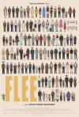

[逃亡](https://pewae.com/gaan/aHR0cHM6Ly9tb3ZpZS5kb3ViYW4uY29tL3N1YmplY3QvMzA0MDM2NDU=)

原名：Flee导演：乔纳斯·波赫·拉斯穆森主演：Belal Faiz / Daniel Karimyar / Elaha Faiz / Fardin Mijdzadeh / Georg Jagunov / Milad Eskandari / Navid Nazir / Rashid Aitouganov / Sadia Faiz / Zahra Mehrwarz类型：动画 / 纪录地区：丹麦首映时间：2021

无感。
过于强调穆斯林和同性恋的身份，令人反感。

[古宅](https://pewae.com/gaan/aHR0cHM6Ly9tb3ZpZS5kb3ViYW4uY29tL3N1YmplY3QvMjY5OTU3NjQ=)

导演：涂霆骏 / 麦浩邦主演：吴锦泉 / 姚童 / 张彦博 / 张继聪 / 朱茵 / 李枫 / 邹文正 / 魏来类型：恐怖 / 惊悚地区：香港首映时间：2018

浪费时间。
唯一可取的地方是朱茵扮上世纪主妇的扮相还不错。

[失控玩家](https://pewae.com/gaan/aHR0cHM6Ly9tb3ZpZS5kb3ViYW4uY29tL3N1YmplY3QvMzAzMzczODg=)

原名：Free Guy导演：肖恩·利维主演：乌特卡什·安邦德卡尔 / 乔·基瑞 / 休·杰克曼 / 克里斯·埃文斯 / 塔伊加·维迪提 / 朱迪·科默 / 查宁·塔图姆 / 瑞安·雷诺兹 / 道恩·强森 / 里尔·莱尔·哈瓦瑞类型：动作 / 喜剧 / 科幻地区：美国首映时间：2021

谁还不是个别人世界里的NPC呢？
黑人的角色既必要又多余，过于套路了，失败。
片子快结束时城市崩坏的视觉效果值得表扬。

[智取威虎山](https://pewae.com/gaan/aHR0cHM6Ly9tb3ZpZS5kb3ViYW4uY29tL3N1YmplY3QvMTA4MDc5MDk=)

导演：徐克主演：余男 / 佟丽娅 / 吴旭东 / 张涵予 / 杜奕衡 / 林更新 / 梁家辉 / 谢苗 / 陈晓 / 韩庚类型：冒险 / 剧情 / 动作 / 战争地区：大陆首映时间：2014

喜欢正片的干净利索的结局。
韩庚的现代戏应该与花絮版结局一起被删掉。
编剧太失败了，京剧中没出现的内容几乎都没编好。

[这个孩子很邪恶](https://pewae.com/gaan/aHR0cHM6Ly9tb3ZpZS5kb3ViYW4uY29tL3N1YmplY3QvMzU3Mzk5MzQ=)

原名：The Good Father导演：片冈翔主演：南沙良 / 大西流星 / 樱井雪 / 渡边樱 / 玉木宏类型：剧情地区：日本首映时间：2022

无聊

[碟仙碟仙](https://pewae.com/gaan/aHR0cHM6Ly9tb3ZpZS5kb3ViYW4uY29tL3N1YmplY3QvMjY0MTUzMzU=)

导演：黄柏基主演：庄锶敏 / 沈震轩 / 罗兰 / 罗天池 / 邵音音 / 陆骏光 / 鲍起静类型：惊悚地区：香港首映时间：2015

这女鬼能力这么强，还费这么多事干嘛？
女三跟路人傻傻分不清楚.
罗兰就这?

[八角笼中](https://pewae.com/gaan/aHR0cHM6Ly9tb3ZpZS5kb3ViYW4uY29tL3N1YmplY3QvMzU3NjU0ODA=)

导演：王宝强主演：史彭元 / 周德柏文 / 张祎曈 / 王宝强 / 王迅 / 甲央求朗 / 肖央 / 胡浩帆 / 陈永胜 / 马虎类型：剧情 / 动作地区：大陆首映时间：2023

对于大凉山的现状还是过于美化了，可惜。
东鹏特饮的广告过于生硬。
果然李晨不管戏份多少，永远是最出戏的那个。

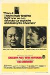

[主席](https://pewae.com/gaan/aHR0cHM6Ly9tb3ZpZS5kb3ViYW4uY29tL3N1YmplY3QvMTk0NjA2MA==)

原名：The Chairman导演：J·李·汤普森主演：安妮·海伍德 / 格利高里·派克 / 阿瑟·希尔类型：剧情 / 动作地区：英国首映时间：1969

对文革解构比较深刻的悬疑片。
007是个大好人，无数人抄袭它都不会被告抄袭。
外景有些凄惨。

[我们拥有夜晚](https://pewae.com/gaan/aHR0cHM6Ly9tb3ZpZS5kb3ViYW4uY29tL3N1YmplY3QvMjAwMjcyNQ==)

原名：We Own the Night导演：詹姆斯·格雷主演：Alex Veadov / Dominic Colon / 伊娃·门德斯 / 华金·菲尼克斯 / 罗伯特·杜瓦尔 / 马克·沃尔伯格类型：剧情 / 惊悚 / 犯罪地区：美国首映时间：2007

故事俗烂但拍摄精良。
把药藏进假貂皮里这件事还挺酷的。
2007年的一次性口罩跟十年后的没任何区别。

[封神第一部：朝歌风云](https://pewae.com/gaan/aHR0cHM6Ly9tb3ZpZS5kb3ViYW4uY29tL3N1YmplY3QvMTA2MDQwODY=)

导演：乌尔善主演：于适 / 夏雨 / 娜然 / 李雪健 / 此沙 / 武亚凡 / 袁泉 / 费翔 / 陈牧驰 / 黄渤类型：动作 / 古装 / 奇幻 / 战争地区：大陆首映时间：2023

故事改编是花了力气的，好评。
一群禁卫军小鲜肉很难分清哪个是哪个，客串的神仙也是，实在是白瞎了人情了。
黄飞虎整个支线被砍掉了？

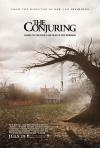

[招魂](https://pewae.com/gaan/aHR0cHM6Ly9tb3ZpZS5kb3ViYW4uY29tL3N1YmplY3QvMzgwNDYyOQ==)

原名：The Conjuring导演：温子仁主演：乔伊·金 / 凯拉·迪弗 / 哈蕾·麦克法兰 / 山农·库克 / 帕特里克·威尔森 / 朗·里维斯顿 / 珊莉·卡斯韦尔 / 维拉·法米加 / 莉莉·泰勒 / 麦肯吉·弗依类型：恐怖 / 悬疑 / 惊悚地区：美国首映时间：2013

好莱坞式心理恐惧电影，但感觉不如日式。
为什么要用那么丑的娃娃。

[茶啊二中](https://pewae.com/gaan/aHR0cHM6Ly9tb3ZpZS5kb3ViYW4uY29tL3N1YmplY3QvMzQ4ODAwMTg=)

导演：夏铭泽 / 阎凯主演：夏铭泽 / 王博文 / 苗龙 / 计良 / 邢原源 / 郭红进 / 阎凯 / 陈小龙 / 高禹恒 / 黄恒类型：动画 / 喜剧 / 奇幻地区：大陆首映时间：2023

故事一般，笑点一般，题材值得鼓励。
初中时没有烧烤店，不住校，也没有网吧，所以毫无代入感。
刘若琳和她的三个小伙伴过于路人。

[圣诞玫瑰](https://pewae.com/gaan/aHR0cHM6Ly9tb3ZpZS5kb3ViYW4uY29tL3N1YmplY3QvMTA2MDAyNzE=)

导演：杨采妮主演：万茜 / 夏文汐 / 夏雨 / 廖启智 / 张震 / 李绮虹 / 桂纶镁 / 甘国亮 / 秦海璐 / 郭富城类型：剧情 / 悬疑 / 犯罪地区：大陆首映时间：2013

故弄玄虚的手法是可以的，但是郭富城明显被桂纶镁碾压。
夏雨的角色好别扭。
杨采妮的新导演病。

[石门](https://pewae.com/gaan/aHR0cHM6Ly93d3cuaW1kYi5jb20vdGl0bGUvdHQxNDA3MTY4NA==)

原名：Stonewalling导演：大冢龙治 / 黄骥主演：姚红贵 / 肖子龙 / 黄小雄类型：剧情地区：大陆首映时间：2022

女主样貌身材俱佳，就是孕妇演得一点儿也不像。
导演他妈真的会演戏。
时间上注水太严重，是请不起剪辑师么？

[天涯海角](https://pewae.com/gaan/aHR0cHM6Ly9tb3ZpZS5kb3ViYW4uY29tL3N1YmplY3QvMTMwNzcyNA==)

导演：李志毅主演：何超仪 / 张达明 / 方平 / 王敏德 / 玛利亚 / 金城武 / 陈小春 / 陈德森 / 陈慧琳 / 陈豪类型：剧情 / 爱情地区：香港首映时间：1996

意外怀孕怎么办？那就去死好了。
一直觉得陈慧琳演戏眼大漏神，本片就是代表。
配乐不错。

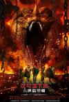

[龙与地下城：侠盗荣耀](https://pewae.com/gaan/aHR0cHM6Ly9tb3ZpZS5kb3ViYW4uY29tL3N1YmplY3QvMjY1ODQ2NzM=)

原名：Dungeons & Dragons: Honor Among Thieves导演：乔纳森·戈尔茨坦 / 约翰·弗朗西斯·戴利主演：休·格兰特 / 克洛伊·科尔曼 / 克里斯·派恩 / 凯尔·希克森 / 布莱德利·库珀 / 米歇尔·罗德里格兹 / 索菲娅·莉莉丝 / 贾斯蒂斯·史密斯 / 雷吉-让·佩吉 / 黛茜·海德类型：冒险 / 动作 / 奇幻地区：美国首映时间：2023

米歇尔罗德里格斯身上已经看不到年轻时那种彪悍劲儿了。
中规中矩的爆米花电影，团队感拍的不错。
结局俗烂。

[消失的她](https://pewae.com/gaan/aHR0cHM6Ly9tb3ZpZS5kb3ViYW4uY29tL3N1YmplY3QvMzU2NjA3OTU=)

导演：刘翔 / 崔睿主演：于诚群 / 倪妮 / 孟芷旭 / 张诣文含 / 文咏珊 / 朱一龙 / 杜江 / 柯国庆 / 祝海钰 / 黄子琪类型：悬疑 / 犯罪地区：大陆首映时间：2023

毫无悬念可言。
反赌狗的效果倒是拉满。
结局恶臭。

[致命玩笑2](https://pewae.com/gaan/aHR0cHM6Ly9tb3ZpZS5kb3ViYW4uY29tL3N1YmplY3QvMzAxMTQ3Mg==)

原名：Joy Ride 2: Dead Ahead导演：Louis Morneau主演：Mark Gibbon / 凯尔·施密德 / 劳拉乔丹 / 妮基·艾考克斯 / 尼克·扎诺类型：恐怖 / 惊悚地区：美国首映时间：2008

紧张的氛围还行，但是剧情水分太大了。
女主的身材实在是不太行，还不如那具尸体。
主角团都挺讨厌的。

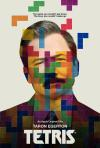

[俄罗斯方块](https://pewae.com/gaan/aHR0cHM6Ly9tb3ZpZS5kb3ViYW4uY29tL3N1YmplY3QvMjYwODc0NzE=)

原名：Tetris导演：乔·拜尔德主演：伊川东吾 / 伊戈尔·格拉布佐夫 / 塔伦·埃哲顿 / 奥列格·斯特凡 / 安东尼·鲍伊 / 尼基塔·叶甫列莫夫 / 山村宪之介 / 托比·琼斯 / 本·迈尔斯 / 罗杰·阿拉姆类型：传记 / 剧情 / 历史 / 惊悚地区：英国首映时间：2023

一个会C语言的推销员的故事。
帝国主义在黑苏联/俄罗斯这件事上真是不遗余力，但是我喜欢。
最后的追逐戏太过于戏剧化，过了。

[关于我和鬼变成家人的那件事](https://pewae.com/gaan/aHR0cHM6Ly9tb3ZpZS5kb3ViYW4uY29tL3N1YmplY3QvMzU2OTgyODQ=)

导演：程伟豪主演：庹宗华 / 李至正 / 林柏宏 / 王净 / 王满娇 / 蔡振南 / 许光汉 / 郑志伟 / 陈彦佐 / 马念先类型：同性 / 喜剧 / 奇幻 / 悬疑地区：台湾首映时间：2023

警匪与搞笑的部分调和得很好。
第一次投胎和第二次投胎的两次感情戏超级啰嗦。
许光汉的身材真的超级棒。

[囚室211](https://pewae.com/gaan/aHR0cHM6Ly9tb3ZpZS5kb3ViYW4uY29tL3N1YmplY3QvMzEwMzQxOA==)

原名：Cell 211导演：丹尼尔·蒙宗主演：乔斯因·本格特伊 / 卡洛斯·巴登 / 安东尼奥·雷西内斯 / 帕特希·柏斯库尔特 / 曼努埃尔·莫龙 / 曼诺罗·索洛 / 玛尔塔·埃图拉 / 路易斯·扎赫拉 / 路易斯·托萨尔 / 阿尔维托·阿曼类型：剧情 / 动作地区：西班牙首映时间：2009

女主事儿逼。
字幕组事儿逼。
动作戏有些单调。

[长沙夜生活](https://pewae.com/gaan/aHR0cHM6Ly9tb3ZpZS5kb3ViYW4uY29tL3N1YmplY3QvMzU0NTE4OTE=)

导演：张冀主演：吴军 / 吴昊宸 / 周思羽 / 尹昉 / 廖凡 / 张婧仪 / 张艺兴 / 白宇帆 / 罗钢 / 苏岩类型：剧情 / 爱情地区：大陆首映时间：2023

旅游局任务吧，剧情简直是脑子有病。
尤其是张婧仪尹舫那根线，我就想问他俩是开了个房换了身衣服吗？那么快吗？
心痛苏岩一秒钟。

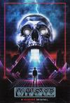

[致命录像带85](https://pewae.com/gaan/aHR0cHM6Ly9tb3ZpZS5kb3ViYW4uY29tL3N1YmplY3QvMzYxMTg1ODY=)

原名：V/H/S/85导演：吉吉·索尔·格雷罗 / 大卫·布鲁克纳 / 娜塔莎·克尔曼尼 / 斯科特·德瑞克森 / 迈克·P·纳尔逊主演：Alex Galick / Chelsey Grant / Justen Jones / Marcio Moreno / Mark Sipka / 丹妮·迪特 / 乔丹·贝尔菲 / 吉吉·索尔·格雷罗 / 弗莱迪·罗德里格兹 / 詹姆斯·兰索恩类型：恐怖地区：美国首映时间：2023

在邪教题材上越走越远，这才是真正的邪教吧。
印象平平，家族火并那块还凑合。

[悲情三角](https://pewae.com/gaan/aHR0cHM6Ly9tb3ZpZS5kb3ViYW4uY29tL3N1YmplY3QvMjcwNjYxNTI=)

原名：Triangle of Sadness导演：鲁本·奥斯特伦德主演：伍迪·哈里森 / 卡罗琳娜·金宁 / 哈里斯·迪金森 / 多莉·德莱昂 / 奥利弗·福德·戴维斯 / 扎特科·巴瑞克 / 松妮·梅勒斯 / 查尔比·迪恩·科里克 / 汉娜·奥尔登堡 / 薇琪·柏林类型：剧情 / 喜剧地区：瑞典首映时间：2022

我能把音量调小，也能把音量调大。
太喜欢粪水临头这种劲爆又恶俗的镜头了。
女主的肤色很漂亮，男主太绿茶。

[日本沉没](https://pewae.com/gaan/aHR0cHM6Ly9tb3ZpZS5kb3ViYW4uY29tL3N1YmplY3QvMTc4ODQzMQ==)

原名：Doomsday: The Sinking of Japan导演：樋口真嗣主演：丰川悦司 / 及川光博 / 大地真央 / 柴崎幸 / 福田麻由子 / 草彅刚类型：冒险 / 剧情 / 灾难 / 科幻地区：日本首映时间：2006

拍出了惶惶不可终日的感觉。
但是太墨迹了，都要逃难了害在那墨迹个啥？
特效有种掉帧的感觉。

[敢死队4：最终章](https://pewae.com/gaan/aHR0cHM6Ly9tb3ZpZS5kb3ViYW4uY29tL3N1YmplY3QvMjU4NDUyOTc=)

原名：Expend4bles导演：斯科特·沃主演：50分 / 伊科·乌艾斯 / 兰迪·库卓 / 安迪·加西亚 / 托尼·贾 / 杜夫·龙格尔 / 杰森·斯坦森 / 梅根·福克斯 / 西尔维斯特·史泰龙 / 雅各布·西皮奥类型：冒险 / 动作 / 惊悚 / 战争地区：美国首映时间：2023

唯一的看点是片尾梅根的凸点。
都什么年代了还搁这儿阻止第三次世界大战呢。
如此劲爆的动作电影，看得我睡着好几次。

[铁汉柔情](https://pewae.com/gaan/aHR0cHM6Ly9tb3ZpZS5kb3ViYW4uY29tL3N1YmplY3QvMjU4MjQ3NDc=)

导演：蔡继光主演：万梓良 / 刘志荣 / 吴家丽 / 吴岱融 / 李丽蕊 / 林聪 / 黄志强类型：剧情 / 动作地区：香港首映时间：1990

剧情一般，但所有演员在线。
黄志强和林聪非常强。
吴岱融的角色缺少逻辑。

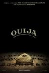

[死亡占卜](https://pewae.com/gaan/aHR0cHM6Ly9tb3ZpZS5kb3ViYW4uY29tL3N1YmplY3QvMzAxNDM5OQ==)

原名：Ouija导演：斯蒂尔斯·怀特主演：克劳迪娅·卡茨 / 奥利维亚·库克 / 安娜·科托 / 林·沙烨 / 桑尼·梅·艾利森 / 比安卡·A·桑托斯 / 罗宾·莱弗里 / 达伦·卡加索夫 / 道格拉斯·史密斯 / 雪莱·亨尼格类型：冒险 / 动作 / 恐怖 / 惊悚地区：美国首映时间：2014

老套。

[求恋期](https://pewae.com/gaan/aHR0cHM6Ly9tb3ZpZS5kb3ViYW4uY29tL3N1YmplY3QvMTMwNTQzNg==)

导演：谷德昭主演：刘德华 / 古巨基 / 周海媚 / 张沅薇 / 张燊悦 / 苏志威 / 雷颂德 / 黎姿类型：剧情 / 喜剧 / 爱情地区：香港首映时间：1997

苏志威可是又真诚又猥琐。
三男主都是音乐人，四女主都来自TVB，辅以一堆电影咖客串，奇怪的组合。
稍有一点青春伤感的味道，不过除了雷颂德张燊悦的组合，另两对都不来电。

[流浪地球2](https://pewae.com/gaan/aHR0cHM6Ly9tb3ZpZS5kb3ViYW4uY29tL3N1YmplY3QvMzUyNjcyMDg=)

导演：郭帆主演：佟丽娅 / 刘德华 / 吴京 / 宁理 / 安地 / 朱颜曼滋 / 李雪健 / 沙溢 / 王智 / 王若熹类型：冒险 / 灾难 / 科幻地区：大陆首映时间：2023

剧本太失败，人类两千年大计，却开始得漏洞百出，可能吗？
时间过长，刘德华线完全可以全砍。
李雪健老师还是应该请配音。

[前任4：英年早婚](https://pewae.com/gaan/aHR0cHM6Ly9tb3ZpZS5kb3ViYW4uY29tL3N1YmplY3QvMzUzNTg0NDM=)

导演：田羽生主演：于文文 / 冯铭潮 / 刘雅瑟 / 张天爱 / 曾梦雪 / 朱颜曼滋 / 罗米 / 药一樍 / 郑恺 / 韩庚类型：喜剧 / 爱情地区：大陆首映时间：2023

韩庚简直是从油锅里捞出来的，腻歪透了。
这镜头的摇法，导演是拍MV出身的吧。
整个剧组对不起刘雅瑟。

[你猜我是不是英雄！](https://pewae.com/gaan/aHR0cHM6Ly9tb3ZpZS5kb3ViYW4uY29tL3N1YmplY3QvMzUyNTczOTA=)

导演：张凯主演：于洋 / 修睿 / 小山竹 / 文松 / 朱天福 / 潘斌龙 / 贾冰 / 马丽 / 魏翔 / 黄允桐类型：喜剧地区：大陆首映时间：2023

毫无逻辑的烂。

[和平饭店](https://pewae.com/gaan/aHR0cHM6Ly9tb3ZpZS5kb3ViYW4uY29tL3N1YmplY3QvMTI5Mzg2Nw==)

导演：韦家辉主演：刘晓彤 / 刘洵 / 叶童 / 吴倩莲 / 周润发 / 李兆基 / 秦豪 / 鲁芬类型：动作 / 西部地区：香港首映时间：1995

和平饭店里被庇护的人只是一群没有立场的纸偶。
还行，但是高潮前情绪堆积不够。
叶童演得非常出色，可惜角色是个作精。

[范加尔](https://pewae.com/gaan/aHR0cHM6Ly9tb3ZpZS5kb3ViYW4uY29tL3N1YmplY3QvMzU4NjI4NTI=)

原名：Louis导演：Geertjan Lassche主演：路易斯·范·加尔类型：纪录地区：荷兰首映时间：2022

显然对于范厨师和屏幕前的我来说，最难忘的还是阿贾克斯的岁月。
德波尔兄弟，戴维斯们啊，怎么就没出来一个像样的教练呢？
荷兰语生肉降低了观感。

[恶人](https://pewae.com/gaan/aHR0cHM6Ly9tb3ZpZS5kb3ViYW4uY29tL3N1YmplY3QvNDEzNTQ0Mw==)

原名：Villain导演：李相日主演：余贵美子 / 光石研 / 冈田将生 / 妻夫木聪 / 柄本明 / 树木希林 / 池内万作 / 深津绘里 / 满岛光 / 盐见三省类型：剧情 / 爱情 / 犯罪地区：日本首映时间：2010

一群绝望的人在互相伤害。
妻夫木聪的气质跟主角窝囊而有决绝的性格非常契合。
找闺女的分支感人。

[埃舍尔街的红色邮筒](https://pewae.com/gaan/aHR0cHM6Ly9tb3ZpZS5kb3ViYW4uY29tL3N1YmplY3QvMzQ5ODIyNTI=)

原名：Red Post on Escher Street导演：园子温主演：吹越满 / 小泽真利奈 / 渡边哲 / 茉爱罗 / 藤田朋子 / 诹访太朗 / 鸟羽润类型：喜剧地区：日本首映时间：2020

园子温的温情时刻。
聚沙成塔的龙套大叔的收藏超级有感觉的。
园子温是有多喜欢拍涩谷啊！

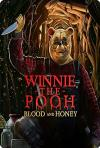

[小熊维尼：血染蜂蜜](https://pewae.com/gaan/aHR0cHM6Ly9tb3ZpZS5kb3ViYW4uY29tL3N1YmplY3QvMzU5MTQ5MTM=)

原名：Winnie-the-Pooh: Blood and Honey导演：瑞斯·弗雷克·沃特菲尔德主演：Amber Doig-Thorne / Bao Tieu / Chris Cordell / Danielle Ronald / Danielle Scott / Gillian Broderick / Marcus Massey / Maria Taylor / May Kelly / Natasha Tosini类型：恐怖地区：英国首映时间：2023

这种片豆瓣都不开分不开评论，是在担心什么？
片头动画非常可爱，谁成想后面啥也不是。
猫头鹰和跳跳虎哪去了？

[不要碰我](https://pewae.com/gaan/aHR0cHM6Ly9tb3ZpZS5kb3ViYW4uY29tL3N1YmplY3QvMjY3Mjc4ODk=)

原名：Touch Me Not导演：阿迪娜·平蒂列主演：克里斯蒂安·巴耶林 / 劳拉·本森 / 厄梅拉·琦琦库娃 / 托马斯·勒马尔奎斯 / 格雷特·乌尔勒曼 / 汉娜·霍夫曼 / 西尼·勒夫 / 阿迪娜·平蒂列类型：剧情地区：罗马尼亚首映时间：2018

非常怪异的感觉，片中的人类仿佛都不是人类。
女主胸真大。
那个演女装大佬的演员牺牲可真大。

[正义回廊](https://pewae.com/gaan/aHR0cHM6Ly9tb3ZpZS5kb3ViYW4uY29tL3N1YmplY3QvMzUzMTE4Nzg=)

导演：何爵天主演：叶蕴仪 / 周文健 / 朱柏谦 / 杨伟伦 / 杨诗敏 / 林海峰 / 苏玉华 / 蔡紫晴 / 邵仲衡 / 麦沛东类型：剧情 / 犯罪地区：香港首映时间：2022

简单的案情因为调查而变得复杂，两位罪犯演绎得都很好。
陪审团的表现有些十二怒汉的味道。
扑朔迷离的感觉仍稍显不足。

[要命会议](https://pewae.com/gaan/aHR0cHM6Ly9tb3ZpZS5kb3ViYW4uY29tL3N1YmplY3QvMzYyMzYyMDY=)

原名：The Conference导演：帕特里克·伊库伦德主演：Amed Bozan / Claes Hartelius / Jimmy Lindström / Marie Agerhäll / Martin Lagos / 亚当·隆格伦 / 克里斯托弗·努登罗特 / 埃娃·梅兰德 / 罗伯特·福林 / 茜茜莉亚·尼尔森类型：喜剧 / 恐怖 / 悬疑 / 惊悚地区：瑞典首映时间：2023

质量一般，但是团建大屠杀这个点子不错。
女主直接拿U盘摊牌有丢丢蠢。
老太太字里行间的环保更像是反讽。

[过激派歌剧](https://pewae.com/gaan/aHR0cHM6Ly9tb3ZpZS5kb3ViYW4uY29tL3N1YmplY3QvMjY4MzM4Njc=)

原名：Kagekiha opera导演：江本純子主演：中村有沙 / 早织 / 樱井由纪类型：剧情 / 同性地区：日本首映时间：2016

癫狂的氛围感不错。
没有钱是万万不能的。
喜欢结局的各奔东西。

[美国往事](https://pewae.com/gaan/aHR0cHM6Ly9tb3ZpZS5kb3ViYW4uY29tL3N1YmplY3QvMTI5MjI2Mg==)

原名：Once Upon a Time in America导演：赛尔乔·莱昂内主演：丹尼·爱罗 / 乔·佩西 / 伊丽莎白·麦戈文 / 伯特·杨 / 塔斯黛·韦尔德 / 特里特·威廉斯 / 理查德·布赖特 / 罗伯特·德尼罗 / 詹姆斯·伍兹 / 詹姆斯·海登类型：剧情 / 犯罪地区：美国首映时间：1984

明明是美国加意大利电影，却演绎了风味十足的古龙江湖。
唯一的缺点是片场太长，时空交错频繁，看完一遍以后要立刻回看一遍，于是八小时过去了。
有没有一种可能，导演是为了批判劳勃狄尼洛这种满脑子精液的冒牌黑社会？

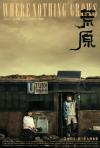

[荒原](https://pewae.com/gaan/aHR0cHM6Ly9tb3ZpZS5kb3ViYW4uY29tL3N1YmplY3QvMzUxMzEzNDU=)

导演：左志国主演：任素汐 / 周申 / 李晨 / 王静类型：冒险 / 剧情地区：大陆首映时间：2023

类型值得鼓励，剧情实在一般。
任素汐这种演法，简直是把“我要得奖”写在了脸上。
另外那个虚幻的冒险者实在是没处理好。

[蓝丝绒](https://pewae.com/gaan/aHR0cHM6Ly93d3cuaW1kYi5jb20vdGl0bGUvdHQwMDkwNzU2)

原名：Blue Velvet导演：大卫·林奇主演：dennis hopper / isabella rossellini / kyle maclachlan类型：剧情 / 犯罪 / 神秘地区：美国首映时间：1986

悬疑不太足，惊悚有一点儿，反派降智太严重。
男主纯属作死，反派第一时间弄死他，或者第二时间弄死他，啥事儿没有。
女一有豁牙。

[飞来横财](https://pewae.com/gaan/aHR0cHM6Ly9tb3ZpZS5kb3ViYW4uY29tL3N1YmplY3QvMzY3MTA5MDE=)

导演：李子轩主演：修睿 / 刘恩尚 / 小沈阳 / 师铭泽 / 曹瑞 / 李印 / 焦娜 / 秦牛正威 / 许君聪 / 贾冰类型：喜剧地区：大陆首映时间：2024

梗比较老也比较硬，但演得还行。
网红脸女主毕业于“北京电影学院进修班”，这也好意思写？
对讲机不算BUG的话，那质量也忒好了。

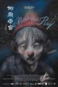

[椒麻堂会](https://pewae.com/gaan/aHR0cHM6Ly9tb3ZpZS5kb3ViYW4uY29tL3N1YmplY3QvMjczMDU5OTc=)

导演：邱炯炯主演：关南 / 徐刚 / 易思成 / 薛旭春 / 邱志敏 / 陈浩宇 / 顾桃类型：剧情地区：香港首映时间：2021

惊艳的美工效果，花小钱办大事。
屎里抠蛆能拍出来已经很难能可贵了。
不带字幕挺遗憾的。

[Jose与虎与鱼们](https://pewae.com/gaan/aHR0cHM6Ly9tb3ZpZS5kb3ViYW4uY29tL3N1YmplY3QvMTQyODI5MQ==)

原名：Josee, the Tiger and the Fish导演：犬童一心主演：上野树里 / 妻夫木聪 / 新井浩文 / 板尾创路 / 森下能幸 / 江口德子 / 池胁千鹤 / 荒川良良 / 菅野莉央 / 萨布类型：剧情 / 爱情地区：日本首映时间：2003

爱与残疾无关，不爱也与残疾无关。
妻夫木聪总是一副不清爽的样子。

[龙虎风云](https://pewae.com/gaan/aHR0cHM6Ly9tb3ZpZS5kb3ViYW4uY29tL3N1YmplY3QvMTI5OTY1OA==)

导演：林岭东主演：吴家丽 / 周润发 / 孙越 / 张耀扬 / 徐锦江 / 李修贤类型：剧情 / 动作 / 惊悚 / 犯罪地区：香港首映时间：1987

调度出色，卧底片的教科书。
周润发与李修贤的感情线展开过于草率了。
孙越最后拍向张耀扬脑袋的一砖可真解气啊。