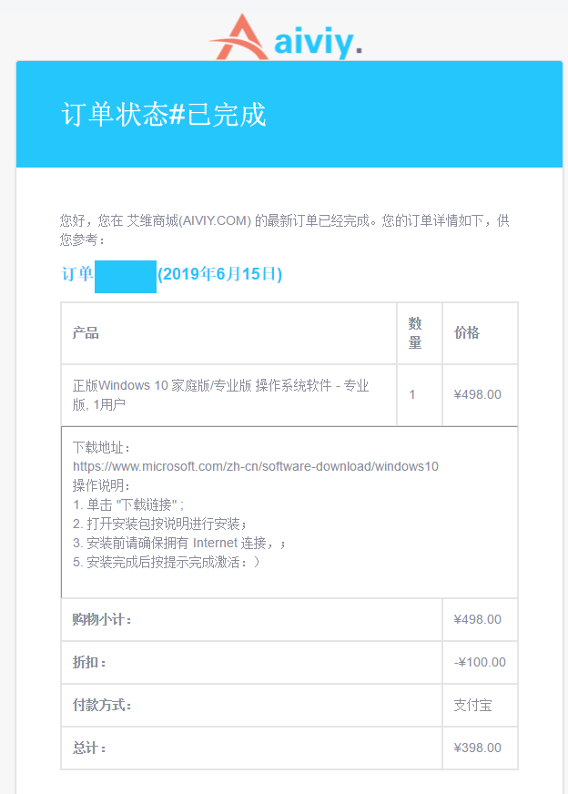

其实是一次冲动消费。
周三周四老婆在家用了我PC两天，之后再开机竟然遭遇弹窗。
用火绒查，每次都会蓝屏。
有些慌。加上三年前配机器的时候装的就不是什么好版本，索性一不做二不休，割了它！
正好老D提供的信息，某软件商城买Windows有优惠。

等待安装的时间冷静下来，查一下，那个窗应该是Flash弹的；而火绒蓝屏可能是因为移动硬盘没拔……
这下除游戏外的各种软件，除了付费的就是免费和开源的了，也不错。

从1999年在宿舍配第一台PC到现在，恰好20年。